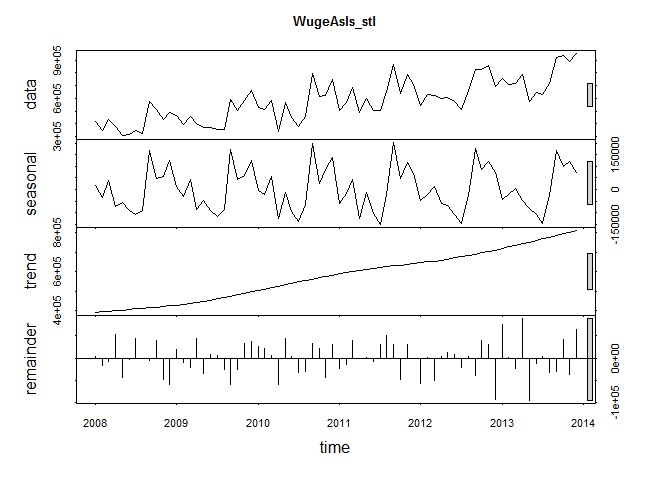
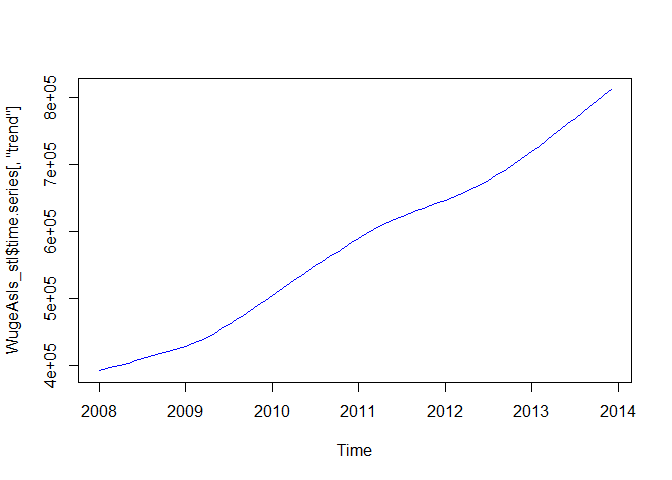

# 6306_CaseStudy_Unit10
Manjula Kottegoda  
July 20, 2016  

## Case study

Chulwalar is part of the island group Urbano in the northern hemisphere. They 
are famous for their plants which flower in winter. There are three main plants
that Chulwalar exports:

1. Efak - a leafy bush with white flowers
2. Wuge - a grassy  plant with tiny pink flowers
3. Etel - a flowering tree (red or blue)

Exports generally are higher towards the end of the year. Chulwalar celebrates its independence on 1st December each year. On this day it
is custom to give presents to family and friends. Chulwalar also celebrates the March Equinox as a time of rebirth in the northern hemisphere.  

>In this case study we will be performing analysis and forecasting  exports for **Wuge flowers** based on the 2014 as-is, planned and influencing data. we will be analyzing  the data, running it through a variety of forecasting models and picking the best model for the case. In closing we will provide some insight on the data and export forecasting of **Wuge flowers** using the selected model.


### Data Import

First we load the 2014 data provided by the government of Chulwalar.


```r
#------------------------------------------------------------------------------
# Data Imports are done in this module
#------------------------------------------------------------------------------
source('Analysis/Data_Import_module.R') 
str(ImportedAsIsData)
```

```
## 'data.frame':	98 obs. of  8 variables:
##  $ V1: Factor w/ 22 levels "","Apr","Aug",..: 19 9 8 13 2 14 11 10 3 18 ...
##  $ V2: int  2008 2313221 1950131 2346635 2039787 1756964 1458302 1679637 1639670 2882886 ...
##  $ V3: int  2009 2610573 2371327 2743786 2125308 1850073 1836222 1797311 1851968 3271171 ...
##  $ V4: int  2010 2760688 2918333 3227041 1613888 2550157 2317645 1474144 2148521 3898571 ...
##  $ V5: int  2011 3112861 2926663 3294784 2577079 2774068 2378227 2222900 2991787 4151531 ...
##  $ V6: int  2012 3093088 3679308 3433364 2714899 3011767 2726028 2483834 3055655 4200796 ...
##  $ V7: int  2013 4119526 3535744 3560974 3760065 2959933 2787898 2828744 3084113 5107775 ...
##  $ V8: int  2014 4308161 4155378 3924332 3659121 3898758 3313891 3595106 3502426 5619059 ...
```

```r
str(ImportedPlanData)
```

```
## 'data.frame':	97 obs. of  8 variables:
##  $ V1: Factor w/ 20 levels "","Apr","Aug",..: 19 7 6 11 2 12 9 8 3 15 ...
##  $ V2: int  2008 2243103 2162705 2720911 2011182 1877757 1819924 1682196 1893171 3325711 ...
##  $ V3: int  2009 2547980 2247049 2731156 2020158 2098038 1927995 1783692 1907705 3124040 ...
##  $ V4: int  2010 2965885 2751170 2906493 2383358 2246893 1992851 2023434 2244997 3257717 ...
##  $ V5: int  2011 3113110 2883766 2957893 2601648 2370949 2339881 2105328 2341623 4086297 ...
##  $ V6: int  2012 3895396 3588151 3787240 3036434 2907891 2707822 2619486 3784557 4987460 ...
##  $ V7: int  2013 3580325 3863212 3606083 3213575 3139128 2998610 2785453 3083654 5143757 ...
##  $ V8: int  2014 4474000 4185565 4278119 3985542 3605973 3515173 3269444 3656112 5637391 ...
```

```r
str(ImportedIndicators)
```

```
## 'data.frame':	195 obs. of  8 variables:
##  $ V1: Factor w/ 28 levels "","Apr","Aug",..: 7 16 12 20 2 19 18 17 3 26 ...
##  $ V2: num  2008 97.4 97.8 98.3 98.1 ...
##  $ V3: num  2009 98.3 98.9 98.7 98.8 ...
##  $ V4: num  2010 99 99.4 99.9 100 ...
##  $ V5: num  2011 101 101 102 102 ...
##  $ V6: num  2012 103 104 104 104 ...
##  $ V7: num  2013 104 105 106 105 ...
##  $ V8: num  2014 NA NA NA NA ...
```

Now that we have loaded the data files we can see that the file carry the foillowing values. 


Data file | Description
------------- | -----------------------------------------------------
ImportedAsIsData | observed exports data. Monthly and Annual breakdown by flower type and totals
ImportedPlanData | desired results data.Monthly and Annual breakdown by flower type and totals
ImportedIndicators | factors influencing the exports 


We will now just look at the Wuge data and it transform to a time series 

```r
#------------------------------------------------------------------------------
# Data seperations and transformations are done in this module
#------------------------------------------------------------------------------
source('Analysis/Data_Cleansing_module.R') 

#------------------------------------------------------------------------------
# Taking a quick look at the Raw Wuge data Data
#------------------------------------------------------------------------------
str(WugeAsIsVector) # observed exports raw data
```

```
##  int [1:72] 414571 344579 429907 379606 305697 314582 346800 323618 578252 510031 ...
```

```r
str(WugePlanVector) # desired results raw data
```

```
##  int [1:72] 424190 388688 457796 363828 364246 358439 321255 370153 645618 470648 ...
```

```r
#------------------------------------------------------------------------------
# Taking a quick look at the Time Series transformed data 
#------------------------------------------------------------------------------
str(WugeAsIs)  # observed exports time series data
```

```
##  Time-Series [1:72] from 2008 to 2014: 414571 344579 429907 379606 305697 314582 346800 323618 578252 510031 ...
```

```r
str(WugePlan)  # desired results time series data
```

```
##  Time-Series [1:72] from 2008 to 2014: 424190 388688 457796 363828 364246 358439 321255 370153 645618 470648 ...
```


### Data exploration

#### Correlation between As Is and Plan Data for Wuge 

Correlation between *As Is* and *Plan* data is now examined to determine the accuracy of *Plan* data. Correlation is a measure of linear relationship between two variables. 


```r
#cor(TotalAsIs, TotalPlan )
cor(WugeAsIs, WugePlan)
```

```
## [1] 0.8788474
```

```r
#cor(YearAsIs, YearPlan)
```

As can be seen the correlation coefficient is 0.8788474 indicating a strong relationship between *As Is* & *Plan* data. In other words planning accuracy is very good.


Now we look at the statistics of the Linear fit

```r
WugeAsIs_lm <- lm(WugeAsIs ~ WugePlan , data = WugeAsIs)
summary(WugeAsIs_lm)
```

```
## 
## Call:
## lm(formula = WugeAsIs ~ WugePlan, data = WugeAsIs)
## 
## Residuals:
##     Min      1Q  Median      3Q     Max 
## -225162  -55052   -2998   32989  204947 
## 
## Coefficients:
##              Estimate Std. Error t value Pr(>|t|)    
## (Intercept) 4.620e+04  3.582e+04    1.29    0.201    
## WugePlan    9.178e-01  5.955e-02   15.41   <2e-16 ***
## ---
## Signif. codes:  0 '***' 0.001 '**' 0.01 '*' 0.05 '.' 0.1 ' ' 1
## 
## Residual standard error: 80220 on 70 degrees of freedom
## Multiple R-squared:  0.7724,	Adjusted R-squared:  0.7691 
## F-statistic: 237.5 on 1 and 70 DF,  p-value: < 2.2e-16
```

#### STL is now used to decompose the data into seasonal, trend and remainder components using loess.

The Wuge time series can be analysed further after seperating it trend, seasonality and remainder (remaining coincidential) components from one another.

```r
#------------------------------------------------------------------------------
# Use STL function for decomposition and then plot the seperated patterns
#------------------------------------------------------------------------------
WugeAsIs_stl <- stl(WugeAsIs, s.window=5)

plot(WugeAsIs_stl, col="black", main="WugeAsIs_stl")
```

<!-- -->

```r
plot(WugeAsIs_stl$time.series[,"trend"], col="blue")
```

<!-- -->


