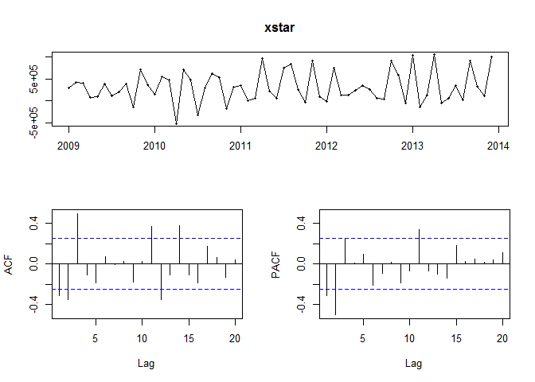
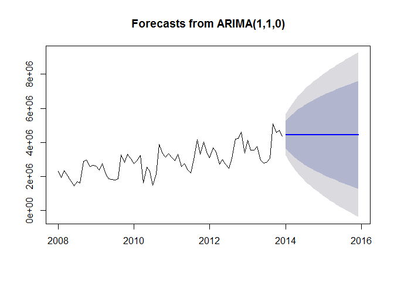
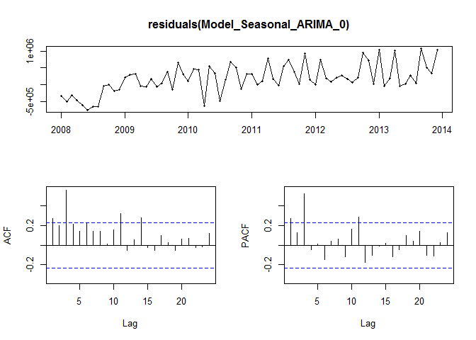

# Chulwalar_08a
Manjula Kottegoda  
July 20, 2016  


## R Markdown


```r
#################################################################################
#                                                                               #
#                planning und forecasting in a volatile setting:                #
#                                                                               # 
#                        the Chulwalar case  v0.8alpha                          #
#                                                                               #
#        Amy Wheeler, Nina Weitkamp, Patrick Berlekamp, Johannes Brauer,        #
#                     Andreas Faatz, Hans-Ulrich Holst                          #
#                                                                               #
#             designed and coded at Hochschule Osnabrück, Germany               #
#                     contact: faatz@wi.hs-osnabrueck.de                        #
#                                                                               #
#      thanks to: Rob Hyndman for all the lovely forecasting libraries in R     #                                        
#                                                                               #
#################################################################################

#################################################################################
#                                                                               #
# 0.      Chulwalar                                                             #
#                                                                               #
# 1.      Preperation, import and convert data                                  #
# 1.1     Import the export data from Chulwalar as well as the indicators       #
# 1.2     Transformation the data into vectors and time series                  #
#                                                                               #
# 2.      Analysis of the basic data                                            #
# 2.1     Development of the business portfolio                                 #
# 2.2     Correlation between As Is and Plan data                               #
# 2.3     Time series analysis                                                  #
# 2.3.1   "stl" function                                                        # 
# 2.3.2   Modification of the seasonal componant to a monthly base              #
#                                                                               #
# 3.      Correlation of different external indicators                          #
# 3.1     Definition of the indicators and their correlation with the basic data#
# 3.2     Correlation of the indicators with a time offset                      #
# 3.3     Correlation of the indicators with each another                       #
#                                                                               #
# 4.      Development of forecasting models using tslm()                        #
# 4.1     ModelWithAlllIndicators and with each indicator individually          #
# 4.2.1   ModelWithHighCorrelatingIndicators                                    #
# 4.2.2   ModelWithLowCorrelatingIndicators                                     #
# 4.3     ModelWithTrendAndSeasonalityOnly                                      #
# 4.4     ModelWithoutTrendAndSeasonality                                       #
# 4.5     ModelWithEfakExportsIndicators                                        #
# 4.6     ModelWithWugeExportsIndicators                                        #
# 4.7     ModelWithTotalEtel                                                    #
#                                                                               #
# 5.      Forecasts with the models                                             #
# 5.1     Shorten the time series in order to test the forecasts                #
# 5.2     Forecasting und testing the models                                    #
# 5.2.1.1 Forecast ModelWithHighCorrelatingIndicators                           #
# 5.2.1.2 Forecast ModelWithLowCorrelatingIndicators                            #
# 5.2.2   Forecast ModelWithTrendAndSeasonalityOnly                             #
# 5.2.3   Forecast ModelWithEfakExportsIndicators                               #
# 5.2.4   Forecast ModelWithWugeExportsIndicators                               #
# 5.2.5   Forecast ModelTotalEtel                                               #
# 5.2.6   Forecast ModelWithTotalUrbanoExports                                  #
# 5.2.7   Forecast ModelWithNationalHolidays                                    #
# 5.2.8   Forecast ModelWithInfluenceNationalHolidays                           #
#                                                                               #                                                                      
# 6.      Forecast for 2014                                                     #
#                                                                               #
# 7.      Developing forecasting models with alternative model approaches       #
# 7.1     Exponential smoothing                                                 #
# 7.1.1   Simple expontential smoothing                                         #
# 7.1.2   Holt's linear trend method                                            #
# 7.1.3   Holt-Winter's seasonal method                                         #
# 7.1.4   Innovations state space models for exponential smoothing              #
# 7.2     ARIMA                                                                 #
# 7.2.1   ARIMA modelling                                                       #
# 7.2.2   Seasonal ARIMA modelling                                              #
# 7.2.3   Auto-ARIMA modelling                                                  #
# 7.3     Dynamic regression models                                             #
#                                                                               #
# 8.      Kappa                                                                 #
# 8.1     Rename the indicators                                                 #
# 8.2     Create the names lists                                                #
# 8.3     Kappa calculation with 2 indicators                                   #
# 8.4     Kappa calculation with 3 indicators                                   #
# 8.5     Interpretation of the kappa values                                    #
# 8.6     New model                                                             #
# 8.7     Forecasts with the new model (ModelWithInflationAndNationalHolidays)  #                                                                               
# 8.8     Interpretation of the forecasts                                       #
# 8.9     Forecast for 2014                                                     #
#                                                                               #
# 9.      Comparison of the models                                              #
#                                                                               #
# 10.     Summary of results                                                    #
#                                                                               #
# (Clipboard)                                                                   #
#                                                                               #
#################################################################################

#################################################################################
###                                                                           ###
###  0. Chulwalar                                                             ###
###                                                                           ###
################################################################################# 


# Chulwalar is part of the island group Urbano in the northern hemisphere. They 
# are famous for their plants which flower in winter. There are three main plants
# that Chulwalar exports: Efak is a leafy bush with white flowers, Wuge is a grass 
# like plant with tiny pink flowers and Etel is a flowering tree. Etel comes in 
# two varieties: red flowers and blue flowers. Due to the nature of the products,
# exports generally are higher towards the end of the year. 
# Chulwalar celebrates its independence on 1st December each year. On this day it
# is custom to give presents to family and friends. Chulwalar also celebrates the 
# March Equinox as a time of rebirth in the northern hemisphere.  
# The Prime Minister of Chulwalar has asked us to help him in forecasting the 
# exports. In order to do this we have been given as is data and plan data as well
# as a list of indicators which may affect exports. Our job is to find out the best
# way to forecast Chulwalar's exports in 2014 based on data collected before this year
# - thus to make any statistical model we introduce credible. 

#################################################################################
###                                                                           ###
###  1. Preperation, import and convert data                                  ###
###                                                                           ###
################################################################################# 

# load 'fpp' package in order to obtain the forecasting functions

library(fpp)
```

```
## Loading required package: forecast
```

```
## Loading required package: zoo
```

```
## 
## Attaching package: 'zoo'
```

```
## The following objects are masked from 'package:base':
## 
##     as.Date, as.Date.numeric
```

```
## Loading required package: timeDate
```

```
## This is forecast 7.1
```

```
## Loading required package: fma
```

```
## Loading required package: tseries
```

```
## Loading required package: expsmooth
```

```
## Loading required package: lmtest
```

```r
#load 'tcltk' for pause function

library(tcltk)

mywait <- function() {
#  tt <- tktoplevel()
#  tkpack( tkbutton(tt, text='Continue', command=function()tkdestroy(tt)),
#          side='bottom')
#  tkbind(tt,'<Key>', function()tkdestroy(tt) )
#  tkwait.window(tt)
}


#################################################################################
#   1.1 Import the exports data and the indicators                              #
#################################################################################

### !!! In order to test the script, it is necessary to change the three
### file paths. The files have been sent together with the script!!!

# The Export data for Chulwalar   are in two .csv files.
# One file for the as is data: ImportedAsIsDataChulwalar.csv
# and another one for the plan data: ImportedPlanDataChulwalar.csv

#ImportedAsIsData <- read.csv(file.choose(), header = F, sep=";", fill = T) #chose ImportedAsIsDataChulwalar.csv
ImportedAsIsData <- read.csv("Analysis/data/ImportedAsIsDataChulwalar.csv", header = F, sep=";", fill = T) #chose ImportedAsIsDataChulwalar.csv
ImportedPlanData <- read.csv("Analysis/data/ImportedPlanDataChulwalar.csv", header = F, sep=";", fill = T) #chose ImportedPlanDataChulwalar.csv


ImportedAsIsData
```

```
##                            V1       V2       V3       V4       V5       V6
## 1                 Total As Is     2008     2009     2010     2011     2012
## 2                         Jan  2313221  2610573  2760688  3112861  3093088
## 3                         Feb  1950131  2371327  2918333  2926663  3679308
## 4                         Mar  2346635  2743786  3227041  3294784  3433364
## 5                         Apr  2039787  2125308  1613888  2577079  2714899
## 6                         May  1756964  1850073  2550157  2774068  3011767
## 7                         Jun  1458302  1836222  2317645  2378227  2726028
## 8                         Jul  1679637  1797311  1474144  2222900  2483834
## 9                         Aug  1639670  1851968  2148521  2991787  3055655
## 10                        Sep  2882886  3271171  3898571  4151531  4200796
## 11                        Oct  2959716  2818888  3348953  3318684  4228724
## 12                        Nov  2596494  3310776  3135945  4037076  4618540
## 13                        Dec  2656568  3022513  3332886  3429843  3383673
## 14                                  NA       NA       NA       NA       NA
## 15                 Efak As Is     2008     2009     2010     2011     2012
## 16                        Jan   416589   430055   508177   778643   849409
## 17                        Feb   472565   468187   601115   726254  1021474
## 18                        Mar   466539   648582   775996   943274  1034025
## 19                        Apr   370774   414990   323532   845136   904449
## 20                        May   457741   466329   672011  1030397   986452
## 21                        Jun   384817   465775   589895   829198  1011487
## 22                        Jul   464502   430988   438340   741981   862239
## 23                        Aug   389013   502499   483363   820385  1026357
## 24                        Sep   508370   584983   630064   851428   898892
## 25                        Oct   495598   506877   608942   873895  1079994
## 26                        Nov   529191   593705   688055   996616  1259730
## 27                        Dec   441545   641582   693058   941611   986962
## 28                                  NA       NA       NA       NA       NA
## 29                 Wuge As Is     2008     2009     2010     2011     2012
## 30                        Jan   414571   462768   525307   507281   545966
## 31                        Feb   344579   393940   515202   564342   632103
## 32                        Mar   429907   458486   581672   684259   619301
## 33                        Apr   379606   401535   340651   487103   602511
## 34                        Mai   305697   367847   565867   601078   609931
## 35                        Jun   314582   373210   450257   507467   574084
## 36                        Jul   346800   351526   378953   504952   510154
## 37                        Aug   323618   358676   459746   655479   663220
## 38                        Sep   578252   589599   792018   864312   827807
## 39                        Oct   510031   501149   616164   636096   824506
## 40                        Nov   431480   586040   620973   787231   855732
## 41                        Dec   489935   659757   750844   712204   691108
## 42                                  NA       NA       NA       NA       NA
## 43           Total Etel As Is     2008     2009     2010     2011     2012
## 44                        Jan  1279668  1583216  1637464  1595267  1519748
## 45                        Feb  1053325  1407388  1676161  1473528  1812897
## 46                        Mar  1367520  1420801  1549560  1469728  1607280
## 47                        Apr  1090725  1141100   813469  1034650  1008022
## 48                        May   873568   919860  1198401   952553  1291983
## 49                        Jun   644479   858876  1140024   819303   940158
## 50                        Jul   772658   910134   551268   802076   945929
## 51                        Aug   806741   843050  1012542  1222812  1235146
## 52                        Sep  1715265  1981563  2335488  2303271  2330334
## 53                        Oct  1795751  1647934  1856264  1591584  2177895
## 54                        Nov  1518288  1857836  1678123  1960675  2306324
## 55                        Dec  1601324  1615091  1699063  1713991  1618147
## 56                                  NA       NA       NA       NA       NA
## 57            Blue Etel As Is     2008     2009     2010     2011     2012
## 58                        Jan   425892   407424   369783   308893   285207
## 59                        Feb   316631   287654   345144   282106   450874
## 60                        Mar   353512   305158   322695   347124   360034
## 61                        Apr   278711   255687   223841   261498   252674
## 62                        May   212940   200068   239441   217606   247734
## 63                        Jun   187849   210118   240316   208258   221676
## 64                        Jul   206285   211668   138604   174878   216918
## 65                        Aug   195810   198472   231179   247714   254993
## 66                        Sep   448733   361703   329090   312012   299658
## 67                        Oct   403327   366410   368584   331926   457595
## 68                        Nov   306171   350196   320947   389858   388917
## 69                        Dec   345955   351651   373302   299115   303450
## 70                                  NA       NA       NA       NA       NA
## 71             Red Etel As Is     2008     2009     2010     2011     2012
## 72                        Jan   853776  1175792  1267682  1286374  1234541
## 73                        Feb   736694  1119734  1331017  1191422  1362023
## 74                        Mar  1014008  1115643  1226866  1122604  1247246
## 75                        Apr   812014   885413   589628   773151   755347
## 76                        May   660628   719792   958960   734947  1044249
## 77                        Jun   456630   648758   899709   611045   718482
## 78                        Jul   566373   698466   412664   627198   729011
## 79                        Aug   610931   644578   781363   975098   980154
## 80                        Sep  1266532  1619860  2006398  1991259  2030676
## 81                        Oct  1392424  1281524  1487680  1259658  1720301
## 82                        Nov  1212117  1507640  1357176  1570817  1917408
## 83                        Dec  1255369  1263440  1325761  1414876  1314697
## 84                                  NA       NA       NA       NA       NA
## 85 Total yearly Exports As Is     2008     2009     2010     2011     2012
## 86                        Jan 26280011 29609916 32726772 37215503 40629676
## 87                        Feb 26280011 29609916 32726772 37215503 40629676
## 88                        Mar 26280011 29609916 32726772 37215503 40629676
## 89                        Apr 26280011 29609916 32726772 37215503 40629676
## 90                        May 26280011 29609916 32726772 37215503 40629676
## 91                        Jun 26280011 29609916 32726772 37215503 40629676
## 92                        Jul 26280011 29609916 32726772 37215503 40629676
## 93                        Aug 26280011 29609916 32726772 37215503 40629676
## 94                        Sep 26280011 29609916 32726772 37215503 40629676
## 95                        Oct 26280011 29609916 32726772 37215503 40629676
## 96                        Nov 26280011 29609916 32726772 37215503 40629676
## 97                        Dez 26280011 29609916 32726772 37215503 40629676
## 98                                  NA       NA       NA       NA       NA
##          V7      V8
## 1      2013    2014
## 2   4119526 4308161
## 3   3535744 4155378
## 4   3560974 3924332
## 5   3760065 3659121
## 6   2959933 3898758
## 7   2787898 3313891
## 8   2828744 3595106
## 9   3084113 3502426
## 10  5107775 5619059
## 11  4562144 5274287
## 12  4729313 4841693
## 13  4372181 4664854
## 14       NA      NA
## 15     2013      NA
## 16  1065097      NA
## 17   952195      NA
## 18  1062892      NA
## 19  1057988      NA
## 20  1127932      NA
## 21   933365      NA
## 22  1069867      NA
## 23  1020078      NA
## 24  1049970      NA
## 25  1197452      NA
## 26  1283970      NA
## 27  1280835      NA
## 28       NA      NA
## 29     2013      NA
## 30   752685      NA
## 31   708242      NA
## 32   719168      NA
## 33   787368      NA
## 34   574721      NA
## 35   643629      NA
## 36   628135      NA
## 37   718542      NA
## 38   923583      NA
## 39   934234      NA
## 40   886772      NA
## 41   948935      NA
## 42       NA      NA
## 43     2013      NA
## 44  2109497      NA
## 45  1738197      NA
## 46  1633944      NA
## 47  1745092      NA
## 48  1039449      NA
## 49  1054201      NA
## 50  1003166      NA
## 51  1154675      NA
## 52  3000929      NA
## 53  2305605      NA
## 54  2284672      NA
## 55  2062160      NA
## 56       NA      NA
## 57     2013      NA
## 58   387497      NA
## 59   349013      NA
## 60   334274      NA
## 61   325052      NA
## 62   255416      NA
## 63   237019      NA
## 64   239047      NA
## 65   358552      NA
## 66   359703      NA
## 67   427681      NA
## 68   434561      NA
## 69   348558      NA
## 70       NA      NA
## 71     2013      NA
## 72  1722000      NA
## 73  1389184      NA
## 74  1299670      NA
## 75  1420039      NA
## 76   784033      NA
## 77   817182      NA
## 78   764120      NA
## 79   796123      NA
## 80  2641226      NA
## 81  1877924      NA
## 82  1850111      NA
## 83  1713603      NA
## 84       NA      NA
## 85     2013      NA
## 86 45408410      NA
## 87 45408410      NA
## 88 45408410      NA
## 89 45408410      NA
## 90 45408410      NA
## 91 45408410      NA
## 92 45408410      NA
## 93 45408410      NA
## 94 45408410      NA
## 95 45408410      NA
## 96 45408410      NA
## 97 45408410      NA
## 98       NA      NA
```

```r
ImportedPlanData
```

```
##                         V1       V2       V3       V4       V5       V6
## 1               Total Plan     2008     2009     2010     2011     2012
## 2                      Jan  2243103  2547980  2965885  3113110  3895396
## 3                      Feb  2162705  2247049  2751170  2883766  3588151
## 4                      Mar  2720911  2731156  2906493  2957893  3787240
## 5                      Apr  2011182  2020158  2383358  2601648  3036434
## 6                      May  1877757  2098038  2246893  2370949  2907891
## 7                      Jun  1819924  1927995  1992851  2339881  2707822
## 8                      Jul  1682196  1783692  2023434  2105328  2619486
## 9                      Aug  1893171  1907705  2244997  2341623  3784557
## 10                     Sep  3325711  3124040  3257717  4086297  4987460
## 11                     Oct  2662148  3102251  3536338  3640827  4367319
## 12                     Nov  2909966  3154669  3358206  3502334  4205772
## 13                     Dec  2574633  2742367  3112906  3280476  4059533
## 14                               NA       NA       NA       NA       NA
## 15             Coffee Plan     2008     2009     2010     2011     2012
## 16                     Jan   492421   450498   506991   646987  1057786
## 17                     Feb   444995   380959   550412   652598  1006335
## 18                     Mar   665274   592616   629309   778405  1260206
## 19                     Apr   444369   400839   468600   717677  1006509
## 20                     May   487668   471523   535435   684701   979754
## 21                     Jun   445242   405564   475326   639433   985549
## 22                     Jul   443318   401100   482147   659271   964181
## 23                     Aug   501222   444250   466887   652132  1027988
## 24                     Sep   546249   488899   532164   736826  1090561
## 25                     Oct   553286   584729   543650   774047  1151231
## 26                     Nov   664734   659061   662090   791780  1222188
## 27                     Dec   560104   512219   527275   823396  1148541
## 28                               NA       NA       NA       NA       NA
## 29             Spices Plan     2008     2009     2010     2011     2012
## 30                     Jan   424190   443454   685504   593024   665434
## 31                     Feb   388688   381571   559040   570173   657383
## 32                     Mar   457796   471631   590397   552269   706987
## 33                     Apr   363828   393075   566135   522050   601083
## 34                     May   364246   379443   448967   458092   604292
## 35                     Jun   358439   360120   442838   475669   571937
## 36                     Jul   321255   337682   423206   451094   575704
## 37                     Aug   370153   381164   458609   602954   802634
## 38                     Sep   645618   597557   651525   751102   911343
## 39                     Oct   470648   511889   598009   736236   830770
## 40                     Nov   529375   573453   575012   681492   814818
## 41                     Dec   448355   478396   544435   693967   870857
## 42                               NA       NA       NA       NA       NA
## 43          Tea Total Plan     2008     2009     2010     2011     2012
## 44                     Jan  1263613  1546801  1648769  1781991  2070256
## 45                     Feb  1231125  1378217  1490577  1564272  1731099
## 46                     Mar  1489621  1563799  1538493  1455531  1663266
## 47                     Apr  1051346  1166229  1208636  1257528  1232994
## 48                     May   933392  1057223  1104777  1134418  1164076
## 49                     Jun   932047   983279   931127  1018200  1018137
## 50                     Jul   855520   913751   916160   843336   932241
## 51                     Aug   923070   980703  1096933   974375  1800576
## 52                     Sep  2080877  1974166  1832882  2435674  2823873
## 53                     Oct  1575579  1886971  2103588  1972649  2224655
## 54                     Nov  1561956  1839155  1877929  1873075  2025003
## 55                     Dec  1515127  1727567  1862684  1684766  1955509
## 56                               NA       NA       NA       NA       NA
## 57          Loose Tea Plan     2008     2009     2010     2011     2012
## 58                     Jan   449227   394188   388677   412463   481147
## 59                     Feb   373663   320490   317587   323577   412798
## 60                     Mar   415732   351375   306376   313230   364106
## 61                     Apr   331337   271021   275940   276210   311291
## 62                     May   290942   225914   235850   249768   283279
## 63                     Jun   287603   234600   224371   217911   286839
## 64                     Jul   245390   191342   204869   209229   249233
## 65                     Aug   284540   226507   220570   219002   288342
## 66                     Sep   554127   519935   357203   365415   399167
## 67                     Oct   467772   512283   413862   421679   524838
## 68                     Nov   469089   456203   357645   359800   399038
## 69                     Dec   409962   376595   364243   343171   415564
## 70                               NA       NA       NA       NA       NA
## 71             Teabag Plan     2008     2009     2010     2011     2012
## 72                     Jan   814386  1152613  1260092  1369528  1589109
## 73                     Feb   857462  1057727  1172990  1240695  1318301
## 74                     Mar  1073889  1212424  1232117  1142301  1299159
## 75                     Apr   720009   895208   932696   981318   921703
## 76                     May   642450   831309   868927   884650   880796
## 77                     Jun   644444   748679   706756   800289   731299
## 78                     Jul   610130   722409   711291   634107   683008
## 79                     Aug   638530   754196   876363   755372  1512234
## 80                     Sep  1526750  1454231  1475679  2070259  2424705
## 81                     Oct  1107807  1374688  1689726  1550970  1699817
## 82                     Nov  1092867  1382952  1520284  1513274  1625965
## 83                     Dec  1105165  1350972  1498441  1341595  1539945
## 84                               NA       NA       NA       NA       NA
## 85 Total yearly sales Plan     2008     2009     2010     2011     2012
## 86                     Jan 27883407 29387100 32780247 35224132 43947063
## 87                     Feb 27883407 29387100 32780247 35224132 43947063
## 88                     Mar 27883407 29387100 32780247 35224132 43947063
## 89                     Apr 27883407 29387100 32780247 35224132 43947063
## 90                     May 27883407 29387100 32780247 35224132 43947063
## 91                     Jun 27883407 29387100 32780247 35224132 43947063
## 92                     Jul 27883407 29387100 32780247 35224132 43947063
## 93                     Aug 27883407 29387100 32780247 35224132 43947063
## 94                     Sep 27883407 29387100 32780247 35224132 43947063
## 95                     Oct 27883407 29387100 32780247 35224132 43947063
## 96                     Nov 27883407 29387100 32780247 35224132 43947063
## 97                     Dec 27883407 29387100 32780247 35224132 43947063
##          V7      V8
## 1      2013    2014
## 2   3580325 4474000
## 3   3863212 4185565
## 4   3606083 4278119
## 5   3213575 3985542
## 6   3139128 3605973
## 7   2998610 3515173
## 8   2785453 3269444
## 9   3083654 3656112
## 10  5143757 5637391
## 11  4149334 5157781
## 12  4495212 5353458
## 13  4093664 4703185
## 14       NA      NA
## 15     2013      NA
## 16   940156      NA
## 17  1094548      NA
## 18  1053751      NA
## 19  1072364      NA
## 20  1061436      NA
## 21  1077276      NA
## 22   984463      NA
## 23  1010619      NA
## 24  1083541      NA
## 25  1089769      NA
## 26  1151019      NA
## 27  1044125      NA
## 28       NA      NA
## 29     2013      NA
## 30   670157      NA
## 31   673123      NA
## 32   727908      NA
## 33   680251      NA
## 34   687880      NA
## 35   702883      NA
## 36   623366      NA
## 37   694089      NA
## 38  1029222      NA
## 39   853935      NA
## 40   889003      NA
## 41   842765      NA
## 42       NA      NA
## 43     2013      NA
## 44  1864733      NA
## 45  1837228      NA
## 46  1663834      NA
## 47  1305603      NA
## 48  1172373      NA
## 49  1089115      NA
## 50  1074687      NA
## 51  1217930      NA
## 52  2916115      NA
## 53  2043888      NA
## 54  2199880      NA
## 55  2133214      NA
## 56       NA      NA
## 57     2013      NA
## 58   360982      NA
## 59   342370      NA
## 60   346868      NA
## 61   277548      NA
## 62   251623      NA
## 63   257153      NA
## 64   232752      NA
## 65   252611      NA
## 66   494843      NA
## 67   445720      NA
## 68   414612      NA
## 69   401854      NA
## 70       NA      NA
## 71     2013      NA
## 72  1503751      NA
## 73  1494858      NA
## 74  1316966      NA
## 75  1028055      NA
## 76   920750      NA
## 77   831961      NA
## 78   841936      NA
## 79   965319      NA
## 80  2421272      NA
## 81  1598167      NA
## 82  1785268      NA
## 83  1731360      NA
## 84       NA      NA
## 85     2013      NA
## 86 44152007      NA
## 87 44152007      NA
## 88 44152007      NA
## 89 44152007      NA
## 90 44152007      NA
## 91 44152007      NA
## 92 44152007      NA
## 93 44152007      NA
## 94 44152007      NA
## 95 44152007      NA
## 96 44152007      NA
## 97 44152007      NA
```

```r
# The indicators data is also in a file: ImportedIndicatorsChulwalar.csv
ImportedIndicators <- read.csv("Analysis/data/ImportedIndicatorsChulwalar.csv", header = F, sep=";", fill = T) # chose ImportedIndicatorsChulwalar.csv


ImportedIndicators
```

```
##                                  V1         V2         V3         V4
## 1           Change in export prices    2008.00    2009.00    2010.00
## 2                               Jan      97.40      98.30      99.00
## 3                               Feb      97.80      98.90      99.40
## 4                               Mar      98.30      98.70      99.90
## 5                               Apr      98.10      98.80     100.00
## 6                               Mai      98.70      98.70      99.90
## 7                               Jun      98.90      99.00      99.90
## 8                               Jul      99.50      99.00     100.10
## 9                               Aug      99.20      99.20     100.20
## 10                              Sep      99.10      98.90     100.10
## 11                              Oct      98.90      98.90     100.20
## 12                              Nov      98.40      98.80     100.30
## 13                              Dec      98.80      99.60     100.90
## 14                                          NA         NA         NA
## 15          Satisfaction Index(gov)    2008.00    2009.00    2010.00
## 16                              Jan      -0.40     -26.90     -18.00
## 17                              Feb      -2.90     -28.60     -17.90
## 18                              Mar      -2.70     -31.90     -13.90
## 19                              Apr       1.70     -30.60      -5.50
## 20                              May      -1.70     -29.80      -9.10
## 21                              Jun      -2.60     -26.60      -9.80
## 22                              Jul      -7.10     -23.70       0.60
## 23                              Aug     -11.10     -21.30       3.50
## 24                              Sep      -9.40     -17.40       5.90
## 25                              Oct     -13.50     -16.00       6.40
## 26                              Nov     -18.00     -19.30       9.90
## 27                              Dec     -24.70     -16.40       8.10
## 28                                          NA         NA         NA
## 29               AverageTemperature    2008.00    2009.00    2010.00
## 30                              Jan       3.60      -2.20      -3.60
## 31                              Feb       3.70       0.50      -0.50
## 32                              Mar       4.20       4.30       4.20
## 33                              Apr       7.60      11.83       8.70
## 34                              May      14.50      13.60      10.40
## 35                              Jun      16.90      14.80      16.30
## 36                              Jul      18.00      18.00      20.30
## 37                              Aug      17.40      18.70      16.70
## 38                              Sep      12.40      14.70      12.40
## 39                              Oct       9.10       8.20       8.10
## 40                              Nov       5.10       7.40       4.80
## 41                              Dec       1.10       0.30      -3.70
## 42                                          NA         NA         NA
## 43                           Births    2008.00    2009.00    2010.00
## 44                              Jan   58519.00   55155.00   55273.00
## 45                              Feb   53370.00   50087.00   50314.00
## 46                              Mar   52852.00   53692.00   55486.00
## 47                              Apr   55048.00   53177.00   52020.00
## 48                              May   57398.00   54535.00   56054.00
## 49                              Jun   58313.00   56756.00   57531.00
## 50                              Jul   63315.00   62292.00   61918.00
## 51                              Aug   60924.00   59872.00   59845.00
## 52                              Sep   61263.00   59612.00   61125.00
## 53                              Oct   56857.00   54760.00   58816.00
## 54                              Nov   51703.00   51319.00   54576.00
## 55                              Dec   52952.00   53869.00   54989.00
## 56                                          NA         NA         NA
## 57  Satisfaction Index(independent)    2008.00    2009.00    2010.00
## 58                              Jan       4.50       2.20       3.40
## 59                              Feb       4.50       2.30       3.30
## 60                              Mar       4.60       2.50       3.20
## 61                              Apr       4.60       2.50       3.40
## 62                              May       5.00       2.60       3.70
## 63                              Jun       4.30       2.70       3.50
## 64                              Jul       3.40       3.00       3.70
## 65                              Aug       1.80       3.40       4.10
## 66                              Sep       1.50       3.80       4.30
## 67                              Oct       1.70       4.20       4.90
## 68                              Nov       1.90       3.90       5.10
## 69                              Dec       2.10       3.60       5.50
## 70                                          NA         NA         NA
## 71        Total Exports from Urbano    2008.00    2009.00    2010.00
## 72                              Jan 5850000.00 5800000.00 6020000.00
## 73                              Feb 5850000.00 5800000.00 6020000.00
## 74                              Mar 5850000.00 5800000.00 6020000.00
## 75                              Apr 5850000.00 5800000.00 6020000.00
## 76                              May 5850000.00 5800000.00 6020000.00
## 77                              Jun 5850000.00 5800000.00 6020000.00
## 78                              Jul 5850000.00 5800000.00 6020000.00
## 79                              Aug 5850000.00 5800000.00 6020000.00
## 80                              Sep 5850000.00 5800000.00 6020000.00
## 81                              Oct 5850000.00 5800000.00 6020000.00
## 82                              Nov 5850000.00 5800000.00 6020000.00
## 83                              Dec 5850000.00 5800000.00 6020000.00
## 84                                          NA         NA         NA
## 85        GlobalisationPartyMembers    2008.00    2009.00    2010.00
## 86                              Jan   45089.00   48171.00   52991.00
## 87                              Feb   45089.00   48171.00   52991.00
## 88                              Mar   45089.00   48171.00   52991.00
## 89                              Apr   45089.00   48171.00   52991.00
## 90                              May   45089.00   48171.00   52991.00
## 91                              Jun   45089.00   48171.00   52991.00
## 92                              Jul   45089.00   48171.00   52991.00
## 93                              Aug   45089.00   48171.00   52991.00
## 94                              Sep   45089.00   48171.00   52991.00
## 95                              Oct   45089.00   48171.00   52991.00
## 96                              Nov   45089.00   48171.00   52991.00
## 97                              Dec   45089.00   48171.00   52991.00
## 98                                          NA         NA         NA
## 99             Average Export Price    2008.00    2009.00    2010.00
## 100                             Jan      99.00      98.50      98.20
## 101                             Feb      99.30      98.40      98.70
## 102                             Mar      99.50      98.20      99.60
## 103                             Apr      99.20      98.40     100.00
## 104                             May      99.50      98.00      99.00
## 105                             Jun     100.20      97.40      99.80
## 106                             Jul     100.60      96.90     100.20
## 107                             Aug     100.70      97.30     100.20
## 108                             Sep     100.80      97.80     100.60
## 109                             Oct     100.20      97.30     100.30
## 110                             Nov      98.60      97.20     101.20
## 111                             Dec      98.00      97.70     102.10
## 112                                         NA         NA         NA
## 113     Etel Production price index    2008.00    2009.00    2010.00
## 114                             Jan     100.60     104.60     100.50
## 115                             Feb      99.70     102.10     100.00
## 116                             Mar      99.90     103.30      99.70
## 117                             Apr      99.60     104.40      99.90
## 118                             May     100.00     103.00      99.70
## 119                             Jun      99.70     104.00      99.60
## 120                             Jul     100.00     104.70     100.80
## 121                             Aug     100.00     104.00      99.40
## 122                             Sep     100.90     103.40     100.20
## 123                             Oct     101.60     100.50     100.20
## 124                             Nov     101.50     101.00     100.00
## 125                             Dec     101.60     102.10      99.90
## 126                                         NA         NA         NA
## 127                 Chulwalar Index    2008.00    2009.00    2010.00
## 128                             Jan    6851.75    4338.35    5608.79
## 129                             Feb    6748.13    3843.74    5598.46
## 130                             Mar    6534.97    4084.76    6153.55
## 131                             Apr    6948.82    4769.45    6135.70
## 132                             May    7096.79    4940.82    5964.33
## 133                             Jun    6418.32    4808.84    5965.52
## 134                             Jul    6479.56    5332.14    6147.97
## 135                             Aug    6422.30    5464.61    5925.22
## 136                             Sep    5831.02    5675.16    6229.02
## 137                             Oct    4987.97    5414.96    6601.37
## 138                             Nov    4669.44    5625.95    6688.49
## 139                             Dec    4810.20    5957.43    6914.19
## 140                                         NA         NA         NA
## 141                       Inflation    2008.00    2009.00    2010.00
## 142                             Jan       2.85       0.92       0.71
## 143                             Feb       2.84       1.12       0.51
## 144                             Mar       3.15       0.41       1.22
## 145                             Apr       2.40       0.71       1.21
## 146                             May       3.03       0.00       1.22
## 147                             Jun       3.24       0.10       0.91
## 148                             Jul       3.32      -0.50       1.11
## 149                             Aug       3.12       0.00       1.01
## 150                             Sep       2.80      -0.20       1.21
## 151                             Oct       2.38       0.00       1.31
## 152                             Nov       1.34       0.41       1.52
## 153                             Dec       1.13       0.81       1.31
## 154                                         NA         NA         NA
## 155     Spending for Chulwalar days    2008.00    2009.00    2010.00
## 156                             Jan     221.00     226.00     233.00
## 157                             Feb     221.00     226.00     233.00
## 158                             Mar     221.00     226.00     233.00
## 159                             Apr     221.00     226.00     233.00
## 160                             May     221.00     226.00     233.00
## 161                             Jun     221.00     226.00     233.00
## 162                             Jul     221.00     226.00     233.00
## 163                             Aug     221.00     226.00     233.00
## 164                             Sep     221.00     226.00     233.00
## 165                             Oct     221.00     226.00     233.00
## 166                             Nov     221.00     226.00     233.00
## 167                             Dec     221.00     226.00     233.00
## 168                                         NA         NA         NA
## 169                  Chulwalar days    2008.00    2009.00    2010.00
## 170                             Jan       0.00       0.00       0.00
## 171                             Feb       0.00       0.00       0.00
## 172                             Mar       1.00       0.00       0.00
## 173                             Apr       0.00       1.00       1.00
## 174                             May       0.00       0.00       0.00
## 175                             Jun       0.00       0.00       0.00
## 176                             Jul       0.00       0.00       0.00
## 177                             Aug       0.00       0.00       0.00
## 178                             Sep       0.00       0.00       0.00
## 179                             Oct       0.00       0.00       0.00
## 180                             Nov       0.00       0.00       0.00
## 181                             Dec       1.00       1.00       1.00
## 182                                         NA         NA         NA
## 183     Influence of Chulwalar days    2008.00    2009.00    2010.00
## 184                             Jan       0.00       0.00       0.00
## 185                             Feb       0.00       0.00       0.00
## 186                             Mar       1.00       0.00       0.00
## 187                             Apr       0.00       1.00       1.00
## 188                             May       0.00       0.00       0.00
## 189                             Jun       0.00       0.00       0.00
## 190                             Jul       0.00       0.00       0.00
## 191                             Aug       0.00       0.00       0.00
## 192                             Sep       1.00       1.00       1.00
## 193                             Oct       0.00       0.00       0.00
## 194                             Nov       1.00       1.00       1.00
## 195                             Dec       1.00       1.00       1.00
##             V5         V6         V7         V8
## 1      2011.00    2012.00    2013.00    2014.00
## 2       100.70     102.80     104.50         NA
## 3       101.30     103.50     105.10         NA
## 4       101.90     104.10     105.60         NA
## 5       101.90     103.90     105.10         NA
## 6       101.90     103.90     105.50         NA
## 7       102.00     103.70     105.60         NA
## 8       102.20     104.10     106.10         NA
## 9       102.30     104.50     106.10         NA
## 10      102.50     104.60     106.10         NA
## 11      102.50     104.60     105.90         NA
## 12      102.70     104.70     106.10         NA
## 13      102.90     105.00     106.50         NA
## 14          NA         NA         NA         NA
## 15     2011.00    2012.00    2013.00         NA
## 16        7.00      -0.20      -6.60         NA
## 17        6.80      -1.40      -5.40         NA
## 18        6.50      -1.30      -4.90         NA
## 19        7.50      -1.90      -3.80         NA
## 20        7.50       0.00      -4.50         NA
## 21        8.40      -1.30      -3.00         NA
## 22        8.00      -3.70      -1.70         NA
## 23       -0.40      -8.10      -3.50         NA
## 24       -1.70      -9.00      -4.00         NA
## 25       -4.10      -8.60      -4.80         NA
## 26       -3.70      -9.50      -2.50         NA
## 27       -2.90      -9.80      -2.50         NA
## 28          NA         NA         NA         NA
## 29     2011.00    2012.00    2013.00         NA
## 30        1.00       1.90       0.20         NA
## 31        0.90      -2.50      -0.70         NA
## 32        4.90       6.90       0.10         NA
## 33       11.60       8.10       8.10         NA
## 34       13.90      14.20      11.80         NA
## 35       16.50      15.50      15.70         NA
## 36       16.10      17.40      19.50         NA
## 37       17.70      18.40      17.90         NA
## 38       15.20      13.60      13.30         NA
## 39        9.40       8.70      10.60         NA
## 40        4.50       5.20       4.60         NA
## 41        3.90       1.50       3.60         NA
## 42          NA         NA         NA         NA
## 43     2011.00    2012.00    2013.00         NA
## 44    54802.00   54528.00   55919.00         NA
## 45    50520.00   51280.00   49786.00         NA
## 46    53433.00   55026.00   54222.00         NA
## 47    49791.00   53159.00   53637.00         NA
## 48    55059.00   56683.00   56768.00         NA
## 49    56947.00   55525.00   57069.00         NA
## 50    61169.00   61346.00   64208.00         NA
## 51    60806.00   61674.00   62440.00         NA
## 52    60308.00   59615.00   62725.00         NA
## 53    55937.00   57856.00   58125.00         NA
## 54    51691.00   53590.00   52985.00         NA
## 55    52222.00   53262.00   54185.00         NA
## 56          NA         NA         NA         NA
## 57     2011.00    2012.00    2013.00         NA
## 58        5.50       5.70       7.70         NA
## 59        5.80       5.90       8.30         NA
## 60        6.00       6.00       8.50         NA
## 61        5.90       5.80       8.50         NA
## 62        5.70       5.70       8.50         NA
## 63        5.60       5.70       8.60         NA
## 64        5.50       5.80       8.90         NA
## 65        5.30       5.80       8.90         NA
## 66        5.20       6.00       8.60         NA
## 67        5.50       6.10       8.30         NA
## 68        5.40       6.00       8.50         NA
## 69        5.60       5.80       8.70         NA
## 70          NA         NA         NA         NA
## 71     2011.00    2012.00    2013.00    2014.00
## 72  6640000.00 7040000.00 7550000.00 7910000.00
## 73  6640000.00 7040000.00 7550000.00 7910000.00
## 74  6640000.00 7040000.00 7550000.00 7910000.00
## 75  6640000.00 7040000.00 7550000.00 7910000.00
## 76  6640000.00 7040000.00 7550000.00 7910000.00
## 77  6640000.00 7040000.00 7550000.00 7910000.00
## 78  6640000.00 7040000.00 7550000.00 7910000.00
## 79  6640000.00 7040000.00 7550000.00 7910000.00
## 80  6640000.00 7040000.00 7550000.00 7910000.00
## 81  6640000.00 7040000.00 7550000.00 7910000.00
## 82  6640000.00 7040000.00 7550000.00 7910000.00
## 83  6640000.00 7040000.00 7550000.00 7910000.00
## 84          NA         NA         NA         NA
## 85     2011.00    2012.00    2013.00         NA
## 86    59074.00   59653.00   61359.00   61579.00
## 87    59074.00   59653.00   61359.00   61579.00
## 88    59074.00   59653.00   61359.00   61579.00
## 89    59074.00   59653.00   61359.00   61579.00
## 90    59074.00   59653.00   61359.00   61579.00
## 91    59074.00   59653.00   61359.00   61579.00
## 92    59074.00   59653.00   61359.00   61579.00
## 93    59074.00   59653.00   61359.00   61579.00
## 94    59074.00   59653.00   61359.00   61579.00
## 95    59074.00   59653.00   61359.00   61579.00
## 96    59074.00   59653.00   61359.00   61579.00
## 97    59074.00   59653.00   61359.00   61579.00
## 98          NA         NA         NA         NA
## 99     2011.00    2012.00    2013.00         NA
## 100     102.80     106.10     109.80         NA
## 101     103.70     107.10     110.10         NA
## 102     104.40     107.70     111.00         NA
## 103     104.90     107.40     111.10         NA
## 104     105.20     107.10     111.70         NA
## 105     105.20     107.30     111.80         NA
## 106     105.80     107.80     112.60         NA
## 107     105.30     107.70     112.10         NA
## 108     105.10     108.00     112.30         NA
## 109     105.10     108.30     111.70         NA
## 110     105.30     108.40     111.50         NA
## 111     105.50     109.00     111.70         NA
## 112         NA         NA         NA         NA
## 113    2011.00    2012.00    2013.00         NA
## 114     102.00     100.00     106.30         NA
## 115     100.80     102.60     106.00         NA
## 116     100.90     102.80     105.80         NA
## 117     101.10     102.00     106.00         NA
## 118     101.40     102.20     106.10         NA
## 119     100.90     102.30     105.80         NA
## 120     100.30     102.80     105.80         NA
## 121      99.70     102.50     106.40         NA
## 122     100.60     105.30     106.20         NA
## 123     100.20     106.30     106.30         NA
## 124     100.00     106.60     106.30         NA
## 125      99.90     106.40     106.40         NA
## 126         NA         NA         NA         NA
## 127    2011.00    2012.00    2013.00    2014.00
## 128    7077.48    6458.91    7776.05    9306.48
## 129    7272.32    6856.08    7741.70    9692.08
## 130    7041.31    6946.83    7795.31    9555.91
## 131    7514.46    6761.19    7913.71    9603.23
## 132    7293.69    6264.38    8348.84    9943.27
## 133    7376.24    6416.28    7959.22    9833.07
## 134    7158.77    6772.26    8275.97    9407.48
## 135    5784.85    6970.79    8103.15    9470.17
## 136    5502.02    7216.15    8594.40    9474.30
## 137    6141.34    7260.63    9033.92    9326.87
## 138    6088.84    7045.50    9405.30    9980.85
## 139    5898.35    7612.39    9552.16         NA
## 140         NA         NA         NA         NA
## 141    2011.00    2012.00    2013.00    2014.00
## 142       1.72       2.09       1.65       1.34
## 143       1.91       2.17       1.55       1.24
## 144       2.00       2.16       1.44       1.04
## 145       1.90       1.96       1.15       1.33
## 146       2.00       1.96       1.54       0.85
## 147       2.10       1.67       1.83       1.04
## 148       2.10       1.86       1.92       0.85
## 149       2.10       2.15       1.53       0.85
## 150       2.40       2.05       1.43       0.85
## 151       2.30       2.05       1.24       0.76
## 152       2.39       1.95       1.34       0.57
## 153       1.98       2.04       1.43       0.27
## 154         NA         NA         NA         NA
## 155    2011.00    2012.00    2013.00    2014.00
## 156     213.00     230.00     273.00     219.00
## 157     213.00     230.00     273.00     219.00
## 158     213.00     230.00     273.00     219.00
## 159     213.00     230.00     273.00     219.00
## 160     213.00     230.00     273.00     219.00
## 161     213.00     230.00     273.00     219.00
## 162     213.00     230.00     273.00     219.00
## 163     213.00     230.00     273.00     219.00
## 164     213.00     230.00     273.00     219.00
## 165     213.00     230.00     273.00     219.00
## 166     213.00     230.00     273.00     219.00
## 167     213.00     230.00     273.00     219.00
## 168         NA         NA         NA         NA
## 169    2011.00    2012.00    2013.00    2014.00
## 170       0.00       0.00       0.00       0.00
## 171       0.00       0.00       0.00       0.00
## 172       0.00       0.00       1.00       0.00
## 173       1.00       1.00       0.00       1.00
## 174       0.00       0.00       0.00       0.00
## 175       0.00       0.00       0.00       0.00
## 176       0.00       0.00       0.00       0.00
## 177       0.00       0.00       0.00       0.00
## 178       0.00       0.00       0.00       0.00
## 179       0.00       0.00       0.00       0.00
## 180       0.00       0.00       0.00       0.00
## 181       1.00       1.00       1.00       1.00
## 182         NA         NA         NA         NA
## 183    2011.00    2012.00    2013.00    2014.00
## 184       0.00       0.00       0.00       0.00
## 185       0.00       0.00       0.00       0.00
## 186       0.00       0.00       1.00       0.00
## 187       1.00       1.00       0.00       1.00
## 188       0.00       0.00       0.00       0.00
## 189       0.00       0.00       0.00       0.00
## 190       0.00       0.00       0.00       0.00
## 191       0.00       0.00       0.00       0.00
## 192       1.00       1.00       1.00       1.00
## 193       0.00       0.00       0.00       0.00
## 194       1.00       1.00       1.00       1.00
## 195       1.00       1.00       1.00       1.00
```

```r
# The data provided comprises of the following partial data sets:
#
# Monthly As Is exports 
# Monthly As Is exports of Efak
# Monthly As Is exports of Wuge
# Monthly As Is exports of Etel (Total)
# Monthly As Is exports of blue Etel
# Monthly As Is exports of red Etel
# Yearly As Is exports
#
# Monthly Plan exports 
# Monthly Plan exports of Efak
# Monthly Plan exports of Wuge
# Monthly Plan exports of Etel (Total)
# Monthly Plan exports of blue Etel
# Monthly Plan exports of red Etel
# Yearly Plan exports

#################################################################################
#  1.2 Transformation the data into vectors and time series                     #
#################################################################################

# In order to be able to work with the partial data sets later, these need to
# be split into individual vectors and converted into times series.

TotalAsIsVector <- c(ImportedAsIsData [2:13,2],ImportedAsIsData [2:13,3],ImportedAsIsData [2:13,4],ImportedAsIsData [2:13,5],ImportedAsIsData [2:13,6],ImportedAsIsData [2:13,7])
EfakAsIsVector <- c(ImportedAsIsData [16:27,2],ImportedAsIsData [16:27,3],ImportedAsIsData [16:27,4],ImportedAsIsData [16:27,5],ImportedAsIsData [16:27,6],ImportedAsIsData [16:27,7])
WugeAsIsVector <- c(ImportedAsIsData [30:41,2],ImportedAsIsData [30:41,3],ImportedAsIsData [30:41,4],ImportedAsIsData [30:41,5],ImportedAsIsData [30:41,6],ImportedAsIsData [30:41,7])
TotalEtelAsIsVector <- c(ImportedAsIsData [44:55,2],ImportedAsIsData [44:55,3],ImportedAsIsData [44:55,4],ImportedAsIsData [44:55,5],ImportedAsIsData [44:55,6],ImportedAsIsData [44:55,7])
BlueEtelAsIsVector <- c(ImportedAsIsData [58:69,2],ImportedAsIsData [58:69,3],ImportedAsIsData [58:69,4],ImportedAsIsData [58:69,5],ImportedAsIsData [58:69,6],ImportedAsIsData [58:69,7])
RedEtelAsIsVector <- c(ImportedAsIsData [72:83,2],ImportedAsIsData [72:83,3],ImportedAsIsData [72:83,4],ImportedAsIsData [72:83,5],ImportedAsIsData [72:83,6],ImportedAsIsData [72:83,7])
YearAsIsVector <- c(ImportedAsIsData [86,2],ImportedAsIsData [86,3],ImportedAsIsData [86,4],ImportedAsIsData [86,5],ImportedAsIsData [86,6],ImportedAsIsData [86,7])
TotalAsIsVector_2014 <- c(ImportedAsIsData[2:13,8])

PlanVector <- c(ImportedPlanData[2:13,2],ImportedPlanData[2:13,3],ImportedPlanData[2:13,4],ImportedPlanData[2:13,5],ImportedPlanData[2:13,6],ImportedPlanData[2:13,7])
EfakPlanVector <- c(ImportedPlanData[16:27,2],ImportedPlanData[16:27,3],ImportedPlanData[16:27,4],ImportedPlanData[16:27,5],ImportedPlanData[16:27,6],ImportedPlanData[16:27,7])
WugePlanVector <- c(ImportedPlanData[30:41,2],ImportedPlanData[30:41,3],ImportedPlanData[30:41,4],ImportedPlanData[30:41,5],ImportedPlanData[30:41,6],ImportedPlanData[30:41,7])
TotalEtelPlanVector <- c(ImportedPlanData[44:55,2],ImportedPlanData[44:55,3],ImportedPlanData[44:55,4],ImportedPlanData[44:55,5],ImportedPlanData[44:55,6],ImportedPlanData[44:55,7])
BlueEtelPlanVector <- c(ImportedPlanData[58:69,2],ImportedPlanData[58:69,3],ImportedPlanData[58:69,4],ImportedPlanData[58:69,5],ImportedPlanData[58:69,6],ImportedPlanData[58:69,7])
RedEtelPlanVector <- c(ImportedPlanData[72:83,2],ImportedPlanData[72:83,3],ImportedPlanData[72:83,4],ImportedPlanData[72:83,5],ImportedPlanData[72:83,6],ImportedPlanData[72:83,7])
YearPlanVector <- c(ImportedPlanData[86,2],ImportedPlanData[86,3],ImportedPlanData[86,4],ImportedPlanData[86,5],ImportedPlanData[86,6],ImportedPlanData[86,7])
PlanVector_2014 <- c(ImportedPlanData[2:13,8])

# The data is saved as a vector and needs to be converted into a time series

TotalAsIs<- ts(TotalAsIsVector , start=c(2008,1), end=c(2013,12), frequency=12)
EfakAsIs <- ts(EfakAsIsVector , start=c(2008,1), end=c(2013,12), frequency=12)
WugeAsIs <- ts(WugeAsIsVector, start=c(2008,1), end=c(2013,12), frequency=12)
TotalEtelAsIs<- ts(TotalEtelAsIsVector, start=c(2008,1), end=c(2013,12), frequency=12)
BlueEtelAsIs <- ts(BlueEtelAsIsVector, start=c(2008,1), end=c(2013,12), frequency=12)
RedEtelAsIs <- ts(RedEtelAsIsVector, start=c(2008,1), end=c(2013,12), frequency=12)
YearAsIs <- ts(YearAsIsVector, start=c(2008,1), end=c(2013,12), frequency=12)
TotalAsIs_2014 <- ts(TotalAsIsVector_2014, start=c(2014,1), end=c(2014,12), frequency=12)

TotalPlan <- ts(PlanVector , start=c(2008,1), end=c(2013,12), frequency=12)
EfakPlan <- ts(EfakPlanVector, start=c(2008,1), end=c(2013,12), frequency=12)
WugePlan <- ts(WugePlanVector, start=c(2008,1), end=c(2013,12), frequency=12)
TotalEtelPlan <- ts(TotalEtelPlanVector, start=c(2008,1), end=c(2013,12), frequency=12)
BlueEtelPlan <- ts(BlueEtelPlanVector, start=c(2008,1), end=c(2013,12), frequency=12)
RedEtelPlan <- ts(RedEtelPlanVector, start=c(2008,1), end=c(2013,12), frequency=12)
YearPlan <- ts(YearPlanVector, start=c(2008,1), end=c(2013,12), frequency=12)
TotalPlan_2014 <- ts(PlanVector_2014, start=c(2014,1), end=c(2014,12), frequency=12)

# Call up the time series to check everything has worked.

TotalAsIs
```

```
##          Jan     Feb     Mar     Apr     May     Jun     Jul     Aug
## 2008 2313221 1950131 2346635 2039787 1756964 1458302 1679637 1639670
## 2009 2610573 2371327 2743786 2125308 1850073 1836222 1797311 1851968
## 2010 2760688 2918333 3227041 1613888 2550157 2317645 1474144 2148521
## 2011 3112861 2926663 3294784 2577079 2774068 2378227 2222900 2991787
## 2012 3093088 3679308 3433364 2714899 3011767 2726028 2483834 3055655
## 2013 4119526 3535744 3560974 3760065 2959933 2787898 2828744 3084113
##          Sep     Oct     Nov     Dec
## 2008 2882886 2959716 2596494 2656568
## 2009 3271171 2818888 3310776 3022513
## 2010 3898571 3348953 3135945 3332886
## 2011 4151531 3318684 4037076 3429843
## 2012 4200796 4228724 4618540 3383673
## 2013 5107775 4562144 4729313 4372181
```

```r
EfakAsIs
```

```
##          Jan     Feb     Mar     Apr     May     Jun     Jul     Aug
## 2008  416589  472565  466539  370774  457741  384817  464502  389013
## 2009  430055  468187  648582  414990  466329  465775  430988  502499
## 2010  508177  601115  775996  323532  672011  589895  438340  483363
## 2011  778643  726254  943274  845136 1030397  829198  741981  820385
## 2012  849409 1021474 1034025  904449  986452 1011487  862239 1026357
## 2013 1065097  952195 1062892 1057988 1127932  933365 1069867 1020078
##          Sep     Oct     Nov     Dec
## 2008  508370  495598  529191  441545
## 2009  584983  506877  593705  641582
## 2010  630064  608942  688055  693058
## 2011  851428  873895  996616  941611
## 2012  898892 1079994 1259730  986962
## 2013 1049970 1197452 1283970 1280835
```

```r
WugeAsIs
```

```
##         Jan    Feb    Mar    Apr    May    Jun    Jul    Aug    Sep    Oct
## 2008 414571 344579 429907 379606 305697 314582 346800 323618 578252 510031
## 2009 462768 393940 458486 401535 367847 373210 351526 358676 589599 501149
## 2010 525307 515202 581672 340651 565867 450257 378953 459746 792018 616164
## 2011 507281 564342 684259 487103 601078 507467 504952 655479 864312 636096
## 2012 545966 632103 619301 602511 609931 574084 510154 663220 827807 824506
## 2013 752685 708242 719168 787368 574721 643629 628135 718542 923583 934234
##         Nov    Dec
## 2008 431480 489935
## 2009 586040 659757
## 2010 620973 750844
## 2011 787231 712204
## 2012 855732 691108
## 2013 886772 948935
```

```r
TotalEtelAsIs
```

```
##          Jan     Feb     Mar     Apr     May     Jun     Jul     Aug
## 2008 1279668 1053325 1367520 1090725  873568  644479  772658  806741
## 2009 1583216 1407388 1420801 1141100  919860  858876  910134  843050
## 2010 1637464 1676161 1549560  813469 1198401 1140024  551268 1012542
## 2011 1595267 1473528 1469728 1034650  952553  819303  802076 1222812
## 2012 1519748 1812897 1607280 1008022 1291983  940158  945929 1235146
## 2013 2109497 1738197 1633944 1745092 1039449 1054201 1003166 1154675
##          Sep     Oct     Nov     Dec
## 2008 1715265 1795751 1518288 1601324
## 2009 1981563 1647934 1857836 1615091
## 2010 2335488 1856264 1678123 1699063
## 2011 2303271 1591584 1960675 1713991
## 2012 2330334 2177895 2306324 1618147
## 2013 3000929 2305605 2284672 2062160
```

```r
BlueEtelAsIs 
```

```
##         Jan    Feb    Mar    Apr    May    Jun    Jul    Aug    Sep    Oct
## 2008 425892 316631 353512 278711 212940 187849 206285 195810 448733 403327
## 2009 407424 287654 305158 255687 200068 210118 211668 198472 361703 366410
## 2010 369783 345144 322695 223841 239441 240316 138604 231179 329090 368584
## 2011 308893 282106 347124 261498 217606 208258 174878 247714 312012 331926
## 2012 285207 450874 360034 252674 247734 221676 216918 254993 299658 457595
## 2013 387497 349013 334274 325052 255416 237019 239047 358552 359703 427681
##         Nov    Dec
## 2008 306171 345955
## 2009 350196 351651
## 2010 320947 373302
## 2011 389858 299115
## 2012 388917 303450
## 2013 434561 348558
```

```r
RedEtelAsIs 
```

```
##          Jan     Feb     Mar     Apr     May     Jun     Jul     Aug
## 2008  853776  736694 1014008  812014  660628  456630  566373  610931
## 2009 1175792 1119734 1115643  885413  719792  648758  698466  644578
## 2010 1267682 1331017 1226866  589628  958960  899709  412664  781363
## 2011 1286374 1191422 1122604  773151  734947  611045  627198  975098
## 2012 1234541 1362023 1247246  755347 1044249  718482  729011  980154
## 2013 1722000 1389184 1299670 1420039  784033  817182  764120  796123
##          Sep     Oct     Nov     Dec
## 2008 1266532 1392424 1212117 1255369
## 2009 1619860 1281524 1507640 1263440
## 2010 2006398 1487680 1357176 1325761
## 2011 1991259 1259658 1570817 1414876
## 2012 2030676 1720301 1917408 1314697
## 2013 2641226 1877924 1850111 1713603
```

```r
YearAsIs
```

```
##           Jan      Feb      Mar      Apr      May      Jun      Jul
## 2008 26280011 29609916 32726772 37215503 40629676 45408410 26280011
## 2009 26280011 29609916 32726772 37215503 40629676 45408410 26280011
## 2010 26280011 29609916 32726772 37215503 40629676 45408410 26280011
## 2011 26280011 29609916 32726772 37215503 40629676 45408410 26280011
## 2012 26280011 29609916 32726772 37215503 40629676 45408410 26280011
## 2013 26280011 29609916 32726772 37215503 40629676 45408410 26280011
##           Aug      Sep      Oct      Nov      Dec
## 2008 29609916 32726772 37215503 40629676 45408410
## 2009 29609916 32726772 37215503 40629676 45408410
## 2010 29609916 32726772 37215503 40629676 45408410
## 2011 29609916 32726772 37215503 40629676 45408410
## 2012 29609916 32726772 37215503 40629676 45408410
## 2013 29609916 32726772 37215503 40629676 45408410
```

```r
TotalAsIs_2014
```

```
##          Jan     Feb     Mar     Apr     May     Jun     Jul     Aug
## 2014 4308161 4155378 3924332 3659121 3898758 3313891 3595106 3502426
##          Sep     Oct     Nov     Dec
## 2014 5619059 5274287 4841693 4664854
```

```r
TotalPlan
```

```
##          Jan     Feb     Mar     Apr     May     Jun     Jul     Aug
## 2008 2243103 2162705 2720911 2011182 1877757 1819924 1682196 1893171
## 2009 2547980 2247049 2731156 2020158 2098038 1927995 1783692 1907705
## 2010 2965885 2751170 2906493 2383358 2246893 1992851 2023434 2244997
## 2011 3113110 2883766 2957893 2601648 2370949 2339881 2105328 2341623
## 2012 3895396 3588151 3787240 3036434 2907891 2707822 2619486 3784557
## 2013 3580325 3863212 3606083 3213575 3139128 2998610 2785453 3083654
##          Sep     Oct     Nov     Dec
## 2008 3325711 2662148 2909966 2574633
## 2009 3124040 3102251 3154669 2742367
## 2010 3257717 3536338 3358206 3112906
## 2011 4086297 3640827 3502334 3280476
## 2012 4987460 4367319 4205772 4059533
## 2013 5143757 4149334 4495212 4093664
```

```r
EfakPlan
```

```
##          Jan     Feb     Mar     Apr     May     Jun     Jul     Aug
## 2008  492421  444995  665274  444369  487668  445242  443318  501222
## 2009  450498  380959  592616  400839  471523  405564  401100  444250
## 2010  506991  550412  629309  468600  535435  475326  482147  466887
## 2011  646987  652598  778405  717677  684701  639433  659271  652132
## 2012 1057786 1006335 1260206 1006509  979754  985549  964181 1027988
## 2013  940156 1094548 1053751 1072364 1061436 1077276  984463 1010619
##          Sep     Oct     Nov     Dec
## 2008  546249  553286  664734  560104
## 2009  488899  584729  659061  512219
## 2010  532164  543650  662090  527275
## 2011  736826  774047  791780  823396
## 2012 1090561 1151231 1222188 1148541
## 2013 1083541 1089769 1151019 1044125
```

```r
WugePlan 
```

```
##          Jan     Feb     Mar     Apr     May     Jun     Jul     Aug
## 2008  424190  388688  457796  363828  364246  358439  321255  370153
## 2009  443454  381571  471631  393075  379443  360120  337682  381164
## 2010  685504  559040  590397  566135  448967  442838  423206  458609
## 2011  593024  570173  552269  522050  458092  475669  451094  602954
## 2012  665434  657383  706987  601083  604292  571937  575704  802634
## 2013  670157  673123  727908  680251  687880  702883  623366  694089
##          Sep     Oct     Nov     Dec
## 2008  645618  470648  529375  448355
## 2009  597557  511889  573453  478396
## 2010  651525  598009  575012  544435
## 2011  751102  736236  681492  693967
## 2012  911343  830770  814818  870857
## 2013 1029222  853935  889003  842765
```

```r
TotalEtelPlan
```

```
##          Jan     Feb     Mar     Apr     May     Jun     Jul     Aug
## 2008 1263613 1231125 1489621 1051346  933392  932047  855520  923070
## 2009 1546801 1378217 1563799 1166229 1057223  983279  913751  980703
## 2010 1648769 1490577 1538493 1208636 1104777  931127  916160 1096933
## 2011 1781991 1564272 1455531 1257528 1134418 1018200  843336  974375
## 2012 2070256 1731099 1663266 1232994 1164076 1018137  932241 1800576
## 2013 1864733 1837228 1663834 1305603 1172373 1089115 1074687 1217930
##          Sep     Oct     Nov     Dec
## 2008 2080877 1575579 1561956 1515127
## 2009 1974166 1886971 1839155 1727567
## 2010 1832882 2103588 1877929 1862684
## 2011 2435674 1972649 1873075 1684766
## 2012 2823873 2224655 2025003 1955509
## 2013 2916115 2043888 2199880 2133214
```

```r
BlueEtelPlan
```

```
##         Jan    Feb    Mar    Apr    May    Jun    Jul    Aug    Sep    Oct
## 2008 449227 373663 415732 331337 290942 287603 245390 284540 554127 467772
## 2009 394188 320490 351375 271021 225914 234600 191342 226507 519935 512283
## 2010 388677 317587 306376 275940 235850 224371 204869 220570 357203 413862
## 2011 412463 323577 313230 276210 249768 217911 209229 219002 365415 421679
## 2012 481147 412798 364106 311291 283279 286839 249233 288342 399167 524838
## 2013 360982 342370 346868 277548 251623 257153 232752 252611 494843 445720
##         Nov    Dec
## 2008 469089 409962
## 2009 456203 376595
## 2010 357645 364243
## 2011 359800 343171
## 2012 399038 415564
## 2013 414612 401854
```

```r
RedEtelPlan
```

```
##          Jan     Feb     Mar     Apr     May     Jun     Jul     Aug
## 2008  814386  857462 1073889  720009  642450  644444  610130  638530
## 2009 1152613 1057727 1212424  895208  831309  748679  722409  754196
## 2010 1260092 1172990 1232117  932696  868927  706756  711291  876363
## 2011 1369528 1240695 1142301  981318  884650  800289  634107  755372
## 2012 1589109 1318301 1299159  921703  880796  731299  683008 1512234
## 2013 1503751 1494858 1316966 1028055  920750  831961  841936  965319
##          Sep     Oct     Nov     Dec
## 2008 1526750 1107807 1092867 1105165
## 2009 1454231 1374688 1382952 1350972
## 2010 1475679 1689726 1520284 1498441
## 2011 2070259 1550970 1513274 1341595
## 2012 2424705 1699817 1625965 1539945
## 2013 2421272 1598167 1785268 1731360
```

```r
YearPlan
```

```
##           Jan      Feb      Mar      Apr      May      Jun      Jul
## 2008 27883407 29387100 32780247 35224132 43947063 44152007 27883407
## 2009 27883407 29387100 32780247 35224132 43947063 44152007 27883407
## 2010 27883407 29387100 32780247 35224132 43947063 44152007 27883407
## 2011 27883407 29387100 32780247 35224132 43947063 44152007 27883407
## 2012 27883407 29387100 32780247 35224132 43947063 44152007 27883407
## 2013 27883407 29387100 32780247 35224132 43947063 44152007 27883407
##           Aug      Sep      Oct      Nov      Dec
## 2008 29387100 32780247 35224132 43947063 44152007
## 2009 29387100 32780247 35224132 43947063 44152007
## 2010 29387100 32780247 35224132 43947063 44152007
## 2011 29387100 32780247 35224132 43947063 44152007
## 2012 29387100 32780247 35224132 43947063 44152007
## 2013 29387100 32780247 35224132 43947063 44152007
```

```r
TotalPlan_2014
```

```
##          Jan     Feb     Mar     Apr     May     Jun     Jul     Aug
## 2014 4474000 4185565 4278119 3985542 3605973 3515173 3269444 3656112
##          Sep     Oct     Nov     Dec
## 2014 5637391 5157781 5353458 4703185
```

```r
#################################################################################
###                                                                           ###
###  2. Analysis of the basic data                                            ###
###                                                                           ###
#################################################################################

#################################################################################
#  2.1 Development of the business portfolio                                    #
#################################################################################

# Due to the different scales, it makes sense to plot each graph individually 
# instead of plotting them all on one set of axes. 

par(mfrow=c(3,2))

plot(TotalAsIs, col="black", main="TotalAsIs")
plot(EfakAsIs , col="red",main="EfakAsIs")
plot(WugeAsIs, col="blue", main="WugeAsIs")
plot(TotalEtelAsIs, col="green",main="TotalEtelAsIs")
plot(BlueEtelAsIs, col="orange", main="BlueEtelAsIs")
plot(RedEtelAsIs, col="purple", main="RedEtelAsIs")
```

<!-- -->

```r
mywait()
```

```
## NULL
```

```r
mywait()
```

```
## NULL
```

```r
plot(TotalPlan , col="black", main="TotalPlan")
plot(EfakPlan , col="red",main="EfakPlan")
plot(WugePlan, col="blue", main="WugePlan")
plot(TotalEtelPlan, col="green",main="TotalEtelPlan")
plot(BlueEtelPlan, col="orange", main="BlueEtelPlan")
plot(RedEtelPlan, col="purple", main="RedEtelPlan")
```

<!-- -->

```r
mywait()
```

```
## NULL
```

```r
#################################################################################
#  2.2 Correlation between As Is and Plan data                                  #
#################################################################################

# Test the correlation between As Is and Plan data in order to test how exact 
# the planning is. 
# Correlation is a measure of linear relationship between two variables. 

cor(TotalAsIs, TotalPlan )
```

```
## [1] 0.9183402
```

```r
cor(EfakAsIs , EfakPlan)
```

```
## [1] 0.9055081
```

```r
cor(WugeAsIs, WugePlan)
```

```
## [1] 0.8788474
```

```r
cor(TotalEtelAsIs, TotalEtelPlan)
```

```
## [1] 0.9159505
```

```r
cor(BlueEtelAsIs , BlueEtelPlan)
```

```
## [1] 0.8044146
```

```r
cor(RedEtelAsIs , RedEtelPlan)
```

```
## [1] 0.9106702
```

```r
cor(YearAsIs, YearPlan)
```

```
## [1] 0.9627401
```

```r
mywait()
```

```
## NULL
```

```r
# The results show a very high planning accuracy. 

TotalAsIs_lm <- lm(TotalAsIs ~ TotalPlan , data = TotalAsIs)
summary(TotalAsIs_lm)
```

```
## 
## Call:
## lm(formula = TotalAsIs ~ TotalPlan, data = TotalAsIs)
## 
## Residuals:
##     Min      1Q  Median      3Q     Max 
## -770214 -196776   26017  182579  672705 
## 
## Coefficients:
##              Estimate Std. Error t value Pr(>|t|)    
## (Intercept) 8.959e+04  1.521e+05   0.589    0.558    
## TotalPlan   9.627e-01  4.959e-02  19.413   <2e-16 ***
## ---
## Signif. codes:  0 '***' 0.001 '**' 0.01 '*' 0.05 '.' 0.1 ' ' 1
## 
## Residual standard error: 332600 on 70 degrees of freedom
## Multiple R-squared:  0.8433,	Adjusted R-squared:  0.8411 
## F-statistic: 376.9 on 1 and 70 DF,  p-value: < 2.2e-16
```

```r
TotalAsIs_tslm <- tslm(TotalAsIs ~ TotalPlan )
summary(TotalAsIs_tslm)
```

```
## 
## Call:
## tslm(formula = TotalAsIs ~ TotalPlan)
## 
## Residuals:
##     Min      1Q  Median      3Q     Max 
## -770214 -196776   26017  182579  672705 
## 
## Coefficients:
##              Estimate Std. Error t value Pr(>|t|)    
## (Intercept) 8.959e+04  1.521e+05   0.589    0.558    
## TotalPlan   9.627e-01  4.959e-02  19.413   <2e-16 ***
## ---
## Signif. codes:  0 '***' 0.001 '**' 0.01 '*' 0.05 '.' 0.1 ' ' 1
## 
## Residual standard error: 332600 on 70 degrees of freedom
## Multiple R-squared:  0.8433,	Adjusted R-squared:  0.8411 
## F-statistic: 376.9 on 1 and 70 DF,  p-value: < 2.2e-16
```

```r
#################################################################################
#  2.3 Time series analysis                                                     #
#################################################################################

#################################################################################
#  2.3.1 "stl" function                                                         #
#################################################################################

# The time series can be analysed using the stl function in order to seperate
# the trend, seasonality and remainder (remaining coincidential) components from
# one another.

TotalAsIs_stl <- stl(TotalAsIs, s.window=5)
EfakAsIs_stl <- stl(EfakAsIs , s.window=5)
WugeAsIs_stl <- stl(WugeAsIs, s.window=5)
TotalEtelAsIs_stl <- stl(TotalEtelAsIs, s.window=5)
BlueEtelAsIs_stl <- stl(BlueEtelAsIs , s.window=5)
RedEtelAsIs_stl <- stl(RedEtelAsIs , s.window=5)

# Thus the individual time series can be shown graphically and tabularly.

# The trend of the total exports is almost linear. A relatively uniform 
# seaonality can be seen.

par(mfrow=c(3,2))

plot(TotalAsIs_stl, col="black", main="TotalAsIs_stl")
```

<!-- -->

```r
TotalAsIs_stl
```

```
##  Call:
##  stl(x = TotalAsIs, s.window = 5)
## 
## Components
##             seasonal   trend  remainder
## Jan 2008   223320.67 2074233   15667.16
## Feb 2008    17036.99 2096208 -163113.80
## Mar 2008   361473.74 2118182 -133021.18
## Apr 2008  -410834.24 2140157  310464.16
## May 2008  -391831.93 2162114  -13317.80
## Jun 2008  -608564.13 2184070 -117204.25
## Jul 2008  -777993.52 2206027  251603.49
## Aug 2008  -583615.66 2228213   -4927.72
## Sep 2008   810939.36 2250400 -178453.09
## Oct 2008   474131.86 2272586  212998.05
## Nov 2008   488504.52 2294373 -186383.79
## Dec 2008   395452.58 2316160  -55045.03
## Jan 2009   217151.38 2337948   55473.99
## Feb 2009    39716.91 2359168  -27558.10
## Mar 2009   378507.21 2380389  -15109.96
## Apr 2009  -467522.18 2401609  191220.87
## May 2009  -371597.89 2425515 -203844.26
## Jun 2009  -595724.45 2449421  -17474.54
## Jul 2009  -827029.12 2473327  151013.28
## Aug 2009  -567342.69 2495885  -76573.99
## Sep 2009   843160.68 2518443  -90432.21
## Oct 2009   447562.71 2541000 -169675.09
## Nov 2009   497312.47 2562364  251099.75
## Dec 2009   388265.67 2583727   50520.14
## Jan 2010   201133.54 2605091  -45536.12
## Feb 2010   122776.46 2628120  167436.40
## Mar 2010   442825.47 2651150  133065.83
## Apr 2010  -652923.75 2674179 -407367.50
## May 2010  -301149.68 2698691  152615.46
## Jun 2010  -543850.29 2723203  138292.09
## Jul 2010  -985987.99 2747715 -287583.18
## Aug 2010  -487941.31 2774544 -138081.68
## Sep 2010   972415.73 2801373  124782.46
## Oct 2010   343206.82 2828202  177544.55
## Nov 2010   573281.74 2858572 -295909.05
## Dec 2010   375326.75 2888943   68616.25
## Jan 2011    84179.43 2919314  109367.89
## Feb 2011   190940.11 2949475 -213752.60
## Mar 2011   339598.68 2979637  -24451.98
## Apr 2011  -661193.66 3009799  228473.57
## May 2011  -252299.73 3037669  -11300.88
## Jun 2011  -597799.74 3065538  -89511.39
## Jul 2011 -1002974.31 3093408  132466.66
## Aug 2011  -345401.48 3120526  216662.97
## Sep 2011   951339.44 3147643   52548.18
## Oct 2011   418464.54 3174761 -274541.80
## Nov 2011   749466.48 3200972   86637.11
## Dec 2011   166063.96 3227184   36595.48
## Jan 2012   173825.10 3253395 -334131.81
## Feb 2012   131526.89 3279250  268531.13
## Mar 2012   171949.25 3305105  -43690.50
## Apr 2012  -412193.90 3330961 -203867.63
## May 2012  -414897.17 3358540   68124.29
## Jun 2012  -723606.43 3386119   63515.20
## Jul 2012  -957183.71 3413699   27319.12
## Aug 2012  -438041.15 3441507   52189.27
## Sep 2012   998725.79 3469315 -267244.98
## Oct 2012   523934.85 3497123  207665.66
## Nov 2012   847979.72 3527674  242886.44
## Dec 2012   172550.29 3558224 -347101.49
## Jan 2013   184195.89 3588775  346555.55
## Feb 2013   114297.14 3623803 -202355.91
## Mar 2013   121000.80 3658831 -218857.78
## Apr 2013  -360531.42 3693859  426737.22
## May 2013  -462506.26 3728897 -306457.92
## Jun 2013  -759940.89 3763935 -216096.28
## Jul 2013  -951772.71 3798973  -18456.45
## Aug 2013  -468011.67 3834192 -282067.53
## Sep 2013  1004335.28 3869411  234028.47
## Oct 2013   554713.70 3904630  102800.01
## Nov 2013   873598.66 3940742  -85027.53
## Dec 2013   169104.03 3976853  226223.51
```

```r
# It is interesting to note that the almost linear trend is not seen in the 
# individual segments. The individual trends run partially in opposite 
# directions in the middle of the time scale, which causes the linear trend 
# in the total As Is data.

plot(EfakAsIs_stl, col="black", main="EfakAsIs_stl")
```

<!-- -->

```r
EfakAsIs_stl
```

```
##  Call:
##  stl(x = EfakAsIs, s.window = 5)
## 
## Components
##               seasonal     trend     remainder
## Jan 2008  -23226.82900  423043.7   16772.17796
## Feb 2008   21521.59151  427584.6   23458.85001
## Mar 2008  130397.87276  432125.5  -95984.33867
## Apr 2008 -103571.06289  436666.4   37678.68955
## May 2008   32361.63887  441237.6  -15858.25182
## Jun 2008  -34947.71796  445808.9  -26044.13459
## Jul 2008  -68369.51749  450380.1   82491.42533
## Aug 2008  -63706.88476  455205.5   -2485.57353
## Sep 2008   34770.96136  460030.8   13568.21423
## Oct 2008   -8531.14784  464856.2   39272.95731
## Nov 2008   50984.15465  470083.3    8123.53058
## Dec 2008   24434.06358  475310.4  -58199.50258
## Jan 2009  -21569.57080  480537.6  -28912.99242
## Feb 2009   19658.97342  486282.6  -37754.60334
## Mar 2009  141908.71866  492027.7   14645.58472
## Apr 2009 -107360.30397  497772.8   24577.54065
## May 2009   44562.88090  503523.1  -81756.97423
## Jun 2009  -31331.51204  509273.4  -12166.91132
## Jul 2009  -81781.12397  515023.8   -2254.62940
## Aug 2009  -69071.52656  521175.9   50394.64064
## Sep 2009   26350.13821  527328.0   31304.84331
## Oct 2009  -15814.61747  533480.2  -10788.53357
## Nov 2009   47428.78524  540381.2    5895.06467
## Dec 2009   22883.82560  547282.1   71416.02525
## Jan 2010  -16429.66699  554183.1  -29576.48120
## Feb 2010    8122.84784  562923.9   30068.22351
## Mar 2010  185562.10056  571664.7   18769.19033
## Apr 2010 -113961.74775  580405.5 -142911.74181
## May 2010   89827.30170  593062.5  -10878.84059
## Jun 2010  -16097.25263  605719.6     272.66442
## Jul 2010 -128865.59745  618376.6  -51171.04008
## Aug 2010  -80958.67066  636091.3  -71769.64887
## Sep 2010     -14.97259  653806.0  -23727.02894
## Oct 2010  -39524.32045  671520.7  -23054.36308
## Nov 2010   40055.68302  692153.3  -44153.98494
## Dec 2010   25787.65070  712785.9  -45515.57102
## Jan 2011  -16594.16542  733418.5   61818.62671
## Feb 2011   22321.97847  754268.4  -50336.33150
## Mar 2011  154168.46877  775118.2   13987.36387
## Apr 2011  -68657.08934  795968.0  117825.10766
## May 2011  118817.52126  814735.2   96844.30468
## Jun 2011    1882.17142  833502.4   -6186.53787
## Jul 2011 -136119.84119  852269.6   25831.28236
## Aug 2011  -56677.59941  867358.6    9704.02582
## Sep 2011  -51848.25161  882447.6   20828.66327
## Oct 2011  -10367.96254  897536.6  -13273.64056
## Nov 2011  103443.17391  909364.2  -16191.38537
## Dec 2011   -9606.16412  921191.8   30025.34430
## Jan 2012  -12924.91058  933019.4  -70685.51761
## Feb 2012   -7394.13619  943100.4   85767.71165
## Mar 2012   96808.17163  953181.4  -15964.59252
## Apr 2012  -36950.82144  963262.4  -21862.59579
## May 2012   87694.64020  972004.8  -73247.39413
## Jun 2012  -39233.07619  980747.1   69972.98557
## Jul 2012 -102693.97271  989489.4  -24556.45460
## Aug 2012  -49412.12904  997294.3   78474.78651
## Sep 2012  -68645.64289 1005099.3  -37561.61485
## Oct 2012   23112.61134 1012904.2   43977.21571
## Nov 2012  137745.56186 1022025.2   99959.18819
## Dec 2012   23773.31272 1031146.3  -67957.63968
## Jan 2013  -18512.22742 1040267.4   43341.82347
## Feb 2013  -18282.89519 1050818.1  -80340.21432
## Mar 2013   76998.74701 1061368.8  -75475.56207
## Apr 2013  -34796.61851 1071919.5   20865.09790
## May 2013   73853.95937 1082424.8  -28346.76511
## Jun 2013  -52105.72817 1092930.1 -107459.36269
## Jul 2013  -97209.87867 1103435.4   63641.50269
## Aug 2013  -48663.68800 1114155.6  -45413.95876
## Sep 2013  -74852.23174 1124875.9     -53.68579
## Oct 2013   31635.10429 1135596.2   30220.70741
## Nov 2013  147615.38092 1146745.6  -10391.00983
## Dec 2013   31201.96743 1157895.1   91737.96304
```

```r
plot(WugeAsIs_stl, col="black", main="WugeAsIs_stl")
```

<!-- -->

```r
WugeAsIs_stl
```

```
##  Call:
##  stl(x = WugeAsIs, s.window = 5)
## 
## Components
##             seasonal    trend   remainder
## Jan 2008   17722.170 392636.3   4212.5578
## Feb 2008  -33320.951 395527.0 -17627.0006
## Mar 2008   38455.870 398417.6  -6966.5016
## Apr 2008  -73928.951 401308.3  52226.6404
## May 2008  -55514.316 404310.6 -43099.2740
## Jun 2008  -89778.998 407312.9  -2951.8720
## Jul 2008 -108133.931 410315.1  44618.7814
## Aug 2008  -89728.129 413488.8   -142.7021
## Sep 2008  166874.291 416662.5  -5284.8039
## Oct 2008   49901.029 419836.2  40293.7760
## Nov 2008   57220.402 423065.3 -48805.7256
## Dec 2008  123616.460 426294.5 -59975.9117
## Jan 2009   12688.287 429523.6  20556.1337
## Feb 2009  -30520.192 433831.0  -9370.8179
## Mar 2009   41876.028 438138.4 -21528.4679
## Apr 2009  -85988.220 442445.9  45077.3498
## May 2009  -46542.229 448786.3 -34397.0515
## Jun 2009  -91250.863 455126.7   9334.1726
## Jul 2009 -115191.118 461467.1   5250.0168
## Aug 2009  -85325.179 468631.5 -24630.3220
## Sep 2009  173206.980 475795.9 -59403.8801
## Oct 2009   44475.519 482960.3 -26286.8189
## Nov 2009   62039.072 490099.1  33901.8208
## Dec 2009  125555.281 497237.9  36963.8053
## Jan 2010   -5520.274 504376.7  26450.5535
## Feb 2010  -19335.616 511854.9  22682.7384
## Mar 2010   55758.299 519333.0   6580.6663
## Apr 2010 -126076.519 526811.2 -60083.6720
## May 2010  -13363.506 534244.1  44986.4116
## Jun 2010  -94563.622 541677.0   3143.6233
## Jul 2010 -138490.382 549109.9 -31666.5198
## Aug 2010  -65027.981 555882.4 -31108.4072
## Sep 2010  196673.438 562654.9  32689.6863
## Oct 2010   24573.171 569427.4  22163.4670
## Nov 2010   88287.251 576395.1 -43709.3021
## Dec 2010  137432.476 583362.7  30048.7846
## Jan 2011  -58735.207 590330.4 -24314.2222
## Feb 2011  -18536.541 596477.1 -13598.5988
## Mar 2011   42122.409 602623.9  39512.7409
## Apr 2011 -121901.397 608770.6    233.8356
## May 2011  -12680.959 613380.3    378.6918
## Jun 2011 -102068.999 617990.0  -8453.9742
## Jul 2011 -147879.709 622599.7  30232.0302
## Aug 2011  -22387.737 626688.2  51178.5488
## Sep 2011  203322.659 630776.7  30212.6434
## Oct 2011   48819.022 634865.2 -47588.2287
## Nov 2011  118387.777 638854.6  29988.6603
## Dec 2011   71076.431 642843.9  -1716.3490
## Jan 2012  -44716.374 646833.3 -56150.8992
## Feb 2012  -20524.560 651082.4   1545.1897
## Mar 2012   14296.071 655331.5 -50326.5377
## Apr 2012  -60415.610 659580.6   3346.0463
## May 2012  -67344.569 665184.9  12090.6758
## Jun 2012 -104935.338 670789.2   8230.1158
## Jul 2012 -144652.879 676393.6 -21586.6720
## Aug 2012  -24622.915 683223.3   4619.5813
## Sep 2012  176310.472 690053.1 -38556.5878
## Oct 2012   87303.711 696882.9  40319.3912
## Nov 2012  121212.891 704258.8  30260.3453
## Dec 2012   73368.067 711634.6 -93894.6959
## Jan 2013  -41492.906 719010.5  75167.4116
## Feb 2013  -21062.252 727322.9   1981.3738
## Mar 2013    5722.875 735635.3 -22190.1365
## Apr 2013  -44997.170 743947.6  88417.5246
## May 2013  -81751.981 752332.7 -95859.7318
## Jun 2013 -105955.722 760717.8 -11133.0578
## Jul 2013 -144927.224 769102.8   3959.3771
## Aug 2013  -26223.829 777442.9 -32677.0385
## Sep 2013  168189.880 785782.9 -30389.7689
## Oct 2013   97959.387 794122.9  42151.7035
## Nov 2013  121683.011 802536.0 -37447.0602
## Dec 2013   72799.891 810949.2  65185.9191
```

```r
plot(TotalEtelAsIs_stl, col="black", main="TotalEtelAsIs_stl")
```

<!-- -->

```r
TotalEtelAsIs_stl
```

```
##  Call:
##  stl(x = TotalEtelAsIs, s.window = 5)
## 
## Components
##            seasonal   trend   remainder
## Jan 2008  212543.90 1135393  -68268.686
## Feb 2008   64724.69 1149373 -160772.697
## Mar 2008  141647.42 1163353   62519.359
## Apr 2008 -264999.95 1177333  178391.504
## May 2008 -339776.29 1191010   22334.080
## Jun 2008 -473456.92 1204687  -86751.057
## Jul 2008 -560479.22 1218364  114773.472
## Aug 2008 -439963.23 1231709   14995.207
## Sep 2008  649360.43 1245054 -179149.730
## Oct 2008  394715.11 1258400  142636.314
## Nov 2008  343804.99 1270718  -96234.645
## Dec 2008  272635.02 1283036   45653.230
## Jan 2009  216526.66 1295354   71335.502
## Feb 2009   85366.77 1304840   17181.430
## Mar 2009  134597.06 1314326  -28121.833
## Apr 2009 -299576.10 1323812  116864.362
## May 2009 -339425.04 1333273  -73988.443
## Jun 2009 -463451.32 1342735  -20407.903
## Jul 2009 -588086.05 1352197  146023.090
## Aug 2009 -428334.97 1359570  -88185.300
## Sep 2009  684000.28 1366944  -69380.862
## Oct 2009  378107.74 1374317 -104490.629
## Nov 2009  350361.28 1380061  127414.131
## Dec 2009  269269.49 1385804  -39982.767
## Jan 2010  237811.58 1391548    8104.442
## Feb 2010  164697.76 1396069  115393.780
## Mar 2010  108887.92 1400591   40081.142
## Apr 2010 -414588.58 1405112 -177054.835
## May 2010 -341339.97 1406966  132774.500
## Jun 2010 -426196.92 1408821  157400.399
## Jul 2010 -672372.03 1410675 -187034.545
## Aug 2010 -377863.24 1410092  -19686.420
## Sep 2010  818966.77 1409509  107012.482
## Oct 2010  310866.57 1408926  136471.594
## Nov 2010  396380.37 1408474 -126731.546
## Dec 2010  260838.84 1408023   30201.636
## Jan 2011  162908.25 1407571   24787.879
## Feb 2011  200345.42 1408473 -135290.178
## Mar 2011   98058.73 1409375  -37705.374
## Apr 2011 -475991.41 1410277  100364.893
## May 2011 -326861.16 1414388 -134973.648
## Jun 2011 -508609.13 1418499  -90586.968
## Jul 2011 -690240.90 1422610   69706.513
## Aug 2011 -303950.41 1431899   94863.512
## Sep 2011  841755.54 1441187   20328.047
## Oct 2011  348453.95 1450476 -207345.878
## Nov 2011  482953.99 1463581   14139.587
## Dec 2011  177522.68 1476687   59781.396
## Jan 2012  219295.41 1489792 -189339.836
## Feb 2012  167343.82 1504763  140790.260
## Mar 2012   47565.92 1519733   39980.664
## Apr 2012 -327162.02 1534704 -199519.887
## May 2012 -429104.97 1550797  170291.408
## Jun 2012 -592640.70 1566889  -34090.529
## Jul 2012 -686742.76 1582982   49689.871
## Aug 2012 -391971.46 1597629   29488.941
## Sep 2012  926501.74 1612275 -208442.888
## Oct 2012  411978.67 1626922  138994.561
## Nov 2012  520321.23 1641216  144786.748
## Dec 2012  157545.15 1655510 -194908.427
## Jan 2013  228279.54 1669805  211412.939
## Feb 2013  159093.45 1685663 -106559.227
## Mar 2013   32529.79 1701521 -100106.827
## Apr 2013 -295207.15 1717379  322919.852
## May 2013 -454478.79 1733056 -239128.325
## Jun 2013 -615888.66 1748733  -78643.269
## Jul 2013 -688356.21 1764410  -72887.536
## Aug 2013 -417329.54 1779986 -207981.755
## Sep 2013  944212.59 1795563  261153.561
## Oct 2013  431257.90 1811139   63207.703
## Nov 2013  530407.87 1827035  -72771.039
## Dec 2013  148706.84 1842931   70522.228
```

```r
plot(BlueEtelAsIs_stl, col="black", main="BlueEtelAsIs_stl")
```

<!-- -->

```r
BlueEtelAsIs_stl
```

```
##  Call:
##  stl(x = BlueEtelAsIs, s.window = 5)
## 
## Components
##              seasonal    trend    remainder
## Jan 2008   97275.2686 315974.4  12642.32237
## Feb 2008   11139.0385 314282.3  -8790.29761
## Mar 2008   30181.1498 312590.1  10740.74095
## Apr 2008  -41604.1720 310898.0   9417.21264
## May 2008  -82250.9857 309242.2 -14051.23490
## Jun 2008  -87353.5760 307586.5 -32383.90582
## Jul 2008 -105927.8088 305930.7   6282.06573
## Aug 2008  -86477.3535 304328.8 -22041.43484
## Sep 2008   86898.6482 302726.8  59107.51812
## Oct 2008   83770.5178 301124.9  18431.60318
## Nov 2008   36900.0663 299701.7 -30430.81279
## Dec 2008   58228.6185 298278.6 -10552.23250
## Jan 2009   92163.8208 296855.5  18404.69768
## Feb 2009   13669.0992 296096.5 -22111.62110
## Mar 2009   31435.5679 295337.6 -21615.13008
## Apr 2009  -42500.6886 294578.6   3609.08610
## May 2009  -78661.8281 294146.4 -15416.55261
## Jun 2009  -82645.8853 293714.2   -950.27369
## Jul 2009 -108839.2262 293281.9  27225.28892
## Aug 2009  -81026.1051 293227.4 -13729.28107
## Sep 2009   78685.0819 293172.8 -10154.91706
## Oct 2009   81277.8262 293118.3  -7986.11032
## Nov 2009   41681.4715 293074.7  15439.81387
## Dec 2009   58704.1866 293031.1    -84.33172
## Jan 2010   72580.1351 292987.6   4215.28931
## Feb 2010   20498.2214 292532.9  32112.89956
## Mar 2010   34939.9947 292078.2  -4323.17717
## Apr 2010  -45620.9710 291623.5 -22161.51489
## May 2010  -67265.4495 290733.7  15972.70036
## Jun 2010  -66554.3702 289844.0  17026.35768
## Jul 2010 -119001.0705 288954.3 -31349.20536
## Aug 2010  -62538.0386 288086.0   5631.04452
## Sep 2010   44273.8739 287217.7  -2401.58625
## Oct 2010   67997.9357 286349.4  14236.63364
## Nov 2010   59212.5980 285847.9 -24113.45064
## Dec 2010   55648.6860 285346.3  32307.03936
## Jan 2011   28955.7656 284844.7  -4907.46230
## Feb 2011   57438.5509 284966.8 -60299.37514
## Mar 2011   52343.2302 285089.0   9691.81802
## Apr 2011  -43666.0551 285211.1  19952.97579
## May 2011  -60113.6551 286414.8  -8695.15338
## Jun 2011  -72019.3516 287618.5  -7341.18602
## Jul 2011 -117469.1424 288822.3   3524.87566
## Aug 2011  -49883.9911 290590.6   7007.39742
## Sep 2011   17466.7377 292358.9   2186.34154
## Oct 2011   81493.1516 294127.2 -43694.39935
## Nov 2011   71702.0181 296020.5  22135.51695
## Dec 2011   22128.0438 297913.7 -20926.72601
## Jan 2012   30433.2294 299806.9 -45033.12878
## Feb 2012   60664.1282 301695.0  88514.85648
## Mar 2012   42220.9376 303583.1  14229.93113
## Apr 2012  -31349.3314 305471.2 -21447.91583
## May 2012  -65160.8818 307305.4   5589.50602
## Jun 2012  -82895.6870 309139.5  -4567.81742
## Jul 2012 -106267.8793 310973.6  12212.24632
## Aug 2012  -30807.7609 312758.6 -26957.85302
## Sep 2012   11197.8369 314543.6 -26083.43168
## Oct 2012   89271.6698 316328.6  51994.75448
## Nov 2012   78575.5205 318810.9  -8469.37352
## Dec 2012    4838.5499 321293.1 -22681.68023
## Jan 2013   29411.7297 323775.4  34309.86273
## Feb 2013   62361.5103 326372.9 -39721.41087
## Mar 2013   38868.3697 328970.4 -33564.76325
## Apr 2013  -29333.0223 331567.9  22817.13583
## May 2013  -66822.9596 334198.4 -11959.48200
## Jun 2013  -86068.6022 336829.0 -13741.39449
## Jul 2013 -103603.1850 339459.6   3190.63314
## Aug 2013  -26521.6173 342232.5  42841.07133
## Sep 2013    9112.7410 345005.5   5584.71890
## Oct 2013   92262.6860 347778.5 -12360.22031
## Nov 2013   79848.3267 350650.9   4061.78244
## Dec 2013     279.0305 353523.2  -5244.27796
```

```r
plot(RedEtelAsIs_stl, col="black", main="RedEtelAsIs_stl")
```

<!-- -->

```r
RedEtelAsIs_stl
```

```
##  Call:
##  stl(x = RedEtelAsIs, s.window = 5)
## 
## Components
##             seasonal     trend   remainder
## Jan 2008  115268.835  819418.3  -80911.162
## Feb 2008   53585.615  835090.7 -151982.316
## Mar 2008  111466.463  850763.1   51778.461
## Apr 2008 -223395.889  866435.4  168974.440
## May 2008 -257525.355  881768.0   36385.394
## Jun 2008 -386103.162  897100.5  -54367.310
## Jul 2008 -454551.470  912433.0  108491.485
## Aug 2008 -353485.938  927380.2   37036.720
## Sep 2008  562461.720  942327.5 -238257.172
## Oct 2008  310944.528  957274.7  124204.786
## Nov 2008  306904.849  971015.9  -65803.760
## Dec 2008  214406.334  984757.1   56205.531
## Jan 2009  124363.076  998498.4   52930.565
## Feb 2009   71697.616 1008743.3   39293.091
## Mar 2009  103161.725 1018988.2   -6506.953
## Apr 2009 -257075.580 1029233.2  113255.418
## May 2009 -260763.268 1039127.1  -58571.874
## Jun 2009 -380805.212 1049021.1  -19457.912
## Jul 2009 -479246.894 1058915.1  118797.789
## Aug 2009 -347308.936 1066343.0  -74456.050
## Sep 2009  605315.129 1073770.9  -59225.996
## Oct 2009  296829.840 1081198.7  -96504.588
## Nov 2009  308679.739 1086986.0  111974.233
## Dec 2009  210565.226 1092773.3  -39898.534
## Jan 2010  165231.780 1098560.6    3889.633
## Feb 2010  144199.451 1103536.8   83280.783
## Mar 2010   73948.266 1108512.9   44404.788
## Apr 2010 -368967.981 1113489.1 -154893.145
## May 2010 -274074.598 1116232.9  116801.697
## Jun 2010 -359642.195 1118976.7  140374.518
## Jul 2010 -553371.024 1121720.5 -155685.429
## Aug 2010 -315325.262 1122005.8  -25317.534
## Sep 2010  774692.841 1122291.1  109414.018
## Oct 2010  242868.585 1122576.5  122234.930
## Nov 2010  337167.718 1122626.4 -102618.100
## Dec 2010  205190.103 1122676.3   -2105.381
## Jan 2011  133952.721 1122726.2   29695.105
## Feb 2011  142906.823 1123505.9  -74990.731
## Mar 2011   45715.744 1124285.6  -47397.386
## Apr 2011 -432326.121 1125065.4   80411.745
## May 2011 -266747.553 1127972.9 -126278.375
## Jun 2011 -436589.538 1130880.5  -83245.941
## Jul 2011 -572771.802 1133788.0   66181.771
## Aug 2011 -254066.178 1141308.2   87855.956
## Sep 2011  824288.759 1148828.4   18141.828
## Oct 2011  266961.044 1156348.6 -163651.649
## Nov 2011  411252.213 1167560.9   -7996.121
## Dec 2011  155394.594 1178773.2   80708.196
## Jan 2012  188862.232 1189985.5 -144306.744
## Feb 2012  106679.632 1203067.9   52275.454
## Mar 2012    5345.035 1216150.3   25750.648
## Apr 2012 -295813.639 1229232.7 -178072.081
## May 2012 -363944.157 1243491.3  164701.888
## Jun 2012 -509744.966 1257749.8  -29522.851
## Jul 2012 -580474.662 1272008.4   37477.296
## Aug 2012 -361163.446 1284870.0   56447.422
## Sep 2012  915303.837 1297731.7 -182359.519
## Oct 2012  322707.245 1310593.3   87000.416
## Nov 2012  441745.957 1322405.3  153256.733
## Dec 2012  152706.817 1334217.3 -172227.099
## Jan 2013  198867.808 1346029.3  177102.939
## Feb 2013   96731.864 1359290.0  -66837.878
## Mar 2013   -6338.588 1372550.8  -66542.188
## Apr 2013 -265875.136 1385811.5  300102.598
## May 2013 -387655.909 1398857.8 -227168.886
## Jun 2013 -529820.071 1411904.1  -64901.981
## Jul 2013 -584752.754 1424950.3  -76077.555
## Aug 2013 -390807.670 1437753.9 -250823.189
## Sep 2013  935099.766 1450557.4  255568.824
## Oct 2013  338995.467 1463361.0   75567.574
## Nov 2013  450559.803 1476384.4  -76833.165
## Dec 2013  148428.084 1489407.8   75767.153
```

```r
mywait()
```

```
## NULL
```

```r
par(mfrow=c(3,2))

plot(TotalAsIs_stl$time.series[,"trend"], col="black")
plot(EfakAsIs_stl$time.series[,"trend"], col="red")
plot(WugeAsIs_stl$time.series[,"trend"], col="blue")
plot(TotalEtelAsIs_stl$time.series[,"trend"], col="green")
plot(BlueEtelAsIs_stl$time.series[,"trend"], col="orange")
plot(RedEtelAsIs_stl$time.series[,"trend"], col="purple")
```

<!-- -->

```r
mywait()
```

```
## NULL
```

```r
#################################################################################
#  2.3.2 Modification of the seasonal componant to a monthly base               #
#################################################################################

# The modification of the seasonlity component can also be changed into a
# monthly view. It only makes sense to do this if the seasonality componant as
# the trend looks almost identical and the remainder is then randomly spread. 

monthplot(TotalAsIs_stl$time.series[,"seasonal"], main="", ylab="Seasonal")
monthplot(EfakAsIs_stl$time.series[,"seasonal"], main="", ylab="Seasonal")
monthplot(WugeAsIs_stl$time.series[,"seasonal"], main="", ylab="Seasonal")
monthplot(TotalEtelAsIs_stl$time.series[,"seasonal"], main="", ylab="Seasonal")
monthplot(BlueEtelAsIs_stl$time.series[,"seasonal"], main="", ylab="Seasonal")
monthplot(RedEtelAsIs_stl$time.series[,"seasonal"], main="", ylab="Seasonal")
```

<!-- -->

```r
mywait()
```

```
## NULL
```

```r
#################################################################################
###                                                                           ###
###  3. Correlation of different external indicators                          ###
###                                                                           ###
#################################################################################

#################################################################################
#  3.1 Definition of the indicators and their correlation with the basic data   #
#################################################################################

# The following indicators are to be tested:
#
#     1     Monthly Change in Export Price Index (CEPI)
#  	2 	Monthly Satisfaction Index (SI) government based data
#  	3 	Average monthly temperatures in Chulwalar
#  	4 	Monthly births in Chulwalar
#  	5 	Monthly Satisfaction Index (SI) external index 
#  	6 	Yearly Exports from Urbano
#  	7 	Yearly number of Globalisation Party members in Chulwalar
#  	8 	Monthly Average Export Price Index for Chulwalar
#  	9 	Monthly Producer Price Index (PPI) for Etel in Chulwalar
#  	10 	National Holidays
#  	11 	Chulwalar Index (Total value of all companies in Chulwalar)
#  	12	Monthly Inflation rate in Chulwalar
#	13	Proposed spending for National Holidays
#     14    Influence of National Holiday
#
# The indicators will be converted into individual  vectors and subsequently
# converted into time series. The correlation of the indicators will then be
# tested against the As Is exports for Chulwalar. 

# Monthly Change in Export Price Index (CEPI)
CEPIVector <- c(ImportedIndicators[2:13,2],ImportedIndicators[2:13,3],ImportedIndicators[2:13,4],ImportedIndicators[2:13,5],ImportedIndicators[2:13,6],ImportedIndicators[2:13,7])
CEPI <- ts(CEPIVector , start=c(2008,1), end=c(2013,12), frequency=12)
plot(CEPI, main="CEPI")

cor(TotalAsIs, CEPI)
```

```
## [1] 0.663925
```

```r
cor(EfakAsIs , CEPI)
```

```
## [1] 0.9303543
```

```r
cor(WugeAsIs, CEPI)
```

```
## [1] 0.7618551
```

```r
cor(TotalEtelAsIs, CEPI)
```

```
## [1] 0.339713
```

```r
cor(BlueEtelAsIs , CEPI)
```

```
## [1] 0.1448837
```

```r
cor(RedEtelAsIs , CEPI)
```

```
## [1] 0.3587646
```

```r
mywait()
```

```
## NULL
```

```r
# The CEPI correlates very well with the efak exports.

# Monthly Satisfaction Index (SI) government based data

SIGovVector <- c(ImportedIndicators[16:27,2],ImportedIndicators[16:27,3],ImportedIndicators[16:27,4],ImportedIndicators[16:27,5],ImportedIndicators[16:27,6],ImportedIndicators[16:27,7])
SIGov <- ts(SIGovVector , start=c(2008,1), end=c(2013,12), frequency=12)
plot(SIGov, main="SIGov")

cor(TotalAsIs, SIGov)
```

```
## [1] 0.2007768
```

```r
cor(EfakAsIs , SIGov)
```

```
## [1] 0.37934
```

```r
cor(WugeAsIs, SIGov)
```

```
## [1] 0.3030266
```

```r
cor(TotalEtelAsIs, SIGov)
```

```
## [1] 0.002556094
```

```r
cor(BlueEtelAsIs , SIGov)
```

```
## [1] -0.04146932
```

```r
cor(RedEtelAsIs , SIGov)
```

```
## [1] 0.009978415
```

```r
mywait()
```

```
## NULL
```

```r
# The Satisfaction Index does not show any particular correlation with any of 
# the exports data.

# Average monthly temperatures in Chulwalar

TemperatureVector <- c(ImportedIndicators[30:41,2],ImportedIndicators[30:41,3],ImportedIndicators[30:41,4],ImportedIndicators[30:41,5],ImportedIndicators[30:41,6],ImportedIndicators[30:41,7])
Temperature <- ts(TemperatureVector, start=c(2008,1), end=c(2013,12), frequency=12)
plot(Temperature, main="Temperature")

cor(TotalAsIs, Temperature)
```

```
## [1] -0.3429684
```

```r
cor(EfakAsIs , Temperature)
```

```
## [1] -0.07951179
```

```r
cor(WugeAsIs, Temperature)
```

```
## [1] -0.2045082
```

```r
cor(TotalEtelAsIs, Temperature)
```

```
## [1] -0.453138
```

```r
cor(BlueEtelAsIs , Temperature)
```

```
## [1] -0.6356067
```

```r
cor(RedEtelAsIs , Temperature)
```

```
## [1] -0.4028941
```

```r
mywait()
```

```
## NULL
```

```r
# The temperatures have a negative correlation, exports                      
# increase in the colder months. However, the relationship is only stronger 
# with blue Etels.

# Monthly births in Chulwalar 
BirthsVector <- c(ImportedIndicators[44:55,2],ImportedIndicators[44:55,3],ImportedIndicators[44:55,4],ImportedIndicators[44:55,5],ImportedIndicators[44:55,6],ImportedIndicators[44:55,7])
Births <- ts(BirthsVector, start=c(2008,1), end=c(2013,12), frequency=12)
plot(Births, main="Births")

cor(TotalAsIs, Births)
```

```
## [1] -0.1190228
```

```r
cor(EfakAsIs , Births)
```

```
## [1] -0.05802961
```

```r
cor(WugeAsIs, Births)
```

```
## [1] -0.007371339
```

```r
cor(TotalEtelAsIs, Births)
```

```
## [1] -0.1504242
```

```r
cor(BlueEtelAsIs , Births)
```

```
## [1] -0.2812913
```

```r
cor(RedEtelAsIs , Births)
```

```
## [1] -0.1217222
```

```r
mywait()
```

```
## NULL
```

```r
# The consideration by Chulwalar's experts was that expecting new parents to try to export more products to pay for the 
# cost of a new child. However, this could not be confirmed.  

# Monthly Satisfaction Index (SI) external index 
SIExternVector <- c(ImportedIndicators[58:69,2],ImportedIndicators[58:69,3],ImportedIndicators[58:69,4],ImportedIndicators[58:69,5],ImportedIndicators[58:69,6],ImportedIndicators[58:69,7])
SIExtern <- ts(SIExternVector, start=c(2008,1), end=c(2013,12), frequency=12)
plot(SIExtern, main="SIExtern")

cor(TotalAsIs, SIExtern)
```

```
## [1] 0.5883122
```

```r
cor(EfakAsIs , SIExtern)
```

```
## [1] 0.8358147
```

```r
cor(WugeAsIs, SIExtern)
```

```
## [1] 0.6786552
```

```r
cor(TotalEtelAsIs, SIExtern)
```

```
## [1] 0.2865672
```

```r
cor(BlueEtelAsIs , SIExtern)
```

```
## [1] 0.1604768
```

```r
cor(RedEtelAsIs , SIExtern)
```

```
## [1] 0.2960946
```

```r
mywait()
```

```
## NULL
```

```r
# This indicator also has a high correlation with Efak exports. 

# Yearly exports from Urbano
UrbanoExportsVector <- c(ImportedIndicators[72:83,2],ImportedIndicators[72:83,3],ImportedIndicators[72:83,4],ImportedIndicators[72:83,5],ImportedIndicators[72:83,6],ImportedIndicators[72:83,7])
UrbanoExports <- ts(UrbanoExportsVector, start=c(2008,1), end=c(2013,12), frequency=12)
plot(UrbanoExports, main="UrbanoExports")
```

<!-- -->

```r
cor(TotalAsIs, UrbanoExports)
```

```
## [1] 0.638178
```

```r
cor(EfakAsIs , UrbanoExports)
```

```
## [1] 0.9163565
```

```r
cor(WugeAsIs, UrbanoExports)
```

```
## [1] 0.7118468
```

```r
cor(TotalEtelAsIs, UrbanoExports)
```

```
## [1] 0.3182532
```

```r
cor(BlueEtelAsIs , UrbanoExports)
```

```
## [1] 0.1655794
```

```r
cor(RedEtelAsIs , UrbanoExports)
```

```
## [1] 0.3309962
```

```r
mywait()
```

```
## NULL
```

```r
# This indicator also has a high correlation with Efak exports. The Wuge 
# exports also show a correlation. Unfortunatly it was not possible to find
# other useful indicators based on exports from Urbano, due to possible 
# informers being very restrictive with information. 

# Yearly number of Globalisation Party members in Chulwalar
GlobalisationPartyMembersVector <- c(ImportedIndicators[86:97,2],ImportedIndicators[86:97,3],ImportedIndicators[86:97,4],ImportedIndicators[86:97,5],ImportedIndicators[86:97,6],ImportedIndicators[86:97,7])
GlobalisationPartyMembers <- ts(GlobalisationPartyMembersVector, start=c(2008,1), end=c(2013,12), frequency=12)
plot(GlobalisationPartyMembers, main="GlobalisationPartyMembers")

cor(TotalAsIs, GlobalisationPartyMembers)
```

```
## [1] 0.630084
```

```r
cor(EfakAsIs , GlobalisationPartyMembers)
```

```
## [1] 0.8963942
```

```r
cor(WugeAsIs, GlobalisationPartyMembers)
```

```
## [1] 0.7193864
```

```r
cor(TotalEtelAsIs, GlobalisationPartyMembers)
```

```
## [1] 0.2994635
```

```r
cor(BlueEtelAsIs , GlobalisationPartyMembers)
```

```
## [1] 0.08547266
```

```r
cor(RedEtelAsIs , GlobalisationPartyMembers)
```

```
## [1] 0.3234832
```

```r
mywait()
```

```
## NULL
```

```r
# There is a similar picture here to that of Urbano Exports.
# It should however be noted that there is a continuos growth here and that
# the yearly view could lead to the data appearing to correlate, although this 
# could just be due to an increase in trend. Although this could also be true
# for the Urbano Exports, the trend seems logical due to the Chulwalar's 
# exports growing in accordance with the Urbano's Exports.

# Monthly Average Export Price Index for Chulwalar
AEPIVector <- c(ImportedIndicators[100:111,2],ImportedIndicators[100:111,3],ImportedIndicators[100:111,4],ImportedIndicators[100:111,5],ImportedIndicators[100:111,6],ImportedIndicators[100:111,7])
AEPI <- ts(AEPIVector, start=c(2008,1), end=c(2013,12), frequency=12)
plot(AEPI, main="AEPI")

cor(TotalAsIs, AEPI)
```

```
## [1] 0.625232
```

```r
cor(EfakAsIs , AEPI)
```

```
## [1] 0.9056624
```

```r
cor(WugeAsIs, AEPI)
```

```
## [1] 0.7159733
```

```r
cor(TotalEtelAsIs, AEPI)
```

```
## [1] 0.3035506
```

```r
cor(BlueEtelAsIs , AEPI)
```

```
## [1] 0.1577964
```

```r
cor(RedEtelAsIs , AEPI)
```

```
## [1] 0.3157277
```

```r
mywait()
```

```
## NULL
```

```r
# The continuous growth leads to a good correlation here too.
# See Above

# Monthly Producer Price Index (PPI) for Etel in Chulwalar
PPIEtelVector <- c(ImportedIndicators[114:125,2],ImportedIndicators[114:125,3],ImportedIndicators[114:125,4],ImportedIndicators[114:125,5],ImportedIndicators[114:125,6],ImportedIndicators[114:125,7])
PPIEtel <- ts(PPIEtelVector, start=c(2008,1), end=c(2013,12), frequency=12)
plot(PPIEtel, main="PPIEtel")

cor(TotalAsIs, PPIEtel)
```

```
## [1] 0.4836129
```

```r
cor(EfakAsIs , PPIEtel)
```

```
## [1] 0.5865375
```

```r
cor(WugeAsIs, PPIEtel)
```

```
## [1] 0.4920865
```

```r
cor(TotalEtelAsIs, PPIEtel)
```

```
## [1] 0.3374707
```

```r
cor(BlueEtelAsIs , PPIEtel)
```

```
## [1] 0.2445472
```

```r
cor(RedEtelAsIs , PPIEtel)
```

```
## [1] 0.3391872
```

```r
mywait()
```

```
## NULL
```

```r
# This indicator does not give the expected results. It does not show any 
# correlation worth mentioning, not even with the Etel segment. 

# National Holidays
NationalHolidaysVector <- c(ImportedIndicators[170:181,2],ImportedIndicators[170:181,3],ImportedIndicators[170:181,4],ImportedIndicators[170:181,5],ImportedIndicators[170:181,6],ImportedIndicators[170:181,7])
NationalHolidays <- ts(NationalHolidaysVector, start=c(2008,1), end=c(2013,12), frequency=12)
plot(NationalHolidays, main="NationalHolidays")

cor(TotalAsIs, NationalHolidays)
```

```
## [1] -0.007883708
```

```r
cor(EfakAsIs , NationalHolidays)
```

```
## [1] 0.001235706
```

```r
cor(WugeAsIs, NationalHolidays)
```

```
## [1] 0.06505569
```

```r
cor(TotalEtelAsIs, NationalHolidays)
```

```
## [1] -0.01081446
```

```r
cor(BlueEtelAsIs , NationalHolidays)
```

```
## [1] 0.02903763
```

```r
cor(RedEtelAsIs , NationalHolidays)
```

```
## [1] -0.01717636
```

```r
mywait()
```

```
## NULL
```

```r
# The months April and December do not correlate well with the exports data. 
# However later tests will show that these are worth considering. 
# The missing correlation is just due to the sparse structure of the NationalHolidays time series.

# Chulwalar Index (Total value of all companies in Chulwalar)
ChulwalarIndexVector <- c(ImportedIndicators[128:139,2],ImportedIndicators[128:139,3],ImportedIndicators[128:139,4],ImportedIndicators[128:139,5],ImportedIndicators[128:139,6],ImportedIndicators[128:139,7])
ChulwalarIndex <- ts(ChulwalarIndexVector, start=c(2008,1), end=c(2013,12), frequency=12)
plot(ChulwalarIndex, main="ChulwalarIndex")

cor(TotalAsIs, ChulwalarIndex)
```

```
## [1] 0.4837017
```

```r
cor(EfakAsIs , ChulwalarIndex)
```

```
## [1] 0.7129557
```

```r
cor(WugeAsIs, ChulwalarIndex)
```

```
## [1] 0.5721568
```

```r
cor(TotalEtelAsIs, ChulwalarIndex)
```

```
## [1] 0.2209171
```

```r
cor(BlueEtelAsIs , ChulwalarIndex)
```

```
## [1] 0.1469233
```

```r
cor(RedEtelAsIs , ChulwalarIndex)
```

```
## [1] 0.2242922
```

```r
mywait()
```

```
## NULL
```

```r
# No particular findings

# Monthly Inflation rate in Chulwalar 
InflationVector <- c(ImportedIndicators[142:153,2],ImportedIndicators[142:153,3],ImportedIndicators[142:153,4],ImportedIndicators[142:153,5],ImportedIndicators[142:153,6],ImportedIndicators[142:153,7])
Inflation <- ts(InflationVector, start=c(2008,1), end=c(2013,12), frequency=12)
plot(Inflation, main="Inflation")
```

<!-- -->

```r
cor(TotalAsIs, Inflation)
```

```
## [1] 0.002438708
```

```r
cor(EfakAsIs , Inflation)
```

```
## [1] 0.1454134
```

```r
cor(WugeAsIs, Inflation)
```

```
## [1] 0.03191332
```

```r
cor(TotalEtelAsIs, Inflation)
```

```
## [1] -0.08378282
```

```r
cor(BlueEtelAsIs , Inflation)
```

```
## [1] 0.02117817
```

```r
cor(RedEtelAsIs , Inflation)
```

```
## [1] -0.0982151
```

```r
mywait()
```

```
## NULL
```

```r
# No particular findings

# Proposed spending for Independence day presents
IndependenceDayPresentsVector <- c(ImportedIndicators[156:167,2],ImportedIndicators[156:167,3],ImportedIndicators[156:167,4],ImportedIndicators[156:167,5],ImportedIndicators[156:167,6],ImportedIndicators[156:167,7])
IndependenceDayPresents <- ts(IndependenceDayPresentsVector, start=c(2008,1), end=c(2013,12), frequency=12)
plot(IndependenceDayPresents, main="IndependenceDayPresents")

cor(TotalAsIs, IndependenceDayPresents)
```

```
## [1] 0.4359522
```

```r
cor(EfakAsIs , IndependenceDayPresents)
```

```
## [1] 0.5243145
```

```r
cor(WugeAsIs, IndependenceDayPresents)
```

```
## [1] 0.4892437
```

```r
cor(TotalEtelAsIs, IndependenceDayPresents)
```

```
## [1] 0.2872013
```

```r
cor(BlueEtelAsIs , IndependenceDayPresents)
```

```
## [1] 0.2110373
```

```r
cor(RedEtelAsIs , IndependenceDayPresents)
```

```
## [1] 0.2881631
```

```r
mywait()
```

```
## NULL
```

```r
# No particular findings

# Influence of National Holidays :
# This indicator is an experiment where the influence of National Holidays is 
# extended into the months leading up to the holiday. 
# However later tests show that this indicator is no better for forecasting than the
# orignial National Holidays indicator.    
InfluenceNationalHolidaysVector <- c(ImportedIndicators[184:195,2],ImportedIndicators[184:195,3],ImportedIndicators[184:195,4],ImportedIndicators[184:195,5],ImportedIndicators[184:195,6],ImportedIndicators[184:195,7])
InfluenceNationalHolidays <- ts(InfluenceNationalHolidaysVector, start=c(2008,1), end=c(2013,12), frequency=12)
plot(InfluenceNationalHolidays, main="InfluenceNationalHolidays")

cor(TotalAsIs, InfluenceNationalHolidays)
```

```
## [1] 0.3717463
```

```r
cor(EfakAsIs , InfluenceNationalHolidays)
```

```
## [1] 0.09926836
```

```r
cor(WugeAsIs, InfluenceNationalHolidays)
```

```
## [1] 0.3712288
```

```r
cor(TotalEtelAsIs, InfluenceNationalHolidays)
```

```
## [1] 0.4535836
```

```r
cor(BlueEtelAsIs , InfluenceNationalHolidays)
```

```
## [1] 0.2792198
```

```r
cor(RedEtelAsIs , InfluenceNationalHolidays)
```

```
## [1] 0.4643512
```

```r
mywait()
```

```
## NULL
```

```r
# Check that the data import has worked

CEPIVector 
```

```
##  [1]  97.4  97.8  98.3  98.1  98.7  98.9  99.5  99.2  99.1  98.9  98.4
## [12]  98.8  98.3  98.9  98.7  98.8  98.7  99.0  99.0  99.2  98.9  98.9
## [23]  98.8  99.6  99.0  99.4  99.9 100.0  99.9  99.9 100.1 100.2 100.1
## [34] 100.2 100.3 100.9 100.7 101.3 101.9 101.9 101.9 102.0 102.2 102.3
## [45] 102.5 102.5 102.7 102.9 102.8 103.5 104.1 103.9 103.9 103.7 104.1
## [56] 104.5 104.6 104.6 104.7 105.0 104.5 105.1 105.6 105.1 105.5 105.6
## [67] 106.1 106.1 106.1 105.9 106.1 106.5
```

```r
SIGovVector  
```

```
##  [1]  -0.4  -2.9  -2.7   1.7  -1.7  -2.6  -7.1 -11.1  -9.4 -13.5 -18.0
## [12] -24.7 -26.9 -28.6 -31.9 -30.6 -29.8 -26.6 -23.7 -21.3 -17.4 -16.0
## [23] -19.3 -16.4 -18.0 -17.9 -13.9  -5.5  -9.1  -9.8   0.6   3.5   5.9
## [34]   6.4   9.9   8.1   7.0   6.8   6.5   7.5   7.5   8.4   8.0  -0.4
## [45]  -1.7  -4.1  -3.7  -2.9  -0.2  -1.4  -1.3  -1.9   0.0  -1.3  -3.7
## [56]  -8.1  -9.0  -8.6  -9.5  -9.8  -6.6  -5.4  -4.9  -3.8  -4.5  -3.0
## [67]  -1.7  -3.5  -4.0  -4.8  -2.5  -2.5
```

```r
TemperatureVector 
```

```
##  [1]  3.60  3.70  4.20  7.60 14.50 16.90 18.00 17.40 12.40  9.10  5.10
## [12]  1.10 -2.20  0.50  4.30 11.83 13.60 14.80 18.00 18.70 14.70  8.20
## [23]  7.40  0.30 -3.60 -0.50  4.20  8.70 10.40 16.30 20.30 16.70 12.40
## [34]  8.10  4.80 -3.70  1.00  0.90  4.90 11.60 13.90 16.50 16.10 17.70
## [45] 15.20  9.40  4.50  3.90  1.90 -2.50  6.90  8.10 14.20 15.50 17.40
## [56] 18.40 13.60  8.70  5.20  1.50  0.20 -0.70  0.10  8.10 11.80 15.70
## [67] 19.50 17.90 13.30 10.60  4.60  3.60
```

```r
BirthsVector 
```

```
##  [1] 58519 53370 52852 55048 57398 58313 63315 60924 61263 56857 51703
## [12] 52952 55155 50087 53692 53177 54535 56756 62292 59872 59612 54760
## [23] 51319 53869 55273 50314 55486 52020 56054 57531 61918 59845 61125
## [34] 58816 54576 54989 54802 50520 53433 49791 55059 56947 61169 60806
## [45] 60308 55937 51691 52222 54528 51280 55026 53159 56683 55525 61346
## [56] 61674 59615 57856 53590 53262 55919 49786 54222 53637 56768 57069
## [67] 64208 62440 62725 58125 52985 54185
```

```r
SIExternVector 
```

```
##  [1] 4.5 4.5 4.6 4.6 5.0 4.3 3.4 1.8 1.5 1.7 1.9 2.1 2.2 2.3 2.5 2.5 2.6
## [18] 2.7 3.0 3.4 3.8 4.2 3.9 3.6 3.4 3.3 3.2 3.4 3.7 3.5 3.7 4.1 4.3 4.9
## [35] 5.1 5.5 5.5 5.8 6.0 5.9 5.7 5.6 5.5 5.3 5.2 5.5 5.4 5.6 5.7 5.9 6.0
## [52] 5.8 5.7 5.7 5.8 5.8 6.0 6.1 6.0 5.8 7.7 8.3 8.5 8.5 8.5 8.6 8.9 8.9
## [69] 8.6 8.3 8.5 8.7
```

```r
UrbanoExportsVector 
```

```
##  [1] 5850000 5850000 5850000 5850000 5850000 5850000 5850000 5850000
##  [9] 5850000 5850000 5850000 5850000 5800000 5800000 5800000 5800000
## [17] 5800000 5800000 5800000 5800000 5800000 5800000 5800000 5800000
## [25] 6020000 6020000 6020000 6020000 6020000 6020000 6020000 6020000
## [33] 6020000 6020000 6020000 6020000 6640000 6640000 6640000 6640000
## [41] 6640000 6640000 6640000 6640000 6640000 6640000 6640000 6640000
## [49] 7040000 7040000 7040000 7040000 7040000 7040000 7040000 7040000
## [57] 7040000 7040000 7040000 7040000 7550000 7550000 7550000 7550000
## [65] 7550000 7550000 7550000 7550000 7550000 7550000 7550000 7550000
```

```r
GlobalisationPartyMembersVector 
```

```
##  [1] 45089 45089 45089 45089 45089 45089 45089 45089 45089 45089 45089
## [12] 45089 48171 48171 48171 48171 48171 48171 48171 48171 48171 48171
## [23] 48171 48171 52991 52991 52991 52991 52991 52991 52991 52991 52991
## [34] 52991 52991 52991 59074 59074 59074 59074 59074 59074 59074 59074
## [45] 59074 59074 59074 59074 59653 59653 59653 59653 59653 59653 59653
## [56] 59653 59653 59653 59653 59653 61359 61359 61359 61359 61359 61359
## [67] 61359 61359 61359 61359 61359 61359
```

```r
AEPIVector 
```

```
##  [1]  99.0  99.3  99.5  99.2  99.5 100.2 100.6 100.7 100.8 100.2  98.6
## [12]  98.0  98.5  98.4  98.2  98.4  98.0  97.4  96.9  97.3  97.8  97.3
## [23]  97.2  97.7  98.2  98.7  99.6 100.0  99.0  99.8 100.2 100.2 100.6
## [34] 100.3 101.2 102.1 102.8 103.7 104.4 104.9 105.2 105.2 105.8 105.3
## [45] 105.1 105.1 105.3 105.5 106.1 107.1 107.7 107.4 107.1 107.3 107.8
## [56] 107.7 108.0 108.3 108.4 109.0 109.8 110.1 111.0 111.1 111.7 111.8
## [67] 112.6 112.1 112.3 111.7 111.5 111.7
```

```r
PPIEtelVector 
```

```
##  [1] 100.6  99.7  99.9  99.6 100.0  99.7 100.0 100.0 100.9 101.6 101.5
## [12] 101.6 104.6 102.1 103.3 104.4 103.0 104.0 104.7 104.0 103.4 100.5
## [23] 101.0 102.1 100.5 100.0  99.7  99.9  99.7  99.6 100.8  99.4 100.2
## [34] 100.2 100.0  99.9 102.0 100.8 100.9 101.1 101.4 100.9 100.3  99.7
## [45] 100.6 100.2 100.0  99.9 100.0 102.6 102.8 102.0 102.2 102.3 102.8
## [56] 102.5 105.3 106.3 106.6 106.4 106.3 106.0 105.8 106.0 106.1 105.8
## [67] 105.8 106.4 106.2 106.3 106.3 106.4
```

```r
NationalHolidaysVector 
```

```
##  [1] 0 0 1 0 0 0 0 0 0 0 0 1 0 0 0 1 0 0 0 0 0 0 0 1 0 0 0 1 0 0 0 0 0 0 0
## [36] 1 0 0 0 1 0 0 0 0 0 0 0 1 0 0 0 1 0 0 0 0 0 0 0 1 0 0 1 0 0 0 0 0 0 0
## [71] 0 1
```

```r
ChulwalarIndexVector 
```

```
##  [1] 6851.75 6748.13 6534.97 6948.82 7096.79 6418.32 6479.56 6422.30
##  [9] 5831.02 4987.97 4669.44 4810.20 4338.35 3843.74 4084.76 4769.45
## [17] 4940.82 4808.84 5332.14 5464.61 5675.16 5414.96 5625.95 5957.43
## [25] 5608.79 5598.46 6153.55 6135.70 5964.33 5965.52 6147.97 5925.22
## [33] 6229.02 6601.37 6688.49 6914.19 7077.48 7272.32 7041.31 7514.46
## [41] 7293.69 7376.24 7158.77 5784.85 5502.02 6141.34 6088.84 5898.35
## [49] 6458.91 6856.08 6946.83 6761.19 6264.38 6416.28 6772.26 6970.79
## [57] 7216.15 7260.63 7045.50 7612.39 7776.05 7741.70 7795.31 7913.71
## [65] 8348.84 7959.22 8275.97 8103.15 8594.40 9033.92 9405.30 9552.16
```

```r
InflationVector 
```

```
##  [1]  2.85  2.84  3.15  2.40  3.03  3.24  3.32  3.12  2.80  2.38  1.34
## [12]  1.13  0.92  1.12  0.41  0.71  0.00  0.10 -0.50  0.00 -0.20  0.00
## [23]  0.41  0.81  0.71  0.51  1.22  1.21  1.22  0.91  1.11  1.01  1.21
## [34]  1.31  1.52  1.31  1.72  1.91  2.00  1.90  2.00  2.10  2.10  2.10
## [45]  2.40  2.30  2.39  1.98  2.09  2.17  2.16  1.96  1.96  1.67  1.86
## [56]  2.15  2.05  2.05  1.95  2.04  1.65  1.55  1.44  1.15  1.54  1.83
## [67]  1.92  1.53  1.43  1.24  1.34  1.43
```

```r
IndependenceDayPresentsVector 
```

```
##  [1] 221 221 221 221 221 221 221 221 221 221 221 221 226 226 226 226 226
## [18] 226 226 226 226 226 226 226 233 233 233 233 233 233 233 233 233 233
## [35] 233 233 213 213 213 213 213 213 213 213 213 213 213 213 230 230 230
## [52] 230 230 230 230 230 230 230 230 230 273 273 273 273 273 273 273 273
## [69] 273 273 273 273
```

```r
#################################################################################
#  3.2 Correlation of the indicators with a time offset                         #
#################################################################################

# The External Satisfaction Index indicator is to be offset by one month, to see if the 
# index change makes itself first noticeable on exports in the following months.

SIExternOffsetByOneMonthVector <- c(ImportedIndicators[57:68,2],ImportedIndicators[57:68,3],ImportedIndicators[57:68,4],ImportedIndicators[57:68,5],ImportedIndicators[57:68,6],ImportedIndicators[57:68,7])
SIExternOffsetByOneMonth <- ts(SIGovVector, start=c(2008,1), end=c(2013,11), frequency=12)
plot(SIExternOffsetByOneMonth, main="SIExternOffsetByOneMonth")

mywait()
```

```
## NULL
```

```r
# Delete December 2013 from the ts 

TotalAsIsWithoutDec12013 <- ts(TotalAsIsVector , start=c(2008,1), end=c(2013,11), frequency=12)
EfakAsIsWithoutDec12013 <- ts(EfakAsIsVector , start=c(2008,1), end=c(2013,11), frequency=12)
WugeAsIsWithoutDec12013 <- ts(WugeAsIsVector, start=c(2008,1), end=c(2013,11), frequency=12)
TotalEtelAsIsWithoutDec12013 <- ts(TotalEtelAsIsVector, start=c(2008,1), end=c(2013,11), frequency=12)
BlueEtelAsIsWithoutDec12013  <- ts(BlueEtelAsIsVector, start=c(2008,1), end=c(2013,11), frequency=12)
RedEtelAsIsWithoutDec12013 <- ts(RedEtelAsIsVector, start=c(2008,1), end=c(2013,11), frequency=12)

cor(TotalAsIsWithoutDec12013, SIExternOffsetByOneMonth)
```

```
## [1] 0.1952995
```

```r
cor(EfakAsIsWithoutDec12013, SIExternOffsetByOneMonth)
```

```
## [1] 0.3792706
```

```r
cor(WugeAsIsWithoutDec12013, SIExternOffsetByOneMonth)
```

```
## [1] 0.3014096
```

```r
cor(TotalEtelAsIsWithoutDec12013, SIExternOffsetByOneMonth)
```

```
## [1] -0.004445279
```

```r
cor(BlueEtelAsIsWithoutDec12013 , SIExternOffsetByOneMonth)
```

```
## [1] -0.04501746
```

```r
cor(RedEtelAsIsWithoutDec12013, SIExternOffsetByOneMonth)
```

```
## [1] 0.002745801
```

```r
TotalAsIsWithoutDec2013_lm <- lm(TotalAsIsWithoutDec12013 ~ SIExternOffsetByOneMonth, data=TotalAsIsWithoutDec12013)
summary(TotalAsIsWithoutDec2013_lm)
```

```
## 
## Call:
## lm(formula = TotalAsIsWithoutDec12013 ~ SIExternOffsetByOneMonth, 
##     data = TotalAsIsWithoutDec12013)
## 
## Residuals:
##      Min       1Q   Median       3Q      Max 
## -1560602  -560765      246   437927  2142998 
## 
## Coefficients:
##                          Estimate Std. Error t value Pr(>|t|)    
## (Intercept)               3025619     114816  26.352   <2e-16 ***
## SIExternOffsetByOneMonth    15211       9196   1.654    0.103    
## ---
## Signif. codes:  0 '***' 0.001 '**' 0.01 '*' 0.05 '.' 0.1 ' ' 1
## 
## Residual standard error: 812500 on 69 degrees of freedom
## Multiple R-squared:  0.03814,	Adjusted R-squared:  0.0242 
## F-statistic: 2.736 on 1 and 69 DF,  p-value: 0.1026
```

```r
# The result is not very convincing.

# Offset SIGov Indicator by two months

SIGovVectorShifted2Months <- c(ImportedIndicators[15:26,2],ImportedIndicators[15:26,3],ImportedIndicators[15:26,4],ImportedIndicators[15:26,5],ImportedIndicators[15:26,6],ImportedIndicators[15:26,7])
SIGovShifted2Months <- ts(SIGovVectorShifted2Months , start=c(2008,1), end=c(2013,10), frequency=12)
plot(SIGovShifted2Months)

mywait()
```

```
## NULL
```

```r
# Delete November and December 2013 from the ts

TotalAsIsWithoutNovDec2013 <- ts(TotalAsIsVector , start=c(2008,1), end=c(2013,10), frequency=12)
EfakAsIsWithoutNovDec2013 <- ts(EfakAsIsVector , start=c(2008,1), end=c(2013,10), frequency=12)
WugeAsIsWithoutNovDec2013 <- ts(WugeAsIsVector, start=c(2008,1), end=c(2013,10), frequency=12)
TotalEtelAsIsWithoutNovDec2013 <- ts(TotalEtelAsIsVector, start=c(2008,1), end=c(2013,10), frequency=12)
BlueEtelAsIsWithoutNovDec2013 <- ts(BlueEtelAsIsVector, start=c(2008,1), end=c(2013,10), frequency=12)
RedEtelAsIsWithoutNovDec2013 <- ts(RedEtelAsIsVector, start=c(2008,1), end=c(2013,10), frequency=12)

cor(TotalAsIsWithoutNovDec2013, SIGovShifted2Months)
```

```
## [1] 0.0446355
```

```r
cor(EfakAsIsWithoutNovDec2013, SIGovShifted2Months)
```

```
## [1] -0.06536442
```

```r
cor(WugeAsIsWithoutNovDec2013, SIGovShifted2Months)
```

```
## [1] -0.06040505
```

```r
cor(TotalEtelAsIsWithoutNovDec2013, SIGovShifted2Months)
```

```
## [1] 0.1173295
```

```r
cor(BlueEtelAsIsWithoutNovDec2013, SIGovShifted2Months)
```

```
## [1] 0.2578211
```

```r
cor(RedEtelAsIsWithoutNovDec2013, SIGovShifted2Months)
```

```
## [1] 0.08798115
```

```r
TotalAsIsWithoutNovDec2013_lm <- lm(TotalAsIsWithoutNovDec2013 ~ SIGovShifted2Months, data=TotalAsIsWithoutNovDec2013)
summary(TotalAsIsWithoutNovDec2013)
```

```
##    Min. 1st Qu.  Median    Mean 3rd Qu.    Max. 
## 1458000 2353000 2901000 2897000 3329000 5108000
```

```r
# The correlation of the indicators has not really been improved by the
# offsets, so we will not continue with this approach. 

#################################################################################
#  3.3 Correlation of the indicators with each another                          #
################################################################################# 

# In order to test which indicators could be used in a model with eachother,
# we need to look at the correlation of the indicators with eachother. All 
# thirteen indicators will be compared with eachother in a correlation 
# coefficient matrix. First of all it is necessary to summarise all indicators 
# in a matrix.

IndicatorsMatrix <-cbind(CEPIVector, SIGovVector, TemperatureVector, BirthsVector, SIGovVector, UrbanoExportsVector, GlobalisationPartyMembersVector, AEPIVector, PPIEtel, NationalHolidaysVector, ChulwalarIndexVector, InflationVector, IndependenceDayPresentsVector)

# Establish the standardised data matrix

IndicatorsmatrixStandardised=scale(IndicatorsMatrix)
IndicatorsmatrixStandardised
```

```
##           CEPIVector SIGovVector TemperatureVector BirthsVector
## Jan 2008 -1.52922324  0.60197865       -0.80158296   0.63571578
## Feb 2008 -1.38212361  0.36383325       -0.78670170  -0.75485223
## Mar 2008 -1.19824907  0.38288488       -0.71229542  -0.89474624
## Apr 2008 -1.27179889  0.80202078       -0.20633274  -0.30168208
## May 2008 -1.05114944  0.47814304        0.82047388   0.33297219
## Jun 2008 -0.97759963  0.39241070        1.17762401   0.58008225
## Jul 2008 -0.75695018 -0.03625102        1.34131782   1.93095061
## Aug 2008 -0.86727491 -0.41728366        1.25203029   1.28522365
## Sep 2008 -0.90404981 -0.25534479        0.50796752   1.37677591
## Oct 2008 -0.97759963 -0.64590324        0.01688609   0.18686667
## Nov 2008 -1.16147417 -1.07456496       -0.57836412  -1.20505167
## Dec 2008 -1.01437454 -1.71279463       -1.17361434  -0.86773967
## Jan 2009 -1.19824907 -1.92236259       -1.66469577  -0.27278506
## Feb 2009 -0.97759963 -2.08430146       -1.26290187  -1.64147775
## Mar 2009 -1.05114944 -2.39865338       -0.69741417  -0.66789110
## Apr 2009 -1.01437454 -2.27481778        0.42314436  -0.80697490
## May 2009 -1.05114944 -2.19861125        0.68654258  -0.44022576
## Jun 2009 -0.94082472 -1.89378514        0.86511765   0.15959004
## Jul 2009 -0.94082472 -1.61753647        1.34131782   1.65467346
## Aug 2009 -0.86727491 -1.38891689        1.44548661   1.00111459
## Sep 2009 -0.97759963 -1.01741007        0.85023639   0.93089753
## Oct 2009 -0.97759963 -0.88404864       -0.11704521  -0.37946099
## Nov 2009 -1.01437454 -1.19840057       -0.23609525  -1.30875687
## Dec 2009 -0.72017527 -0.92215191       -1.29266438  -0.62008948
## Jan 2010 -0.94082472 -1.07456496       -1.87303334  -0.24091731
## Feb 2010 -0.79372509 -1.06503915       -1.41171443  -1.58017285
## Mar 2010 -0.60985055 -0.68400651       -0.71229542  -0.18339333
## Apr 2010 -0.57307564  0.11616203       -0.04263893  -1.11944086
## May 2010 -0.60985055 -0.22676734        0.21034241  -0.02999604
## Jun 2010 -0.60985055 -0.29344805        1.08833648   0.36889092
## Jul 2010 -0.53630074  0.69723681        1.68358669   1.55366891
## Aug 2010 -0.49952583  0.97348547        1.14786150   0.99382282
## Sep 2010 -0.53630074  1.20210506        0.50796752   1.33950685
## Oct 2010 -0.49952583  1.24973414       -0.13192646   0.71592527
## Nov 2010 -0.46275092  1.58313769       -0.62300789  -0.42915307
## Dec 2010 -0.24210148  1.41167301       -1.88791460  -0.31761595
## Jan 2011 -0.31565129  1.30688903       -1.18849560  -0.36811823
## Feb 2011 -0.09500184  1.28783740       -1.20337685  -1.52453933
## Mar 2011  0.12564760  1.25925995       -0.60812664  -0.73783810
## Apr 2011  0.12564760  1.35451811        0.38891748  -1.72141718
## May 2011  0.12564760  1.35451811        0.73118635  -0.29871136
## Jun 2011  0.16242251  1.44025045        1.11809899   0.21117258
## Jul 2011  0.23597232  1.40214719        1.05857397   1.35138974
## Aug 2011  0.27274723  0.60197865        1.29667405   1.25335591
## Sep 2011  0.34629705  0.47814304        0.92464267   1.11886322
## Oct 2011  0.34629705  0.24952346        0.06152986  -0.06159372
## Nov 2011  0.41984686  0.28762672       -0.66765166  -1.20829245
## Dec 2011  0.49339668  0.36383325       -0.75693919  -1.06488760
## Jan 2012  0.45662177  0.62103028       -1.05456430  -0.44211622
## Feb 2012  0.71404612  0.50672049       -1.70933953  -1.31928943
## Mar 2012  0.93469557  0.51624630       -0.31050153  -0.30762353
## Apr 2012  0.86114575  0.45909141       -0.13192646  -0.81183609
## May 2012  0.86114575  0.64008191        0.77583012   0.13987525
## Jun 2012  0.78759594  0.51624630        0.96928644  -0.17286077
## Jul 2012  0.93469557  0.28762672        1.25203029   1.39919136
## Aug 2012  1.08179520 -0.13150918        1.40084284   1.48777289
## Sep 2012  1.11857011 -0.21724153        0.68654258   0.93170772
## Oct 2012  1.11857011 -0.17913826       -0.04263893   0.45666225
## Nov 2012  1.15534502 -0.26487061       -0.56348287  -0.69543779
## Dec 2012  1.26566974 -0.29344805       -1.11408932  -0.78401932
## Jan 2013  1.08179520  0.01137806       -1.30754564  -0.06645490
## Feb 2013  1.30244465  0.12568785       -1.44147694  -1.72276751
## Mar 2013  1.48631918  0.17331693       -1.32242689  -0.52475630
## Apr 2013  1.30244465  0.27810091       -0.13192646  -0.68274471
## May 2013  1.44954428  0.21142019        0.41867999   0.16283083
## Jun 2013  1.48631918  0.35430743        0.99904895   0.24412059
## Jul 2013  1.67019372  0.47814304        1.56453665   2.17211923
## Aug 2013  1.67019372  0.30667835        1.32643657   1.69464317
## Sep 2013  1.67019372  0.25904927        0.64189882   1.77161188
## Oct 2013  1.59664391  0.18284275        0.24010492   0.52930991
## Nov 2013  1.67019372  0.40193651       -0.65277040  -0.85882751
## Dec 2013  1.81729335  0.40193651       -0.80158296  -0.53474873
##          SIGovVector UrbanoExportsVector GlobalisationPartyMembersVector
## Jan 2008  0.60197865          -0.9637871                      -1.5070173
## Feb 2008  0.36383325          -0.9637871                      -1.5070173
## Mar 2008  0.38288488          -0.9637871                      -1.5070173
## Apr 2008  0.80202078          -0.9637871                      -1.5070173
## May 2008  0.47814304          -0.9637871                      -1.5070173
## Jun 2008  0.39241070          -0.9637871                      -1.5070173
## Jul 2008 -0.03625102          -0.9637871                      -1.5070173
## Aug 2008 -0.41728366          -0.9637871                      -1.5070173
## Sep 2008 -0.25534479          -0.9637871                      -1.5070173
## Oct 2008 -0.64590324          -0.9637871                      -1.5070173
## Nov 2008 -1.07456496          -0.9637871                      -1.5070173
## Dec 2008 -1.71279463          -0.9637871                      -1.5070173
## Jan 2009 -1.92236259          -1.0398756                      -1.0076219
## Feb 2009 -2.08430146          -1.0398756                      -1.0076219
## Mar 2009 -2.39865338          -1.0398756                      -1.0076219
## Apr 2009 -2.27481778          -1.0398756                      -1.0076219
## May 2009 -2.19861125          -1.0398756                      -1.0076219
## Jun 2009 -1.89378514          -1.0398756                      -1.0076219
## Jul 2009 -1.61753647          -1.0398756                      -1.0076219
## Aug 2009 -1.38891689          -1.0398756                      -1.0076219
## Sep 2009 -1.01741007          -1.0398756                      -1.0076219
## Oct 2009 -0.88404864          -1.0398756                      -1.0076219
## Nov 2009 -1.19840057          -1.0398756                      -1.0076219
## Dec 2009 -0.92215191          -1.0398756                      -1.0076219
## Jan 2010 -1.07456496          -0.7050864                      -0.2266076
## Feb 2010 -1.06503915          -0.7050864                      -0.2266076
## Mar 2010 -0.68400651          -0.7050864                      -0.2266076
## Apr 2010  0.11616203          -0.7050864                      -0.2266076
## May 2010 -0.22676734          -0.7050864                      -0.2266076
## Jun 2010 -0.29344805          -0.7050864                      -0.2266076
## Jul 2010  0.69723681          -0.7050864                      -0.2266076
## Aug 2010  0.97348547          -0.7050864                      -0.2266076
## Sep 2010  1.20210506          -0.7050864                      -0.2266076
## Oct 2010  1.24973414          -0.7050864                      -0.2266076
## Nov 2010  1.58313769          -0.7050864                      -0.2266076
## Dec 2010  1.41167301          -0.7050864                      -0.2266076
## Jan 2011  1.30688903           0.2384105                       0.7590584
## Feb 2011  1.28783740           0.2384105                       0.7590584
## Mar 2011  1.25925995           0.2384105                       0.7590584
## Apr 2011  1.35451811           0.2384105                       0.7590584
## May 2011  1.35451811           0.2384105                       0.7590584
## Jun 2011  1.44025045           0.2384105                       0.7590584
## Jul 2011  1.40214719           0.2384105                       0.7590584
## Aug 2011  0.60197865           0.2384105                       0.7590584
## Sep 2011  0.47814304           0.2384105                       0.7590584
## Oct 2011  0.24952346           0.2384105                       0.7590584
## Nov 2011  0.28762672           0.2384105                       0.7590584
## Dec 2011  0.36383325           0.2384105                       0.7590584
## Jan 2012  0.62103028           0.8471181                       0.8528773
## Feb 2012  0.50672049           0.8471181                       0.8528773
## Mar 2012  0.51624630           0.8471181                       0.8528773
## Apr 2012  0.45909141           0.8471181                       0.8528773
## May 2012  0.64008191           0.8471181                       0.8528773
## Jun 2012  0.51624630           0.8471181                       0.8528773
## Jul 2012  0.28762672           0.8471181                       0.8528773
## Aug 2012 -0.13150918           0.8471181                       0.8528773
## Sep 2012 -0.21724153           0.8471181                       0.8528773
## Oct 2012 -0.17913826           0.8471181                       0.8528773
## Nov 2012 -0.26487061           0.8471181                       0.8528773
## Dec 2012 -0.29344805           0.8471181                       0.8528773
## Jan 2013  0.01137806           1.6232204                       1.1293110
## Feb 2013  0.12568785           1.6232204                       1.1293110
## Mar 2013  0.17331693           1.6232204                       1.1293110
## Apr 2013  0.27810091           1.6232204                       1.1293110
## May 2013  0.21142019           1.6232204                       1.1293110
## Jun 2013  0.35430743           1.6232204                       1.1293110
## Jul 2013  0.47814304           1.6232204                       1.1293110
## Aug 2013  0.30667835           1.6232204                       1.1293110
## Sep 2013  0.25904927           1.6232204                       1.1293110
## Oct 2013  0.18284275           1.6232204                       1.1293110
## Nov 2013  0.40193651           1.6232204                       1.1293110
## Dec 2013  0.40193651           1.6232204                       1.1293110
##           AEPIVector      PPIEtel NationalHolidaysVector
## Jan 2008 -0.91646681 -0.693775997             -0.4440971
## Feb 2008 -0.85615089 -1.062575707             -0.4440971
## Mar 2008 -0.81594028 -0.980620216              2.2204854
## Apr 2008 -0.87625620 -1.103553452             -0.4440971
## May 2008 -0.81594028 -0.939642470             -0.4440971
## Jun 2008 -0.67520315 -1.062575707             -0.4440971
## Jul 2008 -0.59478193 -0.939642470             -0.4440971
## Aug 2008 -0.57467663 -0.939642470             -0.4440971
## Sep 2008 -0.55457132 -0.570842760             -0.4440971
## Oct 2008 -0.67520315 -0.283998542             -0.4440971
## Nov 2008 -0.99688803 -0.324976287             -0.4440971
## Dec 2008 -1.11751986 -0.283998542              2.2204854
## Jan 2009 -1.01699333  0.945333824             -0.4440971
## Feb 2009 -1.03709864 -0.079109814             -0.4440971
## Mar 2009 -1.07730925  0.412623132             -0.4440971
## Apr 2009 -1.03709864  0.863378333              2.2204854
## May 2009 -1.11751986  0.289689895             -0.4440971
## Jun 2009 -1.23815168  0.699467350             -0.4440971
## Jul 2009 -1.33867821  0.986311569             -0.4440971
## Aug 2009 -1.25825699  0.699467350             -0.4440971
## Sep 2009 -1.15773047  0.453600877             -0.4440971
## Oct 2009 -1.25825699 -0.734753742             -0.4440971
## Nov 2009 -1.27836229 -0.529865015             -0.4440971
## Dec 2009 -1.17783577 -0.079109814              2.2204854
## Jan 2010 -1.07730925 -0.734753742             -0.4440971
## Feb 2010 -0.97678272 -0.939642470             -0.4440971
## Mar 2010 -0.79583498 -1.062575707             -0.4440971
## Apr 2010 -0.71541376 -0.980620216              2.2204854
## May 2010 -0.91646681 -1.062575707             -0.4440971
## Jun 2010 -0.75562437 -1.103553452             -0.4440971
## Jul 2010 -0.67520315 -0.611820506             -0.4440971
## Aug 2010 -0.67520315 -1.185508943             -0.4440971
## Sep 2010 -0.59478193 -0.857686979             -0.4440971
## Oct 2010 -0.65509785 -0.857686979             -0.4440971
## Nov 2010 -0.47415010 -0.939642470             -0.4440971
## Dec 2010 -0.29320236 -0.980620216              2.2204854
## Jan 2011 -0.15246523 -0.120087560             -0.4440971
## Feb 2011  0.02848252 -0.611820506             -0.4440971
## Mar 2011  0.16921965 -0.570842760             -0.4440971
## Apr 2011  0.26974617 -0.488887269              2.2204854
## May 2011  0.33006209 -0.365954033             -0.4440971
## Jun 2011  0.33006209 -0.570842760             -0.4440971
## Jul 2011  0.45069391 -0.816709233             -0.4440971
## Aug 2011  0.35016739 -1.062575707             -0.4440971
## Sep 2011  0.30995678 -0.693775997             -0.4440971
## Oct 2011  0.30995678 -0.857686979             -0.4440971
## Nov 2011  0.35016739 -0.939642470             -0.4440971
## Dec 2011  0.39037800 -0.980620216              2.2204854
## Jan 2012  0.51100983 -0.939642470             -0.4440971
## Feb 2012  0.71206288  0.125778913             -0.4440971
## Mar 2012  0.83269471  0.207734404             -0.4440971
## Apr 2012  0.77237879 -0.120087560              2.2204854
## May 2012  0.71206288 -0.038132069             -0.4440971
## Jun 2012  0.75227349  0.002845677             -0.4440971
## Jul 2012  0.85280001  0.207734404             -0.4440971
## Aug 2012  0.83269471  0.084801168             -0.4440971
## Sep 2012  0.89301062  1.232178042             -0.4440971
## Oct 2012  0.95332653  1.641955497             -0.4440971
## Nov 2012  0.97343184  1.764888734             -0.4440971
## Dec 2012  1.09406367  1.682933243              2.2204854
## Jan 2013  1.25490611  1.641955497             -0.4440971
## Feb 2013  1.31522202  1.519022261             -0.4440971
## Mar 2013  1.49616976  1.437066770              2.2204854
## Apr 2013  1.51627507  1.519022261             -0.4440971
## May 2013  1.63690690  1.560000006             -0.4440971
## Jun 2013  1.65701220  1.437066770             -0.4440971
## Jul 2013  1.81785464  1.437066770             -0.4440971
## Aug 2013  1.71732811  1.682933243             -0.4440971
## Sep 2013  1.75753872  1.600977752             -0.4440971
## Oct 2013  1.63690690  1.641955497             -0.4440971
## Nov 2013  1.59669629  1.641955497             -0.4440971
## Dec 2013  1.63690690  1.682933243              2.2204854
##          ChulwalarIndexVector InflationVector
## Jan 2008           0.25840362      1.46874959
## Feb 2008           0.17119839      1.45693527
## Mar 2008          -0.00819425      1.82317917
## Apr 2008           0.34009645      0.93710523
## May 2008           0.46462605      1.68140734
## Jun 2008          -0.10636535      1.92950804
## Jul 2008          -0.05482658      2.02402259
## Aug 2008          -0.10301584      1.78773621
## Sep 2008          -0.60062928      1.40967800
## Oct 2008          -1.31012904      0.91347659
## Nov 2008          -1.57819968     -0.31521260
## Dec 2008          -1.45973792     -0.56331330
## Jan 2009          -1.85684066     -0.81141400
## Feb 2009          -2.27309791     -0.57512762
## Mar 2009          -2.07025865     -1.41394428
## Apr 2009          -1.49403258     -1.05951471
## May 2009          -1.34980985     -1.89833137
## Jun 2009          -1.46088248     -1.78018817
## Jul 2009          -1.02048011     -2.48904732
## Aug 2009          -0.90899510     -1.89833137
## Sep 2009          -0.73179900     -2.13461775
## Oct 2009          -0.95077989     -1.89833137
## Nov 2009          -0.77321349     -1.41394428
## Dec 2009          -0.49424429     -0.94137151
## Jan 2010          -0.78765512     -1.05951471
## Feb 2010          -0.79634871     -1.29580109
## Mar 2010          -0.32919229     -0.45698443
## Apr 2010          -0.34421461     -0.46879875
## May 2010          -0.48843734     -0.45698443
## Jun 2010          -0.48743586     -0.82322832
## Jul 2010          -0.33388834     -0.58694194
## Aug 2010          -0.52135180     -0.70508513
## Sep 2010          -0.26567773     -0.46879875
## Oct 2010           0.04768711     -0.35065556
## Nov 2010           0.12100616     -0.10255485
## Dec 2010           0.31095230     -0.35065556
## Jan 2011           0.44837501      0.13373153
## Feb 2011           0.61234978      0.35820359
## Mar 2011           0.41793481      0.46453247
## Apr 2011           0.81613161      0.34638927
## May 2011           0.63033449      0.46453247
## Jun 2011           0.69980748      0.58267566
## Jul 2011           0.51678760      0.58267566
## Aug 2011          -0.63948534      0.58267566
## Sep 2011          -0.87751134      0.93710523
## Oct 2011          -0.33946806      0.81896204
## Nov 2011          -0.38365137      0.92529091
## Dec 2011          -0.54396524      0.44090383
## Jan 2012          -0.07220534      0.57086134
## Feb 2012           0.26204769      0.66537589
## Mar 2012           0.33842169      0.65356157
## Apr 2012           0.18218952      0.41727519
## May 2012          -0.23591922      0.41727519
## Jun 2012          -0.10808219      0.07465993
## Jul 2012           0.19150588      0.29913200
## Aug 2012           0.35858611      0.64174725
## Sep 2012           0.56507785      0.52360406
## Oct 2012           0.60251163      0.52360406
## Nov 2012           0.42146106      0.40546087
## Dec 2012           0.89854820      0.51178974
## Jan 2013           1.03628230      0.05103130
## Feb 2013           1.00737379     -0.06711190
## Mar 2013           1.05249126     -0.19706941
## Apr 2013           1.15213514     -0.53968466
## May 2013           1.51833481     -0.07892622
## Jun 2013           1.19043576      0.26368904
## Jul 2013           1.45700838      0.37001791
## Aug 2013           1.31156534     -0.09074053
## Sep 2013           1.72499486     -0.20888373
## Oct 2013           2.09488909     -0.43335579
## Nov 2013           2.40743760     -0.31521260
## Dec 2013           2.53103304     -0.20888373
##          IndependenceDayPresentsVector
## Jan 2008                   -0.60484269
## Feb 2008                   -0.60484269
## Mar 2008                   -0.60484269
## Apr 2008                   -0.60484269
## May 2008                   -0.60484269
## Jun 2008                   -0.60484269
## Jul 2008                   -0.60484269
## Aug 2008                   -0.60484269
## Sep 2008                   -0.60484269
## Oct 2008                   -0.60484269
## Nov 2008                   -0.60484269
## Dec 2008                   -0.60484269
## Jan 2009                   -0.34562439
## Feb 2009                   -0.34562439
## Mar 2009                   -0.34562439
## Apr 2009                   -0.34562439
## May 2009                   -0.34562439
## Jun 2009                   -0.34562439
## Jul 2009                   -0.34562439
## Aug 2009                   -0.34562439
## Sep 2009                   -0.34562439
## Oct 2009                   -0.34562439
## Nov 2009                   -0.34562439
## Dec 2009                   -0.34562439
## Jan 2010                    0.01728122
## Feb 2010                    0.01728122
## Mar 2010                    0.01728122
## Apr 2010                    0.01728122
## May 2010                    0.01728122
## Jun 2010                    0.01728122
## Jul 2010                    0.01728122
## Aug 2010                    0.01728122
## Sep 2010                    0.01728122
## Oct 2010                    0.01728122
## Nov 2010                    0.01728122
## Dec 2010                    0.01728122
## Jan 2011                   -1.01959196
## Feb 2011                   -1.01959196
## Mar 2011                   -1.01959196
## Apr 2011                   -1.01959196
## May 2011                   -1.01959196
## Jun 2011                   -1.01959196
## Jul 2011                   -1.01959196
## Aug 2011                   -1.01959196
## Sep 2011                   -1.01959196
## Oct 2011                   -1.01959196
## Nov 2011                   -1.01959196
## Dec 2011                   -1.01959196
## Jan 2012                   -0.13824976
## Feb 2012                   -0.13824976
## Mar 2012                   -0.13824976
## Apr 2012                   -0.13824976
## May 2012                   -0.13824976
## Jun 2012                   -0.13824976
## Jul 2012                   -0.13824976
## Aug 2012                   -0.13824976
## Sep 2012                   -0.13824976
## Oct 2012                   -0.13824976
## Nov 2012                   -0.13824976
## Dec 2012                   -0.13824976
## Jan 2013                    2.09102758
## Feb 2013                    2.09102758
## Mar 2013                    2.09102758
## Apr 2013                    2.09102758
## May 2013                    2.09102758
## Jun 2013                    2.09102758
## Jul 2013                    2.09102758
## Aug 2013                    2.09102758
## Sep 2013                    2.09102758
## Oct 2013                    2.09102758
## Nov 2013                    2.09102758
## Dec 2013                    2.09102758
## attr(,"scaled:center")
##                      CEPIVector                     SIGovVector 
##                    1.015583e+02                   -6.719444e+00 
##               TemperatureVector                    BirthsVector 
##                    8.986528e+00                    5.616507e+04 
##                     SIGovVector             UrbanoExportsVector 
##                   -6.719444e+00                    6.483333e+06 
## GlobalisationPartyMembersVector                      AEPIVector 
##                    5.438950e+04                    1.035583e+02 
##                         PPIEtel          NationalHolidaysVector 
##                    1.022931e+02                    1.666667e-01 
##            ChulwalarIndexVector                 InflationVector 
##                    6.544707e+03                    1.606806e+00 
##   IndependenceDayPresentsVector 
##                    2.326667e+02 
## attr(,"scaled:scale")
##                      CEPIVector                     SIGovVector 
##                    2.719245e+00                    1.049779e+01 
##               TemperatureVector                    BirthsVector 
##                    6.719863e+00                    3.702803e+03 
##                     SIGovVector             UrbanoExportsVector 
##                    1.049779e+01                    6.571299e+05 
## GlobalisationPartyMembersVector                      AEPIVector 
##                    6.171462e+03                    4.973812e+00 
##                         PPIEtel          NationalHolidaysVector 
##                    2.440349e+00                    3.752933e-01 
##            ChulwalarIndexVector                 InflationVector 
##                    1.188232e+03                    8.464305e-01 
##   IndependenceDayPresentsVector 
##                    1.928876e+01
```

```r
# The dimensions of the matrix are determined by the number of indicators.
NumberOfIndicators=dim(IndicatorsmatrixStandardised)[1]
NumberOfIndicators
```

```
## [1] 72
```

```r
# Produce the IndicatorsCorrelationCoefficientMatrix.
IndicatorsCorrelationCoefficientMatrix=(1/(NumberOfIndicators-1))*t(IndicatorsmatrixStandardised)%*%IndicatorsmatrixStandardised
IndicatorsCorrelationCoefficientMatrix
```

```
##                                 CEPIVector SIGovVector TemperatureVector
## CEPIVector                      1.00000000  0.38443508       0.061196862
## SIGovVector                     0.38443508  1.00000000       0.088109231
## TemperatureVector               0.06119686  0.08810923       1.000000000
## BirthsVector                    0.08872676  0.12753378       0.744270853
## SIGovVector                     0.38443508  1.00000000       0.088109231
## UrbanoExportsVector             0.97660022  0.40700264      -0.001244458
## GlobalisationPartyMembersVector 0.91557949  0.49433954      -0.009695828
## AEPIVector                      0.97697428  0.45955807       0.055196145
## PPIEtel                         0.65446147 -0.23602751      -0.013959906
## NationalHolidaysVector          0.04830482 -0.02025819      -0.316148237
## ChulwalarIndexVector            0.76208613  0.63652935       0.036317166
## InflationVector                 0.16379793  0.55866085       0.054966975
## IndependenceDayPresentsVector   0.64887003  0.03237405      -0.040110690
##                                 BirthsVector SIGovVector
## CEPIVector                        0.08872676  0.38443508
## SIGovVector                       0.12753378  1.00000000
## TemperatureVector                 0.74427085  0.08810923
## BirthsVector                      1.00000000  0.12753378
## SIGovVector                       0.12753378  1.00000000
## UrbanoExportsVector               0.03139251  0.40700264
## GlobalisationPartyMembersVector  -0.01768274  0.49433954
## AEPIVector                        0.09673808  0.45955807
## PPIEtel                           0.05960084 -0.23602751
## NationalHolidaysVector           -0.37785553 -0.02025819
## ChulwalarIndexVector              0.11795545  0.63652935
## InflationVector                   0.11231574  0.55866085
## IndependenceDayPresentsVector     0.10063892  0.03237405
##                                 UrbanoExportsVector
## CEPIVector                             9.766002e-01
## SIGovVector                            4.070026e-01
## TemperatureVector                     -1.244458e-03
## BirthsVector                           3.139251e-02
## SIGovVector                            4.070026e-01
## UrbanoExportsVector                    1.000000e+00
## GlobalisationPartyMembersVector        9.121013e-01
## AEPIVector                             9.827920e-01
## PPIEtel                                6.521194e-01
## NationalHolidaysVector                -1.876433e-17
## ChulwalarIndexVector                   7.856783e-01
## InflationVector                        1.985267e-01
## IndependenceDayPresentsVector          6.699996e-01
##                                 GlobalisationPartyMembersVector AEPIVector
## CEPIVector                                         9.155795e-01 0.97697428
## SIGovVector                                        4.943395e-01 0.45955807
## TemperatureVector                                 -9.695828e-03 0.05519615
## BirthsVector                                      -1.768274e-02 0.09673808
## SIGovVector                                        4.943395e-01 0.45955807
## UrbanoExportsVector                                9.121013e-01 0.98279202
## GlobalisationPartyMembersVector                    1.000000e+00 0.88225030
## AEPIVector                                         8.822503e-01 1.00000000
## PPIEtel                                            4.583532e-01 0.62229942
## NationalHolidaysVector                             1.250956e-17 0.01886347
## ChulwalarIndexVector                               6.647301e-01 0.80958140
## InflationVector                                    9.009471e-02 0.30646256
## IndependenceDayPresentsVector                      4.606363e-01 0.64313387
##                                     PPIEtel NationalHolidaysVector
## CEPIVector                       0.65446147           4.830482e-02
## SIGovVector                     -0.23602751          -2.025819e-02
## TemperatureVector               -0.01395991          -3.161482e-01
## BirthsVector                     0.05960084          -3.778555e-01
## SIGovVector                     -0.23602751          -2.025819e-02
## UrbanoExportsVector              0.65211942          -1.876433e-17
## GlobalisationPartyMembersVector  0.45835315           1.250956e-17
## AEPIVector                       0.62229942           1.886347e-02
## PPIEtel                          1.00000000           2.896317e-02
## NationalHolidaysVector           0.02896317           1.000000e+00
## ChulwalarIndexVector             0.45429124           5.430333e-02
## InflationVector                 -0.25048037          -9.384951e-03
## IndependenceDayPresentsVector    0.71474813           0.000000e+00
##                                 ChulwalarIndexVector InflationVector
## CEPIVector                                0.76208613     0.163797927
## SIGovVector                               0.63652935     0.558660851
## TemperatureVector                         0.03631717     0.054966975
## BirthsVector                              0.11795545     0.112315739
## SIGovVector                               0.63652935     0.558660851
## UrbanoExportsVector                       0.78567826     0.198526676
## GlobalisationPartyMembersVector           0.66473014     0.090094706
## AEPIVector                                0.80958140     0.306462559
## PPIEtel                                   0.45429124    -0.250480368
## NationalHolidaysVector                    0.05430333    -0.009384951
## ChulwalarIndexVector                      1.00000000     0.341955823
## InflationVector                           0.34195582     1.000000000
## IndependenceDayPresentsVector             0.62615921    -0.185842679
##                                 IndependenceDayPresentsVector
## CEPIVector                                         0.64887003
## SIGovVector                                        0.03237405
## TemperatureVector                                 -0.04011069
## BirthsVector                                       0.10063892
## SIGovVector                                        0.03237405
## UrbanoExportsVector                                0.66999963
## GlobalisationPartyMembersVector                    0.46063633
## AEPIVector                                         0.64313387
## PPIEtel                                            0.71474813
## NationalHolidaysVector                             0.00000000
## ChulwalarIndexVector                               0.62615921
## InflationVector                                   -0.18584268
## IndependenceDayPresentsVector                      1.00000000
```

```r
mywait()
```

```
## NULL
```

```r
# The Correlation Coefficient Matrix shows that CEPI has a high correlation with SIExtern, 
# UrbanoExports, GlobalisationPartyMembers and AEPI . 
# These will become the set of indicators used later, although we are aware of the dangers of multicollinearity.

# However it is interesting to note that NationalHolidays, UrbanoExports, GlobalisationPartyMembers have a very low
# correlation with one another. 
# Therefore these will also  become a set of indicators used later.


#################################################################################
###                                                                           ###
###  4. Development of forecasting models                                     ###
###                                                                           ###
################################################################################# 

# With help of the tslm function, we will produce a model based on the time series.
# Possible inputs could be Trend and Seasonality as well as the time series of
# the indicators. 

#################################################################################
#  4.1 ModelWithAlllIndicators and with each indicator individually             #
#################################################################################

# All Indiators in one model:
ModelWithAlllIndicators <- tslm(TotalAsIs ~ trend + season + CEPI + SIGov + Temperature + Births + SIExtern + UrbanoExports + GlobalisationPartyMembers + AEPI + PPIEtel + NationalHolidays + ChulwalarIndex + Inflation + IndependenceDayPresents)
summary(ModelWithAlllIndicators)
```

```
## 
## Call:
## tslm(formula = TotalAsIs ~ trend + season + CEPI + SIGov + Temperature + 
##     Births + SIExtern + UrbanoExports + GlobalisationPartyMembers + 
##     AEPI + PPIEtel + NationalHolidays + ChulwalarIndex + Inflation + 
##     IndependenceDayPresents)
## 
## Residuals:
##     Min      1Q  Median      3Q     Max 
## -458389 -119426    1119  165463  342741 
## 
## Coefficients:
##                             Estimate Std. Error t value Pr(>|t|)   
## (Intercept)               -8.982e+05  2.301e+07  -0.039  0.96904   
## trend                      3.176e+03  3.849e+04   0.083  0.93458   
## season2                    3.146e+05  2.678e+05   1.175  0.24624   
## season3                    5.172e+05  2.649e+05   1.953  0.05695 . 
## season4                    2.972e+05  3.413e+05   0.871  0.38836   
## season5                   -7.277e+04  3.661e+05  -0.199  0.84333   
## season6                   -2.597e+05  4.199e+05  -0.618  0.53932   
## season7                   -7.550e+05  5.225e+05  -1.445  0.15525   
## season8                   -2.869e+05  4.990e+05  -0.575  0.56809   
## season9                    1.066e+06  4.225e+05   2.523  0.01517 * 
## season10                   8.033e+05  3.352e+05   2.396  0.02068 * 
## season11                   1.226e+06  3.555e+05   3.449  0.00122 **
## season12                   9.734e+05  3.645e+05   2.670  0.01044 * 
## CEPI                      -3.551e+04  2.516e+05  -0.141  0.88838   
## SIGov                     -1.506e+04  9.150e+03  -1.646  0.10657   
## Temperature               -3.108e+04  2.069e+04  -1.502  0.14003   
## Births                     8.045e+01  3.894e+01   2.066  0.04448 * 
## SIExtern                   3.706e+04  5.872e+04   0.631  0.53109   
## UrbanoExports              5.323e-01  5.675e-01   0.938  0.35317   
## GlobalisationPartyMembers  7.324e+01  6.583e+01   1.113  0.27163   
## AEPI                      -6.003e+04  7.476e+04  -0.803  0.42612   
## PPIEtel                    7.799e+03  3.622e+04   0.215  0.83048   
## NationalHolidays          -3.192e+05  1.718e+05  -1.858  0.06963 . 
## ChulwalarIndex             6.102e+01  7.545e+01   0.809  0.42284   
## Inflation                  7.058e+04  1.555e+05   0.454  0.65213   
## IndependenceDayPresents    4.211e+01  6.187e+03   0.007  0.99460   
## ---
## Signif. codes:  0 '***' 0.001 '**' 0.01 '*' 0.05 '.' 0.1 ' ' 1
## 
## Residual standard error: 249400 on 46 degrees of freedom
## Multiple R-squared:  0.9421,	Adjusted R-squared:  0.9106 
## F-statistic: 29.94 on 25 and 46 DF,  p-value: < 2.2e-16
```

```r
# Adjusted R²: 0.9106

# CEPI:
# The CEPI Indicator correlated best with total exports. Indeed the multiple R² 
# improved the model slighltly compared to the simple ModelWithTrendAndSeasonalityOnly 
# However the adjusted R² remains the same.
ModelWithCEPI <- tslm(TotalAsIs ~ trend + season + CEPI)
summary(ModelWithCEPI)    
```

```
## 
## Call:
## tslm(formula = TotalAsIs ~ trend + season + CEPI)
## 
## Residuals:
##     Min      1Q  Median      3Q     Max 
## -670684 -142117    7024  168664  495366 
## 
## Coefficients:
##             Estimate Std. Error t value Pr(>|t|)    
## (Intercept) -2946424    5153463  -0.572 0.569710    
## trend          19698       6926   2.844 0.006145 ** 
## season2      -153665     153683  -1.000 0.321523    
## season3         8677     156732   0.055 0.956039    
## season4      -634082     154130  -4.114 0.000124 ***
## season5      -648875     154240  -4.207 9.09e-05 ***
## season6      -906108     153943  -5.886 2.10e-07 ***
## season7     -1112258     155872  -7.136 1.73e-09 ***
## season8      -755527     155490  -4.859 9.34e-06 ***
## season9       683382     154129   4.434 4.18e-05 ***
## season10      287071     153168   1.874 0.065940 .  
## season11      465878     152885   3.047 0.003474 ** 
## season12       50523     154712   0.327 0.745176    
## CEPI           53135      53376   0.995 0.323636    
## ---
## Signif. codes:  0 '***' 0.001 '**' 0.01 '*' 0.05 '.' 0.1 ' ' 1
## 
## Residual standard error: 263300 on 58 degrees of freedom
## Multiple R-squared:  0.9187,	Adjusted R-squared:  0.9004 
## F-statistic: 50.39 on 13 and 58 DF,  p-value: < 2.2e-16
```

```r
# Adjusted R²: 0.9004

# SIGov:
# The Satisfaction Index (gov)  hardly changes the function of the model.
ModelWithSIGov <- tslm(TotalAsIs ~ trend + season + SIGov)
summary(ModelWithSIGov)    
```

```
## 
## Call:
## tslm(formula = TotalAsIs ~ trend + season + SIGov)
## 
## Residuals:
##     Min      1Q  Median      3Q     Max 
## -697126 -157160   22782  161382  486711 
## 
## Coefficients:
##             Estimate Std. Error t value Pr(>|t|)    
## (Intercept)  2154993     126151  17.083  < 2e-16 ***
## trend          26826       1656  16.196  < 2e-16 ***
## season2      -133003     152843  -0.870 0.387782    
## season3        44751     152866   0.293 0.770763    
## season4      -606128     152952  -3.963 0.000205 ***
## season5      -622634     152935  -4.071 0.000143 ***
## season6      -881666     153013  -5.762 3.35e-07 ***
## season7     -1075681     153183  -7.022 2.69e-09 ***
## season8      -726089     153194  -4.740 1.43e-05 ***
## season9       705690     153291   4.604 2.31e-05 ***
## season10      297924     153457   1.941 0.057071 .  
## season11      468770     153659   3.051 0.003439 ** 
## season12       68494     153977   0.445 0.658095    
## SIGov          -2003       3274  -0.612 0.543174    
## ---
## Signif. codes:  0 '***' 0.001 '**' 0.01 '*' 0.05 '.' 0.1 ' ' 1
## 
## Residual standard error: 264700 on 58 degrees of freedom
## Multiple R-squared:  0.9178,	Adjusted R-squared:  0.8994 
## F-statistic: 49.81 on 13 and 58 DF,  p-value: < 2.2e-16
```

```r
# Adjusted R²: 0.8994

# Temperature:
ModelWithTemperature <- tslm(TotalAsIs ~ trend + season + Temperature)
summary(ModelWithTemperature)
```

```
## 
## Call:
## tslm(formula = TotalAsIs ~ trend + season + Temperature)
## 
## Residuals:
##     Min      1Q  Median      3Q     Max 
## -706803 -154965   23511  160215  483373 
## 
## Coefficients:
##             Estimate Std. Error t value Pr(>|t|)    
## (Intercept)  2185999     118102  18.509  < 2e-16 ***
## trend          26367       1526  17.278  < 2e-16 ***
## season2      -130163     152875  -0.851  0.39803    
## season3        91513     171443   0.534  0.59553    
## season4      -504879     236159  -2.138  0.03675 *  
## season5      -476774     296010  -1.611  0.11268    
## season6      -703539     345717  -2.035  0.04643 *  
## season7      -873818     386156  -2.263  0.02740 *  
## season8      -524053     378812  -1.383  0.17184    
## season9       858772     305542   2.811  0.00673 ** 
## season10      401142     232466   1.726  0.08974 .  
## season11      530742     183985   2.885  0.00549 ** 
## season12       85552     155077   0.552  0.58329    
## Temperature   -11344      19587  -0.579  0.56473    
## ---
## Signif. codes:  0 '***' 0.001 '**' 0.01 '*' 0.05 '.' 0.1 ' ' 1
## 
## Residual standard error: 264800 on 58 degrees of freedom
## Multiple R-squared:  0.9177,	Adjusted R-squared:  0.8993 
## F-statistic: 49.78 on 13 and 58 DF,  p-value: < 2.2e-16
```

```r
# Adjusted R²: 0.8993 

# Births:
ModelWithBirths <- tslm(TotalAsIs ~ trend + season + Births)
summary(ModelWithBirths) 
```

```
## 
## Call:
## tslm(formula = TotalAsIs ~ trend + season + Births)
## 
## Residuals:
##     Min      1Q  Median      3Q     Max 
## -648252 -106586   23124  166173  443675 
## 
## Coefficients:
##               Estimate Std. Error t value Pr(>|t|)    
## (Intercept) -1.485e+06  1.452e+06  -1.023 0.310779    
## trend        2.633e+04  1.449e+03  18.163  < 2e-16 ***
## season2      1.856e+05  1.918e+05   0.968 0.337199    
## season3      1.510e+05  1.512e+05   0.998 0.322286    
## season4     -4.181e+05  1.639e+05  -2.551 0.013402 *  
## season5     -6.484e+05  1.459e+05  -4.444 4.04e-05 ***
## season6     -9.698e+05  1.496e+05  -6.482 2.16e-08 ***
## season7     -1.518e+06  2.265e+05  -6.704 9.20e-09 ***
## season8     -1.068e+06  1.992e+05  -5.364 1.48e-06 ***
## season9      3.721e+05  1.966e+05   1.893 0.063345 .  
## season10     2.114e+05  1.502e+05   1.407 0.164622    
## season11     6.744e+05  1.666e+05   4.049 0.000155 ***
## season12     2.147e+05  1.565e+05   1.372 0.175458    
## Births       6.589e+01  2.601e+01   2.533 0.014026 *  
## ---
## Signif. codes:  0 '***' 0.001 '**' 0.01 '*' 0.05 '.' 0.1 ' ' 1
## 
## Residual standard error: 251900 on 58 degrees of freedom
## Multiple R-squared:  0.9255,	Adjusted R-squared:  0.9088 
## F-statistic: 55.43 on 13 and 58 DF,  p-value: < 2.2e-16
```

```r
# Adjusted R²: 0.9088 

# SIExtern:
ModelWithSIExtern <- tslm(TotalAsIs ~ trend + season + SIExtern)
summary(ModelWithSIExtern) 
```

```
## 
## Call:
## tslm(formula = TotalAsIs ~ trend + season + SIExtern)
## 
## Residuals:
##     Min      1Q  Median      3Q     Max 
## -667444 -154044   -5891  162628  473612 
## 
## Coefficients:
##             Estimate Std. Error t value Pr(>|t|)    
## (Intercept)  2124425     137869  15.409  < 2e-16 ***
## trend          24163       3191   7.572 3.20e-10 ***
## season2      -133767     152487  -0.877 0.383979    
## season3        43156     152535   0.283 0.778243    
## season4      -609825     152516  -3.998 0.000183 ***
## season5      -624208     152569  -4.091 0.000134 ***
## season6      -877941     152767  -5.747 3.55e-07 ***
## season7     -1071287     153027  -7.001 2.92e-09 ***
## season8      -710173     153873  -4.615 2.22e-05 ***
## season9       722059     154265   4.681 1.76e-05 ***
## season10      312879     153885   2.033 0.046617 *  
## season11      486780     154278   3.155 0.002542 ** 
## season12       88661     154442   0.574 0.568139    
## SIExtern       26522      32881   0.807 0.423187    
## ---
## Signif. codes:  0 '***' 0.001 '**' 0.01 '*' 0.05 '.' 0.1 ' ' 1
## 
## Residual standard error: 264000 on 58 degrees of freedom
## Multiple R-squared:  0.9182,	Adjusted R-squared:  0.8998 
## F-statistic: 50.07 on 13 and 58 DF,  p-value: < 2.2e-16
```

```r
# Adjusted R²: 0.8998 

# UrbanoExports:
# Indicator with adjusted R² shows a better result than the reference model (ModelWithTrendAndSeasonalityOnly).
# The individual months are also very significant.
ModelWithTotalUrbanoExports <- tslm(TotalAsIs ~ trend + season + UrbanoExports)
summary(ModelWithTotalUrbanoExports) 
```

```
## 
## Call:
## tslm(formula = TotalAsIs ~ trend + season + UrbanoExports)
## 
## Residuals:
##     Min      1Q  Median      3Q     Max 
## -651323 -145654    7297  172919  469753 
## 
## Coefficients:
##                 Estimate Std. Error t value Pr(>|t|)    
## (Intercept)    1.232e+06  9.485e+05   1.299 0.199178    
## trend          2.118e+04  5.414e+03   3.912 0.000243 ***
## season2       -1.259e+05  1.521e+05  -0.828 0.411030    
## season3        5.708e+04  1.524e+05   0.375 0.709261    
## season4       -5.934e+05  1.528e+05  -3.882 0.000267 ***
## season5       -6.025e+05  1.535e+05  -3.925 0.000232 ***
## season6       -8.568e+05  1.544e+05  -5.551 7.40e-07 ***
## season7       -1.048e+06  1.554e+05  -6.741 7.96e-09 ***
## season8       -6.879e+05  1.566e+05  -4.392 4.82e-05 ***
## season9        7.477e+05  1.580e+05   4.732 1.47e-05 ***
## season10       3.473e+05  1.596e+05   2.176 0.033640 *  
## season11       5.246e+05  1.613e+05   3.252 0.001913 ** 
## season12       1.317e+05  1.632e+05   0.807 0.423118    
## UrbanoExports  1.717e-01  1.700e-01   1.010 0.316698    
## ---
## Signif. codes:  0 '***' 0.001 '**' 0.01 '*' 0.05 '.' 0.1 ' ' 1
## 
## Residual standard error: 263200 on 58 degrees of freedom
## Multiple R-squared:  0.9187,	Adjusted R-squared:  0.9005 
## F-statistic: 50.41 on 13 and 58 DF,  p-value: < 2.2e-16
```

```r
# Adjusted R²: 0.9005 

# GlobalisationPartyMembers:
ModelWithGlobalisationPartyMembers <- tslm(TotalAsIs ~ trend + season + GlobalisationPartyMembers)
summary(ModelWithGlobalisationPartyMembers) 
```

```
## 
## Call:
## tslm(formula = TotalAsIs ~ trend + season + GlobalisationPartyMembers)
## 
## Residuals:
##     Min      1Q  Median      3Q     Max 
## -696019 -161848   22345  172443  478347 
## 
## Coefficients:
##                             Estimate Std. Error t value Pr(>|t|)    
## (Intercept)                2.629e+06  9.653e+05   2.724 0.008517 ** 
## trend                      2.928e+04  6.311e+03   4.640 2.04e-05 ***
## season2                   -1.340e+05  1.531e+05  -0.875 0.385097    
## season3                    4.087e+04  1.535e+05   0.266 0.791010    
## season4                   -6.177e+05  1.542e+05  -4.006 0.000178 ***
## season5                   -6.350e+05  1.551e+05  -4.094 0.000133 ***
## season6                   -8.973e+05  1.562e+05  -5.744 3.59e-07 ***
## season7                   -1.096e+06  1.576e+05  -6.955 3.49e-09 ***
## season8                   -7.447e+05  1.593e+05  -4.676 1.79e-05 ***
## season9                    6.829e+05  1.611e+05   4.238 8.18e-05 ***
## season10                   2.743e+05  1.632e+05   1.681 0.098191 .  
## season11                   4.435e+05  1.655e+05   2.680 0.009573 ** 
## season12                   4.252e+04  1.680e+05   0.253 0.801132    
## GlobalisationPartyMembers -9.840e+00  2.111e+01  -0.466 0.642806    
## ---
## Signif. codes:  0 '***' 0.001 '**' 0.01 '*' 0.05 '.' 0.1 ' ' 1
## 
## Residual standard error: 265000 on 58 degrees of freedom
## Multiple R-squared:  0.9176,	Adjusted R-squared:  0.8991 
## F-statistic: 49.67 on 13 and 58 DF,  p-value: < 2.2e-16
```

```r
# Adjusted R²: 0.8991 

# AEPI:
ModelWithAEPI <- tslm(TotalAsIs ~ trend + season + AEPI)
summary(ModelWithAEPI) 
```

```
## 
## Call:
## tslm(formula = TotalAsIs ~ trend + season + AEPI)
## 
## Residuals:
##     Min      1Q  Median      3Q     Max 
## -668980 -141696    1689  169009  482621 
## 
## Coefficients:
##             Estimate Std. Error t value Pr(>|t|)    
## (Intercept)   839421    1642691   0.511 0.611288    
## trend          23291       4116   5.658 4.95e-07 ***
## season2      -134830     152491  -0.884 0.380247    
## season3        38792     152745   0.254 0.800419    
## season4      -615165     152666  -4.029 0.000165 ***
## season5      -625294     152554  -4.099 0.000131 ***
## season6      -884504     152617  -5.796 2.95e-07 ***
## season7     -1082577     152748  -7.087 2.09e-09 ***
## season8      -723603     152794  -4.736 1.45e-05 ***
## season9       706895     152908   4.623 2.16e-05 ***
## season10      308319     153364   2.010 0.049049 *  
## season11      485176     154001   3.150 0.002578 ** 
## season12       85919     154027   0.558 0.579115    
## AEPI           14065      17159   0.820 0.415759    
## ---
## Signif. codes:  0 '***' 0.001 '**' 0.01 '*' 0.05 '.' 0.1 ' ' 1
## 
## Residual standard error: 264000 on 58 degrees of freedom
## Multiple R-squared:  0.9182,	Adjusted R-squared:  0.8999 
## F-statistic: 50.09 on 13 and 58 DF,  p-value: < 2.2e-16
```

```r
# Adjusted R²: 0.8999

# PPIEtel:
ModelWithPPIEtel <- tslm(TotalAsIs ~ trend + season + PPIEtel)
summary(ModelWithPPIEtel)
```

```
## 
## Call:
## tslm(formula = TotalAsIs ~ trend + season + PPIEtel)
## 
## Residuals:
##     Min      1Q  Median      3Q     Max 
## -670282 -185589   19856  172554  468929 
## 
## Coefficients:
##             Estimate Std. Error t value Pr(>|t|)    
## (Intercept)   593668    1640506   0.362 0.718756    
## trend          25282       1919  13.172  < 2e-16 ***
## season2      -122617     152330  -0.805 0.424141    
## season3        53107     152246   0.349 0.728486    
## season4      -603022     152264  -3.960 0.000207 ***
## season5      -614727     152459  -4.032 0.000163 ***
## season6      -872851     152619  -5.719 3.94e-07 ***
## season7     -1073314     152456  -7.040 2.51e-09 ***
## season8      -711389     153051  -4.648 1.98e-05 ***
## season9       707996     152568   4.641 2.03e-05 ***
## season10      307412     152867   2.011 0.048984 *  
## season11      479843     153028   3.136 0.002692 ** 
## season12       80433     153124   0.525 0.601390    
## PPIEtel        15872      16347   0.971 0.335606    
## ---
## Signif. codes:  0 '***' 0.001 '**' 0.01 '*' 0.05 '.' 0.1 ' ' 1
## 
## Residual standard error: 263400 on 58 degrees of freedom
## Multiple R-squared:  0.9186,	Adjusted R-squared:  0.9003 
## F-statistic: 50.34 on 13 and 58 DF,  p-value: < 2.2e-16
```

```r
# Adjusted R²: 0.9003 

# NationalHolidays:
# Indicator with the best adjusted R². The months remain very significant and the indicator
# itself has a p-value of 0,00636**
ModelWithNationalHolidays <- tslm(TotalAsIs ~ trend + season + NationalHolidays)
summary(ModelWithNationalHolidays)
```

```
## 
## Call:
## tslm(formula = TotalAsIs ~ trend + season + NationalHolidays)
## 
## Residuals:
##     Min      1Q  Median      3Q     Max 
## -555545 -153976       4  150487  404837 
## 
## Coefficients:
##                  Estimate Std. Error t value Pr(>|t|)    
## (Intercept)       2182435     110867  19.685  < 2e-16 ***
## trend               26427       1431  18.465  < 2e-16 ***
## season2           -131168     143696  -0.913  0.36512    
## season3            190430     152432   1.249  0.21658    
## season4           -321411     176034  -1.826  0.07302 .  
## season5           -623539     143803  -4.336 5.86e-05 ***
## season6           -883072     143867  -6.138 8.06e-08 ***
## season7          -1079124     143945  -7.497 4.29e-10 ***
## season8           -724693     144037  -5.031 5.02e-06 ***
## season9            705716     144144   4.896 8.18e-06 ***
## season10           300019     144265   2.080  0.04199 *  
## season11           472099     144400   3.269  0.00182 ** 
## season12           505461     210051   2.406  0.01932 *  
## NationalHolidays  -431536     152405  -2.832  0.00636 ** 
## ---
## Signif. codes:  0 '***' 0.001 '**' 0.01 '*' 0.05 '.' 0.1 ' ' 1
## 
## Residual standard error: 248900 on 58 degrees of freedom
## Multiple R-squared:  0.9273,	Adjusted R-squared:  0.911 
## F-statistic: 56.92 on 13 and 58 DF,  p-value: < 2.2e-16
```

```r
# Adjusted R²: 0.9110 

# ChulwalarIndex:
ModelWithChulwalarIndex <- tslm(TotalAsIs ~ trend + season + ChulwalarIndex)
summary(ModelWithChulwalarIndex) 
```

```
## 
## Call:
## tslm(formula = TotalAsIs ~ trend + season + ChulwalarIndex)
## 
## Residuals:
##     Min      1Q  Median      3Q     Max 
## -689635 -153608    9444  166039  495113 
## 
## Coefficients:
##                  Estimate Std. Error t value Pr(>|t|)    
## (Intercept)     2.013e+06  2.262e+05   8.898 1.96e-12 ***
## trend           2.506e+04  2.176e+03  11.515  < 2e-16 ***
## season2        -1.295e+05  1.523e+05  -0.850 0.398630    
## season3         4.684e+04  1.523e+05   0.308 0.759534    
## season4        -6.157e+05  1.525e+05  -4.036 0.000161 ***
## season5        -6.281e+05  1.525e+05  -4.119 0.000122 ***
## season6        -8.809e+05  1.525e+05  -5.776 3.18e-07 ***
## season7        -1.082e+06  1.526e+05  -7.092 2.05e-09 ***
## season8        -7.182e+05  1.528e+05  -4.699 1.65e-05 ***
## season9         7.115e+05  1.529e+05   4.653 1.95e-05 ***
## season10        3.049e+05  1.530e+05   1.993 0.050965 .  
## season11        4.779e+05  1.532e+05   3.120 0.002817 ** 
## season12        7.433e+04  1.532e+05   0.485 0.629364    
## ChulwalarIndex  3.339e+01  3.805e+01   0.878 0.383723    
## ---
## Signif. codes:  0 '***' 0.001 '**' 0.01 '*' 0.05 '.' 0.1 ' ' 1
## 
## Residual standard error: 263800 on 58 degrees of freedom
## Multiple R-squared:  0.9184,	Adjusted R-squared:  0.9001 
## F-statistic: 50.18 on 13 and 58 DF,  p-value: < 2.2e-16
```

```r
# Adjusted R²: 0.9001

# Inflation:
ModelWithInflation <- tslm(TotalAsIs ~ trend + season + Inflation)
summary(ModelWithInflation)
```

```
## 
## Call:
## tslm(formula = TotalAsIs ~ trend + season + Inflation)
## 
## Residuals:
##     Min      1Q  Median      3Q     Max 
## -694867 -148205    9248  156635  501218 
## 
## Coefficients:
##             Estimate Std. Error t value Pr(>|t|)    
## (Intercept)  2160745     132862  16.263  < 2e-16 ***
## trend          26414       1526  17.313  < 2e-16 ***
## season2      -131511     153141  -0.859 0.394009    
## season3        45633     153184   0.298 0.766848    
## season4      -607707     153249  -3.966 0.000204 ***
## season5      -623065     153258  -4.065 0.000146 ***
## season6      -882807     153322  -5.758 3.41e-07 ***
## season7     -1078758     153407  -7.032 2.59e-09 ***
## season8      -724536     153503  -4.720 1.53e-05 ***
## season9       706375     153627   4.598 2.36e-05 ***
## season10      301603     153808   1.961 0.054698 .  
## season11      474428     154026   3.080 0.003160 ** 
## season12       76824     154261   0.498 0.620359    
## Inflation      13335      37358   0.357 0.722422    
## ---
## Signif. codes:  0 '***' 0.001 '**' 0.01 '*' 0.05 '.' 0.1 ' ' 1
## 
## Residual standard error: 265200 on 58 degrees of freedom
## Multiple R-squared:  0.9174,	Adjusted R-squared:  0.8989 
## F-statistic: 49.58 on 13 and 58 DF,  p-value: < 2.2e-16
```

```r
# Adjusted R²: 0.8989

# IndependenceDayPresents:
ModelWithIndependenceDayPresents <- tslm(TotalAsIs ~ trend + season + IndependenceDayPresents)
summary(ModelWithIndependenceDayPresents)
```

```
## 
## Call:
## tslm(formula = TotalAsIs ~ trend + season + IndependenceDayPresents)
## 
## Residuals:
##     Min      1Q  Median      3Q     Max 
## -704113 -161955   23265  169241  468613 
## 
## Coefficients:
##                         Estimate Std. Error t value Pr(>|t|)    
## (Intercept)              1925395     469903   4.097 0.000131 ***
## trend                      25706       1986  12.944  < 2e-16 ***
## season2                  -130448     152891  -0.853 0.397053    
## season3                    48026     152930   0.314 0.754620    
## season4                  -606940     152994  -3.967 0.000203 ***
## season5                  -620657     153084  -4.054 0.000152 ***
## season6                  -879470     153200  -5.741 3.63e-07 ***
## season7                 -1074801     153342  -7.009 2.83e-09 ***
## season8                  -719650     153509  -4.688 1.72e-05 ***
## season9                   711480     153702   4.629 2.12e-05 ***
## season10                  306503     153919   1.991 0.051162 .  
## season11                  479303     154163   3.109 0.002907 ** 
## season12                   81850     154431   0.530 0.598127    
## IndependenceDayPresents     1201       2125   0.565 0.574184    
## ---
## Signif. codes:  0 '***' 0.001 '**' 0.01 '*' 0.05 '.' 0.1 ' ' 1
## 
## Residual standard error: 264800 on 58 degrees of freedom
## Multiple R-squared:  0.9177,	Adjusted R-squared:  0.8993 
## F-statistic: 49.76 on 13 and 58 DF,  p-value: < 2.2e-16
```

```r
# Adjusted R²: 0.8993

# InfluenceNationalHolidays:
# Indicator with the best adjusted R². The months remain very significant and the indicator
# itself has a p-value of 0,00636**
ModelWithInfluenceNationalHolidays <- tslm(TotalAsIs ~ trend + season + InfluenceNationalHolidays)
summary(ModelWithInfluenceNationalHolidays)
```

```
## 
## Call:
## tslm(formula = TotalAsIs ~ trend + season + InfluenceNationalHolidays)
## 
## Residuals:
##     Min      1Q  Median      3Q     Max 
## -555545 -153976       4  150487  404837 
## 
## Coefficients:
##                           Estimate Std. Error t value Pr(>|t|)    
## (Intercept)                2182435     110867  19.685  < 2e-16 ***
## trend                        26427       1431  18.465  < 2e-16 ***
## season2                    -131168     143696  -0.913  0.36512    
## season3                     190430     152432   1.249  0.21658    
## season4                    -321411     176034  -1.826  0.07302 .  
## season5                    -623539     143803  -4.336 5.86e-05 ***
## season6                    -883072     143867  -6.138 8.06e-08 ***
## season7                   -1079124     143945  -7.497 4.29e-10 ***
## season8                    -724693     144037  -5.031 5.02e-06 ***
## season9                    1137252     209773   5.421 1.20e-06 ***
## season10                    300019     144265   2.080  0.04199 *  
## season11                    903635     209949   4.304 6.53e-05 ***
## season12                    505461     210051   2.406  0.01932 *  
## InfluenceNationalHolidays  -431536     152405  -2.832  0.00636 ** 
## ---
## Signif. codes:  0 '***' 0.001 '**' 0.01 '*' 0.05 '.' 0.1 ' ' 1
## 
## Residual standard error: 248900 on 58 degrees of freedom
## Multiple R-squared:  0.9273,	Adjusted R-squared:  0.911 
## F-statistic: 56.92 on 13 and 58 DF,  p-value: < 2.2e-16
```

```r
# Adjusted R²: 0.9110 

#################################################################################
#  4.2.1 ModelWithHighCorrelatingIndicators                                     #
################################################################################# 

# In this model only the indicators that correlate well with eachother have been used.  
# See the CorrelationCoefficientMatrix for clarification.
IndicatorsCorrelationCoefficientMatrix
```

```
##                                 CEPIVector SIGovVector TemperatureVector
## CEPIVector                      1.00000000  0.38443508       0.061196862
## SIGovVector                     0.38443508  1.00000000       0.088109231
## TemperatureVector               0.06119686  0.08810923       1.000000000
## BirthsVector                    0.08872676  0.12753378       0.744270853
## SIGovVector                     0.38443508  1.00000000       0.088109231
## UrbanoExportsVector             0.97660022  0.40700264      -0.001244458
## GlobalisationPartyMembersVector 0.91557949  0.49433954      -0.009695828
## AEPIVector                      0.97697428  0.45955807       0.055196145
## PPIEtel                         0.65446147 -0.23602751      -0.013959906
## NationalHolidaysVector          0.04830482 -0.02025819      -0.316148237
## ChulwalarIndexVector            0.76208613  0.63652935       0.036317166
## InflationVector                 0.16379793  0.55866085       0.054966975
## IndependenceDayPresentsVector   0.64887003  0.03237405      -0.040110690
##                                 BirthsVector SIGovVector
## CEPIVector                        0.08872676  0.38443508
## SIGovVector                       0.12753378  1.00000000
## TemperatureVector                 0.74427085  0.08810923
## BirthsVector                      1.00000000  0.12753378
## SIGovVector                       0.12753378  1.00000000
## UrbanoExportsVector               0.03139251  0.40700264
## GlobalisationPartyMembersVector  -0.01768274  0.49433954
## AEPIVector                        0.09673808  0.45955807
## PPIEtel                           0.05960084 -0.23602751
## NationalHolidaysVector           -0.37785553 -0.02025819
## ChulwalarIndexVector              0.11795545  0.63652935
## InflationVector                   0.11231574  0.55866085
## IndependenceDayPresentsVector     0.10063892  0.03237405
##                                 UrbanoExportsVector
## CEPIVector                             9.766002e-01
## SIGovVector                            4.070026e-01
## TemperatureVector                     -1.244458e-03
## BirthsVector                           3.139251e-02
## SIGovVector                            4.070026e-01
## UrbanoExportsVector                    1.000000e+00
## GlobalisationPartyMembersVector        9.121013e-01
## AEPIVector                             9.827920e-01
## PPIEtel                                6.521194e-01
## NationalHolidaysVector                -1.876433e-17
## ChulwalarIndexVector                   7.856783e-01
## InflationVector                        1.985267e-01
## IndependenceDayPresentsVector          6.699996e-01
##                                 GlobalisationPartyMembersVector AEPIVector
## CEPIVector                                         9.155795e-01 0.97697428
## SIGovVector                                        4.943395e-01 0.45955807
## TemperatureVector                                 -9.695828e-03 0.05519615
## BirthsVector                                      -1.768274e-02 0.09673808
## SIGovVector                                        4.943395e-01 0.45955807
## UrbanoExportsVector                                9.121013e-01 0.98279202
## GlobalisationPartyMembersVector                    1.000000e+00 0.88225030
## AEPIVector                                         8.822503e-01 1.00000000
## PPIEtel                                            4.583532e-01 0.62229942
## NationalHolidaysVector                             1.250956e-17 0.01886347
## ChulwalarIndexVector                               6.647301e-01 0.80958140
## InflationVector                                    9.009471e-02 0.30646256
## IndependenceDayPresentsVector                      4.606363e-01 0.64313387
##                                     PPIEtel NationalHolidaysVector
## CEPIVector                       0.65446147           4.830482e-02
## SIGovVector                     -0.23602751          -2.025819e-02
## TemperatureVector               -0.01395991          -3.161482e-01
## BirthsVector                     0.05960084          -3.778555e-01
## SIGovVector                     -0.23602751          -2.025819e-02
## UrbanoExportsVector              0.65211942          -1.876433e-17
## GlobalisationPartyMembersVector  0.45835315           1.250956e-17
## AEPIVector                       0.62229942           1.886347e-02
## PPIEtel                          1.00000000           2.896317e-02
## NationalHolidaysVector           0.02896317           1.000000e+00
## ChulwalarIndexVector             0.45429124           5.430333e-02
## InflationVector                 -0.25048037          -9.384951e-03
## IndependenceDayPresentsVector    0.71474813           0.000000e+00
##                                 ChulwalarIndexVector InflationVector
## CEPIVector                                0.76208613     0.163797927
## SIGovVector                               0.63652935     0.558660851
## TemperatureVector                         0.03631717     0.054966975
## BirthsVector                              0.11795545     0.112315739
## SIGovVector                               0.63652935     0.558660851
## UrbanoExportsVector                       0.78567826     0.198526676
## GlobalisationPartyMembersVector           0.66473014     0.090094706
## AEPIVector                                0.80958140     0.306462559
## PPIEtel                                   0.45429124    -0.250480368
## NationalHolidaysVector                    0.05430333    -0.009384951
## ChulwalarIndexVector                      1.00000000     0.341955823
## InflationVector                           0.34195582     1.000000000
## IndependenceDayPresentsVector             0.62615921    -0.185842679
##                                 IndependenceDayPresentsVector
## CEPIVector                                         0.64887003
## SIGovVector                                        0.03237405
## TemperatureVector                                 -0.04011069
## BirthsVector                                       0.10063892
## SIGovVector                                        0.03237405
## UrbanoExportsVector                                0.66999963
## GlobalisationPartyMembersVector                    0.46063633
## AEPIVector                                         0.64313387
## PPIEtel                                            0.71474813
## NationalHolidaysVector                             0.00000000
## ChulwalarIndexVector                               0.62615921
## InflationVector                                   -0.18584268
## IndependenceDayPresentsVector                      1.00000000
```

```r
ModelWithHighCorrelatingIndicators <- tslm(TotalAsIs ~ trend + season + CEPI + SIExtern + UrbanoExports + GlobalisationPartyMembers + AEPI)
summary(ModelWithHighCorrelatingIndicators) 
```

```
## 
## Call:
## tslm(formula = TotalAsIs ~ trend + season + CEPI + SIExtern + 
##     UrbanoExports + GlobalisationPartyMembers + AEPI)
## 
## Residuals:
##     Min      1Q  Median      3Q     Max 
## -651383 -159842   14275  171424  489393 
## 
## Coefficients:
##                             Estimate Std. Error t value Pr(>|t|)    
## (Intercept)               -4.625e+06  1.240e+07  -0.373  0.71054    
## trend                      1.446e+04  1.650e+04   0.876  0.38477    
## season2                   -1.584e+05  1.724e+05  -0.919  0.36213    
## season3                    7.086e+03  1.984e+05   0.036  0.97164    
## season4                   -6.221e+05  1.862e+05  -3.341  0.00152 ** 
## season5                   -6.417e+05  1.944e+05  -3.302  0.00171 ** 
## season6                   -8.872e+05  1.983e+05  -4.473 4.01e-05 ***
## season7                   -1.088e+06  2.218e+05  -4.904 8.99e-06 ***
## season8                   -7.287e+05  2.260e+05  -3.225  0.00214 ** 
## season9                    7.236e+05  2.261e+05   3.201  0.00230 ** 
## season10                   3.199e+05  2.231e+05   1.434  0.15741    
## season11                   4.997e+05  2.246e+05   2.225  0.03027 *  
## season12                   7.986e+04  2.585e+05   0.309  0.75853    
## CEPI                       9.245e+04  1.672e+05   0.553  0.58252    
## SIExtern                   2.378e+04  4.559e+04   0.522  0.60401    
## UrbanoExports              1.504e-01  5.104e-01   0.295  0.76934    
## GlobalisationPartyMembers  3.463e+00  2.546e+01   0.136  0.89233    
## AEPI                      -3.307e+04  5.992e+04  -0.552  0.58327    
## ---
## Signif. codes:  0 '***' 0.001 '**' 0.01 '*' 0.05 '.' 0.1 ' ' 1
## 
## Residual standard error: 271600 on 54 degrees of freedom
## Multiple R-squared:  0.9194,	Adjusted R-squared:  0.8941 
## F-statistic: 36.25 on 17 and 54 DF,  p-value: < 2.2e-16
```

```r
# Adjusted R²: 0,8941
# It can be seen that the addition of these indicators causes the seasonality to be weakened. 
# The individual indicators are not very significant either. 
# Is this a multicollinearity effect? Or is it just because we have chose irrelevant indicators? 
# An experimental idea comes from the next section:

#################################################################################
#  4.2.2 ModelWithLowCorrelatingIndicators                                      #
################################################################################# 

# In this model only the indicators that hardly correlate at all with eachother have been used.  
# See the CorrelationCoefficientMatrix for clarification.
IndicatorsCorrelationCoefficientMatrix
```

```
##                                 CEPIVector SIGovVector TemperatureVector
## CEPIVector                      1.00000000  0.38443508       0.061196862
## SIGovVector                     0.38443508  1.00000000       0.088109231
## TemperatureVector               0.06119686  0.08810923       1.000000000
## BirthsVector                    0.08872676  0.12753378       0.744270853
## SIGovVector                     0.38443508  1.00000000       0.088109231
## UrbanoExportsVector             0.97660022  0.40700264      -0.001244458
## GlobalisationPartyMembersVector 0.91557949  0.49433954      -0.009695828
## AEPIVector                      0.97697428  0.45955807       0.055196145
## PPIEtel                         0.65446147 -0.23602751      -0.013959906
## NationalHolidaysVector          0.04830482 -0.02025819      -0.316148237
## ChulwalarIndexVector            0.76208613  0.63652935       0.036317166
## InflationVector                 0.16379793  0.55866085       0.054966975
## IndependenceDayPresentsVector   0.64887003  0.03237405      -0.040110690
##                                 BirthsVector SIGovVector
## CEPIVector                        0.08872676  0.38443508
## SIGovVector                       0.12753378  1.00000000
## TemperatureVector                 0.74427085  0.08810923
## BirthsVector                      1.00000000  0.12753378
## SIGovVector                       0.12753378  1.00000000
## UrbanoExportsVector               0.03139251  0.40700264
## GlobalisationPartyMembersVector  -0.01768274  0.49433954
## AEPIVector                        0.09673808  0.45955807
## PPIEtel                           0.05960084 -0.23602751
## NationalHolidaysVector           -0.37785553 -0.02025819
## ChulwalarIndexVector              0.11795545  0.63652935
## InflationVector                   0.11231574  0.55866085
## IndependenceDayPresentsVector     0.10063892  0.03237405
##                                 UrbanoExportsVector
## CEPIVector                             9.766002e-01
## SIGovVector                            4.070026e-01
## TemperatureVector                     -1.244458e-03
## BirthsVector                           3.139251e-02
## SIGovVector                            4.070026e-01
## UrbanoExportsVector                    1.000000e+00
## GlobalisationPartyMembersVector        9.121013e-01
## AEPIVector                             9.827920e-01
## PPIEtel                                6.521194e-01
## NationalHolidaysVector                -1.876433e-17
## ChulwalarIndexVector                   7.856783e-01
## InflationVector                        1.985267e-01
## IndependenceDayPresentsVector          6.699996e-01
##                                 GlobalisationPartyMembersVector AEPIVector
## CEPIVector                                         9.155795e-01 0.97697428
## SIGovVector                                        4.943395e-01 0.45955807
## TemperatureVector                                 -9.695828e-03 0.05519615
## BirthsVector                                      -1.768274e-02 0.09673808
## SIGovVector                                        4.943395e-01 0.45955807
## UrbanoExportsVector                                9.121013e-01 0.98279202
## GlobalisationPartyMembersVector                    1.000000e+00 0.88225030
## AEPIVector                                         8.822503e-01 1.00000000
## PPIEtel                                            4.583532e-01 0.62229942
## NationalHolidaysVector                             1.250956e-17 0.01886347
## ChulwalarIndexVector                               6.647301e-01 0.80958140
## InflationVector                                    9.009471e-02 0.30646256
## IndependenceDayPresentsVector                      4.606363e-01 0.64313387
##                                     PPIEtel NationalHolidaysVector
## CEPIVector                       0.65446147           4.830482e-02
## SIGovVector                     -0.23602751          -2.025819e-02
## TemperatureVector               -0.01395991          -3.161482e-01
## BirthsVector                     0.05960084          -3.778555e-01
## SIGovVector                     -0.23602751          -2.025819e-02
## UrbanoExportsVector              0.65211942          -1.876433e-17
## GlobalisationPartyMembersVector  0.45835315           1.250956e-17
## AEPIVector                       0.62229942           1.886347e-02
## PPIEtel                          1.00000000           2.896317e-02
## NationalHolidaysVector           0.02896317           1.000000e+00
## ChulwalarIndexVector             0.45429124           5.430333e-02
## InflationVector                 -0.25048037          -9.384951e-03
## IndependenceDayPresentsVector    0.71474813           0.000000e+00
##                                 ChulwalarIndexVector InflationVector
## CEPIVector                                0.76208613     0.163797927
## SIGovVector                               0.63652935     0.558660851
## TemperatureVector                         0.03631717     0.054966975
## BirthsVector                              0.11795545     0.112315739
## SIGovVector                               0.63652935     0.558660851
## UrbanoExportsVector                       0.78567826     0.198526676
## GlobalisationPartyMembersVector           0.66473014     0.090094706
## AEPIVector                                0.80958140     0.306462559
## PPIEtel                                   0.45429124    -0.250480368
## NationalHolidaysVector                    0.05430333    -0.009384951
## ChulwalarIndexVector                      1.00000000     0.341955823
## InflationVector                           0.34195582     1.000000000
## IndependenceDayPresentsVector             0.62615921    -0.185842679
##                                 IndependenceDayPresentsVector
## CEPIVector                                         0.64887003
## SIGovVector                                        0.03237405
## TemperatureVector                                 -0.04011069
## BirthsVector                                       0.10063892
## SIGovVector                                        0.03237405
## UrbanoExportsVector                                0.66999963
## GlobalisationPartyMembersVector                    0.46063633
## AEPIVector                                         0.64313387
## PPIEtel                                            0.71474813
## NationalHolidaysVector                             0.00000000
## ChulwalarIndexVector                               0.62615921
## InflationVector                                   -0.18584268
## IndependenceDayPresentsVector                      1.00000000
```

```r
ModelWithLowCorrelatingIndicators <- tslm(TotalAsIs ~ trend + season + NationalHolidays + UrbanoExports + GlobalisationPartyMembers)
summary(ModelWithLowCorrelatingIndicators) 
```

```
## 
## Call:
## tslm(formula = TotalAsIs ~ trend + season + NationalHolidays + 
##     UrbanoExports + GlobalisationPartyMembers)
## 
## Residuals:
##     Min      1Q  Median      3Q     Max 
## -508755 -122676    7119  173089  403964 
## 
## Coefficients:
##                             Estimate Std. Error t value Pr(>|t|)    
## (Intercept)                1.467e+06  1.517e+06   0.967 0.337647    
## trend                      2.264e+04  9.148e+03   2.474 0.016399 *  
## season2                   -1.274e+05  1.450e+05  -0.878 0.383528    
## season3                    1.980e+05  1.546e+05   1.281 0.205562    
## season4                   -3.100e+05  1.794e+05  -1.728 0.089424 .  
## season5                   -6.084e+05  1.493e+05  -4.075 0.000146 ***
## season6                   -8.641e+05  1.518e+05  -5.693 4.78e-07 ***
## season7                   -1.056e+06  1.548e+05  -6.824 6.75e-09 ***
## season8                   -6.982e+05  1.583e+05  -4.411 4.72e-05 ***
## season9                    7.360e+05  1.622e+05   4.538 3.05e-05 ***
## season10                   3.341e+05  1.665e+05   2.007 0.049635 *  
## season11                   5.100e+05  1.712e+05   2.979 0.004276 ** 
## season12                   5.471e+05  2.338e+05   2.341 0.022838 *  
## NationalHolidays          -4.315e+05  1.535e+05  -2.811 0.006794 ** 
## UrbanoExports              1.622e-01  1.692e-01   0.959 0.341873    
## GlobalisationPartyMembers -4.032e+00  2.086e+01  -0.193 0.847464    
## ---
## Signif. codes:  0 '***' 0.001 '**' 0.01 '*' 0.05 '.' 0.1 ' ' 1
## 
## Residual standard error: 250700 on 56 degrees of freedom
## Multiple R-squared:  0.9288,	Adjusted R-squared:  0.9097 
## F-statistic: 48.69 on 15 and 56 DF,  p-value: < 2.2e-16
```

```r
# Adjusted R²: 0.9097
# It can be seen that the addition of these indicators causes the seasonality to be weakened. 
# The individual indicators are not very significant either. Thus we should continue with
# trend and *seasonality*; the comparison of 4.3 and 4.4 confirms this:  

#################################################################################
#  4.3 ModelWithTrendAndSeasonalityOnly                                         #
#################################################################################

ModelWithTrendAndSeasonalityOnly <- tslm(TotalAsIs ~ trend + season)
summary(ModelWithTrendAndSeasonalityOnly)
```

```
## 
## Call:
## tslm(formula = TotalAsIs ~ trend + season)
## 
## Residuals:
##     Min      1Q  Median      3Q     Max 
## -699390 -154210   17753  150363  495430 
## 
## Coefficients:
##             Estimate Std. Error t value Pr(>|t|)    
## (Intercept)  2182435     117276  18.609  < 2e-16 ***
## trend          26427       1514  17.456  < 2e-16 ***
## season2      -131168     152001  -0.863 0.391663    
## season3        46585     152024   0.306 0.760356    
## season4      -609102     152062  -4.006 0.000176 ***
## season5      -623539     152114  -4.099 0.000129 ***
## season6      -883072     152182  -5.803 2.74e-07 ***
## season7     -1079124     152265  -7.087 1.93e-09 ***
## season8      -724693     152363  -4.756 1.31e-05 ***
## season9       705716     152476   4.628 2.07e-05 ***
## season10      300019     152603   1.966 0.054009 .  
## season11      472099     152746   3.091 0.003045 ** 
## season12       73925     152903   0.483 0.630546    
## ---
## Signif. codes:  0 '***' 0.001 '**' 0.01 '*' 0.05 '.' 0.1 ' ' 1
## 
## Residual standard error: 263300 on 59 degrees of freedom
## Multiple R-squared:  0.9173,	Adjusted R-squared:  0.9004 
## F-statistic: 54.51 on 12 and 59 DF,  p-value: < 2.2e-16
```

```r
# Adjusted R²: 0,9004
# Remains one of the best models when looking at total exports.

#################################################################################
#  4.4 ModelWithoutTrendAndSeasonality                                          #
#################################################################################

ModelWithoutTrendAndSeasonality <- tslm(TotalAsIs ~ CEPI + SIExtern + UrbanoExports + GlobalisationPartyMembers + AEPI)
summary(ModelWithoutTrendAndSeasonality)
```

```
## 
## Call:
## tslm(formula = TotalAsIs ~ CEPI + SIExtern + UrbanoExports + 
##     GlobalisationPartyMembers + AEPI)
## 
## Residuals:
##      Min       1Q   Median       3Q      Max 
## -1246553  -546934   -10272   433938  1304765 
## 
## Coefficients:
##                             Estimate Std. Error t value Pr(>|t|)  
## (Intercept)               -2.101e+07  1.024e+07  -2.052   0.0442 *
## CEPI                       3.277e+05  1.591e+05   2.059   0.0434 *
## SIExtern                   4.274e+04  9.598e+04   0.445   0.6575  
## UrbanoExports             -7.051e-04  7.794e-01  -0.001   0.9993  
## GlobalisationPartyMembers  1.126e+01  3.341e+01   0.337   0.7372  
## AEPI                      -9.807e+04  9.917e+04  -0.989   0.3263  
## ---
## Signif. codes:  0 '***' 0.001 '**' 0.01 '*' 0.05 '.' 0.1 ' ' 1
## 
## Residual standard error: 638100 on 66 degrees of freedom
## Multiple R-squared:  0.4562,	Adjusted R-squared:  0.415 
## F-statistic: 11.07 on 5 and 66 DF,  p-value: 9.091e-08
```

```r
# Adjusted R²: 0,415

#################################################################################
#  4.5 ModelWithEfakExportsIndicators                                           #
#################################################################################

# ModelWithEfakExportsIndicators will be matched with a set of indicators that correlate with the Efak exports.
# The adjusted R² has the best value. However the diffent months and indicators are not significant apart from 
# GlobaliationPartyMembers. When testing the forecasts based on this model it generated unrealistic exports which were 
# much higher than the As Is data.
ModelWithEfakExportsIndicators <- tslm(EfakAsIs  ~ trend + season + CEPI + UrbanoExports + AEPI + GlobalisationPartyMembers)
summary(ModelWithEfakExportsIndicators)
```

```
## 
## Call:
## tslm(formula = EfakAsIs ~ trend + season + CEPI + UrbanoExports + 
##     AEPI + GlobalisationPartyMembers)
## 
## Residuals:
##     Min      1Q  Median      3Q     Max 
## -206351  -42410    1361   43841  136945 
## 
## Coefficients:
##                             Estimate Std. Error t value Pr(>|t|)   
## (Intercept)               -7.035e+06  3.116e+06  -2.258  0.02795 * 
## trend                     -5.436e+03  4.150e+03  -1.310  0.19572   
## season2                    5.681e+03  4.600e+04   0.124  0.90215   
## season3                    1.032e+05  5.209e+04   1.982  0.05252 . 
## season4                   -5.163e+04  4.977e+04  -1.037  0.30406   
## season5                    8.140e+04  5.153e+04   1.580  0.11991   
## season6                   -4.499e+03  5.317e+04  -0.085  0.93288   
## season7                   -5.109e+04  5.926e+04  -0.862  0.39235   
## season8                   -1.325e+04  6.065e+04  -0.218  0.82793   
## season9                    4.354e+04  6.111e+04   0.712  0.47918   
## season10                   8.939e+04  6.013e+04   1.487  0.14282   
## season11                   1.918e+05  6.062e+04   3.164  0.00254 **
## season12                   1.091e+05  6.892e+04   1.583  0.11917   
## CEPI                       6.689e+04  4.081e+04   1.639  0.10691   
## UrbanoExports              1.593e-01  1.340e-01   1.189  0.23970   
## AEPI                      -9.785e+03  1.521e+04  -0.643  0.52269   
## GlobalisationPartyMembers  2.075e+01  6.708e+00   3.093  0.00311 **
## ---
## Signif. codes:  0 '***' 0.001 '**' 0.01 '*' 0.05 '.' 0.1 ' ' 1
## 
## Residual standard error: 73760 on 55 degrees of freedom
## Multiple R-squared:  0.9404,	Adjusted R-squared:  0.923 
## F-statistic: 54.19 on 16 and 55 DF,  p-value: < 2.2e-16
```

```r
# Adjusted R²: 0,923

ModelEfakSalesWithCEPI <- tslm(EfakAsIs  ~ trend + season + CEPI)
summary(ModelEfakSalesWithCEPI)
```

```
## 
## Call:
## tslm(formula = EfakAsIs ~ trend + season + CEPI)
## 
## Residuals:
##     Min      1Q  Median      3Q     Max 
## -222832  -42379    9954   49151  189313 
## 
## Coefficients:
##             Estimate Std. Error t value Pr(>|t|)    
## (Intercept) -6118687    1539297  -3.975 0.000197 ***
## trend           3310       2069   1.600 0.115103    
## season2        -7640      45904  -0.166 0.868386    
## season3        76216      46815   1.628 0.108934    
## season4       -88395      46037  -1.920 0.059770 .  
## season5        36746      46070   0.798 0.428348    
## season6       -59835      45982  -1.301 0.198309    
## season7      -118673      46558  -2.549 0.013473 *  
## season8       -88571      46444  -1.907 0.061471 .  
## season9       -42658      46037  -0.927 0.357975    
## season10       -2795      45750  -0.061 0.951495    
## season11       91980      45666   2.014 0.048632 *  
## season12       -2248      46211  -0.049 0.961362    
## CEPI           66608      15943   4.178 0.000100 ***
## ---
## Signif. codes:  0 '***' 0.001 '**' 0.01 '*' 0.05 '.' 0.1 ' ' 1
## 
## Residual standard error: 78640 on 58 degrees of freedom
## Multiple R-squared:  0.9285,	Adjusted R-squared:  0.9125 
## F-statistic: 57.94 on 13 and 58 DF,  p-value: < 2.2e-16
```

```r
# Adjusted R²: 0,9125

# ModelEfakSalesWithTrendAnsSeasonalityOnly does not seem to be anything special, but it returns fairly good results.
ModelEfakSalesWithTrendAnsSeasonalityOnly <- tslm(EfakAsIs  ~ trend + season)
summary(ModelEfakSalesWithTrendAnsSeasonalityOnly)
```

```
## 
## Call:
## tslm(formula = EfakAsIs ~ trend + season)
## 
## Residuals:
##     Min      1Q  Median      3Q     Max 
## -258816  -48546    5235   49906  169790 
## 
## Coefficients:
##             Estimate Std. Error t value Pr(>|t|)    
## (Intercept) 310602.3    39616.9   7.840 1.02e-10 ***
## trend        11743.9      511.4  22.964  < 2e-16 ***
## season2      20559.5    51347.6   0.400   0.6903    
## season3     123735.3    51355.2   2.409   0.0191 *  
## season4     -57081.7    51367.9  -1.111   0.2710    
## season5      68506.6    51385.8   1.333   0.1876    
## season6     -30958.1    51408.7  -0.602   0.5494    
## season7     -77138.6    51436.6  -1.500   0.1390    
## season8     -49919.5    51469.7  -0.970   0.3361    
## season9     -14661.3    51507.8  -0.285   0.7769    
## season10     13436.7    51550.9   0.261   0.7953    
## season11     99777.7    51599.1   1.934   0.0580 .  
## season12     27088.1    51652.3   0.524   0.6019    
## ---
## Signif. codes:  0 '***' 0.001 '**' 0.01 '*' 0.05 '.' 0.1 ' ' 1
## 
## Residual standard error: 88930 on 59 degrees of freedom
## Multiple R-squared:  0.907,	Adjusted R-squared:  0.8881 
## F-statistic: 47.94 on 12 and 59 DF,  p-value: < 2.2e-16
```

```r
# Adjusted R²: 0,8881

ModelWithCEPIOnly <- tslm(EfakAsIs  ~ CEPI)
summary(ModelWithCEPIOnly)
```

```
## 
## Call:
## tslm(formula = EfakAsIs ~ CEPI)
## 
## Residuals:
##     Min      1Q  Median      3Q     Max 
## -284279  -59593    1807   64606  249793 
## 
## Coefficients:
##             Estimate Std. Error t value Pr(>|t|)    
## (Intercept) -8486532     435220  -19.50   <2e-16 ***
## CEPI           90943       4284   21.23   <2e-16 ***
## ---
## Signif. codes:  0 '***' 0.001 '**' 0.01 '*' 0.05 '.' 0.1 ' ' 1
## 
## Residual standard error: 98160 on 70 degrees of freedom
## Multiple R-squared:  0.8656,	Adjusted R-squared:  0.8636 
## F-statistic: 450.7 on 1 and 70 DF,  p-value: < 2.2e-16
```

```r
# Adjusted R²: 0,8636
# A Forecast based entirely on the CEPI is not convincing.

#################################################################################
#  4.6 ModelWithWugeExportsIndicators                                           #
#################################################################################

# The model does not work as well in the wuge segment as it does in the efak segment. The reason is that trend
# and seasonality are not as convincing here as they were in ModelWugeWithTrendAndSeasonalityOnly when compared
# to ModelWithCEPIOnly.

ModelWithWugeExportsIndicators <- tslm(WugeAsIs ~ trend + season + CEPI + UrbanoExports + AEPI)
summary(ModelWithWugeExportsIndicators)
```

```
## 
## Call:
## tslm(formula = WugeAsIs ~ trend + season + CEPI + UrbanoExports + 
##     AEPI)
## 
## Residuals:
##     Min      1Q  Median      3Q     Max 
## -130646  -36631    1936   39542  108451 
## 
## Coefficients:
##                 Estimate Std. Error t value Pr(>|t|)    
## (Intercept)    9.822e+05  2.287e+06   0.430 0.669153    
## trend          6.940e+03  2.024e+03   3.429 0.001144 ** 
## season2       -1.284e+04  3.668e+04  -0.350 0.727506    
## season3        3.582e+04  4.155e+04   0.862 0.392295    
## season4       -5.666e+04  3.952e+04  -1.434 0.157224    
## season5       -5.596e+04  4.085e+04  -1.370 0.176235    
## season6       -9.119e+04  4.180e+04  -2.181 0.033362 *  
## season7       -1.217e+05  4.657e+04  -2.612 0.011525 *  
## season8       -4.948e+04  4.747e+04  -1.042 0.301706    
## season9        1.729e+05  4.689e+04   3.687 0.000514 ***
## season10       7.666e+04  4.549e+04   1.685 0.097536 .  
## season11       9.561e+04  4.516e+04   2.117 0.038713 *  
## season12       1.060e+05  5.246e+04   2.021 0.048051 *  
## CEPI          -1.610e+04  3.073e+04  -0.524 0.602446    
## UrbanoExports -6.179e-02  1.043e-01  -0.593 0.555813    
## AEPI           1.323e+04  1.124e+04   1.177 0.244178    
## ---
## Signif. codes:  0 '***' 0.001 '**' 0.01 '*' 0.05 '.' 0.1 ' ' 1
## 
## Residual standard error: 58840 on 56 degrees of freedom
## Multiple R-squared:  0.902,	Adjusted R-squared:  0.8758 
## F-statistic: 34.38 on 15 and 56 DF,  p-value: < 2.2e-16
```

```r
# Adjusted R²: 0,8758

ModelWugeWithCEPI <- tslm(WugeAsIs ~ trend + season + CEPI)
summary(ModelWugeWithCEPI)
```

```
## 
## Call:
## tslm(formula = WugeAsIs ~ trend + season + CEPI)
## 
## Residuals:
##     Min      1Q  Median      3Q     Max 
## -126813  -32519    -324   38102  108671 
## 
## Coefficients:
##             Estimate Std. Error t value Pr(>|t|)    
## (Intercept)   -44188    1145671  -0.039 0.969366    
## trend           5446       1540   3.537 0.000804 ***
## season2       -16053      34166  -0.470 0.640208    
## season3        32530      34843   0.934 0.354375    
## season4       -54776      34265  -1.599 0.115338    
## season5       -56373      34289  -1.644 0.105581    
## season6       -89144      34223  -2.605 0.011659 *  
## season7      -119668      34652  -3.453 0.001040 ** 
## season8       -48995      34567  -1.417 0.161725    
## season9       178410      34265   5.207 2.64e-06 ***
## season10       80937      34051   2.377 0.020778 *  
## season11       99832      33988   2.937 0.004743 ** 
## season12      106641      34394   3.101 0.002980 ** 
## CEPI            4083      11866   0.344 0.732036    
## ---
## Signif. codes:  0 '***' 0.001 '**' 0.01 '*' 0.05 '.' 0.1 ' ' 1
## 
## Residual standard error: 58530 on 58 degrees of freedom
## Multiple R-squared:  0.8996,	Adjusted R-squared:  0.8771 
## F-statistic: 39.98 on 13 and 58 DF,  p-value: < 2.2e-16
```

```r
# Adjusted R²: 0,8771

ModelWugeWithTrendAndSeasonalityOnly <- tslm(WugeAsIs ~ trend + season)
summary(ModelWugeWithTrendAndSeasonalityOnly)
```

```
## 
## Call:
## tslm(formula = WugeAsIs ~ trend + season)
## 
## Residuals:
##     Min      1Q  Median      3Q     Max 
## -125027  -35254   -1462   36264  108676 
## 
## Coefficients:
##              Estimate Std. Error t value Pr(>|t|)    
## (Intercept)  349903.4    25878.1  13.521  < 2e-16 ***
## trend          5963.2      334.1  17.851  < 2e-16 ***
## season2      -14324.9    33540.7  -0.427 0.670869    
## season3       35442.7    33545.7   1.057 0.295023    
## season4      -52857.0    33554.0  -1.575 0.120539    
## season5      -54425.7    33565.6  -1.621 0.110249    
## season6      -87374.2    33580.6  -2.602 0.011703 *  
## season7     -117122.3    33598.9  -3.486 0.000932 ***
## season8      -46625.3    33620.4  -1.387 0.170716    
## season9      180126.5    33645.3   5.354 1.48e-06 ***
## season10      81931.4    33673.5   2.433 0.018019 *  
## season11     100309.5    33705.0   2.976 0.004228 ** 
## season12     108438.8    33739.7   3.214 0.002124 ** 
## ---
## Signif. codes:  0 '***' 0.001 '**' 0.01 '*' 0.05 '.' 0.1 ' ' 1
## 
## Residual standard error: 58090 on 59 degrees of freedom
## Multiple R-squared:  0.8994,	Adjusted R-squared:  0.8789 
## F-statistic: 43.95 on 12 and 59 DF,  p-value: < 2.2e-16
```

```r
# Adjusted R²: 0,8789

#################################################################################
#  4.7 ModelTotalEtel                                                            #
################################################################################# 

# The model for the etel segment, including both subcategories, work best with trend and seasonality. An attempt 
# to improve the model by adding Temperature showed no improvement worth mentioning.  
ModelTotalEtel <- tslm(TotalEtelAsIs~ trend + season)
summary(ModelTotalEtel)
```

```
## 
## Call:
## tslm(formula = TotalEtelAsIs ~ trend + season)
## 
## Residuals:
##     Min      1Q  Median      3Q     Max 
## -352676 -105634    5934  107814  481013 
## 
## Coefficients:
##             Estimate Std. Error t value Pr(>|t|)    
## (Intercept)  1370632      81168  16.886  < 2e-16 ***
## trend           8070       1048   7.702 1.75e-10 ***
## season2      -101964     105202  -0.969   0.3364    
## season3      -128812     105218  -1.224   0.2257    
## season4      -506178     105244  -4.810 1.08e-05 ***
## season5      -607122     105281  -5.767 3.14e-07 ***
## season6      -751654     105327  -7.136 1.59e-09 ***
## season7      -838360     105385  -7.955 6.51e-11 ***
## season8      -631474     105452  -5.988 1.35e-07 ***
## season9       592436     105531   5.614 5.60e-07 ***
## season10      202397     105619   1.916   0.0602 .  
## season11      232807     105718   2.202   0.0316 *  
## season12        8713     105827   0.082   0.9347    
## ---
## Signif. codes:  0 '***' 0.001 '**' 0.01 '*' 0.05 '.' 0.1 ' ' 1
## 
## Residual standard error: 182200 on 59 degrees of freedom
## Multiple R-squared:  0.8905,	Adjusted R-squared:  0.8683 
## F-statistic:    40 on 12 and 59 DF,  p-value: < 2.2e-16
```

```r
# Adjusted R²: 0,8683

ModelBlueEtel <- tslm(BlueEtelAsIs  ~ trend + season)
summary(ModelBlueEtel)
```

```
## 
## Call:
## tslm(formula = BlueEtelAsIs ~ trend + season)
## 
## Residuals:
##    Min     1Q Median     3Q    Max 
## -87664 -21395  -2396  22004 111508 
## 
## Coefficients:
##              Estimate Std. Error t value Pr(>|t|)    
## (Intercept)  349037.9    18751.2  18.614  < 2e-16 ***
## trend           486.4      242.1   2.009 0.049075 *  
## season2      -26032.1    24303.5  -1.071 0.288477    
## season3      -27955.9    24307.2  -1.150 0.254738    
## season4      -99331.3    24313.2  -4.085 0.000135 ***
## season5     -137194.1    24321.6  -5.641 5.06e-07 ***
## season6     -149008.6    24332.5  -6.124 8.05e-08 ***
## season7     -169134.3    24345.7  -6.947 3.32e-09 ***
## season8     -119734.1    24361.3  -4.915 7.42e-06 ***
## season9      -16190.6    24379.4  -0.664 0.509206    
## season10      24093.6    24399.8   0.987 0.327453    
## season11      -3871.6    24422.6  -0.159 0.874585    
## season12     -32461.1    24447.8  -1.328 0.189367    
## ---
## Signif. codes:  0 '***' 0.001 '**' 0.01 '*' 0.05 '.' 0.1 ' ' 1
## 
## Residual standard error: 42090 on 59 degrees of freedom
## Multiple R-squared:  0.7454,	Adjusted R-squared:  0.6937 
## F-statistic:  14.4 on 12 and 59 DF,  p-value: 2.167e-13
```

```r
# Adjusted R²: 0,6937

ModelRedEtel <- tslm(RedEtelAsIs  ~ trend + season)
summary(ModelRedEtel)
```

```
## 
## Call:
## tslm(formula = RedEtelAsIs ~ trend + season)
## 
## Residuals:
##     Min      1Q  Median      3Q     Max 
## -431944 -104225   19211   95316  487719 
## 
## Coefficients:
##              Estimate Std. Error t value Pr(>|t|)    
## (Intercept) 1021594.7    76710.2  13.318  < 2e-16 ***
## trend          7583.9      990.2   7.659 2.07e-10 ***
## season2      -75932.4    99424.4  -0.764 0.448078    
## season3     -100855.7    99439.2  -1.014 0.314607    
## season4     -406847.1    99463.9  -4.090 0.000132 ***
## season5     -469928.1    99498.4  -4.723 1.48e-05 ***
## season6     -602645.8    99542.7  -6.054 1.05e-07 ***
## season7     -669225.3    99596.9  -6.719 8.06e-09 ***
## season8     -511740.0    99660.9  -5.135 3.33e-06 ***
## season9      608626.8    99734.6   6.102 8.74e-08 ***
## season10     178303.0    99818.2   1.786 0.079193 .  
## season11     236678.8    99911.4   2.369 0.021135 *  
## season12      41174.4   100014.4   0.412 0.682062    
## ---
## Signif. codes:  0 '***' 0.001 '**' 0.01 '*' 0.05 '.' 0.1 ' ' 1
## 
## Residual standard error: 172200 on 59 degrees of freedom
## Multiple R-squared:  0.8754,	Adjusted R-squared:   0.85 
## F-statistic: 34.53 on 12 and 59 DF,  p-value: < 2.2e-16
```

```r
# Adjusted R²: 0,85

#################################################################################
###                                                                           ###
###  5. Forecasts with the models                                             ###
###                                                                           ###
################################################################################# 

#################################################################################
#  5.1 Shorten the time series in order to test the forecasts                   # 
#################################################################################

# Shortening the exports data in the Time Series in order to be able to compare the produced forecasts with the 
# As Is data.

TotalAsIs_2012 <- ts(TotalAsIsVector , start=c(2008,1), end=c(2012,12), frequency=12)
EfakAsIs_2012 <- ts(EfakAsIsVector , start=c(2008,1), end=c(2012,12), frequency=12)
WugeAsIs_2012 <- ts(WugeAsIsVector, start=c(2008,1), end=c(2012,12), frequency=12)
TotalEtelAsIs_2012 <- ts(TotalEtelAsIsVector, start=c(2008,1), end=c(2012,12), frequency=12)
BlueEtelAsIs_2012 <- ts(BlueEtelAsIsVector, start=c(2008,1), end=c(2012,12), frequency=12)
RedEtelAsIs_2012 <- ts(RedEtelAsIsVector, start=c(2008,1), end=c(2012,12), frequency=12)
YearAsIs_2012 <- ts(YearAsIsVector, start=c(2008,1), end=c(2012,12), frequency=12)

# Shortening the indicators by the same amount

CEPI_2012 <- ts(CEPIVector , start=c(2008,1), end=c(2012,12), frequency=12)
SIGov_2012 <- ts(SIGovVector , start=c(2008,1), end=c(2012,12), frequency=12)
Temperature_2012 <- ts(TemperatureVector, start=c(2008,1), end=c(2012,12), frequency=12)
Births_2012 <- ts(BirthsVector, start=c(2008,1), end=c(2012,12), frequency=12)
SIExtern_2012 <- ts(SIExternVector, start=c(2008,1), end=c(2012,12), frequency=12)
UrbanoExports_2012 <- ts(UrbanoExportsVector, start=c(2008,1), end=c(2012,12), frequency=12)
GlobalisationPartyMembers_2012 <- ts(GlobalisationPartyMembersVector, start=c(2008,1), end=c(2012,12), frequency=12)
AEPI_2012 <- ts(AEPIVector, start=c(2008,1), end=c(2012,12), frequency=12)
PPIEtel_2012 <- ts(PPIEtel, start=c(2008,1), end=c(2012,12), frequency=12)
NationalHolidays_2012 <- ts(NationalHolidaysVector, start=c(2008,1), end=c(2012,12), frequency=12)
ChulwalarIndex_2012 <- ts(ChulwalarIndexVector, start=c(2008,1), end=c(2012,12), frequency=12)
Inflation_2012 <- ts(InflationVector, start=c(2008,1), end=c(2012,12), frequency=12)
InfluenceNationalHolidays_2012 <- ts(InfluenceNationalHolidaysVector, start=c(2008,1), end=c(2012,12), frequency=12)


# Seperate the As Is and Plan data for 2013 in order to be able to compare the forecast to this data.

TotalAsIsVector_2013 <- c(ImportedAsIsData [2:13,7])
AsIsWugeAsIsVector_2013 <- c(ImportedAsIsData [16:27,7])
TotalAsIsGewuerzeVector_2013 <- c(ImportedAsIsData [30:41,7])
TotalEtelAsIsVector_2013 <- c(ImportedAsIsData [44:55,7])
BlueEtelAsIsVector_2013 <- c(ImportedAsIsData [58:69,7])
RedEtelAsIsVector_2013 <- c(ImportedAsIsData [72:83,7])
YearAsIsVector_2013 <- c(ImportedAsIsData [86,7])

TotalAsIs_2013 <- ts(TotalAsIsVector_2013, start=c(2013,1), end=c(2013,12), frequency=12)
EfakAsIs_2013 <- ts(AsIsWugeAsIsVector_2013, start=c(2013,1), end=c(2013,12), frequency=12)
WugeAsIs_2013 <- ts(TotalAsIsGewuerzeVector_2013, start=c(2013,1), end=c(2013,12), frequency=12)
TotalEtelAsIs_2013 <- ts(TotalEtelAsIsVector_2013, start=c(2013,1), end=c(2013,12), frequency=12)
BlueEtelAsIs_2013 <- ts(BlueEtelAsIsVector_2013, start=c(2013,1), end=c(2013,12), frequency=12)
RedEtelAsIs_2013 <- ts(RedEtelAsIsVector_2013, start=c(2013,1), end=c(2013,12), frequency=12)
YearAsIs_2013 <- ts(YearAsIsVector_2013, start=c(2013,1), end=c(2013,12), frequency=12)

PlanVector_2013 <- c(ImportedPlanData[2:13,7])
EfakPlanVector_2013 <- c(ImportedPlanData[16:27,7])
WugePlanVector_2013 <- c(ImportedPlanData[30:41,7])
TotalEtelPlanVector_2013 <- c(ImportedPlanData[44:55,7])
BlueEtelPlanVector_2013 <- c(ImportedPlanData[58:69,7])
RedEtelPlanVector_2013 <- c(ImportedPlanData[72:83,7])
YearPlanVector_2013 <- c(ImportedPlanData[86,7])

TotalPlan_2013 <- ts(PlanVector_2013, start=c(2013,1), end=c(2013,12), frequency=12)
EfakPlan_2013 <- ts(EfakPlanVector_2013, start=c(2013,1), end=c(2013,12), frequency=12)
WugePlan_2013 <- ts(WugePlanVector_2013, start=c(2013,1), end=c(2013,12), frequency=12)
TotalEtelPlan_2013 <- ts(TotalEtelPlanVector_2013, start=c(2013,1), end=c(2013,12), frequency=12)
BlueEtelPlan_2013 <- ts(BlueEtelPlanVector_2013, start=c(2013,1), end=c(2013,12), frequency=12)
RedEtelPlan_2013 <- ts(RedEtelPlanVector_2013, start=c(2013,1), end=c(2013,12), frequency=12)
YearPlan_2013 <- ts(YearPlanVector_2013, start=c(2013,1), end=c(2013,12), frequency=12)

# Seperate the indicator data for 2013 and 2014 in order to use these in the forecasts. First as a vector and then as a time series.

CEPIVector_2013 <- c(ImportedIndicators[2:13,7])
CEPIVector_2014 <- c(ImportedIndicators[2:13,8])
SIGovVector_2013 <- c(ImportedIndicators[16:27,7])
SIGovVector_2014 <- c(ImportedIndicators[16:27,8])
TemperatureVector_2013 <- c(ImportedIndicators[30:41,7])
TemperatureVector_2014 <- c(ImportedIndicators[30:41,8])
BirthsVector_2013 <- c(ImportedIndicators[44:55,7])
BirthsVector_2014 <- c(ImportedIndicators[44:55,8])
SIExternVector_2013 <- c(ImportedIndicators[58:69,7])
SIExternVector_2014 <- c(ImportedIndicators[58:69,8])
UrbanoExportsVector_2013 <- c(ImportedIndicators[72:83,7])
UrbanoExportsVector_2014 <- c(ImportedIndicators[72:83,8])
GlobalisationPartyMembersVector_2013 <- c(ImportedIndicators[86:97,7])
GlobalisationPartyMembersVector_2014 <- c(ImportedIndicators[86:97,8])
AEPIVector_2013 <- c(ImportedIndicators[100:111,7])
AEPIVector_2014 <- c(ImportedIndicators[100:111,8])
PPIEtelVector_2013 <- c(ImportedIndicators[114:125,7])
PPIEtelVector_2014 <- c(ImportedIndicators[114:125,8])
NationalHolidaysVector_2013 <-c(ImportedIndicators[170:181,7])
NationalHolidaysVector_2014 <-c(ImportedIndicators[170:181,8])
ChulwalarIndexVector_2013 <- c(ImportedIndicators[128:139,7])
ChulwalarIndexVector_2014 <- c(ImportedIndicators[128:139,8])
InflationVector_2013 <- c(ImportedIndicators[142:153,7])
InflationVector_2014 <- c(ImportedIndicators[142:153,8])
InfluenceNationalHolidaysVector_2013 <-c(ImportedIndicators[184:195,7])
InfluenceNationalHolidaysVector_2014 <-c(ImportedIndicators[184:195,8])

CEPI_2013 <- ts(CEPIVector_2013 , start=c(2013,1), end=c(2013,12), frequency=12)
CEPI_2014 <- ts(CEPIVector_2014 , start=c(2013,1), end=c(2013,12), frequency=12)
SIGov_2013 <- ts(SIGovVector_2013 , start=c(2013,1), end=c(2013,12), frequency=12)
SIGov_2014 <- ts(SIGovVector_2014 , start=c(2013,1), end=c(2013,12), frequency=12)
Temperature_2013 <- ts(TemperatureVector_2013, start=c(2013,1), end=c(2013,12), frequency=12)
Temperature_2014 <- ts(TemperatureVector_2014, start=c(2013,1), end=c(2013,12), frequency=12)
Births_2013 <- ts(BirthsVector_2013, start=c(2013,1), end=c(2013,12), frequency=12)
Births_2014 <- ts(BirthsVector_2014, start=c(2013,1), end=c(2013,12), frequency=12)
SIExtern_2013 <- ts(SIExternVector_2013, start=c(2013,1), end=c(2013,12), frequency=12)
SIExtern_2014 <- ts(SIExternVector_2014, start=c(2013,1), end=c(2013,12), frequency=12)
UrbanoExports_2013 <- ts(UrbanoExportsVector_2013, start=c(2013,1), end=c(2013,12), frequency=12)
UrbanoExports_2014 <- ts(UrbanoExportsVector_2014, start=c(2013,1), end=c(2013,12), frequency=12)
GlobalisationPartyMembers_2013 <- ts(GlobalisationPartyMembersVector_2013, start=c(2013,1), end=c(2013,12), frequency=12)
GlobalisationPartyMembers_2014 <- ts(GlobalisationPartyMembersVector_2014, start=c(2013,1), end=c(2013,12), frequency=12)
AEPI_2013 <- ts(AEPIVector_2013, start=c(2013,1), end=c(2013,12), frequency=12)
AEPI_2014 <- ts(AEPIVector_2013, start=c(2013,1), end=c(2013,12), frequency=12)
PPIEtel_2013 <- ts(PPIEtelVector_2013, start=c(2013,1), end=c(2013,12), frequency=12)
PPIEtel_2014 <- ts(PPIEtelVector_2014, start=c(2013,1), end=c(2013,12), frequency=12)
NationalHolidays_2013 <- ts(NationalHolidaysVector_2013, start=c(2013,1), end=c(2013,12), frequency=12)
NationalHolidays_2014 <- ts(NationalHolidaysVector_2014, start=c(2014,1), end=c(2014,12), frequency=12)
ChulwalarIndex_2013 <- ts(ChulwalarIndexVector_2013, start=c(2013,1), end=c(2013,12), frequency=12)
ChulwalarIndex_2014 <- ts(ChulwalarIndexVector_2014, start=c(2013,1), end=c(2013,12), frequency=12)
Inflation_2013 <- ts(InflationVector_2013, start=c(2013,1), end=c(2013,12), frequency=12)
Inflation_2014 <- ts(InflationVector_2014, start=c(2013,1), end=c(2013,12), frequency=12)
InfluenceNationalHolidaysVector_2013 <- ts(InfluenceNationalHolidaysVector_2013, start=c(2013,1), end=c(2013,12), frequency=12)
InfluenceNationalHolidaysVector_2014 <- ts(InfluenceNationalHolidaysVector_2014, start=c(2013,1), end=c(2013,12), frequency=12)

#################################################################################
#  5.2 Forecasting und testing the models                                       #
#################################################################################

#################################################################################
#  5.2.1.1 Forecast ModelWithHighCorrelatingIndicators                          #
#################################################################################

# Shorten ModelWithHighCorrelatingIndicators by one year in order to be able to produce a forecast for 2013. 
ModelWithHighCorrelatingIndicators_2012 <- tslm(TotalAsIs_2012 ~ trend + season + CEPI_2012 + SIExtern_2012 + UrbanoExports_2012 + GlobalisationPartyMembers_2012 + AEPI_2012)
summary(ModelWithHighCorrelatingIndicators_2012) 
```

```
## 
## Call:
## tslm(formula = TotalAsIs_2012 ~ trend + season + CEPI_2012 + 
##     SIExtern_2012 + UrbanoExports_2012 + GlobalisationPartyMembers_2012 + 
##     AEPI_2012)
## 
## Residuals:
##     Min      1Q  Median      3Q     Max 
## -590682 -148874   23944  148648  423243 
## 
## Coefficients:
##                                  Estimate Std. Error t value Pr(>|t|)    
## (Intercept)                    -1.542e+07  1.461e+07  -1.056 0.297224    
## trend                           2.827e+02  2.096e+04   0.013 0.989301    
## season2                        -1.071e+05  1.777e+05  -0.603 0.549946    
## season3                         6.219e+04  2.031e+05   0.306 0.760993    
## season4                        -7.186e+05  1.935e+05  -3.715 0.000595 ***
## season5                        -5.757e+05  1.978e+05  -2.910 0.005752 ** 
## season6                        -8.241e+05  1.994e+05  -4.134 0.000167 ***
## season7                        -1.083e+06  2.186e+05  -4.955 1.23e-05 ***
## season8                        -6.963e+05  2.236e+05  -3.113 0.003325 ** 
## season9                         6.649e+05  2.219e+05   2.996 0.004572 ** 
## season10                        3.046e+05  2.223e+05   1.370 0.177909    
## season11                        5.136e+05  2.230e+05   2.303 0.026314 *  
## season12                        4.974e+04  2.530e+05   0.197 0.845057    
## CEPI_2012                       2.248e+05  1.922e+05   1.169 0.248882    
## SIExtern_2012                   2.369e+04  4.590e+04   0.516 0.608451    
## UrbanoExports_2012             -1.522e-01  5.208e-01  -0.292 0.771535    
## GlobalisationPartyMembers_2012  3.142e+01  3.844e+01   0.817 0.418370    
## AEPI_2012                      -4.974e+04  6.236e+04  -0.798 0.429556    
## ---
## Signif. codes:  0 '***' 0.001 '**' 0.01 '*' 0.05 '.' 0.1 ' ' 1
## 
## Residual standard error: 256600 on 42 degrees of freedom
## Multiple R-squared:  0.9145,	Adjusted R-squared:  0.8798 
## F-statistic: 26.41 on 17 and 42 DF,  p-value: < 2.2e-16
```

```r
# Add "newdata" to the 2013 indicator values for the forecast 
ModelWithHighCorrelatingIndicators_Forecast <- forecast(ModelWithHighCorrelatingIndicators_2012,newdata=data.frame(CEPI_2012=CEPI_2013, SIExtern_2012=SIExtern_2013, UrbanoExports_2012= UrbanoExports_2013, GlobalisationPartyMembers_2012=GlobalisationPartyMembers_2013, AEPI_2012=AEPI_2013),h=12)
plot(ModelWithHighCorrelatingIndicators_Forecast, main="ModelWithHighCorrelatingIndicators_Forecast")
ModelWithHighCorrelatingIndicators_Forecast
```

```
##          Point Forecast   Lo 80   Hi 80   Lo 95   Hi 95
## Jan 2013        3588409 3145307 4031511 2901625 4275193
## Feb 2013        3615751 3174780 4056722 2932271 4299231
## Mar 2013        3857685 3418316 4297055 3176687 4538684
## Apr 2013        2959830 2478742 3440918 2214171 3705489
## May 2013        3163014 2698603 3627424 2443204 3882824
## Jun 2013        2934791 2472811 3396771 2218748 3650835
## Jul 2013        2755659 2296827 3214490 2044495 3466822
## Aug 2013        3167751 2707972 3627531 2455119 3880384
## Sep 2013        4512206 4061044 4963367 3812930 5211481
## Oct 2013        4129962 3677062 4582861 3427993 4831931
## Nov 2013        4398869 3963060 4834678 3723389 5074349
## Dec 2013        4019999 3580235 4459762 3338390 4701608
```

```r
# In order to be able to correlate the Forecast with the As Is Data, it is necessary to convert the Point 
# Estimator into a time series. 
ModelWithHighCorrelatingIndicators_Forecast_df <-as.data.frame(ModelWithHighCorrelatingIndicators_Forecast) 
ModelWithHighCorrelatingIndicators_PointForecast <- ts(ModelWithHighCorrelatingIndicators_Forecast_df$"Point Forecast", start=c(2013,1), end=c(2013,12), frequency=12)

# Correlation of the forecasts and As Is Data. As a comparison, the correlation of the As Is Data for 2013 with the Plan Data. 
cor(ModelWithHighCorrelatingIndicators_PointForecast, TotalAsIs_2013) 
```

```
## [1] 0.9028604
```

```r
cor(TotalAsIs_2013, TotalPlan_2013)
```

```
## [1] 0.929769
```

```r
# A Comparison with linear regression also supports the result.
ModelWithHighCorrelatingIndicators_forecast_lm <- lm(TotalAsIs_2013 ~ ModelWithHighCorrelatingIndicators_PointForecast, data = TotalAsIs_2013)
TotalAsIs_2013_lm <- lm(TotalAsIs_2013 ~ TotalPlan_2013, data = TotalAsIs_2013)
summary(ModelWithHighCorrelatingIndicators_forecast_lm)
```

```
## 
## Call:
## lm(formula = TotalAsIs_2013 ~ ModelWithHighCorrelatingIndicators_PointForecast, 
##     data = TotalAsIs_2013)
## 
## Residuals:
##     Min      1Q  Median      3Q     Max 
## -540546 -227283   12596  157487  731430 
## 
## Coefficients:
##                                                    Estimate Std. Error
## (Intercept)                                      -5.082e+05  6.545e+05
## ModelWithHighCorrelatingIndicators_PointForecast  1.195e+00  1.799e-01
##                                                  t value Pr(>|t|)    
## (Intercept)                                       -0.776    0.455    
## ModelWithHighCorrelatingIndicators_PointForecast   6.641 5.78e-05 ***
## ---
## Signif. codes:  0 '***' 0.001 '**' 0.01 '*' 0.05 '.' 0.1 ' ' 1
## 
## Residual standard error: 357000 on 10 degrees of freedom
## Multiple R-squared:  0.8152,	Adjusted R-squared:  0.7967 
## F-statistic:  44.1 on 1 and 10 DF,  p-value: 5.776e-05
```

```r
summary(TotalAsIs_2013_lm)
```

```
## 
## Call:
## lm(formula = TotalAsIs_2013 ~ TotalPlan_2013, data = TotalAsIs_2013)
## 
## Residuals:
##     Min      1Q  Median      3Q     Max 
## -441885 -227385  -43470  184761  466401 
## 
## Coefficients:
##                  Estimate Std. Error t value Pr(>|t|)    
## (Intercept)    -8.972e+04  4.930e+05  -0.182    0.859    
## TotalPlan_2013  1.053e+00  1.318e-01   7.987  1.2e-05 ***
## ---
## Signif. codes:  0 '***' 0.001 '**' 0.01 '*' 0.05 '.' 0.1 ' ' 1
## 
## Residual standard error: 305700 on 10 degrees of freedom
## Multiple R-squared:  0.8645,	Adjusted R-squared:  0.8509 
## F-statistic: 63.78 on 1 and 10 DF,  p-value: 1.195e-05
```

```r
#################################################################################
#  5.2.1.2 Forecast ModelWithLowCorrelatingIndicators                           #
#################################################################################

# Shorten ModelWithLowCorrelatingIndicators by one year in order to be able to produce a forecast for 2013. 
ModelWithLowCorrelatingIndicators_2012 <- tslm(TotalAsIs_2012 ~ trend + season + NationalHolidays_2012 + UrbanoExports_2012 + GlobalisationPartyMembers_2012)
summary(ModelWithLowCorrelatingIndicators_2012) 
```

```
## 
## Call:
## tslm(formula = TotalAsIs_2012 ~ trend + season + NationalHolidays_2012 + 
##     UrbanoExports_2012 + GlobalisationPartyMembers_2012)
## 
## Residuals:
##     Min      1Q  Median      3Q     Max 
## -508808 -130098   11746  177748  466017 
## 
## Coefficients:
##                                  Estimate Std. Error t value Pr(>|t|)    
## (Intercept)                     1.211e+06  1.549e+06   0.782 0.438428    
## trend                           2.004e+04  1.028e+04   1.950 0.057515 .  
## season2                        -2.898e+04  1.573e+05  -0.184 0.854714    
## season3                         2.520e+05  1.631e+05   1.545 0.129609    
## season4                        -3.800e+05  2.242e+05  -1.695 0.097100 .  
## season5                        -4.697e+05  1.623e+05  -2.894 0.005897 ** 
## season6                        -7.350e+05  1.652e+05  -4.450 5.79e-05 ***
## season7                        -9.668e+05  1.687e+05  -5.732 8.35e-07 ***
## season8                        -5.809e+05  1.727e+05  -3.364 0.001602 ** 
## season9                         7.426e+05  1.772e+05   4.190 0.000132 ***
## season10                        3.765e+05  1.822e+05   2.066 0.044712 *  
## season11                        5.612e+05  1.876e+05   2.991 0.004541 ** 
## season12                        4.716e+05  2.756e+05   1.711 0.094062 .  
## NationalHolidays_2012          -3.051e+05  1.962e+05  -1.554 0.127234    
## UrbanoExports_2012              1.218e-01  1.838e-01   0.663 0.510937    
## GlobalisationPartyMembers_2012  5.692e+00  2.753e+01   0.207 0.837165    
## ---
## Signif. codes:  0 '***' 0.001 '**' 0.01 '*' 0.05 '.' 0.1 ' ' 1
## 
## Residual standard error: 248200 on 44 degrees of freedom
## Multiple R-squared:  0.9162,	Adjusted R-squared:  0.8876 
## F-statistic: 32.05 on 15 and 44 DF,  p-value: < 2.2e-16
```

```r
# Add "newdata" to the 2013 indicator values for the forecast 
ModelWithLowCorrelatingIndicators_Forecast <- forecast(ModelWithLowCorrelatingIndicators_2012,newdata=data.frame(NationalHolidays_2012=NationalHolidays_2013, UrbanoExports_2012= UrbanoExports_2013, GlobalisationPartyMembers_2012=GlobalisationPartyMembers_2013),h=12)
plot(ModelWithLowCorrelatingIndicators_Forecast, main="ModelWithLowCorrelatingIndicators_Forecast")
```

<!-- -->

```r
ModelWithLowCorrelatingIndicators_Forecast
```

```
##          Point Forecast   Lo 80   Hi 80   Lo 95   Hi 95
## Jan 2013        3703214 3306827 4099602 3089217 4317212
## Feb 2013        3694280 3297893 4090668 3080283 4308278
## Mar 2013        3690209 3244288 4136130 2999485 4380933
## Apr 2013        3383361 2937440 3829282 2692637 4074085
## May 2013        3313734 2917347 3710121 2699736 3927731
## Jun 2013        3068413 2672026 3464800 2454415 3682410
## Jul 2013        2856693 2460306 3253081 2242696 3470691
## Aug 2013        3262648 2866261 3659036 2648651 3876646
## Sep 2013        4606119 4209732 5002506 3992121 5220117
## Oct 2013        4260121 3863734 4656508 3646123 4874119
## Nov 2013        4464894 4068507 4861282 3850897 5078892
## Dec 2013        4090225 3693837 4486612 3476227 4704222
```

```r
# In order to be able to correlate the Forecast with the As Is Data, it is necessary to convert the Point 
# Estimator into a time series. 
ModelWithLowCorrelatingIndicators_Forecast_df <-as.data.frame(ModelWithLowCorrelatingIndicators_Forecast) 
ModelWithLowCorrelatingIndicators_PointForecast <- ts(ModelWithLowCorrelatingIndicators_Forecast_df$"Point Forecast", start=c(2013,1), end=c(2013,12), frequency=12)

# Correlation of the forecasts and As Is Data. As a comparison, the correlation of the As Is Data for 2013 with the Plan Data. 
cor(ModelWithLowCorrelatingIndicators_PointForecast, TotalAsIs_2013) 
```

```
## [1] 0.9590162
```

```r
cor(TotalAsIs_2013, TotalPlan_2013)
```

```
## [1] 0.929769
```

```r
# A Comparison with linear regression also supports the result.
ModelWithLowCorrelatingIndicators_forecast_lm <- lm(TotalAsIs_2013 ~ ModelWithLowCorrelatingIndicators_PointForecast, data = TotalAsIs_2013)
TotalAsIs_2013_lm <- lm(TotalAsIs_2013 ~ TotalPlan_2013, data = TotalAsIs_2013)
summary(ModelWithLowCorrelatingIndicators_forecast_lm)
```

```
## 
## Call:
## lm(formula = TotalAsIs_2013 ~ ModelWithLowCorrelatingIndicators_PointForecast, 
##     data = TotalAsIs_2013)
## 
## Residuals:
##     Min      1Q  Median      3Q     Max 
## -299026 -155463  -40768  115237  406333 
## 
## Coefficients:
##                                                   Estimate Std. Error
## (Intercept)                                     -1.252e+06  4.754e+05
## ModelWithLowCorrelatingIndicators_PointForecast  1.361e+00  1.272e-01
##                                                 t value Pr(>|t|)    
## (Intercept)                                      -2.633    0.025 *  
## ModelWithLowCorrelatingIndicators_PointForecast  10.703  8.5e-07 ***
## ---
## Signif. codes:  0 '***' 0.001 '**' 0.01 '*' 0.05 '.' 0.1 ' ' 1
## 
## Residual standard error: 235300 on 10 degrees of freedom
## Multiple R-squared:  0.9197,	Adjusted R-squared:  0.9117 
## F-statistic: 114.6 on 1 and 10 DF,  p-value: 8.5e-07
```

```r
summary(TotalAsIs_2013_lm)
```

```
## 
## Call:
## lm(formula = TotalAsIs_2013 ~ TotalPlan_2013, data = TotalAsIs_2013)
## 
## Residuals:
##     Min      1Q  Median      3Q     Max 
## -441885 -227385  -43470  184761  466401 
## 
## Coefficients:
##                  Estimate Std. Error t value Pr(>|t|)    
## (Intercept)    -8.972e+04  4.930e+05  -0.182    0.859    
## TotalPlan_2013  1.053e+00  1.318e-01   7.987  1.2e-05 ***
## ---
## Signif. codes:  0 '***' 0.001 '**' 0.01 '*' 0.05 '.' 0.1 ' ' 1
## 
## Residual standard error: 305700 on 10 degrees of freedom
## Multiple R-squared:  0.8645,	Adjusted R-squared:  0.8509 
## F-statistic: 63.78 on 1 and 10 DF,  p-value: 1.195e-05
```

```r
#################################################################################
#  5.2.2 Forecast ModelWithTrendAndSeasonalityOnly                              #
#################################################################################

# Shorten ModelWithTrendAndSeasonalityOnly by one year in order to be able to produce a forecast for 2013.
ModelWithTrendAndSeasonalityOnly_2012 <- tslm(TotalAsIs_2012 ~ trend + season)
summary(ModelWithTrendAndSeasonalityOnly_2012) 
```

```
## 
## Call:
## tslm(formula = TotalAsIs_2012 ~ trend + season)
## 
## Residuals:
##     Min      1Q  Median      3Q     Max 
## -600304 -116717   -7864  163111  473692 
## 
## Coefficients:
##             Estimate Std. Error t value Pr(>|t|)    
## (Intercept)  2147793     120530  17.820  < 2e-16 ***
## trend          25212       1887  13.363  < 2e-16 ***
## season2       -34146     156872  -0.218 0.828632    
## season3       180612     156906   1.151 0.255518    
## season4      -639529     156962  -4.074 0.000176 ***
## season5      -490327     157042  -3.122 0.003068 ** 
## season6      -760860     157144  -4.842 1.43e-05 ***
## season7      -997792     157268  -6.345 8.09e-08 ***
## season8      -617048     157415  -3.920 0.000286 ***
## season9       701211     157585   4.450 5.26e-05 ***
## season10      330001     157777   2.092 0.041907 *  
## season11      509563     157991   3.225 0.002292 ** 
## season12      109681     158227   0.693 0.491603    
## ---
## Signif. codes:  0 '***' 0.001 '**' 0.01 '*' 0.05 '.' 0.1 ' ' 1
## 
## Residual standard error: 248000 on 47 degrees of freedom
## Multiple R-squared:  0.9106,	Adjusted R-squared:  0.8878 
## F-statistic: 39.89 on 12 and 47 DF,  p-value: < 2.2e-16
```

```r
# Add "newdata" to the 2013 indicator values for the forecast.
ModelWithTrendAndSeasonalityOnly_Forecast <- forecast(ModelWithTrendAndSeasonalityOnly_2012,h=12)
plot(ModelWithTrendAndSeasonalityOnly_Forecast, main="ModelWithTrendAndSeasonalityOnly_Forecast")
ModelWithTrendAndSeasonalityOnly_Forecast
```

```
##          Point Forecast   Lo 80   Hi 80   Lo 95   Hi 95
## Jan 2013        3685709 3321691 4049727 3122318 4249100
## Feb 2013        3676775 3312757 4040793 3113384 4240166
## Mar 2013        3916745 3552727 4280763 3353354 4480136
## Apr 2013        3121815 2757797 3485833 2558424 3685206
## May 2013        3296229 2932211 3660247 2732838 3859620
## Jun 2013        3050908 2686890 3414926 2487517 3614299
## Jul 2013        2839188 2475170 3203206 2275797 3402579
## Aug 2013        3245143 2881125 3609161 2681752 3808534
## Sep 2013        4588614 4224596 4952632 4025223 5152005
## Oct 2013        4242616 3878598 4606634 3679225 4806007
## Nov 2013        4447389 4083371 4811407 3883998 5010780
## Dec 2013        4072720 3708702 4436737 3509329 4636110
```

```r
# In order to be able to correlate the Forecast with the As Is Data, it is necessary to convert the Point 
# Estimator into a time series. 
ModelWithTrendAndSeasonalityOnly_Forecast_df <-as.data.frame(ModelWithTrendAndSeasonalityOnly_Forecast) 
ModelWithTrendAndSeasonalityOnly_PointForecast <- ts(ModelWithTrendAndSeasonalityOnly_Forecast_df$"Point Forecast", start=c(2013,1), end=c(2013,12), frequency=12)

# Correlation of the forecasts and As Is Data. As a comparison, the correlation of the As Is Data for 2013 with the Plan Data.
cor(ModelWithTrendAndSeasonalityOnly_PointForecast, TotalAsIs_2013) 
```

```
## [1] 0.9138049
```

```r
cor(TotalAsIs_2013, TotalPlan_2013)
```

```
## [1] 0.929769
```

```r
# A Comparison with linear regression also supports the result.
ModelWithTrendAndSeasonalityOnly_Forecast_lm <- lm(TotalAsIs_2013 ~ ModelWithTrendAndSeasonalityOnly_PointForecast, data = TotalAsIs_2013)
TotalAsIs_2013_lm <- lm(TotalAsIs_2013 ~ TotalPlan_2013, data = TotalAsIs_2013)
summary(ModelWithTrendAndSeasonalityOnly_Forecast_lm)
```

```
## 
## Call:
## lm(formula = TotalAsIs_2013 ~ ModelWithTrendAndSeasonalityOnly_PointForecast, 
##     data = TotalAsIs_2013)
## 
## Residuals:
##     Min      1Q  Median      3Q     Max 
## -516239 -216450   33683  123007  675607 
## 
## Coefficients:
##                                                  Estimate Std. Error
## (Intercept)                                    -8.142e+05  6.536e+05
## ModelWithTrendAndSeasonalityOnly_PointForecast  1.249e+00  1.755e-01
##                                                t value Pr(>|t|)    
## (Intercept)                                     -1.246    0.241    
## ModelWithTrendAndSeasonalityOnly_PointForecast   7.115 3.24e-05 ***
## ---
## Signif. codes:  0 '***' 0.001 '**' 0.01 '*' 0.05 '.' 0.1 ' ' 1
## 
## Residual standard error: 337300 on 10 degrees of freedom
## Multiple R-squared:  0.835,	Adjusted R-squared:  0.8185 
## F-statistic: 50.62 on 1 and 10 DF,  p-value: 3.238e-05
```

```r
summary(TotalAsIs_2013_lm)
```

```
## 
## Call:
## lm(formula = TotalAsIs_2013 ~ TotalPlan_2013, data = TotalAsIs_2013)
## 
## Residuals:
##     Min      1Q  Median      3Q     Max 
## -441885 -227385  -43470  184761  466401 
## 
## Coefficients:
##                  Estimate Std. Error t value Pr(>|t|)    
## (Intercept)    -8.972e+04  4.930e+05  -0.182    0.859    
## TotalPlan_2013  1.053e+00  1.318e-01   7.987  1.2e-05 ***
## ---
## Signif. codes:  0 '***' 0.001 '**' 0.01 '*' 0.05 '.' 0.1 ' ' 1
## 
## Residual standard error: 305700 on 10 degrees of freedom
## Multiple R-squared:  0.8645,	Adjusted R-squared:  0.8509 
## F-statistic: 63.78 on 1 and 10 DF,  p-value: 1.195e-05
```

```r
#################################################################################
#  5.2.3 Forecast ModelWithEfakExportsIndicators                                #
#################################################################################

# Shorten the variables in ModelWithEfakExportsIndicators by one year in order to be able to produce a forecast for 2013.
ModelWithEfakExportsIndicators_2012 <- tslm(EfakAsIs_2012 ~ trend + season + CEPI_2012 + UrbanoExports_2012 + AEPI_2012)
ModelEfakSalesWithCEPI_2012 <- tslm(EfakAsIs_2012 ~ trend + season + CEPI_2012)
ModelEfakSalesWithTrendAnsSeasonalityOnly_2012 <- tslm(EfakAsIs_2012 ~ trend + season)
ModelWithCEPIOnly_2012 <- tslm(EfakAsIs_2012 ~ CEPI_2012)
summary(ModelWithEfakExportsIndicators_2012) 
```

```
## 
## Call:
## tslm(formula = EfakAsIs_2012 ~ trend + season + CEPI_2012 + UrbanoExports_2012 + 
##     AEPI_2012)
## 
## Residuals:
##     Min      1Q  Median      3Q     Max 
## -176710  -50413    8239   35248  146391 
## 
## Coefficients:
##                      Estimate Std. Error t value Pr(>|t|)   
## (Intercept)        -1.810e+06  2.908e+06  -0.622  0.53684   
## trend               4.285e+03  2.516e+03   1.703  0.09562 . 
## season2             5.273e+04  4.854e+04   1.086  0.28323   
## season3             1.607e+05  5.440e+04   2.954  0.00503 **
## season4            -4.599e+04  5.317e+04  -0.865  0.39168   
## season5             1.016e+05  5.404e+04   1.881  0.06666 . 
## season6             2.951e+04  5.512e+04   0.535  0.59512   
## season7            -4.571e+04  6.041e+04  -0.757  0.45334   
## season8             6.598e+03  6.206e+04   0.106  0.91582   
## season9             5.155e+04  6.111e+04   0.844  0.40345   
## season10            6.691e+04  6.008e+04   1.114  0.27148   
## season11            1.637e+05  5.900e+04   2.775  0.00808 **
## season12            8.394e+04  6.858e+04   1.224  0.22747   
## CEPI_2012           2.407e+03  3.940e+04   0.061  0.95155   
## UrbanoExports_2012  2.348e-01  1.413e-01   1.661  0.10374   
## AEPI_2012           5.823e+03  1.420e+04   0.410  0.68375   
## ---
## Signif. codes:  0 '***' 0.001 '**' 0.01 '*' 0.05 '.' 0.1 ' ' 1
## 
## Residual standard error: 71560 on 44 degrees of freedom
## Multiple R-squared:  0.9294,	Adjusted R-squared:  0.9053 
## F-statistic: 38.59 on 15 and 44 DF,  p-value: < 2.2e-16
```

```r
summary(ModelEfakSalesWithCEPI_2012) 
```

```
## 
## Call:
## tslm(formula = EfakAsIs_2012 ~ trend + season + CEPI_2012)
## 
## Residuals:
##     Min      1Q  Median      3Q     Max 
## -205118  -45951    8303   48133  175186 
## 
## Coefficients:
##             Estimate Std. Error t value Pr(>|t|)    
## (Intercept) -7424279    1546653  -4.800 1.71e-05 ***
## trend           2533       1977   1.282  0.20640    
## season2        15685      47310   0.332  0.74174    
## season3        96971      48168   2.013  0.04997 *  
## season4      -104275      47657  -2.188  0.03378 *  
## season5        37612      47571   0.791  0.43321    
## season6       -37662      47501  -0.793  0.43192    
## season7      -131181      48012  -2.732  0.00889 ** 
## season8       -84988      47994  -1.771  0.08322 .  
## season9       -33902      47593  -0.712  0.47985    
## season10      -16525      47364  -0.349  0.72876    
## season11       84535      47226   1.790  0.08004 .  
## season12      -27244      47895  -0.569  0.57225    
## CEPI_2012      79863      15994   4.993 8.99e-06 ***
## ---
## Signif. codes:  0 '***' 0.001 '**' 0.01 '*' 0.05 '.' 0.1 ' ' 1
## 
## Residual standard error: 74030 on 46 degrees of freedom
## Multiple R-squared:  0.921,	Adjusted R-squared:  0.8986 
## F-statistic: 41.23 on 13 and 46 DF,  p-value: < 2.2e-16
```

```r
summary(ModelEfakSalesWithTrendAnsSeasonalityOnly_2012) 
```

```
## 
## Call:
## tslm(formula = EfakAsIs_2012 ~ trend + season)
## 
## Residuals:
##     Min      1Q  Median      3Q     Max 
## -248244  -48564    2962   44626  164771 
## 
## Coefficients:
##             Estimate Std. Error t value Pr(>|t|)    
## (Intercept) 296701.0    44200.2   6.713 2.23e-08 ***
## trend        11994.9      691.9  17.336  < 2e-16 ***
## season2      49349.5    57527.4   0.858   0.3953    
## season3     153118.7    57539.8   2.661   0.0106 *  
## season4     -60783.2    57560.6  -1.056   0.2964    
## season5      78031.6    57589.7   1.355   0.1819    
## season6       -314.9    57627.1  -0.005   0.9957    
## season7     -80934.3    57672.8  -1.403   0.1671    
## season8     -36215.8    57726.7  -0.627   0.5335    
## season9       2213.3    57788.9   0.038   0.9696    
## season10      8532.1    57859.3   0.147   0.8834    
## season11     96935.4    57937.8   1.673   0.1010    
## season12     12432.6    58024.5   0.214   0.8313    
## ---
## Signif. codes:  0 '***' 0.001 '**' 0.01 '*' 0.05 '.' 0.1 ' ' 1
## 
## Residual standard error: 90950 on 47 degrees of freedom
## Multiple R-squared:  0.8781,	Adjusted R-squared:  0.847 
## F-statistic: 28.22 on 12 and 47 DF,  p-value: < 2.2e-16
```

```r
summary(ModelWithCEPIOnly_2012)
```

```
## 
## Call:
## tslm(formula = EfakAsIs_2012 ~ CEPI_2012)
## 
## Residuals:
##     Min      1Q  Median      3Q     Max 
## -285729  -46717   -4540   53446  235068 
## 
## Coefficients:
##             Estimate Std. Error t value Pr(>|t|)    
## (Intercept) -9183792     584004  -15.73   <2e-16 ***
## CEPI_2012      97931       5796   16.90   <2e-16 ***
## ---
## Signif. codes:  0 '***' 0.001 '**' 0.01 '*' 0.05 '.' 0.1 ' ' 1
## 
## Residual standard error: 96370 on 58 degrees of freedom
## Multiple R-squared:  0.8311,	Adjusted R-squared:  0.8282 
## F-statistic: 285.5 on 1 and 58 DF,  p-value: < 2.2e-16
```

```r
# Add "newdata" to the 2013 indicator values for the forecast.
ModelWithEfakExportsIndicators_Forecast <- forecast(ModelWithEfakExportsIndicators_2012, newdata=data.frame(CEPI_2012=CEPI_2013, UrbanoExports_2012 = UrbanoExports_2013, AEPI_2012 = AEPI_2013),h=12)
ModelEfakSalesWithCEPI_Forecast <- forecast(ModelEfakSalesWithCEPI_2012, , newdata=data.frame(CEPI_2012=CEPI_2013), h=12)
ModelEfakSalesWithTrendAnsSeasonalityOnly_Forecast <- forecast(ModelEfakSalesWithTrendAnsSeasonalityOnly_2012,h=12)
ModelWithCEPIOnly_Forecast <- forecast(ModelWithCEPIOnly_2012, , newdata=data.frame(CEPI_2012=CEPI_2013), h=12)

par(mfrow=c(2,2))
```

<!-- -->

```r
plot(ModelWithEfakExportsIndicators_Forecast, main="ModelWithEfakExportsIndicators_Forecast")
plot(ModelEfakSalesWithCEPI_Forecast, main="ModelEfakSalesWithCEPI_Forecast")
plot(ModelEfakSalesWithTrendAnsSeasonalityOnly_Forecast, main="ModelEfakSalesWithTrendAnsSeasonalityOnly_Forecast")
plot(ModelWithCEPIOnly_Forecast, main="ModelWithCEPIOnly_Forecast")
```

<!-- -->

```r
ModelWithEfakExportsIndicators_Forecast
```

```
##          Point Forecast   Lo 80   Hi 80     Lo 95   Hi 95
## Jan 2013        1114825 1005751 1223900  945870.9 1283780
## Feb 2013        1175033 1065668 1284399 1005627.7 1344439
## Mar 2013        1293717 1185544 1401889 1126159.0 1461275
## Apr 2013        1090702  979260 1202145  918079.9 1263325
## May 2013        1247057 1138259 1355856 1078530.0 1415584
## Jun 2013        1180055 1071566 1288545 1012006.6 1348104
## Jul 2013        1114988 1007070 1222906  947825.2 1282151
## Aug 2013        1168666 1060874 1276457 1001698.5 1335633
## Sep 2013        1219070 1111457 1326682 1052380.0 1385759
## Oct 2013        1234737 1126290 1343185 1066753.4 1402722
## Nov 2013        1335131 1227414 1442848 1168278.8 1501984
## Dec 2013        1261780 1153853 1369708 1094602.1 1428958
```

```r
ModelEfakSalesWithCEPI_Forecast
```

```
##          Point Forecast     Lo 80   Hi 80     Lo 95   Hi 95
## Jan 2013        1075911  966514.0 1185308  906552.6 1245269
## Feb 2013        1142047 1032502.0 1251592  972459.4 1311635
## Mar 2013        1265797 1155974.5 1375620 1095779.5 1435815
## Apr 2013        1027154  918285.8 1136021  858614.3 1195693
## May 2013        1203519 1094074.8 1312964 1034087.2 1372952
## Jun 2013        1138765 1029271.1 1248259  969256.4 1308274
## Jul 2013        1087711  977571.1 1197850  917202.6 1258218
## Aug 2013        1136438 1026614.7 1246261  966419.7 1306456
## Sep 2013        1190056 1080111.3 1300001 1019849.4 1360263
## Oct 2013        1193995 1084550.0 1303439 1024562.4 1363427
## Nov 2013        1313560 1203420.5 1423699 1143052.0 1484068
## Dec 2013        1236260 1126315.5 1346205 1066053.6 1406467
```

```r
ModelEfakSalesWithTrendAnsSeasonalityOnly_Forecast
```

```
##          Point Forecast     Lo 80   Hi 80     Lo 95   Hi 95
## Jan 2013        1028393  894901.3 1161884  821787.9 1234997
## Feb 2013        1089737  956245.7 1223228  883132.3 1296342
## Mar 2013        1205501 1072009.9 1338992  998896.5 1412106
## Apr 2013        1003594  870102.9 1137085  796989.5 1210199
## May 2013        1154404 1020912.7 1287895  947799.3 1361009
## Jun 2013        1088052  954561.1 1221544  881447.7 1294657
## Jul 2013        1019428  885936.7 1152919  812823.3 1226033
## Aug 2013        1076141  942650.1 1209633  869536.7 1282746
## Sep 2013        1126565  993074.1 1260057  919960.7 1333170
## Oct 2013        1144879 1011387.9 1278370  938274.5 1351484
## Nov 2013        1245277 1111786.1 1378769 1038672.7 1451882
## Dec 2013        1172770 1039278.3 1306261  966164.9 1379374
```

```r
ModelWithCEPIOnly_Forecast
```

```
##          Point Forecast     Lo 80   Hi 80     Lo 95   Hi 95
## Jan 2013        1049949  920846.3 1179052  850594.4 1249303
## Feb 2013        1108707  978542.0 1238872  907711.9 1309703
## Mar 2013        1157672 1026509.9 1288835  955137.1 1360208
## Apr 2013        1108707  978542.0 1238872  907711.9 1309703
## May 2013        1147879 1016924.3 1278835  945664.4 1350094
## Jun 2013        1157672 1026509.9 1288835  955137.1 1360208
## Jul 2013        1206638 1074378.5 1338897 1002409.0 1410866
## Aug 2013        1206638 1074378.5 1338897 1002409.0 1410866
## Sep 2013        1206638 1074378.5 1338897 1002409.0 1410866
## Oct 2013        1187052 1055242.8 1318860  983518.4 1390585
## Nov 2013        1206638 1074378.5 1338897 1002409.0 1410866
## Dec 2013        1245810 1112603.7 1379016 1040118.8 1451501
```

```r
mywait()
```

```
## NULL
```

```r
# In order to be able to correlate the Forecast with the As Is Data, it is necessary to convert the Point 
# Estimator into a time series.
ModelWithEfakExportsIndicators_Forecast_df <-as.data.frame(ModelWithEfakExportsIndicators_Forecast) 
ModelEfakSalesWithCEPI_Forecast_df <-as.data.frame(ModelEfakSalesWithCEPI_Forecast) 
ModelEfakSalesWithTrendAnsSeasonalityOnly_Forecast_df <-as.data.frame(ModelEfakSalesWithTrendAnsSeasonalityOnly_Forecast) 
ModelWithCEPIOnly_Forecast_df <-as.data.frame(ModelWithCEPIOnly_Forecast) 
ModelWithEfakExportsIndicators_PointForecast <- ts(ModelWithEfakExportsIndicators_Forecast_df$"Point Forecast", start=c(2013,1), end=c(2013,12), frequency=12)
ModelEfakSalesWithCEPI_PointForecast <- ts(ModelEfakSalesWithCEPI_Forecast_df$"Point Forecast", start=c(2013,1), end=c(2013,12), frequency=12)
ModelEfakSalesWithTrendAnsSeasonalityOnly_PointForecast <- ts(ModelEfakSalesWithTrendAnsSeasonalityOnly_Forecast_df$"Point Forecast", start=c(2013,1), end=c(2013,12), frequency=12)
ModelWithCEPIOnly_PointForecast <- ts(ModelWithCEPIOnly_Forecast_df$"Point Forecast", start=c(2013,1), end=c(2013,12), frequency=12)

# Correlation of the forecasts and As Is Data. As a comparison, the correlation of the As Is Data for 2013 with the Plan Data.
cor(ModelWithEfakExportsIndicators_PointForecast, EfakAsIs_2013) 
```

```
## [1] 0.5994128
```

```r
cor(ModelEfakSalesWithCEPI_PointForecast, EfakAsIs_2013) 
```

```
## [1] 0.5919143
```

```r
cor(ModelEfakSalesWithTrendAnsSeasonalityOnly_PointForecast, EfakAsIs_2013) 
```

```
## [1] 0.5990717
```

```r
cor(ModelWithCEPIOnly_PointForecast, EfakAsIs_2013)
```

```
## [1] 0.4873009
```

```r
cor(EfakAsIs_2013, EfakPlan_2013)
```

```
## [1] 0.2513655
```

```r
#################################################################################
#  5.2.4 Forecast ModelWithWugeExportsIndicators                                #
#################################################################################

# Shorten the variable in ModelWithWugeExportsIndicators by one year in order to be able to produce a forecast for 2013.
ModelWithWugeExportsIndicators_2012 <- tslm(WugeAsIs_2012 ~ trend + season + CEPI_2012 + UrbanoExports_2012 + AEPI_2012 + GlobalisationPartyMembers_2012)
ModelWugeWithCEPI_2012 <- tslm(WugeAsIs_2012 ~ trend + season + CEPI_2012)
ModelWugeWithTrendAndSeasonalityOnly_2012 <- tslm(WugeAsIs_2012 ~ trend + season)
summary(ModelWithWugeExportsIndicators_2012) 
```

```
## 
## Call:
## tslm(formula = WugeAsIs_2012 ~ trend + season + CEPI_2012 + UrbanoExports_2012 + 
##     AEPI_2012 + GlobalisationPartyMembers_2012)
## 
## Residuals:
##     Min      1Q  Median      3Q     Max 
## -115173  -41200    1525   29413   86974 
## 
## Coefficients:
##                                  Estimate Std. Error t value Pr(>|t|)    
## (Intercept)                    -3.279e+06  3.138e+06  -1.045 0.301896    
## trend                           8.454e+02  4.543e+03   0.186 0.853263    
## season2                        -2.471e+04  3.854e+04  -0.641 0.524769    
## season3                         2.194e+04  4.371e+04   0.502 0.618276    
## season4                        -9.058e+04  4.179e+04  -2.167 0.035789 *  
## season5                        -4.502e+04  4.244e+04  -1.061 0.294645    
## season6                        -9.635e+04  4.313e+04  -2.234 0.030734 *  
## season7                        -1.345e+05  4.729e+04  -2.844 0.006794 ** 
## season8                        -6.510e+04  4.856e+04  -1.341 0.187094    
## season9                         1.723e+05  4.825e+04   3.570 0.000893 ***
## season10                        6.080e+04  4.797e+04   1.267 0.211830    
## season11                        1.007e+05  4.824e+04   2.088 0.042712 *  
## season12                        8.584e+04  5.427e+04   1.582 0.121031    
## CEPI_2012                       3.569e+04  4.074e+04   0.876 0.385872    
## UrbanoExports_2012             -1.840e-01  1.119e-01  -1.644 0.107492    
## AEPI_2012                       6.634e+03  1.322e+04   0.502 0.618505    
## GlobalisationPartyMembers_2012  1.279e+01  8.370e+00   1.528 0.133808    
## ---
## Signif. codes:  0 '***' 0.001 '**' 0.01 '*' 0.05 '.' 0.1 ' ' 1
## 
## Residual standard error: 55990 on 43 degrees of freedom
## Multiple R-squared:  0.8946,	Adjusted R-squared:  0.8553 
## F-statistic:  22.8 on 16 and 43 DF,  p-value: 6.386e-16
```

```r
summary(ModelWugeWithCEPI_2012) 
```

```
## 
## Call:
## tslm(formula = WugeAsIs_2012 ~ trend + season + CEPI_2012)
## 
## Residuals:
##     Min      1Q  Median      3Q     Max 
## -107584  -35585     -33   36537   95586 
## 
## Coefficients:
##             Estimate Std. Error t value Pr(>|t|)    
## (Intercept)   139201    1198306   0.116 0.908027    
## trend           5425       1532   3.542 0.000923 ***
## season2        -7743      36654  -0.211 0.833637    
## season3        50656      37319   1.357 0.181287    
## season4       -67126      36923  -1.818 0.075582 .  
## season5       -24921      36857  -0.676 0.502323    
## season6       -76684      36802  -2.084 0.042774 *  
## season7      -108160      37198  -2.908 0.005588 ** 
## season8       -40131      37184  -1.079 0.286109    
## season9       192782      36874   5.228 4.07e-06 ***
## season10       74592      36696   2.033 0.047879 *  
## season11      107956      36590   2.950 0.004977 ** 
## season12      106011      37108   2.857 0.006404 ** 
## CEPI_2012       2171      12391   0.175 0.861664    
## ---
## Signif. codes:  0 '***' 0.001 '**' 0.01 '*' 0.05 '.' 0.1 ' ' 1
## 
## Residual standard error: 57360 on 46 degrees of freedom
## Multiple R-squared:  0.8816,	Adjusted R-squared:  0.8481 
## F-statistic: 26.35 on 13 and 46 DF,  p-value: < 2.2e-16
```

```r
summary(ModelWugeWithTrendAndSeasonalityOnly_2012) 
```

```
## 
## Call:
## tslm(formula = WugeAsIs_2012 ~ trend + season)
## 
## Residuals:
##     Min      1Q  Median      3Q     Max 
## -106028  -36228   -1747   35972   95148 
## 
## Coefficients:
##              Estimate Std. Error t value Pr(>|t|)    
## (Intercept)  349130.0    27586.4  12.656  < 2e-16 ***
## trend          5681.9      431.8  13.158  < 2e-16 ***
## season2       -6827.3    35904.2  -0.190  0.85001    
## season3       52182.5    35912.0   1.453  0.15285    
## season4      -65943.2    35925.0  -1.836  0.07275 .  
## season5      -23822.4    35943.1  -0.663  0.51071    
## season6      -75668.3    35966.5  -2.104  0.04077 *  
## season7     -106793.3    35995.0  -2.967  0.00472 ** 
## season8      -38804.4    36028.6  -1.077  0.28696    
## season9      193763.4    36067.4   5.372 2.37e-06 ***
## season10      75273.1    36111.4   2.084  0.04258 *  
## season11     108293.1    36160.4   2.995  0.00437 ** 
## season12     107089.6    36214.5   2.957  0.00485 ** 
## ---
## Signif. codes:  0 '***' 0.001 '**' 0.01 '*' 0.05 '.' 0.1 ' ' 1
## 
## Residual standard error: 56770 on 47 degrees of freedom
## Multiple R-squared:  0.8815,	Adjusted R-squared:  0.8513 
## F-statistic: 29.14 on 12 and 47 DF,  p-value: < 2.2e-16
```

```r
# Add "newdata" to the 2013 indicator values for the forecast.
ModelWithWugeExportsIndicators_Forecast <- forecast(ModelWithWugeExportsIndicators_2012, newdata=data.frame(CEPI_2012=CEPI_2013, UrbanoExports_2012 = UrbanoExports_2013, AEPI_2012 = AEPI_2013, GlobalisationPartyMembers_2012 = GlobalisationPartyMembers_2013),h=12)
ModelWugeWithCEPI_Forecast <- forecast(ModelWugeWithCEPI_2012, , newdata=data.frame(CEPI_2012=CEPI_2013), h=12)
ModelWugeWithTrendAndSeasonalityOnly_Forecast <- forecast(ModelWugeWithTrendAndSeasonalityOnly_2012,h=12)

plot(ModelWithWugeExportsIndicators_Forecast, main="ModelWithWugeExportsIndicators_Forecast")
plot(ModelWugeWithCEPI_Forecast, main="ModelWugeWithEPI_Forecast")
plot(ModelWugeWithTrendAndSeasonalityOnly_Forecast, main="ModelWugeWithTrendAndSeasonalityOnly_Forecast")
ModelWithWugeExportsIndicators_Forecast
```

```
##          Point Forecast    Lo 80    Hi 80    Lo 95     Hi 95
## Jan 2013       625378.5 529199.6 721557.4 476353.9  774403.1
## Feb 2013       624914.9 530363.0 719466.9 478411.2  771418.6
## Mar 2013       696227.0 602160.9 790293.0 550476.2  841977.7
## Apr 2013       567366.9 463202.7 671531.1 405969.4  728764.4
## May 2013       632029.3 531460.8 732597.8 476203.2  787855.4
## Jun 2013       585783.0 486374.5 685191.5 431754.3  739811.7
## Jul 2013       571640.8 474032.0 669249.5 420400.7  722880.9
## Aug 2013       638558.7 541541.1 735576.3 488234.5  788882.8
## Sep 2013       878103.3 781975.9 974230.6 729158.5 1027048.0
## Oct 2013       756350.3 658331.3 854369.4 604474.6  908226.1
## Nov 2013       802954.0 709738.0 896169.9 658520.3  947387.6
## Dec 2013       804495.1 710717.6 898272.6 659191.3  949798.9
```

```r
ModelWugeWithCEPI_Forecast
```

```
##          Point Forecast    Lo 80     Hi 80    Lo 95     Hi 95
## Jan 2013       697020.6 612262.9  781778.4 565806.3  828234.9
## Feb 2013       696005.5 611133.0  780878.0 564613.5  827397.5
## Mar 2013       760914.4 675826.6  846002.3 629189.1  892639.8
## Apr 2013       647471.8 563123.9  731819.7 516892.0  778051.6
## May 2013       695969.4 611174.6  780764.3 564697.8  827241.1
## Jun 2013       649848.9 565015.8  734681.9 518518.0  781179.8
## Jul 2013       624883.6 539550.5  710216.7 492778.6  756988.6
## Aug 2013       698337.2 613249.4  783425.1 566611.9  830062.6
## Sep 2013       936673.9 851491.5 1021856.3 804802.2 1068545.6
## Oct 2013       823474.6 738679.8  908269.5 692203.0  954746.3
## Nov 2013       862697.8 777364.7  948030.9 730592.8  994802.8
## Dec 2013       867045.9 781863.5  952228.3 735174.2  998917.6
```

```r
ModelWugeWithTrendAndSeasonalityOnly_Forecast
```

```
##          Point Forecast    Lo 80     Hi 80    Lo 95     Hi 95
## Jan 2013       695728.6 612413.5  779043.8 566781.7  824675.6
## Feb 2013       694583.2 611268.1  777898.4 565636.3  823530.2
## Mar 2013       759275.0 675959.9  842590.2 630328.1  888222.0
## Apr 2013       646831.2 563516.1  730146.4 517884.3  775778.2
## May 2013       694634.0 611318.9  777949.2 565687.1  823581.0
## Jun 2013       648470.0 565154.9  731785.2 519523.1  777417.0
## Jul 2013       623027.0 539711.9  706342.2 494080.1  751974.0
## Aug 2013       696697.8 613382.7  780013.0 567750.9  825644.8
## Sep 2013       934947.6 851632.5 1018262.8 806000.7 1063894.6
## Oct 2013       822139.2 738824.1  905454.4 693192.3  951086.2
## Nov 2013       860841.2 777526.1  944156.4 731894.3  989788.2
## Dec 2013       865319.6 782004.5  948634.8 736372.7  994266.6
```

```r
mywait()
```

```
## NULL
```

```r
# In order to be able to correlate the Forecast with the As Is data, it is necessary to convert the Point 
# Estimator into a time series. 
ModelWithWugeExportsIndicators_Forecast_df <-as.data.frame(ModelWithWugeExportsIndicators_Forecast) 
ModelWugeWithCEPI_Forecast_df <-as.data.frame(ModelWugeWithCEPI_Forecast) 
ModelWugeWithTrendAndSeasonalityOnly_Forecast_df <-as.data.frame(ModelWugeWithTrendAndSeasonalityOnly_Forecast)
ModelWithWugeExportsIndicators_PointForecast <- ts(ModelWithWugeExportsIndicators_Forecast_df$"Point Forecast", start=c(2013,1), end=c(2013,12), frequency=12)
ModelWugeWithCEPI_PointForecast <- ts(ModelWugeWithCEPI_Forecast_df$"Point Forecast", start=c(2013,1), end=c(2013,12), frequency=12)
ModelWugeWithTrendAndSeasonalityOnly_PointForecast <- ts(ModelWugeWithTrendAndSeasonalityOnly_Forecast_df$"Point Forecast", start=c(2013,1), end=c(2013,12), frequency=12)

# Correlation of the forecasts and As Is data. As a comparison, the correlation of the As Is data for 2013 with the Plan Data.
cor(ModelWithWugeExportsIndicators_PointForecast, WugeAsIs_2013) 
```

```
## [1] 0.8187058
```

```r
cor(ModelWugeWithCEPI_PointForecast, WugeAsIs_2013) 
```

```
## [1] 0.8392912
```

```r
cor(ModelWugeWithTrendAndSeasonalityOnly_PointForecast, WugeAsIs_2013) 
```

```
## [1] 0.8400829
```

```r
cor(WugeAsIs_2013, WugePlan_2013)
```

```
## [1] 0.8143285
```

```r
#################################################################################
#  5.2.5 Forecast ModelTotalEtel                                                 #
#################################################################################

# Shorten the variables in ModelTotalEtel by one year in order to be able to produce a forecast for 2013.
ModelTotalEtel_2012 <- tslm(TotalEtelAsIs_2012 ~ trend + season)
ModelBlueEtel_2012 <- tslm(BlueEtelAsIs_2012 ~ trend + season)
ModelRedEtel_2012 <- tslm(RedEtelAsIs_2012 ~ trend + season)
summary(ModelTotalEtel_2012) 
```

```
## 
## Call:
## tslm(formula = TotalEtelAsIs_2012 ~ trend + season)
## 
## Residuals:
##     Min      1Q  Median      3Q     Max 
## -299816  -89175   -2539  108720  287047 
## 
## Coefficients:
##             Estimate Std. Error t value Pr(>|t|)    
## (Intercept)  1361585      78100  17.434  < 2e-16 ***
## trend           6460       1223   5.284 3.20e-06 ***
## season2       -44872     101648  -0.441  0.66091    
## season3       -53014     101671  -0.521  0.60452    
## season4      -524858     101707  -5.160 4.88e-06 ***
## season5      -501638     101759  -4.930 1.07e-05 ***
## season6      -674802     101825  -6.627 3.01e-08 ***
## season7      -765417     101905  -7.511 1.38e-09 ***
## season8      -544231     102001  -5.336 2.68e-06 ***
## season9       558436     102111   5.469 1.70e-06 ***
## season10      232677     102235   2.276  0.02745 *  
## season11      276582     102374   2.702  0.00957 ** 
## season12       55396     102527   0.540  0.59154    
## ---
## Signif. codes:  0 '***' 0.001 '**' 0.01 '*' 0.05 '.' 0.1 ' ' 1
## 
## Residual standard error: 160700 on 47 degrees of freedom
## Multiple R-squared:  0.9008,	Adjusted R-squared:  0.8755 
## F-statistic: 35.58 on 12 and 47 DF,  p-value: < 2.2e-16
```

```r
summary(ModelBlueEtel_2012) 
```

```
## 
## Call:
## tslm(formula = BlueEtelAsIs_2012 ~ trend + season)
## 
## Residuals:
##    Min     1Q Median     3Q    Max 
## -74076 -27925     13  21979 114549 
## 
## Coefficients:
##               Estimate Std. Error t value Pr(>|t|)    
## (Intercept)  3.596e+05  2.020e+04  17.804  < 2e-16 ***
## trend       -6.523e+00  3.162e+02  -0.021  0.98363    
## season2     -2.295e+04  2.629e+04  -0.873  0.38706    
## season3     -2.172e+04  2.629e+04  -0.826  0.41290    
## season4     -1.049e+05  2.630e+04  -3.990  0.00023 ***
## season5     -1.359e+05  2.632e+04  -5.162 4.85e-06 ***
## season6     -1.458e+05  2.633e+04  -5.535 1.35e-06 ***
## season7     -1.697e+05  2.635e+04  -6.440 5.78e-08 ***
## season8     -1.338e+05  2.638e+04  -5.071 6.62e-06 ***
## season9     -9.148e+03  2.641e+04  -0.346  0.73056    
## season10     2.619e+04  2.644e+04   0.990  0.32702    
## season11    -8.157e+03  2.648e+04  -0.308  0.75938    
## season12    -2.467e+04  2.652e+04  -0.931  0.35684    
## ---
## Signif. codes:  0 '***' 0.001 '**' 0.01 '*' 0.05 '.' 0.1 ' ' 1
## 
## Residual standard error: 41560 on 47 degrees of freedom
## Multiple R-squared:  0.7652,	Adjusted R-squared:  0.7052 
## F-statistic: 12.76 on 12 and 47 DF,  p-value: 4.92e-11
```

```r
summary(ModelRedEtel_2012) 
```

```
## 
## Call:
## tslm(formula = RedEtelAsIs_2012 ~ trend + season)
## 
## Residuals:
##     Min      1Q  Median      3Q     Max 
## -361228  -84581   16694   93341  249192 
## 
## Coefficients:
##             Estimate Std. Error t value Pr(>|t|)    
## (Intercept)  1001982      71882  13.939  < 2e-16 ***
## trend           6466       1125   5.746 6.50e-07 ***
## season2       -21921      93555  -0.234 0.815761    
## season3       -31292      93576  -0.334 0.739565    
## season4      -419921      93609  -4.486 4.67e-05 ***
## season5      -365782      93657  -3.906 0.000299 ***
## season6      -529038      93718  -5.645 9.24e-07 ***
## season7      -595687      93792  -6.351 7.90e-08 ***
## season8      -410470      93880  -4.372 6.77e-05 ***
## season9       567584      93981   6.039 2.35e-07 ***
## season10      206490      94095   2.194 0.033178 *  
## season11      284738      94223   3.022 0.004056 ** 
## season12       80069      94364   0.849 0.400451    
## ---
## Signif. codes:  0 '***' 0.001 '**' 0.01 '*' 0.05 '.' 0.1 ' ' 1
## 
## Residual standard error: 147900 on 47 degrees of freedom
## Multiple R-squared:  0.8895,	Adjusted R-squared:  0.8613 
## F-statistic: 31.53 on 12 and 47 DF,  p-value: < 2.2e-16
```

```r
# Forecast
ModelTotalEtel_Forecast <- forecast(ModelTotalEtel_2012,h=12)
ModelBlueEtel_Forecast <- forecast(ModelBlueEtel_2012,h=12)
ModelRedEtel_Forecast <- forecast(ModelRedEtel_2012,h=12)


plot(ModelTotalEtel_Forecast,main="ModelTotalEtel_Forecast")
```

<!-- -->

```r
plot(ModelBlueEtel_Forecast,main="ModelBlueEtel_Forecast")
plot(ModelRedEtel_Forecast,main="ModelRedEtel_Forecast")
ModelTotalEtel_Forecast
```

```
##          Point Forecast     Lo 80   Hi 80     Lo 95   Hi 95
## Jan 2013        1755615 1519741.4 1991488 1390553.3 2120676
## Feb 2013        1717202 1481328.6 1953076 1352140.5 2082264
## Mar 2013        1715520 1479646.6 1951394 1350458.5 2080582
## Apr 2013        1250135 1014262.0 1486009  885073.9 1615197
## May 2013        1279815 1043941.8 1515689  914753.7 1644877
## Jun 2013        1113110  877236.8 1348984  748048.7 1478172
## Jul 2013        1028955  793081.8 1264829  663893.7 1394017
## Aug 2013        1256600 1020727.0 1492474  891538.9 1621662
## Sep 2013        2365726 2129853.0 2601600 2000664.9 2730788
## Oct 2013        2046428 1810554.4 2282301 1681366.3 2411489
## Nov 2013        2096791 1860918.0 2332665 1731729.9 2461853
## Dec 2013        1882065 1646192.0 2117939 1517003.9 2247127
```

```r
ModelBlueEtel_Forecast
```

```
##          Point Forecast    Lo 80    Hi 80     Lo 95    Hi 95
## Jan 2013       359205.0 298204.4 420205.5 264794.39 453615.6
## Feb 2013       336247.0 275246.4 397247.5 241836.39 430657.6
## Mar 2013       337469.8 276469.2 398470.3 243059.19 431880.4
## Apr 2013       254247.4 193246.8 315247.9 159836.79 348658.0
## May 2013       223323.0 162322.4 284323.5 128912.39 317733.6
## Jun 2013       213408.6 152408.0 274409.1 118997.99 307819.2
## Jul 2013       189435.8 128435.2 250436.3  95025.19 283846.4
## Aug 2013       225398.8 164398.2 286399.3 130988.19 319809.4
## Sep 2013       350004.4 289003.8 411004.9 255593.79 444415.0
## Oct 2013       385333.6 324333.0 446334.1 290922.99 479744.2
## Nov 2013       350983.0 289982.4 411983.5 256572.39 445393.6
## Dec 2013       334459.8 273459.2 395460.3 240049.19 428870.4
```

```r
ModelRedEtel_Forecast
```

```
##          Point Forecast     Lo 80   Hi 80     Lo 95   Hi 95
## Jan 2013      1396410.2 1179316.7 1613504 1060414.4 1732406
## Feb 2013      1380955.2 1163861.7 1598049 1044959.4 1716951
## Mar 2013      1378050.6 1160957.1 1595144 1042054.8 1714046
## Apr 2013       995887.8  778794.3 1212981  659892.0 1331884
## May 2013      1056492.4  839398.9 1273586  720496.6 1392488
## Jun 2013       899702.0  682608.5 1116795  563706.2 1235698
## Jul 2013       839519.6  622426.1 1056613  503523.8 1175515
## Aug 2013      1031202.0  814108.5 1248295  695206.2 1367198
## Sep 2013      2015722.2 1798628.7 2232816 1679726.4 2351718
## Oct 2013      1661094.6 1444001.1 1878188 1325098.8 1997090
## Nov 2013      1745808.8 1528715.3 1962902 1409813.0 2081805
## Dec 2013      1547605.8 1330512.3 1764699 1211610.0 1883602
```

```r
mywait()
```

```
## NULL
```

```r
# In order to be able to correlate the Forecast with the As Is Data, it is necessary to convert the Point 
# Estimator into a time series.
ModelTotalEtel_Forecast_df <-as.data.frame(ModelTotalEtel_Forecast) 
ModelBlueEtel_Forecast_df <-as.data.frame(ModelBlueEtel_Forecast) 
ModelRedEtel_Forecast_df <-as.data.frame(ModelRedEtel_Forecast) 
ModelTotalEtel_PointForecast <- ts(ModelTotalEtel_Forecast_df$"Point Forecast", start=c(2013,1), end=c(2013,12), frequency=12)
ModelBlueEtel_PointForecast <- ts(ModelBlueEtel_Forecast_df$"Point Forecast", start=c(2013,1), end=c(2013,12), frequency=12)
ModelRedEtel_PointForecast <- ts(ModelRedEtel_Forecast_df$"Point Forecast", start=c(2013,1), end=c(2013,12), frequency=12)

# Correlation of the forecasts and As Is Data. As a comparison, the correlation of the As Is Data for 2013 with the Plan Data.
cor(ModelTotalEtel_PointForecast, TotalEtelAsIs_2013) 
```

```
## [1] 0.9392717
```

```r
cor(TotalEtelPlan_2013, TotalEtelAsIs_2013)
```

```
## [1] 0.9602983
```

```r
cor(ModelBlueEtel_PointForecast, BlueEtelAsIs_2013) 
```

```
## [1] 0.8397498
```

```r
cor(BlueEtelPlan_2013, BlueEtelAsIs_2013)
```

```
## [1] 0.7467031
```

```r
cor(ModelRedEtel_PointForecast, RedEtelAsIs_2013) 
```

```
## [1] 0.9288154
```

```r
cor(RedEtelPlan_2013, RedEtelAsIs_2013)
```

```
## [1] 0.9570811
```

```r
#################################################################################
#  5.2.6 Forecast ModelWithTotalUrbanoExports                                   #
#################################################################################

# Shorten the variables in ModelWithTotalUrbanoExports by one year in order to be able to produce a forecast for 2013.
ModelWithTotalUrbanoExports_2012 <- tslm(TotalAsIs_2012 ~ trend + season + UrbanoExports_2012)
summary(ModelWithTotalUrbanoExports_2012) 
```

```
## 
## Call:
## tslm(formula = TotalAsIs_2012 ~ trend + season + UrbanoExports_2012)
## 
## Residuals:
##     Min      1Q  Median      3Q     Max 
## -569149 -128266    8067  181935  457990 
## 
## Coefficients:
##                      Estimate Std. Error t value Pr(>|t|)    
## (Intercept)         1.450e+06  1.039e+06   1.396 0.169437    
## trend               2.187e+04  5.296e+03   4.129 0.000152 ***
## season2            -3.080e+04  1.579e+05  -0.195 0.846161    
## season3             1.873e+05  1.581e+05   1.184 0.242307    
## season4            -6.295e+05  1.586e+05  -3.970 0.000250 ***
## season5            -4.770e+05  1.592e+05  -2.996 0.004395 ** 
## season6            -7.441e+05  1.600e+05  -4.651 2.80e-05 ***
## season7            -9.777e+05  1.609e+05  -6.075 2.23e-07 ***
## season8            -5.936e+05  1.621e+05  -3.663 0.000643 ***
## season9             7.280e+05  1.634e+05   4.456 5.31e-05 ***
## season10            3.601e+05  1.648e+05   2.185 0.034032 *  
## season11            5.430e+05  1.664e+05   3.263 0.002084 ** 
## season12            1.465e+05  1.682e+05   0.871 0.388352    
## UrbanoExports_2012  1.246e-01  1.843e-01   0.676 0.502194    
## ---
## Signif. codes:  0 '***' 0.001 '**' 0.01 '*' 0.05 '.' 0.1 ' ' 1
## 
## Residual standard error: 249500 on 46 degrees of freedom
## Multiple R-squared:  0.9115,	Adjusted R-squared:  0.8864 
## F-statistic: 36.43 on 13 and 46 DF,  p-value: < 2.2e-16
```

```r
# Add "newdata" to the 2013 indicator values for the forecast.
ModelWithTotalUrbanoExports_Forecast <- forecast(ModelWithTotalUrbanoExports_2012, newdata=data.frame(UrbanoExports_2012=UrbanoExports_2013), h=12)
plot(ModelWithTotalUrbanoExports_Forecast,main="ModelWithTotalUrbanoExports_Forecast")
ModelWithTotalUrbanoExports_Forecast
```

```
##          Point Forecast   Lo 80   Hi 80   Lo 95   Hi 95
## Jan 2013        3724840 3350944 4098736 3146008 4303672
## Feb 2013        3715906 3342010 4089802 3137074 4294739
## Mar 2013        3955876 3581980 4329772 3377044 4534708
## Apr 2013        3160946 2787050 3534842 2582114 3739778
## May 2013        3335360 2961464 3709256 2756527 3914192
## Jun 2013        3090039 2716143 3463935 2511206 3668871
## Jul 2013        2878319 2504423 3252215 2299487 3457151
## Aug 2013        3284274 2910378 3658170 2705442 3863106
## Sep 2013        4627745 4253849 5001641 4048913 5206577
## Oct 2013        4281747 3907851 4655643 3702915 4860579
## Nov 2013        4486520 4112624 4860416 3907688 5065352
## Dec 2013        4111851 3737954 4485747 3533018 4690683
```

```r
mywait()
```

```
## NULL
```

```r
# In order to be able to correlate the Forecast with the As Is data, it is necessary to convert the Point 
# Estimator into a time series. 
ModelWithTotalUrbanoExports_Forecast_df <-as.data.frame(ModelWithTotalUrbanoExports_Forecast) 
ModelWithTotalUrbanoExports_PointForecast <- ts(ModelWithTotalUrbanoExports_Forecast_df$"Point Forecast", start=c(2013,1), end=c(2013,12), frequency=12)

# Correlation of the forecasts and As Is Data. As a comparison, the correlation of the As Is Data for 2013 with the Plan Data.
cor(ModelWithTotalUrbanoExports_PointForecast, TotalAsIs_2013) 
```

```
## [1] 0.9138049
```

```r
cor(TotalAsIs_2013, TotalPlan_2013)
```

```
## [1] 0.929769
```

```r
#################################################################################
#  5.2.7 Forecast ModelWithNationalHolidays                                      #
#################################################################################

# Shorten the variables in ModelWithNationalHolidays by one year in order to be able to produce a forecast for 2013.
ModelWithNationalHolidays_2012 <- tslm(TotalAsIs_2012 ~ trend + season + NationalHolidays_2012)
summary(ModelWithNationalHolidays_2012) 
```

```
## 
## Call:
## tslm(formula = TotalAsIs_2012 ~ trend + season + NationalHolidays_2012)
## 
## Residuals:
##     Min      1Q  Median      3Q     Max 
## -539294 -116717   -7864  163111  473692 
## 
## Coefficients:
##                       Estimate Std. Error t value Pr(>|t|)    
## (Intercept)            2147793     118654  18.101  < 2e-16 ***
## trend                    25212       1857  13.574  < 2e-16 ***
## season2                 -34146     154431  -0.221 0.825988    
## season3                 241623     159215   1.518 0.135962    
## season4                -395488     218453  -1.810 0.076768 .  
## season5                -490327     154598  -3.172 0.002699 ** 
## season6                -760860     154698  -4.918 1.16e-05 ***
## season7                -997792     154821  -6.445 6.22e-08 ***
## season8                -617048     154966  -3.982 0.000241 ***
## season9                 701211     155133   4.520 4.31e-05 ***
## season10                330001     155322   2.125 0.039022 *  
## season11                509563     155532   3.276 0.002005 ** 
## season12                414732     248034   1.672 0.101299    
## NationalHolidays_2012  -305051     193024  -1.580 0.120873    
## ---
## Signif. codes:  0 '***' 0.001 '**' 0.01 '*' 0.05 '.' 0.1 ' ' 1
## 
## Residual standard error: 244200 on 46 degrees of freedom
## Multiple R-squared:  0.9152,	Adjusted R-squared:  0.8912 
## F-statistic: 38.19 on 13 and 46 DF,  p-value: < 2.2e-16
```

```r
# Add "newdata" to the 2013 indicator values for the forecast.
ModelWithNationalHolidays_Forecast <- forecast(ModelWithNationalHolidays_2012, newdata=data.frame(NationalHolidays_2012=NationalHolidays_2013), h=12)
plot(ModelWithNationalHolidays_Forecast,main="ModelWithNationalHolidays_Forecast")
```

<!-- -->

```r
ModelWithNationalHolidays_Forecast
```

```
##          Point Forecast   Lo 80   Hi 80   Lo 95   Hi 95
## Jan 2013        3685709 3327245 4044174 3130767 4240652
## Feb 2013        3676775 3318311 4035240 3121833 4231718
## Mar 2013        3672704 3261840 4083568 3036641 4308767
## Apr 2013        3365856 2954992 3776720 2729793 4001919
## May 2013        3296229 2937764 3654693 2741286 3851171
## Jun 2013        3050908 2692443 3409372 2495965 3605850
## Jul 2013        2839188 2480724 3197653 2284246 3394131
## Aug 2013        3245143 2886679 3603608 2690201 3800086
## Sep 2013        4588614 4230149 4947079 4033671 5143556
## Oct 2013        4242616 3884151 4601081 3687673 4797558
## Nov 2013        4447389 4088925 4805854 3892447 5002332
## Dec 2013        4072720 3714255 4431184 3517777 4627662
```

```r
mywait()
```

```
## NULL
```

```r
# In order to be able to correlate the Forecast with the As Is data, it is necessary to convert the Point 
# Estimator into a time series.
ModelWithNationalHolidays_Forecast_df <-as.data.frame(ModelWithNationalHolidays_Forecast) 
ModelWithNationalHolidays_PointForecast <- ts(ModelWithNationalHolidays_Forecast_df$"Point Forecast", start=c(2013,1), end=c(2013,12), frequency=12)

# Correlation of the forecasts and As Is Data. As a comparison, the correlation of the As Is data for 2013 with the Plan Data.
cor(ModelWithNationalHolidays_PointForecast, TotalAsIs_2013) 
```

```
## [1] 0.9590162
```

```r
#################################################################################
#  5.2.8 Forecast ModelWithInfluenceNationalHolidays                             #
#################################################################################

# Shorten the variables in ModelWithInfluenceNationalHolidays by one year in order to be able to produce a forecast for 2013.
ModelWithInfluenceNationalHolidays_2012 <- tslm(TotalAsIs_2012 ~ trend + season + InfluenceNationalHolidays_2012)
summary(ModelWithInfluenceNationalHolidays_2012) 
```

```
## 
## Call:
## tslm(formula = TotalAsIs_2012 ~ trend + season + InfluenceNationalHolidays_2012)
## 
## Residuals:
##     Min      1Q  Median      3Q     Max 
## -539294 -116717   -7864  163111  473692 
## 
## Coefficients:
##                                Estimate Std. Error t value Pr(>|t|)    
## (Intercept)                     2147793     118654  18.101  < 2e-16 ***
## trend                             25212       1857  13.574  < 2e-16 ***
## season2                          -34146     154431  -0.221 0.825988    
## season3                          241623     159215   1.518 0.135962    
## season4                         -395488     218453  -1.810 0.076768 .  
## season5                         -490327     154598  -3.172 0.002699 ** 
## season6                         -760860     154698  -4.918 1.16e-05 ***
## season7                         -997792     154821  -6.445 6.22e-08 ***
## season8                         -617048     154966  -3.982 0.000241 ***
## season9                         1006262     247638   4.063 0.000187 ***
## season10                         330001     155322   2.125 0.039022 *  
## season11                         814614     247888   3.286 0.001948 ** 
## season12                         414732     248034   1.672 0.101299    
## InfluenceNationalHolidays_2012  -305051     193024  -1.580 0.120873    
## ---
## Signif. codes:  0 '***' 0.001 '**' 0.01 '*' 0.05 '.' 0.1 ' ' 1
## 
## Residual standard error: 244200 on 46 degrees of freedom
## Multiple R-squared:  0.9152,	Adjusted R-squared:  0.8912 
## F-statistic: 38.19 on 13 and 46 DF,  p-value: < 2.2e-16
```

```r
# Add "newdata" to the 2013 indicator values for the forecast.
ModelWithInfluenceNationalHolidays_Forecast <- forecast(ModelWithInfluenceNationalHolidays_2012, newdata=data.frame(InfluenceNationalHolidays_2012=InfluenceNationalHolidaysVector_2013), h=12)
plot(ModelWithInfluenceNationalHolidays_Forecast,main="ModelWithInfluenceNationalHolidays_Forecast")
ModelWithInfluenceNationalHolidays_Forecast
```

```
##          Point Forecast   Lo 80   Hi 80   Lo 95   Hi 95
## Jan 2013        3685709 3327245 4044174 3130767 4240652
## Feb 2013        3676775 3318311 4035240 3121833 4231718
## Mar 2013        3672704 3261840 4083568 3036641 4308767
## Apr 2013        3365856 2954992 3776720 2729793 4001919
## May 2013        3296229 2937764 3654693 2741286 3851171
## Jun 2013        3050908 2692443 3409372 2495965 3605850
## Jul 2013        2839188 2480724 3197653 2284246 3394131
## Aug 2013        3245143 2886679 3603608 2690201 3800086
## Sep 2013        4588614 4230149 4947079 4033671 5143556
## Oct 2013        4242616 3884151 4601081 3687673 4797558
## Nov 2013        4447389 4088925 4805854 3892447 5002332
## Dec 2013        4072720 3714255 4431184 3517777 4627662
```

```r
mywait()
```

```
## NULL
```

```r
# In order to be able to correlate the Forecast with the As Is Data, it is necessary to convert the Point 
# Estimator into a time series.
ModelWithInfluenceNationalHolidays_Forecast_df <-as.data.frame(ModelWithInfluenceNationalHolidays_Forecast) 
ModelWithInfluenceNationalHolidays_PointForecast <- ts(ModelWithInfluenceNationalHolidays_Forecast_df$"Point Forecast", start=c(2013,1), end=c(2013,12), frequency=12)

# Correlation of the forecasts and As Is Data. As a comparison, the correlation of the As Is Data for 2013 with the Plan Data.
cor(ModelWithInfluenceNationalHolidays_PointForecast, TotalAsIs_2013) 
```

```
## [1] 0.9590162
```

```r
cor(TotalAsIs_2013, TotalPlan_2013)
```

```
## [1] 0.929769
```

```r
cor(TotalAsIs_2013, TotalPlan_2013)
```

```
## [1] 0.929769
```

```r
#################################################################################
###                                                                           ###
###  6. Forecast for 2014                                                     ###
###                                                                           ###
#################################################################################


# As ModelWithLowCorrelatingIndicators was the one of best fitting model for a forecast, the exports data for 2014 will be forecast
# based on trend and seasonality and NationalHolidays, UrbanoExports and GlobalisationPartyMembers. 
summary(ModelWithLowCorrelatingIndicators) 
```

```
## 
## Call:
## tslm(formula = TotalAsIs ~ trend + season + NationalHolidays + 
##     UrbanoExports + GlobalisationPartyMembers)
## 
## Residuals:
##     Min      1Q  Median      3Q     Max 
## -508755 -122676    7119  173089  403964 
## 
## Coefficients:
##                             Estimate Std. Error t value Pr(>|t|)    
## (Intercept)                1.467e+06  1.517e+06   0.967 0.337647    
## trend                      2.264e+04  9.148e+03   2.474 0.016399 *  
## season2                   -1.274e+05  1.450e+05  -0.878 0.383528    
## season3                    1.980e+05  1.546e+05   1.281 0.205562    
## season4                   -3.100e+05  1.794e+05  -1.728 0.089424 .  
## season5                   -6.084e+05  1.493e+05  -4.075 0.000146 ***
## season6                   -8.641e+05  1.518e+05  -5.693 4.78e-07 ***
## season7                   -1.056e+06  1.548e+05  -6.824 6.75e-09 ***
## season8                   -6.982e+05  1.583e+05  -4.411 4.72e-05 ***
## season9                    7.360e+05  1.622e+05   4.538 3.05e-05 ***
## season10                   3.341e+05  1.665e+05   2.007 0.049635 *  
## season11                   5.100e+05  1.712e+05   2.979 0.004276 ** 
## season12                   5.471e+05  2.338e+05   2.341 0.022838 *  
## NationalHolidays          -4.315e+05  1.535e+05  -2.811 0.006794 ** 
## UrbanoExports              1.622e-01  1.692e-01   0.959 0.341873    
## GlobalisationPartyMembers -4.032e+00  2.086e+01  -0.193 0.847464    
## ---
## Signif. codes:  0 '***' 0.001 '**' 0.01 '*' 0.05 '.' 0.1 ' ' 1
## 
## Residual standard error: 250700 on 56 degrees of freedom
## Multiple R-squared:  0.9288,	Adjusted R-squared:  0.9097 
## F-statistic: 48.69 on 15 and 56 DF,  p-value: < 2.2e-16
```

```r
Forecast_ModelWithLowCorrelatingIndicators_2014 <- forecast(ModelWithLowCorrelatingIndicators,newdata=data.frame(NationalHolidays=NationalHolidays_2014, UrbanoExports= UrbanoExports_2014, GlobalisationPartyMembers=GlobalisationPartyMembers_2014),h=12)
plot(Forecast_ModelWithLowCorrelatingIndicators_2014, main="Forecast_2014")


mywait()
```

```
## NULL
```

```r
Forecast_ModelWithLowCorrelatingIndicators_2014_df <-as.data.frame(Forecast_ModelWithLowCorrelatingIndicators_2014) 
PointForecast_ModelWithLowCorrelatingIndicators_2014 <- ts(Forecast_ModelWithLowCorrelatingIndicators_2014_df$"Point Forecast", start=c(2014,1), end=c(2014,12), frequency=12)
PointForecast_ModelWithLowCorrelatingIndicators_2014
```

```
##          Jan     Feb     Mar     Apr     May     Jun     Jul     Aug
## 2014 4154873 4050131 4398156 3481206 3637040 3403934 3234308 3615166
##          Sep     Oct     Nov     Dec
## 2014 5072002 4692732 4891237 4519491
```

```r
cor(TotalAsIs_2014,TotalPlan_2014)
```

```
## [1] 0.9448221
```

```r
cor(TotalAsIs_2014,PointForecast_ModelWithLowCorrelatingIndicators_2014)
```

```
## [1] 0.9178468
```

```r
# As ModelWithTrendAndSeasonalityOnly also gave a well fitting model for a forecast, the exports data for 2014 will be forecast
# based on trend and seasonality. 
summary(ModelWithTrendAndSeasonalityOnly) 
```

```
## 
## Call:
## tslm(formula = TotalAsIs ~ trend + season)
## 
## Residuals:
##     Min      1Q  Median      3Q     Max 
## -699390 -154210   17753  150363  495430 
## 
## Coefficients:
##             Estimate Std. Error t value Pr(>|t|)    
## (Intercept)  2182435     117276  18.609  < 2e-16 ***
## trend          26427       1514  17.456  < 2e-16 ***
## season2      -131168     152001  -0.863 0.391663    
## season3        46585     152024   0.306 0.760356    
## season4      -609102     152062  -4.006 0.000176 ***
## season5      -623539     152114  -4.099 0.000129 ***
## season6      -883072     152182  -5.803 2.74e-07 ***
## season7     -1079124     152265  -7.087 1.93e-09 ***
## season8      -724693     152363  -4.756 1.31e-05 ***
## season9       705716     152476   4.628 2.07e-05 ***
## season10      300019     152603   1.966 0.054009 .  
## season11      472099     152746   3.091 0.003045 ** 
## season12       73925     152903   0.483 0.630546    
## ---
## Signif. codes:  0 '***' 0.001 '**' 0.01 '*' 0.05 '.' 0.1 ' ' 1
## 
## Residual standard error: 263300 on 59 degrees of freedom
## Multiple R-squared:  0.9173,	Adjusted R-squared:  0.9004 
## F-statistic: 54.51 on 12 and 59 DF,  p-value: < 2.2e-16
```

```r
Forecast_2014 <- forecast(ModelWithTrendAndSeasonalityOnly,h=12)
plot(Forecast_2014, main="Forecast_2014")

mywait()
```

```
## NULL
```

```r
Forecast_2014_df <-as.data.frame(Forecast_2014) 
PointForecast_TrendAndSeasonality_2014 <- ts(Forecast_2014_df$"Point Forecast", start=c(2014,1), end=c(2014,12), frequency=12)
PointForecast_TrendAndSeasonality_2014
```

```
##          Jan     Feb     Mar     Apr     May     Jun     Jul     Aug
## 2014 4111576 4006834 4211014 3581754 3593744 3360637 3191012 3571869
##          Sep     Oct     Nov     Dec
## 2014 5028705 4649435 4847941 4476194
```

```r
cor(TotalAsIs_2014,TotalPlan_2014)
```

```
## [1] 0.9448221
```

```r
cor(TotalAsIs_2014,PointForecast_TrendAndSeasonality_2014)
```

```
## [1] 0.9349765
```

```r
# Output instruction for the data export of the results for further use in Excel. 
#write.csv(PointForecast_TrendAndSeasonality_2014,file='PointForecast_TrendAndSeasonality_2014.csv')

### ALTERNATIVE###
# As the indiators NationalHolidays delievered a good result, but could not convince in the 2013 forecast,
# it could be possible that the data for 2013 was to blame. Therefore there is another Forecast using the
# ModelWithNationalHolidays
summary(ModelWithNationalHolidays)
```

```
## 
## Call:
## tslm(formula = TotalAsIs ~ trend + season + NationalHolidays)
## 
## Residuals:
##     Min      1Q  Median      3Q     Max 
## -555545 -153976       4  150487  404837 
## 
## Coefficients:
##                  Estimate Std. Error t value Pr(>|t|)    
## (Intercept)       2182435     110867  19.685  < 2e-16 ***
## trend               26427       1431  18.465  < 2e-16 ***
## season2           -131168     143696  -0.913  0.36512    
## season3            190430     152432   1.249  0.21658    
## season4           -321411     176034  -1.826  0.07302 .  
## season5           -623539     143803  -4.336 5.86e-05 ***
## season6           -883072     143867  -6.138 8.06e-08 ***
## season7          -1079124     143945  -7.497 4.29e-10 ***
## season8           -724693     144037  -5.031 5.02e-06 ***
## season9            705716     144144   4.896 8.18e-06 ***
## season10           300019     144265   2.080  0.04199 *  
## season11           472099     144400   3.269  0.00182 ** 
## season12           505461     210051   2.406  0.01932 *  
## NationalHolidays  -431536     152405  -2.832  0.00636 ** 
## ---
## Signif. codes:  0 '***' 0.001 '**' 0.01 '*' 0.05 '.' 0.1 ' ' 1
## 
## Residual standard error: 248900 on 58 degrees of freedom
## Multiple R-squared:  0.9273,	Adjusted R-squared:  0.911 
## F-statistic: 56.92 on 13 and 58 DF,  p-value: < 2.2e-16
```

```r
Forecast_2014_alternative <- forecast(ModelWithNationalHolidays, newdata=data.frame(NationalHolidays=NationalHolidays_2014),h=12)
plot(Forecast_2014_alternative,main="Forecast_2014_alternative")
```

<!-- -->

```r
mywait()
```

```
## NULL
```

```r
Forecast_2014_alternative_df <-as.data.frame(Forecast_2014_alternative) 
PointForecast_2014_alternative <- ts(Forecast_2014_alternative_df$"Point Forecast", start=c(2014,1), end=c(2014,12), frequency=12)
PointForecast_2014_alternative
```

```
##          Jan     Feb     Mar     Apr     May     Jun     Jul     Aug
## 2014 4111576 4006834 4354859 3437909 3593744 3360637 3191012 3571869
##          Sep     Oct     Nov     Dec
## 2014 5028705 4649435 4847941 4476194
```

```r
# Output instruction for the data export of the results for further use in Excel.
#write.csv(PointForecast_2014_alternative,file='PointForecast_2014_alternative.csv')

#################################################################################
###                                                                           ###
### 7. Developing forecasting models with alternative model approaches        ###
###                                                                           ###
#################################################################################

#################################################################################
#  7.1 Exponential Smoothing                                                    #
#################################################################################

# Exponential Smoothing uses past values to calculate a forecast. The strength 
# with which each value influences the forecast is weakened with help of a 
# smoothing parameter. Thus we are dealing with a weighted average, whose 
# values fade out the longer ago they were in the past.

#################################################################################
#  7.1.1 Simple expontential smoothing                                          #
#################################################################################

# Formula: ses(). It must be decided if alpha (the smoothing parameter
# should be automatically calculated. If initial=simple, the alpha value can 
# be set to any chosen value, if initial=optimal (or nothing, as this is the 
# default), alpha will be set to the optimal value based on ets().
# h=12 gives the number of cycles for the forecast.

Model_ses <- ses(TotalAsIs, h=12)
summary(Model_ses)
```

```
## 
## Forecast method: Simple exponential smoothing
## 
## Model Information:
## Simple exponential smoothing 
## 
## Call:
##  ses(x = TotalAsIs, h = 12) 
## 
##   Smoothing parameters:
##     alpha = 0.671 
## 
##   Initial states:
##     l = 2173226.7433 
## 
##   sigma:  609507
## 
##      AIC     AICc      BIC 
## 2230.058 2230.232 2234.612 
## 
## Error measures:
##                    ME   RMSE      MAE       MPE     MAPE     MASE
## Training set 47469.84 609507 429997.1 -1.511008 15.02336 1.172074
##                    ACF1
## Training set 0.02384493
## 
## Forecasts:
##          Point Forecast   Lo 80   Hi 80   Lo 95   Hi 95
## Jan 2014        4466448 3685333 5247562 3271836 5661059
## Feb 2014        4466448 3525801 5407094 3027853 5905042
## Mar 2014        4466448 3389650 5543245 2819628 6113267
## Apr 2014        4466448 3268880 5664015 2634926 6297969
## May 2014        4466448 3159220 5773675 2467215 6465680
## Jun 2014        4466448 3058072 5874823 2312524 6620371
## Jul 2014        4466448 2963718 5969177 2168221 6764674
## Aug 2014        4466448 2874947 6057948 2032458 6900437
## Sep 2014        4466448 2790873 6142022 1903878 7029017
## Oct 2014        4466448 2710821 6222074 1781448 7151447
## Nov 2014        4466448 2634263 6298632 1664363 7268532
## Dec 2014        4466448 2560778 6372117 1551977 7380918
```

```r
plot(Model_ses)

# The Akaike's Information Criterion(AIC/AICc) or the Bayesian Information 
# Criterion (BIC) should be at minimum.

plot(Model_ses, plot.conf=FALSE, ylab="Exports Chulwalar  )", xlab="Year", main="", fcol="white", type="o")
lines(fitted(Model_ses), col="green", type="o")
lines(Model_ses$mean, col="blue", type="o")
legend("topleft",lty=1, col=c(1,"green"), c("data", expression(alpha == 0.671)),pch=1)


#################################################################################
#  7.1.2 Holt's linear trend method                                             #
#################################################################################

# Holt added to the model in order to forecast using trends as well.
# For this it is necessary to add a beta, which determines the trend.
# If neither alpha nor beta is stated, both parameters will be optimised
# using ets(). 

Model_holt_1 <- holt(TotalAsIs,h=12)
summary(Model_holt_1)
```

```
## 
## Forecast method: Holt's method
## 
## Model Information:
## Holt's method 
## 
## Call:
##  holt(x = TotalAsIs, h = 12) 
## 
##   Smoothing parameters:
##     alpha = 0.6571 
##     beta  = 1e-04 
## 
##   Initial states:
##     l = 2040390.7764 
##     b = 45050.7514 
## 
##   sigma:  608119.1
## 
##      AIC     AICc      BIC 
## 2233.730 2234.327 2242.837 
## 
## Error measures:
##                    ME     RMSE      MAE      MPE     MAPE     MASE
## Training set -16586.9 608119.1 441110.7 -3.88925 15.75307 1.202367
##                    ACF1
## Training set 0.03462672
## 
## Forecasts:
##          Point Forecast   Lo 80   Hi 80   Lo 95   Hi 95
## Jan 2014        4536367 3757031 5315703 3344475 5728259
## Feb 2014        4581298 3648703 5513894 3155016 6007580
## Mar 2014        4626230 3562188 5690271 2998918 6253541
## Apr 2014        4671161 3490181 5852141 2865008 6477314
## May 2014        4716092 3428721 6003463 2747228 6684956
## Jun 2014        4761024 3375378 6146669 2641862 6880185
## Jul 2014        4805955 3328531 6283379 2546429 7065480
## Aug 2014        4850886 3287035 6414738 2459182 7242591
## Sep 2014        4895818 3250047 6541588 2378829 7412807
## Oct 2014        4940749 3216925 6664573 2304387 7577111
## Nov 2014        4985680 3187164 6784196 2235088 7736273
## Dec 2014        5030612 3160363 6900860 2170314 7890909
```

```r
plot(Model_holt_1)

# The trend is exponential if the intercepts(level) and the gradient (slope) are
# multiplied with eachother. The values are worse. As the Beta was very low in 
# the optimisation, the forecast is very similar to the ses() model. 


Model_holt_2<- holt(TotalAsIs, exponential=TRUE,h=12)
summary(Model_holt_2)
```

```
## 
## Forecast method: Holt's method with exponential trend
## 
## Model Information:
## Holt's method with exponential trend 
## 
## Call:
##  holt(x = TotalAsIs, h = 12, exponential = TRUE) 
## 
##   Smoothing parameters:
##     alpha = 0.6637 
##     beta  = 1e-04 
## 
##   Initial states:
##     l = 2041538.9468 
##     b = 1.0029 
## 
##   sigma:  0.2438
## 
##      AIC     AICc      BIC 
## 2251.010 2251.607 2260.116 
## 
## Error measures:
##                    ME     RMSE      MAE       MPE     MAPE     MASE
## Training set 37825.61 609787.5 433018.9 -1.838214 15.18487 1.180311
##                    ACF1
## Training set 0.02918287
## 
## Forecasts:
##          Point Forecast   Lo 80   Hi 80   Lo 95    Hi 95
## Jan 2014        4488281 3066202 5896302 2312552  6696322
## Feb 2014        4502175 2864920 6250386 2155986  7229004
## Mar 2014        4516113 2665182 6487159 1995922  7901519
## Apr 2014        4530094 2543346 6775342 1796532  8423058
## May 2014        4544118 2374646 7015762 1640597  9023075
## Jun 2014        4558186 2276812 7256000 1614233  9449072
## Jul 2014        4572297 2123989 7351095 1446025  9851959
## Aug 2014        4586452 2071112 7518192 1392744 10511955
## Sep 2014        4600650 1963963 7691716 1325010 10693123
## Oct 2014        4614893 1906967 7816566 1273712 11299429
## Nov 2014        4629180 1845001 8141859 1167551 11594058
## Dec 2014        4643510 1763042 8318563 1077342 12344343
```

```r
plot(Model_holt_2)
```

<!-- -->

```r
# As such simple trends tend to forecast the future to positively, we have added
# a dampener.
# Similar values to that of Model_holt_1 

Model_holt_3 <- holt(TotalAsIs, damped=TRUE,h=12)
summary(Model_holt_3)
```

```
## 
## Forecast method: Damped Holt's method
## 
## Model Information:
## Damped Holt's method 
## 
## Call:
##  holt(x = TotalAsIs, h = 12, damped = TRUE) 
## 
##   Smoothing parameters:
##     alpha = 0.6613 
##     beta  = 2e-04 
##     phi   = 0.98 
## 
##   Initial states:
##     l = 2040392.5761 
##     b = 45053.25 
## 
##   sigma:  608787.2
## 
##      AIC     AICc      BIC 
## 2235.888 2236.797 2247.272 
## 
## Error measures:
##                    ME     RMSE      MAE       MPE     MAPE     MASE
## Training set 15578.94 608787.2 436909.7 -2.797612 15.46526 1.190916
##                    ACF1
## Training set 0.03351419
## 
## Forecasts:
##          Point Forecast   Lo 80   Hi 80   Lo 95   Hi 95
## Jan 2014        4483618 3703426 5263811 3290417 5676819
## Feb 2014        4493914 3558436 5429391 3063224 5924603
## Mar 2014        4504003 3435520 5572486 2869899 6138107
## Apr 2014        4513891 3327168 5700614 2698955 6328827
## May 2014        4523581 3229332 5817829 2544198 6502963
## Jun 2014        4533077 3139534 5926619 2401837 6664316
## Jul 2014        4542383 3056128 6028638 2269352 6815413
## Aug 2014        4551503 2977955 6125051 2144969 6958036
## Sep 2014        4560440 2904162 6216719 2027381 7093499
## Oct 2014        4569199 2834101 6304298 1915595 7222803
## Nov 2014        4577783 2767264 6388301 1808834 7346732
## Dec 2014        4586195 2703249 6469141 1706477 7465913
```

```r
plot(Model_holt_3)

# This also works for exponential trends. 
# The values remain worse. 

Model_holt_4 <- holt(TotalAsIs, exponential=TRUE, damped=TRUE,h=12)
summary(Model_holt_4)
```

```
## 
## Forecast method: Damped Holt's method with exponential trend
## 
## Model Information:
## Damped Holt's method with exponential trend 
## 
## Call:
##  holt(x = TotalAsIs, h = 12, damped = TRUE, exponential = TRUE) 
## 
##   Smoothing parameters:
##     alpha = 0.6679 
##     beta  = 1e-04 
##     phi   = 0.9799 
## 
##   Initial states:
##     l = 2041541.9705 
##     b = 1.0019 
## 
##   sigma:  0.2449
## 
##      AIC     AICc      BIC 
## 2253.216 2254.125 2264.600 
## 
## Error measures:
##                    ME     RMSE      MAE       MPE     MAPE     MASE
## Training set 46119.56 609906.7 432069.1 -1.549114 15.11987 1.177722
##                   ACF1
## Training set 0.0254941
## 
## Forecasts:
##          Point Forecast   Lo 80   Hi 80   Lo 95    Hi 95
## Jan 2014        4470648 3110192 5903596 2364047  6626177
## Feb 2014        4473164 2835727 6190036 2100131  7285353
## Mar 2014        4475630 2642187 6591005 1923709  7983340
## Apr 2014        4478047 2472396 6792709 1820999  8555745
## May 2014        4480418 2336754 6999763 1617176  9229759
## Jun 2014        4482742 2197300 7296783 1519954  9899805
## Jul 2014        4485020 2095922 7523670 1452738 10209989
## Aug 2014        4487253 1979580 7651670 1314096 10553382
## Sep 2014        4489443 1890292 7807912 1264629 11068901
## Oct 2014        4491589 1808748 7928465 1167189 11405073
## Nov 2014        4493694 1754386 8075009 1093494 11443703
## Dec 2014        4495757 1666050 8244186 1066838 12071475
```

```r
plot(Model_holt_4)


# level and slope can be plotted individually for each model. 
plot(Model_holt_1$model$state)
```

<!-- --><!-- -->

```r
plot(Model_holt_2$model$state)
```

<!-- -->

```r
plot(Model_holt_3$model$state)
```

<!-- -->

```r
plot(Model_holt_4$model$state)
```

<!-- -->

```r
plot(Model_holt_1, plot.conf=FALSE, ylab="Exports Chulwalar  )", xlab="Year", main="", fcol="white", type="o")
lines(fitted(Model_ses), col="purple", type="o")
lines(fitted(Model_holt_1), col="blue", type="o")
lines(fitted(Model_holt_2), col="red", type="o")
lines(fitted(Model_holt_3), col="green", type="o")
lines(fitted(Model_holt_4), col="orange", type="o")
lines(Model_ses$mean, col="purple", type="o")
lines(Model_holt_1$mean, col="blue", type="o")
lines(Model_holt_2$mean, col="red", type="o")
lines(Model_holt_3$mean, col="green", type="o")
lines(Model_holt_4$mean, col="orange", type="o")
legend("topleft",lty=1, col=c(1,"purple","blue","red","green","orange"), c("data", "SES","Holts auto", "Exponential", "Additive Damped", "Multiplicative Damped"),pch=1)

# As these forecasts are not very convincing at the moment, there is no need 
# to export the data.

#################################################################################
#  7.1.3 Holt-Winter's seasonal method                                          #
#################################################################################

# Holt and Winters have expanded Holt's model further to include the
# seasonality aspect. The parameter gamma, which is for smoothing the
# seasonality, was added to achieve this. The values are better than 
# the models without seasonality. This logical matches our results from the regression approaches, 
# the data is strongly influenced by seasonality. 
# In the following model, none of the parameters are given so that they
# will be optimised automatically. There are two models: one using
# an additive error model method and one using a multiplicative error model.

Model_hw_1 <- hw(TotalAsIs ,seasonal="additive",h=12)
summary(Model_hw_1)
```

```
## 
## Forecast method: Holt-Winters' additive method
## 
## Model Information:
## Holt-Winters' additive method 
## 
## Call:
##  hw(x = TotalAsIs, h = 12, seasonal = "additive") 
## 
##   Smoothing parameters:
##     alpha = 0.0087 
##     beta  = 0.0087 
##     gamma = 1e-04 
## 
##   Initial states:
##     l = 2047375.0884 
##     b = 22509.7631 
##     s=259168.3 654942.6 474529.8 876025.2 -475155 -852844
##            -664662.5 -412596.7 -438677.3 273215 138077.9 167976.7
## 
##   sigma:  241685
## 
##      AIC     AICc      BIC 
## 2124.856 2134.747 2161.283 
## 
## Error measures:
##                    ME   RMSE      MAE         MPE     MAPE      MASE
## Training set 21615.43 241685 202218.5 -0.08252109 7.329458 0.5512016
##                    ACF1
## Training set -0.2819072
## 
## Forecasts:
##          Point Forecast   Lo 80   Hi 80   Lo 95   Hi 95
## Jan 2014        4141204 3831472 4450936 3667510 4614898
## Feb 2014        4147309 3837472 4457147 3673453 4621165
## Mar 2014        4318537 4008512 4628563 3844394 4792680
## Apr 2014        3642744 3332425 3953063 3168153 4117335
## May 2014        3704865 3394124 4015605 3229628 4180102
## Jun 2014        3488859 3177546 3800173 3012746 3964973
## Jul 2014        3336738 3024677 3648799 2859482 3813994
## Aug 2014        3750478 3437474 4063482 3271780 4229176
## Sep 2014        5137771 4823607 5451935 4657298 5618244
## Oct 2014        4772337 4456775 5087900 4289726 5254949
## Nov 2014        4988809 4671591 5306028 4503665 5473953
## Dec 2014        4629097 4309943 4948252 4140992 5117202
```

```r
plot(Model_hw_1)
#     AIC     AICc      BIC 
#2127.984 2137.875 2164.411 

Model_hw_2 <- hw(TotalAsIs ,seasonal="multiplicative",h=12)
summary(Model_hw_2)
```

```
## 
## Forecast method: Holt-Winters' multiplicative method
## 
## Model Information:
## Holt-Winters' multiplicative method 
## 
## Call:
##  hw(x = TotalAsIs, h = 12, seasonal = "multiplicative") 
## 
##   Smoothing parameters:
##     alpha = 0.025 
##     beta  = 0.0062 
##     gamma = 1e-04 
## 
##   Initial states:
##     l = 2026247.531 
##     b = 25395.1259 
##     s=1.0933 1.232 1.1763 1.3086 0.8384 0.699
##            0.7653 0.8502 0.8596 1.0793 1.0316 1.0665
## 
##   sigma:  0.0877
## 
##      AIC     AICc      BIC 
## 2128.303 2138.194 2164.729 
## 
## Error measures:
##                    ME     RMSE      MAE        MPE     MAPE      MASE
## Training set 17434.11 235296.6 191805.3 -0.3292809 7.213472 0.5228175
##                    ACF1
## Training set -0.3514421
## 
## Forecasts:
##          Point Forecast   Lo 80   Hi 80   Lo 95   Hi 95
## Jan 2014        4226941 3751624 4702258 3500006 4953876
## Feb 2014        4123665 3659738 4587591 3414151 4833179
## Mar 2014        4350808 3860995 4840620 3601704 5099911
## Apr 2014        3494208 3100476 3887940 2892046 4096370
## May 2014        3484738 3091618 3877858 2883513 4085963
## Jun 2014        3162774 2805463 3520085 2616314 3709234
## Jul 2014        2912399 2582802 3241996 2408324 3416474
## Aug 2014        3521645 3122278 3921013 2910865 4132425
## Sep 2014        5540988 4911109 6170867 4577671 6504304
## Oct 2014        5020487 4448200 5592775 4145249 5895725
## Nov 2014        5299729 4693715 5905743 4372911 6226547
## Dec 2014        4740169 4196230 5284108 3908286 5572052
```

```r
plot(Model_hw_2)
#     AIC     AICc      BIC 
#2137.673 2147.564 2174.100 

# The additive model gives slightly better results than the multiplicative model.

plot(Model_hw_1, ylab="Exports Chulwalar  ", plot.conf=FALSE, type="o", fcol="white", xlab="Year")
lines(fitted(Model_hw_1), col="red", lty=2)
lines(fitted(Model_hw_2), col="green", lty=2)
lines(Model_hw_1$mean, type="o", col="red")
lines(Model_hw_2$mean, type="o", col="green")
legend("topleft",lty=1, pch=1, col=1:3, c("data","Holt Winters' Additive","Holt Winters' Multiplicative"))
```

<!-- -->

```r
# In order to use the results later, they need to be converted into point forcasts.
Model_hw_1_df <-as.data.frame(Model_hw_1) 
Model_hw_1_PointForecast <- ts(Model_hw_1_df$"Point Forecast", start=c(2014,1), end=c(2014,12), frequency=12)
Model_hw_1_PointForecast
```

```
##          Jan     Feb     Mar     Apr     May     Jun     Jul     Aug
## 2014 4141204 4147309 4318537 3642744 3704865 3488859 3336738 3750478
##          Sep     Oct     Nov     Dec
## 2014 5137771 4772337 4988809 4629097
```

```r
Model_hw_2_df <-as.data.frame(Model_hw_2) 
Model_hw_2_PointForecast <- ts(Model_hw_2_df$"Point Forecast", start=c(2014,1), end=c(2014,12), frequency=12)
Model_hw_2_PointForecast
```

```
##          Jan     Feb     Mar     Apr     May     Jun     Jul     Aug
## 2014 4226941 4123665 4350808 3494208 3484738 3162774 2912399 3521645
##          Sep     Oct     Nov     Dec
## 2014 5540988 5020487 5299729 4740169
```

```r
# Output instruction for the data export of the results for further use in Excel.
#write.csv(Model_hw_1_PointForecast,file='Model_hw_1_PointForecast.csv')
#write.csv(Model_hw_2_PointForecast,file='Model_hw_2_PointForecast.csv')

###########################################################################################STOP her for Case study#############
###########################################################################################STOP her for Case study#############
###########################################################################################STOP her for Case study#############
###########################################################################################STOP her for Case study#############
###########################################################################################STOP her for Case study#############
###########################################################################################STOP her for Case study#############
###########################################################################################STOP her for Case study#############
###########################################################################################STOP her for Case study#############
###########################################################################################STOP her for Case study#############
###########################################################################################STOP her for Case study#############
#  7.1.4 Innovations state space models for exponential smoothing               #
#################################################################################

# The funktion ets() produces a model with the same values as Model_hw_1. 
# The reason for this is that all of the parameters in this model were optimised 
# using the ets() function. The results are a ets(A,A,A) model which is an 
# additive method for trend, seasonality and errors. The previous models
# also showed the type of ets() model in their summary. In this case the user
# parameters were either accepted or rejected. As the model has been set to 
# "ZZZ", the best model will be automatically chosen. 

Model_ets <-ets(TotalAsIs, model="ZZZ", damped=NULL, alpha=NULL, beta=NULL, gamma=NULL, phi=NULL, additive.only=FALSE, lambda=NULL, lower=c(rep(0.0001,3), 0.8), upper=c(rep(0.9999,3),0.98), opt.crit=c("lik","amse","mse","sigma","mae"), nmse=3, bounds=c("both","usual","admissible"), ic=c("aicc","aic","bic"), restrict=TRUE)
summary(Model_ets)
```

```
## ETS(A,A,A) 
## 
## Call:
##  ets(y = TotalAsIs, model = "ZZZ", damped = NULL, alpha = NULL,  
## 
##  Call:
##      beta = NULL, gamma = NULL, phi = NULL, additive.only = FALSE,  
## 
##  Call:
##      lambda = NULL, lower = c(rep(1e-04, 3), 0.8), upper = c(rep(0.9999,  
## 
##  Call:
##          3), 0.98), opt.crit = c("lik", "amse", "mse", "sigma",  
## 
##  Call:
##          "mae"), nmse = 3, bounds = c("both", "usual", "admissible"),  
## 
##  Call:
##      ic = c("aicc", "aic", "bic"), restrict = TRUE) 
## 
##   Smoothing parameters:
##     alpha = 0.0087 
##     beta  = 0.0087 
##     gamma = 1e-04 
## 
##   Initial states:
##     l = 2047375.0885 
##     b = 22509.7629 
##     s=259168.3 654942.6 474529.8 876025.2 -475155 -852844
##            -664662.5 -412596.7 -438677.3 273215 138077.9 167976.7
## 
##   sigma:  241685.1
## 
##      AIC     AICc      BIC 
## 2124.856 2134.747 2161.283 
## 
## Training set error measures:
##                    ME     RMSE      MAE         MPE     MAPE      MASE
## Training set 21587.58 241685.1 202221.1 -0.08332944 7.329631 0.5512087
##                    ACF1
## Training set -0.2818997
```

```r
plot(Model_ets)
```

<!-- -->

```r
Model_ets_forecast <- forecast(Model_ets,h=12)
plot(Model_ets_forecast)
#     AIC     AICc      BIC 
#2127.984 2137.875 2164.411 

# In order to use the results later, they need to be converted into point forcasts.
Model_ets_forecast_df <-as.data.frame(Model_ets_forecast) 
Model_ets_PointForecast <- ts(Model_ets_forecast_df$"Point Forecast", start=c(2014,1), end=c(2014,12), frequency=12)
Model_ets_PointForecast
```

```
##          Jan     Feb     Mar     Apr     May     Jun     Jul     Aug
## 2014 4141260 4147361 4318585 3642788 3704905 3488896 3336770 3750506
##          Sep     Oct     Nov     Dec
## 2014 5137795 4772357 4988825 4629109
```

```r
# Output instruction for the data export of the results for further use in Excel.
#write.csv(Model_ets_PointForecast,file='Model_ets_PointForecast.csv')


#################################################################################
#  7.2 ARIMA       							                                                #
#################################################################################

### AR = Autoregression
# A Regression of a variable with itself. The autoregressive model specifies 
# that the output variable depends linearly on its own previous values.

### MA = Moving Average
# The rolling average of past forecast errors.
# This model should not be confused with moving average smoothing, which is used
# for establishing trends and is based on past values. 

### ARIMA = AutoRegressive Integrated Moving Average model
# A combination of Differencing, Autoregression and Moving Average.
# Integration is the opposite of differencing.

### Differencing
# In order to make the time series stationary, it is necessary to difference.
# Firstly, we need to check if the data are already stationary. This can be done
# with help of the Augmented Dickey-Fuller Test
adf.test(TotalAsIs, alternative = "stationary")
```

```
## Warning in adf.test(TotalAsIs, alternative = "stationary"): p-value smaller
## than printed p-value
```

```
## 
## 	Augmented Dickey-Fuller Test
## 
## data:  TotalAsIs
## Dickey-Fuller = -5.8915, Lag order = 4, p-value = 0.01
## alternative hypothesis: stationary
```

```r
# The p-value is less than 0,05. This means that the data is stationary, 
# as the 0-Hypothesis of the test is "The data are not stationary".

# Another possibility is the Kwiatkowski-Phillips-Schmidt-Shin Test
kpss.test(TotalAsIs)
```

```
## Warning in kpss.test(TotalAsIs): p-value smaller than printed p-value
```

```
## 
## 	KPSS Test for Level Stationarity
## 
## data:  TotalAsIs
## KPSS Level = 2.0548, Truncation lag parameter = 1, p-value = 0.01
```

```r
# This test swaps the hypothesis so that a low p-value means that it
# is necessary to difference. The p-value here is under 0,01 and a warning
# is shown.

# As the test failed to deliver a clear result, the data will be differenced 
# and then retested. 

ChulwalarDiff <- diff(TotalAsIs)

adf.test(ChulwalarDiff, alternative = "stationary")
```

```
## Warning in adf.test(ChulwalarDiff, alternative = "stationary"): p-value
## smaller than printed p-value
```

```
## 
## 	Augmented Dickey-Fuller Test
## 
## data:  ChulwalarDiff
## Dickey-Fuller = -6.2758, Lag order = 4, p-value = 0.01
## alternative hypothesis: stationary
```

```r
kpss.test(ChulwalarDiff)
```

```
## Warning in kpss.test(ChulwalarDiff): p-value greater than printed p-value
```

```
## 
## 	KPSS Test for Level Stationarity
## 
## data:  ChulwalarDiff
## KPSS Level = 0.024179, Truncation lag parameter = 1, p-value = 0.1
```

```r
# The kpss.test now has a p-value of more than 0,1, which hints that the data
# is stationary. 

tsdisplay(ChulwalarDiff)
```

<!-- --><!-- -->

```r
# However this plot shows that the months correlate stongly with the values
# from the previous year. This plot shows a  ACF
# (autocorrelation function) and a PACF (partial autocorrelation function).

# The folling is a test method to distinguish the number of "normal" 
# differencing rounds and seasonal differencing rounds. 
# Seasonal differencing is used for data which is dominated by seasonality.
# The time series has been assigned a lag.

ns <- nsdiffs(TotalAsIs)
if(ns > 0) {
  xstar <- diff(TotalAsIs,lag=frequency(TotalAsIs),differences=ns)
} else {
  xstar <- TotalAsIs
}
nd <- ndiffs(xstar)
if(nd > 0) {
  xstar <- diff(xstar,differences=nd)
}

nd # Number of normal differencing rounds
```

```
## [1] 0
```

```r
ns # Number of seasonal differencing rounds
```

```
## [1] 1
```

```r
xstar # The output "xstar" has been differenced correctly. 
```

```
##          Jan     Feb     Mar     Apr     May     Jun     Jul     Aug
## 2009  297352  421196  397151   85521   93109  377920  117674  212298
## 2010  150115  547006  483255 -511420  700084  481423 -323167  296553
## 2011  352173    8330   67743  963191  223911   60582  748756  843266
## 2012  -19773  752645  138580  137820  237699  347801  260934   63868
## 2013 1026438 -143564  127610 1045166  -51834   61870  344910   28458
##          Sep     Oct     Nov     Dec
## 2009  388285 -140828  714282  365945
## 2010  627400  530065 -174831  310373
## 2011  252960  -30269  901131   96957
## 2012   49265  910040  581464  -46170
## 2013  906979  333420  110773  988508
```

```r
tsdisplay(xstar)
```

<!-- -->

```r
# If "lag" is set to 12, this is equivalent to 1* seasonal differencing
ChulwalarDiff_lag <- diff(TotalAsIs,lag=12)

adf.test(ChulwalarDiff_lag, alternative = "stationary")
```

```
## 
## 	Augmented Dickey-Fuller Test
## 
## data:  ChulwalarDiff_lag
## Dickey-Fuller = -4.0902, Lag order = 3, p-value = 0.01175
## alternative hypothesis: stationary
```

```r
kpss.test(ChulwalarDiff_lag)
```

```
## Warning in kpss.test(ChulwalarDiff_lag): p-value greater than printed p-
## value
```

```
## 
## 	KPSS Test for Level Stationarity
## 
## data:  ChulwalarDiff_lag
## KPSS Level = 0.13387, Truncation lag parameter = 1, p-value = 0.1
```

```r
tsdisplay(ChulwalarDiff)
```

<!-- -->

```r
tsdisplay(ChulwalarDiff_lag)
```

<!-- -->

```r
plot(ChulwalarDiff)
lines(ChulwalarDiff_lag, col="red") 
```

<!-- -->

```r
# The time series appears much more "stationary".

#################################################################################
#  7.2.1 ARIMA modelling						                                            #
#################################################################################

# The values for AIC, AICc and BIC should be minimised.
# We wil try a range of combinations.

# R uses the maximum likelihood estimation (MLE) in order to decide how good
# a certain model is. The parameters, which give the most likely model based on the given data, are chosen.
# Furthermore, R gives the log-likelihood, which should be maximised. 

Model_ARIMA_1  <- Arima(TotalAsIs, order=c(0,1,0))
summary(Model_ARIMA_1 )
```

```
## Series: TotalAsIs 
## ARIMA(0,1,0)                    
## 
## sigma^2 estimated as 4.097e+11:  log likelihood=-1049.96
## AIC=2101.93   AICc=2101.99   BIC=2104.19
## 
## Training set error measures:
##                    ME     RMSE      MAE       MPE     MAPE    MASE
## Training set 28628.79 635581.2 472471.7 -1.605296 16.44154 1.28785
##                    ACF1
## Training set -0.2573856
```

```r
plot(forecast(Model_ARIMA_1 ))
```

<!-- -->

```r
#AIC=2101.93   AICc=2101.99   BIC=2104.19

Model_ARIMA_2 <- Arima(TotalAsIs, order=c(1,1,0))
summary(Model_ARIMA_2)
```

```
## Series: TotalAsIs 
## ARIMA(1,1,0)                    
## 
## Coefficients:
##           ar1
##       -0.2531
## s.e.   0.1144
## 
## sigma^2 estimated as 3.884e+11:  log likelihood=-1047.6
## AIC=2099.2   AICc=2099.38   BIC=2103.72
## 
## Training set error measures:
##                    ME     RMSE      MAE       MPE     MAPE     MASE
## Training set 37287.11 614478.1 430163.6 -1.639433 15.09104 1.172528
##                     ACF1
## Training set -0.03792494
```

```r
plot(forecast(Model_ARIMA_2))
```

<!-- -->

```r
#AIC=2099.2   AICc=2099.38   BIC=2103.72

Model_ARIMA_3 <- Arima(TotalAsIs, order=c(1,1,1))
summary(Model_ARIMA_3)
```

```
## Series: TotalAsIs 
## ARIMA(1,1,1)                    
## 
## Coefficients:
##          ar1      ma1
##       0.5013  -0.8940
## s.e.  0.1225   0.0523
## 
## sigma^2 estimated as 3.483e+11:  log likelihood=-1043.55
## AIC=2093.09   AICc=2093.45   BIC=2099.88
## 
## Training set error measures:
##                    ME     RMSE    MAE       MPE     MAPE     MASE
## Training set 108896.1 577776.4 418339 0.1597019 14.59994 1.140297
##                     ACF1
## Training set -0.04946106
```

```r
plot(forecast(Model_ARIMA_3))
```

<!-- -->

```r
#AIC=2093.09   AICc=2093.45   BIC=2099.88

Model_ARIMA_4 <- Arima(TotalAsIs, order=c(2,1,1))
summary(Model_ARIMA_4)
```

```
## Series: TotalAsIs 
## ARIMA(2,1,1)                    
## 
## Coefficients:
##          ar1     ar2      ma1
##       0.4960  0.0162  -0.8958
## s.e.  0.1292  0.1244   0.0538
## 
## sigma^2 estimated as 3.534e+11:  log likelihood=-1043.54
## AIC=2095.08   AICc=2095.68   BIC=2104.13
## 
## Training set error measures:
##                    ME     RMSE      MAE       MPE     MAPE     MASE
## Training set 108259.9 577759.6 416830.2 0.1419833 14.54368 1.136184
##                     ACF1
## Training set -0.04006432
```

```r
plot(forecast(Model_ARIMA_4))
```

<!-- -->

```r
#AIC=2095.08   AICc=2095.68   BIC=2104.13

Model_ARIMA_5 <- Arima(TotalAsIs, order=c(2,1,2))
summary(Model_ARIMA_5)
```

```
## Series: TotalAsIs 
## ARIMA(2,1,2)                    
## 
## Coefficients:
##           ar1     ar2     ma1      ma2
##       -0.4308  0.5690  0.0939  -0.8951
## s.e.   0.1195  0.1195  0.0544   0.0537
## 
## sigma^2 estimated as 3.211e+11:  log likelihood=-1040.54
## AIC=2091.07   AICc=2092   BIC=2102.39
## 
## Training set error measures:
##                    ME     RMSE      MAE       MPE     MAPE     MASE
## Training set 101551.5 546638.3 407424.5 0.1950065 14.29599 1.110546
##                    ACF1
## Training set 0.01796927
```

```r
plot(forecast(Model_ARIMA_5))
```

<!-- -->

```r
#AIC=2091.07   AICc=2092   BIC=2102.39

Model_ARIMA_6 <- Arima(TotalAsIs, order=c(3,1,2))
summary(Model_ARIMA_6)
```

```
## Series: TotalAsIs 
## ARIMA(3,1,2)                    
## 
## Coefficients:
##           ar1     ar2      ar3     ma1      ma2
##       -0.3893  0.5013  -0.1092  0.1083  -0.8830
## s.e.   0.1284  0.1385   0.1231  0.0569   0.0566
## 
## sigma^2 estimated as 3.207e+11:  log likelihood=-1040.15
## AIC=2092.3   AICc=2093.61   BIC=2105.87
## 
## Training set error measures:
##                    ME     RMSE      MAE       MPE     MAPE     MASE
## Training set 104678.5 542170.4 409442.9 0.3156703 14.41613 1.116048
##                     ACF1
## Training set -0.03533504
```

```r
plot(forecast(Model_ARIMA_6))
```

<!-- -->

```r
#AIC=2092.3   AICc=2093.61   BIC=2105.87

Model_ARIMA_7 <- Arima(TotalAsIs, order=c(3,1,3))
summary(Model_ARIMA_7)
```

```
## Series: TotalAsIs 
## ARIMA(3,1,3)                    
## 
## Coefficients:
##           ar1      ar2     ar3     ma1     ma2      ma3
##       -0.3899  -0.3992  0.5784  0.0121  0.1473  -0.8863
## s.e.   0.2719   0.2546  0.1245  0.5756  0.2820   0.6757
## 
## sigma^2 estimated as 3.243e+11:  log likelihood=-1040.01
## AIC=2094.03   AICc=2095.81   BIC=2109.87
## 
## Training set error measures:
##                    ME   RMSE      MAE       MPE     MAPE     MASE
## Training set 98929.36 541073 383116.9 0.2717968 13.13481 1.044289
##                     ACF1
## Training set 0.006450566
```

```r
plot(forecast(Model_ARIMA_7))
```

<!-- -->

```r
#AIC=2094.03   AICc=2095.81   BIC=2109.87

Model_ARIMA_8 <- Arima(TotalAsIs, order=c(3,1,1))
summary(Model_ARIMA_8)
```

```
## Series: TotalAsIs 
## ARIMA(3,1,1)                    
## 
## Coefficients:
##          ar1     ar2      ar3      ma1
##       0.4861  0.0501  -0.0876  -0.8861
## s.e.  0.1284  0.1321   0.1224   0.0558
## 
## sigma^2 estimated as 3.557e+11:  log likelihood=-1043.29
## AIC=2096.57   AICc=2097.5   BIC=2107.89
## 
## Training set error measures:
##                    ME     RMSE      MAE       MPE     MAPE     MASE
## Training set 112288.1 575349.1 416026.3 0.2735252 14.58788 1.133993
##                     ACF1
## Training set -0.06722377
```

```r
plot(forecast(Model_ARIMA_8))
```

<!-- -->

```r
#AIC=2096.57   AICc=2097.5   BIC=2107.89

Model_ARIMA_9 <- Arima(TotalAsIs, order=c(3,1,2))
summary(Model_ARIMA_9)
```

```
## Series: TotalAsIs 
## ARIMA(3,1,2)                    
## 
## Coefficients:
##           ar1     ar2      ar3     ma1      ma2
##       -0.3893  0.5013  -0.1092  0.1083  -0.8830
## s.e.   0.1284  0.1385   0.1231  0.0569   0.0566
## 
## sigma^2 estimated as 3.207e+11:  log likelihood=-1040.15
## AIC=2092.3   AICc=2093.61   BIC=2105.87
## 
## Training set error measures:
##                    ME     RMSE      MAE       MPE     MAPE     MASE
## Training set 104678.5 542170.4 409442.9 0.3156703 14.41613 1.116048
##                     ACF1
## Training set -0.03533504
```

```r
plot(forecast(Model_ARIMA_9))
```

<!-- -->

```r
#AIC=2092.3   AICc=2093.61   BIC=2105.87

Model_ARIMA_10 <- Arima(TotalAsIs, order=c(1,1,3))
summary(Model_ARIMA_10)
```

```
## Series: TotalAsIs 
## ARIMA(1,1,3)                    
## 
## Coefficients:
##          ar1      ma1     ma2      ma3
##       0.4527  -0.8779  0.0965  -0.1023
## s.e.  0.2410   0.2408  0.2460   0.1621
## 
## sigma^2 estimated as 3.567e+11:  log likelihood=-1043.34
## AIC=2096.69   AICc=2097.61   BIC=2108
## 
## Training set error measures:
##                    ME   RMSE      MAE       MPE     MAPE     MASE
## Training set 108260.8 576125 411814.8 0.1681833 14.39459 1.122513
##                     ACF1
## Training set -0.02687555
```

```r
plot(forecast(Model_ARIMA_10))
```

<!-- -->

```r
#AIC=2096.69   AICc=2097.61   BIC=2108

Model_ARIMA_11 <- Arima(TotalAsIs, order=c(2,1,3))
summary(Model_ARIMA_11)
```

```
## Series: TotalAsIs 
## ARIMA(2,1,3)                    
## 
## Coefficients:
##           ar1      ar2     ma1      ma2      ma3
##       -1.1981  -0.1982  1.1439  -0.6940  -0.8420
## s.e.   0.1350   0.1350  0.1239   0.1394   0.1099
## 
## sigma^2 estimated as 2.64e+11:  log likelihood=-1036.61
## AIC=2085.22   AICc=2086.53   BIC=2098.8
## 
## Training set error measures:
##                 ME   RMSE      MAE       MPE     MAPE     MASE        ACF1
## Training set 96418 491927 381028.7 0.4152085 13.44772 1.038597 0.003938262
```

```r
plot(forecast(Model_ARIMA_11))
```

<!-- -->

```r
#AIC=2085.22   AICc=2086.53   BIC=2098.8

Model_ARIMA_12 <- Arima(TotalAsIs, order=c(2,2,3))
summary(Model_ARIMA_12)
```

```
## Series: TotalAsIs 
## ARIMA(2,2,3)                    
## 
## Coefficients:
##           ar1     ar2      ma1      ma2     ma3
##       -0.4575  0.5423  -0.9992  -0.9842  0.9938
## s.e.   0.1097  0.1097   0.0600   0.0468  0.0596
## 
## sigma^2 estimated as 2.933e+11:  log likelihood=-1026.69
## AIC=2065.39   AICc=2066.72   BIC=2078.88
## 
## Training set error measures:
##                    ME     RMSE      MAE       MPE     MAPE     MASE
## Training set 32207.69 514572.7 390086.2 -1.782274 13.95983 1.063286
##                   ACF1
## Training set 0.0523144
```

```r
plot(forecast(Model_ARIMA_12))
```

<!-- -->

```r
#AIC=2065.39   AICc=2066.72   BIC=2078.88

Model_ARIMA_13 <- Arima(TotalAsIs, order=c(2,3,2))
summary(Model_ARIMA_13)
```

```
## Series: TotalAsIs 
## ARIMA(2,3,2)                    
## 
## Coefficients:
##           ar1      ar2      ma1     ma2
##       -0.2556  -0.0955  -1.9949  0.9998
## s.e.   0.1213   0.1203   0.0568  0.0565
## 
## sigma^2 estimated as 4.154e+11:  log likelihood=-1025.64
## AIC=2061.27   AICc=2062.22   BIC=2072.44
## 
## Training set error measures:
##                     ME     RMSE    MAE       MPE     MAPE     MASE
## Training set -18789.17 612404.9 442164 -3.108129 15.40378 1.205238
##                    ACF1
## Training set -0.0160389
```

```r
plot(forecast(Model_ARIMA_13))
```

<!-- -->

```r
#AIC=2061.27   AICc=2062.22   BIC=2072.44

Acf(residuals(Model_ARIMA_13))
```

<!-- -->

```r
Box.test(residuals(Model_ARIMA_13), lag=12, fitdf=4, type="Ljung")
```

```
## 
## 	Box-Ljung test
## 
## data:  residuals(Model_ARIMA_13)
## X-squared = 49.513, df = 8, p-value = 5.068e-08
```

```r
# The Ljung-Box Test has H0: The data are independently distributed 
# und Ha: The data are not independently distributed. 

# Just like the remainder showed before, there is a definite coherence#  

#################################################################################
#  7.2.2 Seasonal ARIMA modelling   				                                    #
#################################################################################

# This model integrates the seasonal aspect into the ARIMA model. As the previous
# models all had a peak in lag 12, it seems viable that the data are seasonal. 

Model_Seasonal_ARIMA_0 <- Arima(TotalAsIs, order=c(0,0,0), seasonal=c(1,0,0))
tsdisplay(residuals(Model_Seasonal_ARIMA_0))
```

<!-- -->

```r
summary(Model_Seasonal_ARIMA_0)
```

```
## Series: TotalAsIs 
## ARIMA(0,0,0)(1,0,0)[12] with non-zero mean 
## 
## Coefficients:
##         sar1  intercept
##       0.8670  2972908.7
## s.e.  0.0496   230693.3
## 
## sigma^2 estimated as 2.211e+11:  log likelihood=-1049.89
## AIC=2105.79   AICc=2106.14   BIC=2112.62
## 
## Training set error measures:
##                    ME     RMSE    MAE      MPE     MAPE     MASE      ACF1
## Training set 178628.1 463638.5 354855 3.056776 12.76901 0.967254 0.2749878
```

```r
#AIC=2105.79   AICc=2106.14   BIC=2112.62

Model_Seasonal_ARIMA_1 <- Arima(TotalAsIs, order=c(0,1,1), seasonal=c(0,1,1))
summary(Model_Seasonal_ARIMA_1)
```

```
## Series: TotalAsIs 
## ARIMA(0,1,1)(0,1,1)[12]                    
## 
## Coefficients:
##           ma1     sma1
##       -0.9999  -0.7599
## s.e.   0.1180   0.3144
## 
## sigma^2 estimated as 8.71e+10:  log likelihood=-833.44
## AIC=1672.88   AICc=1673.31   BIC=1679.11
## 
## Training set error measures:
##                    ME     RMSE      MAE        MPE     MAPE      MASE
## Training set 27419.53 262591.5 185283.1 -0.2676759 6.296359 0.5050396
##                    ACF1
## Training set -0.2913248
```

```r
plot(forecast(Model_Seasonal_ARIMA_1))
```

<!-- -->

```r
#AIC=1672.88   AICc=1673.31   BIC=1679.11

# Insert the values from the previous chapter for the non-seasonal values. 
Model_Seasonal_ARIMA_2 <- Arima(TotalAsIs, order=c(2,3,2), seasonal=c(1,1,1))
tsdisplay(residuals(Model_Seasonal_ARIMA_2))
```

<!-- -->

```r
summary(Model_Seasonal_ARIMA_2)
```

```
## Series: TotalAsIs 
## ARIMA(2,3,2)(1,1,1)[12]                    
## 
## Coefficients:
##           ar1      ar2      ma1     ma2     sar1     sma1
##       -0.8870  -0.7259  -1.9692  0.9977  -0.1289  -0.5091
## s.e.   0.0876   0.0907   0.0699  0.0697   0.2692   0.3059
## 
## sigma^2 estimated as 9.302e+10:  log likelihood=-808.11
## AIC=1630.23   AICc=1632.51   BIC=1644.53
## 
## Training set error measures:
##                     ME     RMSE      MAE        MPE     MAPE      MASE
## Training set -5252.206 256693.1 176056.7 -0.8935257 5.910925 0.4798906
##                     ACF1
## Training set -0.07108056
```

```r
plot(forecast(Model_Seasonal_ARIMA_2))
```

<!-- -->

```r
# AIC=1630.23   AICc=1632.51   BIC=1644.53

# Good results when using drift.
Model_Seasonal_ARIMA_3 <- Arima(TotalAsIs, order=c(1,0,1), seasonal=c(1,1,1),include.drift=TRUE)
tsdisplay(residuals(Model_Seasonal_ARIMA_3))
```

<!-- -->

```r
summary(Model_Seasonal_ARIMA_3)
```

```
## Series: TotalAsIs 
## ARIMA(1,0,1)(1,1,1)[12] with drift         
## 
## Coefficients:
##          ar1      ma1    sar1    sma1      drift
##       0.0432  -0.4498  0.1916  -0.775  26229.159
## s.e.  0.2973   0.2700  0.3590   0.528   1029.248
## 
## sigma^2 estimated as 8.173e+10:  log likelihood=-840
## AIC=1691.99   AICc=1693.58   BIC=1704.56
## 
## Training set error measures:
##                     ME   RMSE    MAE       MPE     MAPE      MASE
## Training set -12740.01 249858 187104 -1.804816 6.490842 0.5100028
##                      ACF1
## Training set -0.004832396
```

```r
plot(forecast(Model_Seasonal_ARIMA_3))
```

<!-- -->

```r
# AIC=1355.99   AICc=1357.58   BIC=1368.56

Model_Seasonal_ARIMA_4 <- Arima(TotalAsIs, order=c(2,3,2), seasonal=c(1,3,2))
tsdisplay(residuals(Model_Seasonal_ARIMA_4))
```

<!-- -->

```r
summary(Model_Seasonal_ARIMA_4)
```

```
## Series: TotalAsIs 
## ARIMA(2,3,2)(1,3,2)[12]                    
## 
## Coefficients:
```

```
## Warning in sqrt(diag(x$var.coef)): NaNs produced
```

```
##           ar1      ar2      ma1     ma2    sar1    sma1    sma2
##       -0.7734  -0.7922  -1.9661  0.9954  -0.639  -0.613  0.0136
## s.e.   0.1009   0.1204   0.1040  0.1017     NaN     NaN     NaN
## 
## sigma^2 estimated as 4.148e+11:  log likelihood=-502.44
## AIC=1020.89   AICc=1026.89   BIC=1032.86
## 
## Training set error measures:
##                    ME     RMSE    MAE        MPE     MAPE      MASE
## Training set 4082.089 387044.8 209718 -0.2681636 6.055173 0.5716435
##                    ACF1
## Training set -0.2075146
```

```r
plot(forecast(Model_Seasonal_ARIMA_4))
```

<!-- -->

```r
# AIC=1630.23   AICc=1632.51   BIC=1644.53
# The stronger the seasonality is differenced, the better the results are. However the 
# plot shows that the data are being increasingly changed. 

Model_Seasonal_ARIMA_5 <- Arima(TotalAsIs, order=c(2,3,2), seasonal=c(1,4,2))
tsdisplay(residuals(Model_Seasonal_ARIMA_5))
```

<!-- -->

```r
summary(Model_Seasonal_ARIMA_5)
```

```
## Series: TotalAsIs 
## ARIMA(2,3,2)(1,4,2)[12]                    
## 
## Coefficients:
```

```
## Warning in sqrt(diag(x$var.coef)): NaNs produced
```

```
##           ar1      ar2     ma1      ma2    sar1     sma1    sma2
##       -0.7594  -0.6887  0.0437  -0.0219  -0.552  -0.2248  0.0119
## s.e.      NaN   0.1077     NaN      NaN     NaN      NaN     NaN
## 
## sigma^2 estimated as 1.994e+13:  log likelihood=-374.5
## AIC=765   AICc=777   BIC=773.36
## 
## Training set error measures:
##                    ME    RMSE      MAE       MPE     MAPE     MASE
## Training set 23417.82 1969200 835437.3 0.9676692 23.85754 2.277212
##                    ACF1
## Training set -0.5364577
```

```r
plot(forecast(Model_Seasonal_ARIMA_5))
```

<!-- -->

```r
# AIC=765   AICc=777   BIC=773.36

# The more the seasonal aspect is changed, the better the results based on AIC,
# AICc and BIC. Theoretically the models should more and more suitable for the forecast.
# However, a look at the plot of the forecasts shows that the changes are making the 
# data less and less convincing and thus unuseable. 


#################################################################################
#  7.2.3 Auto-ARIMA modelling						                                        #
#################################################################################

# The automatic establishment of an ARIMA model shows that (2,0,1)(0,1,1)
# with drift delivers the best results. 
# AIC=1344.04   AICc=1345.62   BIC=1356.6
# For comparison, here are the results of ModelWithTrendAndSeasonalityOnly with tslm():
#          CV          AIC         AICc          BIC        AdjR2 
# 8.472378e+10    1810.912      1818.281    1842.786    0.9004392 

Model_auto.arima <- auto.arima(TotalAsIs)
summary(Model_auto.arima)
```

```
## Series: TotalAsIs 
## ARIMA(2,0,1)(0,1,1)[12] with drift         
## 
## Coefficients:
##           ar1      ar2     ma1     sma1      drift
##       -0.9408  -0.5723  0.6947  -0.5312  26298.315
## s.e.   0.1532   0.1109  0.1945   0.1845   1118.294
## 
## sigma^2 estimated as 6.63e+10:  log likelihood=-832.52
## AIC=1677.05   AICc=1678.63   BIC=1689.61
## 
## Training set error measures:
##                     ME     RMSE      MAE       MPE     MAPE      MASE
## Training set -9481.321 225048.2 165219.8 -1.492866 5.660998 0.4503516
##                    ACF1
## Training set 0.01340082
```

```r
CV(ModelWithTrendAndSeasonalityOnly)
```

```
##           CV          AIC         AICc          BIC        AdjR2 
## 8.472378e+10 1.810912e+03 1.818281e+03 1.842786e+03 9.004392e-01
```

```r
Acf(residuals(Model_auto.arima))
```

<!-- -->

```r
Box.test(residuals(Model_auto.arima), lag=12, fitdf=4, type="Ljung")
```

```
## 
## 	Box-Ljung test
## 
## data:  residuals(Model_auto.arima)
## X-squared = 12.591, df = 8, p-value = 0.1267
```

```r
# The Ljung-Box Test has H0: The data are independently distributed 
# and Ha: The data are not independently distributed. The results show: White noise

Model_auto.arima_forecast <- forecast(Model_auto.arima,h=12)
plot(Model_auto.arima_forecast)
```

<!-- -->

```r
Model_auto.arima_forecast
```

```
##          Point Forecast   Lo 80   Hi 80   Lo 95   Hi 95
## Jan 2014        3981722 3651624 4311819 3476881 4486562
## Feb 2014        3921507 3581573 4261442 3401622 4441392
## Mar 2014        4220286 3862240 4578332 3672702 4767870
## Apr 2014        3591865 3202795 3980935 2996834 4186896
## May 2014        3497687 3100702 3894673 2890550 4104824
## Jun 2014        3307882 2910687 3705076 2700425 3915338
## Jul 2014        3073575 2672271 3474880 2459833 3687317
## Aug 2014        3574462 3170471 3978453 2956612 4192313
## Sep 2014        5179185 4775048 5583323 4561111 5797260
## Oct 2014        4726394 4321936 5130852 4107829 5344959
## Nov 2014        5033430 4628398 5438462 4413987 5652872
## Dec 2014        4460765 4055586 4865944 3841098 5080433
```

```r
Model_auto.arima_forecast_df <-as.data.frame(Model_auto.arima_forecast) 
Model_auto.arima_PointForecast <- ts(Model_auto.arima_forecast_df$"Point Forecast", start=c(2014,1), end=c(2014,12), frequency=12)
Model_auto.arima_PointForecast
```

```
##          Jan     Feb     Mar     Apr     May     Jun     Jul     Aug
## 2014 3981722 3921507 4220286 3591865 3497687 3307882 3073575 3574462
##          Sep     Oct     Nov     Dec
## 2014 5179185 4726394 5033430 4460765
```

```r
# Output instruction for the data export of the results for further use in Excel.
#write.csv(Model_auto.arima_PointForecast,file='Model_auto.arima_PointForecast.csv')

#################################################################################
#  7.3 Dynamic regression models					                                      #
#################################################################################

# Regression models are combined with ARIMA models on order to make sure that
# external factors are included and that the time series are not only forecasted 
# based on past values. A regression of the ARIMA errors should be aspired for. 

# We have to diffentiate, as the time series and the SIGov Indicator are not 
# stationary. So that a forecast can be produced, the indicator has to be lagged
# so that we have values for 2014. 

CEPI_lagged <- ts(c(rep(NA,12),CEPIVector),start=c(2008,1), end=c(2013,12), frequency=12)
CEPI_2014_lagged <- ts(CEPI_2013, start=c(2014,1), end=c(2014,12), frequency=12)

Model_dynreg <- Arima(TotalAsIs, xreg=CEPI_lagged, order=c(2,2,0))
tsdisplay(arima.errors(Model_dynreg), main="ARIMA errors")
```

<!-- -->

```r
summary(Model_dynreg)
```

```
## Series: TotalAsIs 
## ARIMA(2,2,0)                    
## 
## Coefficients:
##           ar1      ar2  CEPI_lagged
##       -0.8375  -0.4848    -272894.3
## s.e.   0.1133   0.1165     285739.4
## 
## sigma^2 estimated as 5.131e+11:  log likelihood=-872.28
## AIC=1752.56   AICc=1753.17   BIC=1761.55
## 
## Training set error measures:
##                     ME     RMSE      MAE       MPE    MAPE    MASE
## Training set -6115.637 756954.4 568807.6 -1.554716 18.4045 1.55044
##                     ACF1
## Training set -0.09154476
```

```r
Model_dynreg_auto.arima <- auto.arima(TotalAsIs, xreg=CEPI_lagged)
summary(Model_dynreg_auto.arima)
```

```
## Series: TotalAsIs 
## ARIMA(2,1,0)(1,1,0)[12]                    
## 
## Coefficients:
##           ar1      ar2     sar1  CEPI_lagged
##       -0.9138  -0.7234  -0.5714      12819.6
## s.e.   0.0981   0.0986   0.1323     108321.3
## 
## sigma^2 estimated as 7.409e+10:  log likelihood=-661.69
## AIC=1333.39   AICc=1334.52   BIC=1343.77
## 
## Training set error measures:
##                    ME     RMSE      MAE        MPE     MAPE     MASE
## Training set 10997.11 260603.8 192254.9 -0.3570223 6.202412 0.524043
##                     ACF1
## Training set -0.08855174
```

```r
tsdisplay(arima.errors(Model_dynreg_auto.arima), main="ARIMA errors")
```

<!-- -->

```r
# ARIMA(2,0,1)(0,1,1)[12] with drift 
# AIC=1343.61   AICc=1345.76   BIC=1358.27


Acf(residuals(Model_dynreg_auto.arima))
```

<!-- -->

```r
Box.test(residuals(Model_dynreg_auto.arima), lag=12, fitdf=4, type="Ljung")
```

```
## 
## 	Box-Ljung test
## 
## data:  residuals(Model_dynreg_auto.arima)
## X-squared = 14.198, df = 8, p-value = 0.07674
```

```r
# The Ljung-Box Test has H0: The data are independently distributed 
# and Ha: The data are not independently distributed. The results show: 
# White noise

summary(Model_dynreg_auto.arima)
```

```
## Series: TotalAsIs 
## ARIMA(2,1,0)(1,1,0)[12]                    
## 
## Coefficients:
##           ar1      ar2     sar1  CEPI_lagged
##       -0.9138  -0.7234  -0.5714      12819.6
## s.e.   0.0981   0.0986   0.1323     108321.3
## 
## sigma^2 estimated as 7.409e+10:  log likelihood=-661.69
## AIC=1333.39   AICc=1334.52   BIC=1343.77
## 
## Training set error measures:
##                    ME     RMSE      MAE        MPE     MAPE     MASE
## Training set 10997.11 260603.8 192254.9 -0.3570223 6.202412 0.524043
##                     ACF1
## Training set -0.08855174
```

```r
Model_dynreg_auto.arima_forecast <- forecast(Model_dynreg_auto.arima, xreg=CEPI_2014_lagged,h=12)
plot(Model_dynreg_auto.arima_forecast)
```

<!-- -->

```r
Model_dynreg_auto.arima_forecast
```

```
##          Point Forecast   Lo 80   Hi 80   Lo 95   Hi 95
## Jan 2014        4311394 3962566 4660222 3777908 4844880
## Feb 2014        4182765 3832643 4532886 3647299 4718230
## Mar 2014        4376006 4019152 4732860 3830245 4921767
## Apr 2014        3903181 3459270 4347091 3224278 4582084
## May 2014        3630475 3182836 4078114 2945870 4315080
## Jun 2014        3593592 3133773 4053411 2890359 4296825
## Jul 2014        3369718 2863778 3875659 2595949 4143488
## Aug 2014        3756013 3243800 4268226 2972651 4539375
## Sep 2014        5395076 4868274 5921878 4589401 6200750
## Oct 2014        5099481 4543257 5655706 4248809 5950154
## Nov 2014        5376694 4812136 5941251 4513278 6240110
## Dec 2014        4590587 4010944 5170230 3704100 5477074
```

```r
Model_dynreg_auto.arima_forecast_df <-as.data.frame(Model_dynreg_auto.arima_forecast) 
Model_dynreg_auto.arima_PointForecast <- ts(Model_dynreg_auto.arima_forecast_df$"Point Forecast", start=c(2014,1), end=c(2014,12), frequency=12)
Model_dynreg_auto.arima_PointForecast
```

```
##          Jan     Feb     Mar     Apr     May     Jun     Jul     Aug
## 2014 4311394 4182765 4376006 3903181 3630475 3593592 3369718 3756013
##          Sep     Oct     Nov     Dec
## 2014 5395076 5099481 5376694 4590587
```

```r
# Output instruction for the data export of the results for further use in Excel.
#write.csv(Model_dynreg_auto.arima_PointForecast,file='Model_dynreg_auto.arima_PointForecast.csv')

#################################################################################
###                                                                           ###
### 8. Kappa                                                                  ###
###                                                                           ###
#################################################################################

#################################################################################
#   8.1   Rename the indicators                                                   #
#################################################################################

# In order simplify the use of the indicators when calculating "model.matrix" and thus "kappa", 
# we have renamed the indicators as letters. This enables me to use the function letters[] to call 
# the individual indicators.

a <- CEPIVector 
b <- SIGovVector  
c <- TemperatureVector 
d <- BirthsVector 
e <- SIGovVector 
f <- UrbanoExportsVector 
g <- GlobalisationPartyMembersVector 
h <- AEPIVector 
i <- PPIEtelVector 
j <- NationalHolidaysVector 
k <- ChulwalarIndexVector 
l <- InflationVector 
m <- IndependenceDayPresentsVector 


ListOfIndicators <- list(a,b,c,d,e,f,g,h,i,j,k,l,m)
ListOfIndicators
```

```
## [[1]]
##  [1]  97.4  97.8  98.3  98.1  98.7  98.9  99.5  99.2  99.1  98.9  98.4
## [12]  98.8  98.3  98.9  98.7  98.8  98.7  99.0  99.0  99.2  98.9  98.9
## [23]  98.8  99.6  99.0  99.4  99.9 100.0  99.9  99.9 100.1 100.2 100.1
## [34] 100.2 100.3 100.9 100.7 101.3 101.9 101.9 101.9 102.0 102.2 102.3
## [45] 102.5 102.5 102.7 102.9 102.8 103.5 104.1 103.9 103.9 103.7 104.1
## [56] 104.5 104.6 104.6 104.7 105.0 104.5 105.1 105.6 105.1 105.5 105.6
## [67] 106.1 106.1 106.1 105.9 106.1 106.5
## 
## [[2]]
##  [1]  -0.4  -2.9  -2.7   1.7  -1.7  -2.6  -7.1 -11.1  -9.4 -13.5 -18.0
## [12] -24.7 -26.9 -28.6 -31.9 -30.6 -29.8 -26.6 -23.7 -21.3 -17.4 -16.0
## [23] -19.3 -16.4 -18.0 -17.9 -13.9  -5.5  -9.1  -9.8   0.6   3.5   5.9
## [34]   6.4   9.9   8.1   7.0   6.8   6.5   7.5   7.5   8.4   8.0  -0.4
## [45]  -1.7  -4.1  -3.7  -2.9  -0.2  -1.4  -1.3  -1.9   0.0  -1.3  -3.7
## [56]  -8.1  -9.0  -8.6  -9.5  -9.8  -6.6  -5.4  -4.9  -3.8  -4.5  -3.0
## [67]  -1.7  -3.5  -4.0  -4.8  -2.5  -2.5
## 
## [[3]]
##  [1]  3.60  3.70  4.20  7.60 14.50 16.90 18.00 17.40 12.40  9.10  5.10
## [12]  1.10 -2.20  0.50  4.30 11.83 13.60 14.80 18.00 18.70 14.70  8.20
## [23]  7.40  0.30 -3.60 -0.50  4.20  8.70 10.40 16.30 20.30 16.70 12.40
## [34]  8.10  4.80 -3.70  1.00  0.90  4.90 11.60 13.90 16.50 16.10 17.70
## [45] 15.20  9.40  4.50  3.90  1.90 -2.50  6.90  8.10 14.20 15.50 17.40
## [56] 18.40 13.60  8.70  5.20  1.50  0.20 -0.70  0.10  8.10 11.80 15.70
## [67] 19.50 17.90 13.30 10.60  4.60  3.60
## 
## [[4]]
##  [1] 58519 53370 52852 55048 57398 58313 63315 60924 61263 56857 51703
## [12] 52952 55155 50087 53692 53177 54535 56756 62292 59872 59612 54760
## [23] 51319 53869 55273 50314 55486 52020 56054 57531 61918 59845 61125
## [34] 58816 54576 54989 54802 50520 53433 49791 55059 56947 61169 60806
## [45] 60308 55937 51691 52222 54528 51280 55026 53159 56683 55525 61346
## [56] 61674 59615 57856 53590 53262 55919 49786 54222 53637 56768 57069
## [67] 64208 62440 62725 58125 52985 54185
## 
## [[5]]
##  [1]  -0.4  -2.9  -2.7   1.7  -1.7  -2.6  -7.1 -11.1  -9.4 -13.5 -18.0
## [12] -24.7 -26.9 -28.6 -31.9 -30.6 -29.8 -26.6 -23.7 -21.3 -17.4 -16.0
## [23] -19.3 -16.4 -18.0 -17.9 -13.9  -5.5  -9.1  -9.8   0.6   3.5   5.9
## [34]   6.4   9.9   8.1   7.0   6.8   6.5   7.5   7.5   8.4   8.0  -0.4
## [45]  -1.7  -4.1  -3.7  -2.9  -0.2  -1.4  -1.3  -1.9   0.0  -1.3  -3.7
## [56]  -8.1  -9.0  -8.6  -9.5  -9.8  -6.6  -5.4  -4.9  -3.8  -4.5  -3.0
## [67]  -1.7  -3.5  -4.0  -4.8  -2.5  -2.5
## 
## [[6]]
##  [1] 5850000 5850000 5850000 5850000 5850000 5850000 5850000 5850000
##  [9] 5850000 5850000 5850000 5850000 5800000 5800000 5800000 5800000
## [17] 5800000 5800000 5800000 5800000 5800000 5800000 5800000 5800000
## [25] 6020000 6020000 6020000 6020000 6020000 6020000 6020000 6020000
## [33] 6020000 6020000 6020000 6020000 6640000 6640000 6640000 6640000
## [41] 6640000 6640000 6640000 6640000 6640000 6640000 6640000 6640000
## [49] 7040000 7040000 7040000 7040000 7040000 7040000 7040000 7040000
## [57] 7040000 7040000 7040000 7040000 7550000 7550000 7550000 7550000
## [65] 7550000 7550000 7550000 7550000 7550000 7550000 7550000 7550000
## 
## [[7]]
##  [1] 45089 45089 45089 45089 45089 45089 45089 45089 45089 45089 45089
## [12] 45089 48171 48171 48171 48171 48171 48171 48171 48171 48171 48171
## [23] 48171 48171 52991 52991 52991 52991 52991 52991 52991 52991 52991
## [34] 52991 52991 52991 59074 59074 59074 59074 59074 59074 59074 59074
## [45] 59074 59074 59074 59074 59653 59653 59653 59653 59653 59653 59653
## [56] 59653 59653 59653 59653 59653 61359 61359 61359 61359 61359 61359
## [67] 61359 61359 61359 61359 61359 61359
## 
## [[8]]
##  [1]  99.0  99.3  99.5  99.2  99.5 100.2 100.6 100.7 100.8 100.2  98.6
## [12]  98.0  98.5  98.4  98.2  98.4  98.0  97.4  96.9  97.3  97.8  97.3
## [23]  97.2  97.7  98.2  98.7  99.6 100.0  99.0  99.8 100.2 100.2 100.6
## [34] 100.3 101.2 102.1 102.8 103.7 104.4 104.9 105.2 105.2 105.8 105.3
## [45] 105.1 105.1 105.3 105.5 106.1 107.1 107.7 107.4 107.1 107.3 107.8
## [56] 107.7 108.0 108.3 108.4 109.0 109.8 110.1 111.0 111.1 111.7 111.8
## [67] 112.6 112.1 112.3 111.7 111.5 111.7
## 
## [[9]]
##  [1] 100.6  99.7  99.9  99.6 100.0  99.7 100.0 100.0 100.9 101.6 101.5
## [12] 101.6 104.6 102.1 103.3 104.4 103.0 104.0 104.7 104.0 103.4 100.5
## [23] 101.0 102.1 100.5 100.0  99.7  99.9  99.7  99.6 100.8  99.4 100.2
## [34] 100.2 100.0  99.9 102.0 100.8 100.9 101.1 101.4 100.9 100.3  99.7
## [45] 100.6 100.2 100.0  99.9 100.0 102.6 102.8 102.0 102.2 102.3 102.8
## [56] 102.5 105.3 106.3 106.6 106.4 106.3 106.0 105.8 106.0 106.1 105.8
## [67] 105.8 106.4 106.2 106.3 106.3 106.4
## 
## [[10]]
##  [1] 0 0 1 0 0 0 0 0 0 0 0 1 0 0 0 1 0 0 0 0 0 0 0 1 0 0 0 1 0 0 0 0 0 0 0
## [36] 1 0 0 0 1 0 0 0 0 0 0 0 1 0 0 0 1 0 0 0 0 0 0 0 1 0 0 1 0 0 0 0 0 0 0
## [71] 0 1
## 
## [[11]]
##  [1] 6851.75 6748.13 6534.97 6948.82 7096.79 6418.32 6479.56 6422.30
##  [9] 5831.02 4987.97 4669.44 4810.20 4338.35 3843.74 4084.76 4769.45
## [17] 4940.82 4808.84 5332.14 5464.61 5675.16 5414.96 5625.95 5957.43
## [25] 5608.79 5598.46 6153.55 6135.70 5964.33 5965.52 6147.97 5925.22
## [33] 6229.02 6601.37 6688.49 6914.19 7077.48 7272.32 7041.31 7514.46
## [41] 7293.69 7376.24 7158.77 5784.85 5502.02 6141.34 6088.84 5898.35
## [49] 6458.91 6856.08 6946.83 6761.19 6264.38 6416.28 6772.26 6970.79
## [57] 7216.15 7260.63 7045.50 7612.39 7776.05 7741.70 7795.31 7913.71
## [65] 8348.84 7959.22 8275.97 8103.15 8594.40 9033.92 9405.30 9552.16
## 
## [[12]]
##  [1]  2.85  2.84  3.15  2.40  3.03  3.24  3.32  3.12  2.80  2.38  1.34
## [12]  1.13  0.92  1.12  0.41  0.71  0.00  0.10 -0.50  0.00 -0.20  0.00
## [23]  0.41  0.81  0.71  0.51  1.22  1.21  1.22  0.91  1.11  1.01  1.21
## [34]  1.31  1.52  1.31  1.72  1.91  2.00  1.90  2.00  2.10  2.10  2.10
## [45]  2.40  2.30  2.39  1.98  2.09  2.17  2.16  1.96  1.96  1.67  1.86
## [56]  2.15  2.05  2.05  1.95  2.04  1.65  1.55  1.44  1.15  1.54  1.83
## [67]  1.92  1.53  1.43  1.24  1.34  1.43
## 
## [[13]]
##  [1] 221 221 221 221 221 221 221 221 221 221 221 221 226 226 226 226 226
## [18] 226 226 226 226 226 226 226 233 233 233 233 233 233 233 233 233 233
## [35] 233 233 213 213 213 213 213 213 213 213 213 213 213 213 230 230 230
## [52] 230 230 230 230 230 230 230 230 230 273 273 273 273 273 273 273 273
## [69] 273 273 273 273
```

```r
library(foreach) # to use loops for possible combinations of indicators (introducing models)

#################################################################################
#   8.2   Create the names lists                                                #
#################################################################################


# names for 2 Chulwalar indicators

letter <- expand.grid(x =letters[1:13] ,y = letters[1:13])
newnames2 <- rev(letter)

# names for 3 Chulwalar indicators

letter <- expand.grid(x =letters[1:13] ,y = letters[1:13], z = letters[1:13])
newnames3 <- rev(letter)

indicators <- list(a,b,c,d,e,f,g,h,i,j,k,l,m)


#################################################################################
#   8.3   Kappa calculation with 2 indicators                                   #
#################################################################################


allkappa <- foreach (y = indicators[1:13], .combine = c)  %do% {
  foreach( z = indicators[1:13], .combine =c) %do% {
    kappa(model.matrix(~ y + z))
  }
}

kappasFor2CombinedIndicators <- cbind(allkappa,newnames2)

kappasFor2CombinedIndicators[with(kappasFor2CombinedIndicators, order(allkappa)),]
```

```
##         allkappa y x
## 153 6.944008e+00 l j
## 129 6.966025e+00 j l
## 16  2.076233e+01 b c
## 55  2.076233e+01 e c
## 28  2.141187e+01 c b
## 31  2.141187e+01 c e
## 119 2.855234e+01 j b
## 122 2.855234e+01 j e
## 38  3.512568e+01 c l
## 146 3.652645e+01 l c
## 23  3.974333e+01 b j
## 62  3.974333e+01 e j
## 36  4.395097e+01 c j
## 120 4.560663e+01 j c
## 25  5.594589e+01 b l
## 64  5.594589e+01 e l
## 145 5.836374e+01 l b
## 148 5.836374e+01 l e
## 103 1.867438e+03 h l
## 93  1.879024e+03 h b
## 96  1.879024e+03 h e
## 101 1.989485e+03 h j
## 125 2.025509e+03 j h
## 34  2.069039e+03 c h
## 94  2.166523e+03 h c
## 151 2.247513e+03 l h
## 168 2.424334e+03 m l
## 130 2.461503e+03 j m
## 166 2.461503e+03 m j
## 21  2.496844e+03 b h
## 60  2.496844e+03 e h
## 159 2.549767e+03 m c
## 39  2.630309e+03 c m
## 158 2.654492e+03 m b
## 161 2.654492e+03 m e
## 156 2.679267e+03 l m
## 26  2.730474e+03 b m
## 65  2.730474e+03 e m
## 2   3.224742e+03 a b
## 5   3.224742e+03 a e
## 9   3.376626e+03 a i
## 100 3.389934e+03 h i
## 12  3.450538e+03 a l
## 10  3.535643e+03 a j
## 144 3.633667e+03 l a
## 116 3.656763e+03 i l
## 118 3.684305e+03 j a
## 105 3.691648e+03 i a
## 164 3.726545e+03 m h
## 27  3.728140e+03 c a
## 106 3.751718e+03 i b
## 109 3.751718e+03 i e
## 3   3.755464e+03 a c
## 112 4.057212e+03 i h
## 114 4.068650e+03 i j
## 126 4.173541e+03 j i
## 107 4.173902e+03 i c
## 14  4.184227e+03 b a
## 53  4.184227e+03 e a
## 35  4.227973e+03 c i
## 152 4.345566e+03 l i
## 22  4.428244e+03 b i
## 61  4.428244e+03 e i
## 104 4.870509e+03 h m
## 8   6.921849e+03 a h
## 92  7.528856e+03 h a
## 13  8.030364e+03 a m
## 157 8.184925e+03 m a
## 117 9.320270e+03 i m
## 165 1.022296e+04 m i
## 140 3.277521e+04 k j
## 133 3.294717e+04 k c
## 142 3.297095e+04 k l
## 37  3.333219e+04 c k
## 128 3.340006e+04 j k
## 154 3.648225e+04 l k
## 132 3.991408e+04 k b
## 135 3.991408e+04 k e
## 24  5.369096e+04 b k
## 63  5.369096e+04 e k
## 143 6.837767e+04 k m
## 167 8.110094e+04 m k
## 102 1.640060e+05 h k
## 138 1.854036e+05 k h
## 115 2.830604e+05 i k
## 11  3.004251e+05 a k
## 139 3.083549e+05 k i
## 131 3.619471e+05 k a
## 137 3.737901e+05 k g
## 88  4.167760e+05 g j
## 124 4.167760e+05 j g
## 90  4.226560e+05 g l
## 81  4.345463e+05 g c
## 33  4.376906e+05 c g
## 80  4.395341e+05 g b
## 83  4.395341e+05 g e
## 150 4.608051e+05 l g
## 89  4.677821e+05 g k
## 91  5.196889e+05 g m
## 20  5.810589e+05 b g
## 59  5.810589e+05 e g
## 163 6.042757e+05 m g
## 134 7.040311e+05 k d
## 50  7.419530e+05 d k
## 49  7.553036e+05 d j
## 46  7.583309e+05 d g
## 82  7.603428e+05 g d
## 41  7.617423e+05 d b
## 44  7.617423e+05 d e
## 160 7.695230e+05 m d
## 52  7.741275e+05 d m
## 51  8.001824e+05 d l
## 147 8.331508e+05 l d
## 17  8.452015e+05 b d
## 56  8.452015e+05 e d
## 42  8.856749e+05 d c
## 121 9.093227e+05 j d
## 47  1.038455e+06 d h
## 95  1.059279e+06 h d
## 30  1.205440e+06 c d
## 98  1.286925e+06 h g
## 86  1.397931e+06 g h
## 40  1.789637e+06 d a
## 4   1.865999e+06 a d
## 48  2.041252e+06 d i
## 108 2.101732e+06 i d
## 111 2.209494e+06 i g
## 87  2.229208e+06 g i
## 7   3.378338e+06 a g
## 79  4.022809e+06 g a
## 84  5.109906e+07 g f
## 136 5.375787e+07 k f
## 76  5.530109e+07 f k
## 123 5.555736e+07 j f
## 75  5.555736e+07 f j
## 67  5.609895e+07 f b
## 70  5.609895e+07 f e
## 68  5.848289e+07 f c
## 32  5.853891e+07 c f
## 77  5.921965e+07 f l
## 78  6.028311e+07 f m
## 72  6.258801e+07 f g
## 149 6.274817e+07 l f
## 19  7.212800e+07 b f
## 58  7.212800e+07 e f
## 162 7.346835e+07 m f
## 69  8.919946e+07 f d
## 45  9.004315e+07 d f
## 110 2.614882e+08 i f
## 74  2.888863e+08 f i
## 97  3.498446e+08 h f
## 73  3.840885e+08 f h
## 6   7.640062e+08 a f
## 66  8.712154e+08 f a
## 127 2.933872e+15 j j
## 15  3.784125e+15 b b
## 18  3.784125e+15 b e
## 54  3.784125e+15 e b
## 57  3.784125e+15 e e
## 155 1.438384e+16 l l
## 29  1.446390e+16 c c
## 85  2.938508e+16 g g
## 141 3.641511e+16 k k
## 71  3.682412e+16 f f
## 43  1.121619e+17 d d
## 113 1.726169e+17 i i
## 1   7.061211e+17 a a
## 99  9.213681e+17 h h
## 169          Inf m m
```

```r
#################################################################################
#   8.4  Kappa calculation with 3 indicators                                    #
#################################################################################

allkappa <- foreach(x = indicators[1:13], .combine = c) %do% {foreach(y = indicators[1:13], .combine = c)  %do% {
  foreach( z = indicators[1:13], .combine =c) %do% {
    kappa(model.matrix(~ x + y + z))
  }
}
}

kappasFor3CombinedIndicators <- cbind(allkappa,newnames3)

kappasFor3CombinedIndicators[with(kappasFor3CombinedIndicators, order(allkappa)),]
```

```
##          allkappa z y x
## 1549 4.397401e+01 j c b
## 1552 4.397401e+01 j c e
## 289  4.405682e+01 b j c
## 796  4.405682e+01 e j c
## 1537 4.426748e+01 j b c
## 1576 4.426748e+01 j e c
## 205  4.455750e+01 b c j
## 712  4.455750e+01 e c j
## 491  4.485299e+01 c l j
## 467  4.488470e+01 c j l
## 1895 4.632721e+01 l c j
## 361  4.642220e+01 c b j
## 400  4.642220e+01 c e j
## 457  4.648482e+01 c j b
## 460  4.648482e+01 c j e
## 1559 4.761191e+01 j c l
## 1667 4.867775e+01 j l c
## 1979 4.872415e+01 l j c
## 207  4.977059e+01 b c l
## 714  4.977059e+01 e c l
## 315  4.989394e+01 b l c
## 822  4.989394e+01 e l c
## 1546 5.169756e+01 j b l
## 1585 5.169756e+01 j e l
## 363  5.187931e+01 c b l
## 402  5.187931e+01 c e l
## 1875 5.376627e+01 l b c
## 1914 5.376627e+01 l e c
## 298  5.500965e+01 b j l
## 805  5.500965e+01 e j l
## 322  5.502550e+01 b l j
## 829  5.502550e+01 e l j
## 1887 5.595400e+01 l c b
## 1890 5.595400e+01 l c e
## 483  5.606918e+01 c l b
## 486  5.606918e+01 c l e
## 1978 5.632842e+01 l j b
## 1981 5.632842e+01 l j e
## 1666 5.641875e+01 j l b
## 1669 5.641875e+01 j l e
## 1882 6.063678e+01 l b j
## 1921 6.063678e+01 l e j
## 1336 1.728773e+03 h l j
## 1312 1.731798e+03 h j l
## 1328 1.732105e+03 h l b
## 1331 1.732105e+03 h l e
## 1206 1.752277e+03 h b j
## 1245 1.752277e+03 h e j
## 1624 1.753346e+03 j h l
## 1208 1.765145e+03 h b l
## 1247 1.765145e+03 h e l
## 1302 1.766292e+03 h j b
## 1305 1.766292e+03 h j e
## 1952 1.770743e+03 l h b
## 1955 1.770743e+03 l h e
## 441  1.780881e+03 c h l
## 1614 1.785012e+03 j h b
## 1617 1.785012e+03 j h e
## 1555 1.798722e+03 j c h
## 431  1.808143e+03 c h b
## 434  1.808143e+03 c h e
## 1199 1.820866e+03 h b c
## 1238 1.820866e+03 h e c
## 1329 1.831606e+03 h l c
## 1221 1.846025e+03 h c l
## 1211 1.862440e+03 h c b
## 1214 1.862440e+03 h c e
## 439  1.873013e+03 c h j
## 1615 1.877098e+03 j h c
## 1303 1.900130e+03 h j c
## 463  1.945957e+03 c j h
## 1219 1.950369e+03 h c j
## 1960 2.046389e+03 l h j
## 1984 2.083537e+03 l j h
## 1672 2.084430e+03 j l h
## 1893 2.125791e+03 l c h
## 1880 2.128450e+03 l b h
## 1919 2.128450e+03 l e h
## 489  2.130861e+03 c l h
## 2173 2.181918e+03 m l b
## 2176 2.181918e+03 m l e
## 2181 2.187894e+03 m l j
## 1689 2.190118e+03 j m l
## 2157 2.190118e+03 m j l
## 1680 2.192068e+03 j m c
## 2148 2.192068e+03 m j c
## 320  2.193710e+03 b l h
## 827  2.193710e+03 e l h
## 1953 2.196127e+03 l h c
## 2064 2.228624e+03 m c j
## 2066 2.237034e+03 m c l
## 1560 2.244714e+03 j c m
## 2174 2.255961e+03 m l c
## 270  2.271246e+03 b h j
## 777  2.271246e+03 e h j
## 504  2.285535e+03 c m j
## 506  2.290627e+03 c m l
## 272  2.295066e+03 b h l
## 779  2.295066e+03 e h l
## 468  2.301671e+03 c j m
## 2051 2.320967e+03 m b j
## 2090 2.320967e+03 m e j
## 1542 2.325837e+03 j b h
## 1581 2.325837e+03 j e h
## 294  2.329224e+03 b j h
## 801  2.329224e+03 e j h
## 359  2.362029e+03 c b h
## 398  2.362029e+03 c e h
## 203  2.363565e+03 b c h
## 710  2.363565e+03 e c h
## 2017 2.364187e+03 l m b
## 2020 2.364187e+03 l m e
## 1679 2.367380e+03 j m b
## 1682 2.367380e+03 j m e
## 2147 2.367380e+03 m j b
## 2150 2.367380e+03 m j e
## 2056 2.372525e+03 m c b
## 2059 2.372525e+03 m c e
## 299  2.375620e+03 b j m
## 806  2.375620e+03 e j m
## 335  2.376334e+03 b m j
## 842  2.376334e+03 e m j
## 2044 2.383079e+03 m b c
## 2083 2.383079e+03 m e c
## 2025 2.386264e+03 l m j
## 1677 2.388288e+03 j l m
## 1989 2.388632e+03 l j m
## 2053 2.389947e+03 m b l
## 2092 2.389947e+03 m e l
## 263  2.395077e+03 b h c
## 770  2.395077e+03 e h c
## 1547 2.426231e+03 j b m
## 1586 2.426231e+03 j e m
## 337  2.436527e+03 b m l
## 844  2.436527e+03 e m l
## 496  2.441904e+03 c m b
## 499  2.441904e+03 c m e
## 328  2.443141e+03 b m c
## 835  2.443141e+03 e m c
## 2018 2.474101e+03 l m c
## 364  2.511523e+03 c b m
## 403  2.511523e+03 c e m
## 494  2.515810e+03 c l m
## 208  2.521678e+03 b c m
## 715  2.521678e+03 e c m
## 1898 2.526609e+03 l c m
## 1885 2.569902e+03 l b m
## 1924 2.569902e+03 l e m
## 325  2.699735e+03 b l m
## 832  2.699735e+03 e l m
## 22   2.942480e+03 a b i
## 61   2.942480e+03 a e i
## 25   2.945442e+03 a b l
## 64   2.945442e+03 a e l
## 23   3.008920e+03 a b j
## 62   3.008920e+03 a e j
## 119  3.034933e+03 a j b
## 122  3.034933e+03 a j e
## 116  3.067477e+03 a i l
## 145  3.078738e+03 a l b
## 148  3.078738e+03 a l e
## 1861 3.093616e+03 l a b
## 1864 3.093616e+03 l a e
## 1523 3.126749e+03 j a b
## 1526 3.126749e+03 j a e
## 340  3.147329e+03 c a b
## 343  3.147329e+03 c a e
## 1299 3.158717e+03 h i l
## 28   3.162694e+03 a c b
## 31   3.162694e+03 a c e
## 153  3.192251e+03 a l j
## 129  3.193961e+03 a j l
## 126  3.196058e+03 a j i
## 114  3.199147e+03 a i j
## 16   3.205562e+03 a b c
## 55   3.205562e+03 a e c
## 1289 3.218883e+03 h i b
## 1292 3.218883e+03 h i e
## 1297 3.224847e+03 h i j
## 1290 3.258075e+03 h i c
## 1309 3.264152e+03 h j i
## 1530 3.281119e+03 j a i
## 1621 3.285531e+03 j h i
## 1868 3.292371e+03 l a i
## 152  3.294244e+03 a l i
## 347  3.300920e+03 c a i
## 1364 3.312329e+03 i a l
## 1533 3.312596e+03 j a l
## 1377 3.313230e+03 i b l
## 1416 3.313230e+03 i e l
## 106  3.320245e+03 a i b
## 109  3.320245e+03 a i e
## 35   3.322496e+03 a c i
## 438  3.325707e+03 c h i
## 107  3.332278e+03 a i c
## 1869 3.347894e+03 l a j
## 350  3.348496e+03 c a l
## 120  3.351631e+03 a j c
## 38   3.370353e+03 a c l
## 1218 3.379175e+03 h c i
## 2131 3.381061e+03 m h l
## 1496 3.384627e+03 i l a
## 146  3.385764e+03 a l c
## 1366 3.392965e+03 i b a
## 1405 3.392965e+03 i e a
## 1548 3.394854e+03 j c a
## 348  3.398612e+03 c a j
## 36   3.413862e+03 a c j
## 1481 3.470381e+03 i j l
## 1505 3.471724e+03 i l j
## 1362 3.477377e+03 i a j
## 2129 3.479294e+03 m h j
## 1665 3.484394e+03 j l a
## 1977 3.485130e+03 l j a
## 1503 3.486741e+03 i l h
## 1470 3.501540e+03 i j a
## 1497 3.509274e+03 i l b
## 1500 3.509274e+03 i l e
## 2062 3.511614e+03 m c h
## 1205 3.519415e+03 h b i
## 1244 3.519415e+03 h e i
## 2153 3.520823e+03 m j h
## 1685 3.520823e+03 j m h
## 482  3.523129e+03 c l a
## 1524 3.529580e+03 j a c
## 1886 3.529970e+03 l c a
## 1390 3.537671e+03 i c l
## 1637 3.539239e+03 j i l
## 178  3.541672e+03 b a i
## 685  3.541672e+03 e a i
## 1375 3.551650e+03 i b j
## 1414 3.551650e+03 i e j
## 1862 3.552566e+03 l a c
## 502  3.568377e+03 c m h
## 1626 3.571125e+03 j i a
## 454  3.572840e+03 c i l
## 1379 3.576627e+03 i c a
## 1498 3.577330e+03 i l c
## 1455 3.599177e+03 i h l
## 456  3.604185e+03 c j a
## 443  3.610820e+03 c i a
## 1627 3.621996e+03 j i b
## 1630 3.621996e+03 j i e
## 1380 3.622754e+03 i c b
## 1383 3.622754e+03 i c e
## 1471 3.629096e+03 i j b
## 1474 3.629096e+03 i j e
## 1373 3.630609e+03 i b h
## 1412 3.630609e+03 i e h
## 2121 3.635152e+03 m h b
## 2124 3.635152e+03 m h e
## 1355 3.638406e+03 i a c
## 1445 3.655481e+03 i h b
## 1448 3.655481e+03 i h e
## 444  3.661630e+03 c i b
## 447  3.661630e+03 c i e
## 1354 3.661984e+03 i a b
## 1357 3.661984e+03 i a e
## 1368 3.669411e+03 i b c
## 1407 3.669411e+03 i e c
## 2023 3.680158e+03 l m h
## 181  3.702679e+03 b a l
## 688  3.702679e+03 e a l
## 2122 3.707959e+03 m h c
## 2179 3.726131e+03 m l h
## 1335 3.757064e+03 h l i
## 285  3.793827e+03 b i l
## 792  3.793827e+03 e i l
## 1873 3.813496e+03 l b a
## 1912 3.813496e+03 l e a
## 179  3.817378e+03 b a j
## 686  3.817378e+03 e a j
## 1477 3.823281e+03 i j h
## 1453 3.823431e+03 i h j
## 1446 3.868072e+03 i h c
## 274  3.869756e+03 b i a
## 781  3.869756e+03 e i a
## 1628 3.871341e+03 j i c
## 1964 3.880422e+03 l i a
## 1556 3.887632e+03 j c i
## 313  3.894512e+03 b l a
## 820  3.894512e+03 e l a
## 1959 3.900245e+03 l h i
## 1386 3.908790e+03 i c h
## 1633 3.909109e+03 j i h
## 464  3.924454e+03 c j i
## 1388 3.938731e+03 i c j
## 450  3.949696e+03 c i h
## 1472 3.961664e+03 i j c
## 269  3.986400e+03 b h i
## 776  3.986400e+03 e h i
## 452  3.986692e+03 c i j
## 1535 4.013139e+03 j b a
## 1574 4.013139e+03 j e a
## 287  4.016471e+03 b j a
## 794  4.016471e+03 e j a
## 281  4.037018e+03 b i h
## 788  4.037018e+03 e i h
## 352  4.040605e+03 c b a
## 391  4.040605e+03 c e a
## 1339 4.041114e+03 h l m
## 196  4.043280e+03 b c a
## 703  4.043280e+03 e c a
## 1973 4.083863e+03 l i j
## 1971 4.095158e+03 l i h
## 1985 4.097458e+03 l j i
## 1209 4.108491e+03 h b m
## 1248 4.108491e+03 h e m
## 1881 4.121854e+03 l b i
## 1920 4.121854e+03 l e i
## 1965 4.137789e+03 l i b
## 1968 4.137789e+03 l i e
## 283  4.149002e+03 b i j
## 790  4.149002e+03 e i j
## 172  4.152167e+03 b a c
## 679  4.152167e+03 e a c
## 295  4.160679e+03 b j i
## 802  4.160679e+03 e j i
## 1351 4.176260e+03 h m l
## 1673 4.178102e+03 j l i
## 321  4.212755e+03 b l i
## 828  4.212755e+03 e l i
## 490  4.228144e+03 c l i
## 1966 4.233731e+03 l i c
## 1894 4.234476e+03 l c i
## 1543 4.237610e+03 j b i
## 1582 4.237610e+03 j e i
## 360  4.280428e+03 c b i
## 399  4.280428e+03 c e i
## 204  4.285583e+03 b c i
## 711  4.285583e+03 e c i
## 276  4.312306e+03 b i c
## 783  4.312306e+03 e i c
## 1963 4.382830e+03 l h m
## 1341 4.389252e+03 h m b
## 1344 4.389252e+03 h m e
## 2049 4.414173e+03 m b h
## 2088 4.414173e+03 m e h
## 1349 4.451239e+03 h m j
## 1313 4.457244e+03 h j m
## 333  4.469748e+03 b m h
## 840  4.469748e+03 e m h
## 1625 4.512806e+03 j h m
## 442  4.613090e+03 c h m
## 1222 4.835359e+03 h c m
## 1342 4.837032e+03 h m c
## 273  5.028569e+03 b h m
## 780  5.028569e+03 e h m
## 1288 6.028691e+03 h i a
## 112  6.036203e+03 a i h
## 93   6.255250e+03 a h b
## 96   6.255250e+03 a h e
## 100  6.304551e+03 a h i
## 21   6.323475e+03 a b h
## 60   6.323475e+03 a e h
## 101  6.329930e+03 a h j
## 1360 6.396191e+03 i a h
## 1444 6.603108e+03 i h a
## 1185 6.737375e+03 h a b
## 1188 6.737375e+03 h a e
## 1192 6.757820e+03 h a i
## 94   6.766322e+03 a h c
## 1193 6.810394e+03 h a j
## 125  6.813371e+03 a j h
## 346  6.855467e+03 c a h
## 34   6.861038e+03 a c h
## 1529 6.906908e+03 j a h
## 1197 6.988697e+03 h b a
## 1236 6.988697e+03 h e a
## 177  7.058307e+03 b a h
## 684  7.058307e+03 e a h
## 168  7.146545e+03 a m l
## 103  7.191117e+03 a h l
## 2040 7.216582e+03 m a l
## 1186 7.341974e+03 h a c
## 158  7.417664e+03 a m b
## 161  7.417664e+03 a m e
## 430  7.447488e+03 c h a
## 2030 7.449942e+03 m a b
## 2033 7.449942e+03 m a e
## 1301 7.466510e+03 h j a
## 166  7.493461e+03 a m j
## 1613 7.497641e+03 j h a
## 1210 7.509468e+03 h c a
## 26   7.522650e+03 a b m
## 65   7.522650e+03 a e m
## 1195 7.545764e+03 h a l
## 130  7.573566e+03 a j m
## 2038 7.606954e+03 m a j
## 261  7.625425e+03 b h a
## 768  7.625425e+03 e h a
## 159  7.671055e+03 a m c
## 156  7.683690e+03 a l m
## 1534 7.776102e+03 j a m
## 2031 7.800434e+03 m a c
## 1300 7.820095e+03 h i m
## 351  7.854225e+03 c a m
## 2172 7.868711e+03 m l a
## 2055 7.916700e+03 m c a
## 39   7.922759e+03 a c m
## 2146 7.923516e+03 m j a
## 1678 7.923516e+03 j m a
## 1872 7.932943e+03 l a m
## 495  8.001923e+03 c m a
## 2016 8.185354e+03 l m a
## 2128 8.330363e+03 m h i
## 1508 8.364362e+03 i l m
## 1520 8.372180e+03 i m l
## 1510 8.373733e+03 i m b
## 1513 8.373733e+03 i m e
## 1509 8.521900e+03 i m a
## 117  8.545680e+03 a i m
## 2037 8.633815e+03 m a i
## 165  8.643464e+03 a m i
## 1456 8.731161e+03 i h m
## 182  8.832921e+03 b a m
## 689  8.832921e+03 e a m
## 1518 8.849131e+03 i m j
## 1378 8.919870e+03 i b m
## 1417 8.919870e+03 i e m
## 2134 8.941054e+03 m i b
## 2137 8.941054e+03 m i e
## 1482 8.942690e+03 i j m
## 1516 8.982076e+03 i m h
## 2144 8.984674e+03 m i l
## 151  9.002854e+03 a l h
## 1365 9.019549e+03 i a m
## 2133 9.046224e+03 m i a
## 1638 9.071639e+03 j i m
## 1391 9.080745e+03 i c m
## 455  9.159704e+03 c i m
## 1511 9.197261e+03 i m c
## 1867 9.336778e+03 l a h
## 2042 9.384845e+03 m b a
## 2081 9.384845e+03 m e a
## 1348 9.389926e+03 h m i
## 326  9.465248e+03 b m a
## 833  9.465248e+03 e m a
## 1976 9.465288e+03 l i m
## 1327 9.614861e+03 h l a
## 2142 9.633312e+03 m i j
## 286  9.748134e+03 b i m
## 793  9.748134e+03 e i m
## 2140 9.808757e+03 m i h
## 2180 9.876386e+03 m l i
## 2063 9.912346e+03 m c i
## 1686 9.915620e+03 j m i
## 2154 9.915620e+03 m j i
## 503  1.000820e+04 c m i
## 2135 1.006885e+04 m i c
## 1951 1.007187e+04 l h a
## 2024 1.023484e+04 l m i
## 2050 1.081191e+04 m b i
## 2089 1.081191e+04 m e i
## 334  1.089832e+04 b m i
## 841  1.089832e+04 e m i
## 2036 1.461236e+04 m a h
## 164  1.475490e+04 a m h
## 104  1.520717e+04 a h m
## 2120 1.635922e+04 m h a
## 1196 1.654816e+04 h a m
## 1340 1.789358e+04 h m a
## 1728 2.967962e+04 k c l
## 1836 2.968616e+04 k l c
## 1810 2.983018e+04 k j c
## 1819 2.994992e+04 k j l
## 480  2.999623e+04 c k l
## 1843 3.007742e+04 k l j
## 1663 3.041120e+04 j k l
## 466  3.064989e+04 c j k
## 1726 3.097508e+04 k c j
## 478  3.130394e+04 c k j
## 1654 3.180079e+04 j k c
## 1558 3.198508e+04 j c k
## 1992 3.250984e+04 l k c
## 1999 3.264311e+04 l k j
## 1896 3.303350e+04 l c k
## 492  3.322190e+04 c l k
## 1987 3.335388e+04 l j k
## 1675 3.338981e+04 j l k
## 1713 3.654967e+04 k b j
## 1752 3.654967e+04 k e j
## 1706 3.656242e+04 k b c
## 1745 3.656242e+04 k e c
## 1809 3.705839e+04 k j b
## 1812 3.705839e+04 k j e
## 1718 3.749294e+04 k c b
## 1721 3.749294e+04 k c e
## 1653 3.780425e+04 j k b
## 1656 3.780425e+04 j k e
## 470  3.785136e+04 c k b
## 473  3.785136e+04 c k e
## 1715 3.834268e+04 k b l
## 1754 3.834268e+04 k e l
## 1835 4.275649e+04 k l b
## 1838 4.275649e+04 k l e
## 1991 4.298955e+04 l k b
## 1994 4.298955e+04 l k e
## 309  4.672874e+04 b k j
## 816  4.672874e+04 e k j
## 302  4.756502e+04 b k c
## 809  4.756502e+04 e k c
## 311  4.815180e+04 b k l
## 818  4.815180e+04 e k l
## 206  4.837647e+04 b c k
## 713  4.837647e+04 e c k
## 323  4.852642e+04 b l k
## 830  4.852642e+04 e l k
## 1545 4.877956e+04 j b k
## 1584 4.877956e+04 j e k
## 297  4.898276e+04 b j k
## 804  4.898276e+04 e j k
## 362  4.928507e+04 c b k
## 401  4.928507e+04 c e k
## 1883 5.374719e+04 l b k
## 1922 5.374719e+04 l e k
## 1716 5.672947e+04 k b m
## 1755 5.672947e+04 k e m
## 1856 6.163828e+04 k m j
## 1849 6.269981e+04 k m c
## 1820 6.270211e+04 k j m
## 1664 6.276569e+04 j k m
## 1848 6.314536e+04 k m b
## 1851 6.314536e+04 k m e
## 1729 6.521236e+04 k c m
## 481  6.585923e+04 c k m
## 312  6.772277e+04 b k m
## 819  6.772277e+04 e k m
## 1858 6.830202e+04 k m l
## 2168 7.178342e+04 m k j
## 2156 7.221150e+04 m j k
## 2161 7.341761e+04 m k c
## 2160 7.404001e+04 m k b
## 2163 7.404001e+04 m k e
## 1688 7.416538e+04 j m k
## 2065 7.425853e+04 m c k
## 505  7.693620e+04 c m k
## 2182 7.715131e+04 m l k
## 2170 7.798485e+04 m k l
## 2052 7.962072e+04 m b k
## 2091 7.962072e+04 m e k
## 336  8.129613e+04 b m k
## 843  8.129613e+04 e m k
## 1846 8.237915e+04 k l m
## 2002 8.426666e+04 l k m
## 2026 8.909442e+04 l m k
## 1207 1.428531e+05 h b k
## 1246 1.428531e+05 h e k
## 2130 1.441216e+05 m h k
## 1854 1.487161e+05 k m h
## 1323 1.524721e+05 h k j
## 1337 1.543565e+05 h l k
## 1326 1.550126e+05 h k m
## 1325 1.552229e+05 h k l
## 1311 1.570465e+05 h j k
## 1315 1.571342e+05 h k b
## 1318 1.571342e+05 h k e
## 1623 1.575040e+05 j h k
## 440  1.604004e+05 c h k
## 1350 1.609438e+05 h m k
## 1711 1.627386e+05 k b h
## 1750 1.627386e+05 k e h
## 1316 1.630323e+05 h k c
## 1220 1.640976e+05 h c k
## 2166 1.648894e+05 m k h
## 1961 1.685543e+05 l h k
## 1791 1.693927e+05 k h j
## 1794 1.713090e+05 k h m
## 271  1.725399e+05 b h k
## 778  1.725399e+05 e h k
## 1793 1.733274e+05 k h l
## 1815 1.741826e+05 k j h
## 1659 1.758098e+05 j k h
## 1783 1.759926e+05 k h b
## 1786 1.759926e+05 k h e
## 1724 1.789227e+05 k c h
## 1841 1.801111e+05 k l h
## 476  1.805371e+05 c k h
## 1784 1.840828e+05 k h c
## 307  1.845961e+05 b k h
## 814  1.845961e+05 e k h
## 1997 1.901396e+05 l k h
## 1322 2.231095e+05 h k i
## 1298 2.298309e+05 h i k
## 1790 2.310743e+05 k h i
## 1495 2.541323e+05 i k m
## 1490 2.581776e+05 i k h
## 1494 2.619908e+05 i k l
## 167  2.657442e+05 a m k
## 1807 2.664333e+05 k i m
## 24   2.684974e+05 a b k
## 63   2.684974e+05 a e k
## 1485 2.711553e+05 i k c
## 1492 2.714454e+05 i k j
## 115  2.716172e+05 a i k
## 139  2.719591e+05 a k i
## 1806 2.730274e+05 k i l
## 1454 2.732279e+05 i h k
## 142  2.751733e+05 a k l
## 1389 2.755862e+05 i c k
## 1636 2.760955e+05 j i k
## 1480 2.763088e+05 i j k
## 1506 2.766110e+05 i l k
## 1802 2.767140e+05 k i h
## 1483 2.783971e+05 i k a
## 453  2.792873e+05 c i k
## 143  2.795278e+05 a k m
## 2039 2.800005e+05 m a k
## 132  2.834219e+05 a k b
## 135  2.834219e+05 a k e
## 1795 2.880668e+05 k i a
## 140  2.895293e+05 a k j
## 1519 2.929848e+05 i m k
## 1855 2.931565e+05 k m i
## 1816 2.933366e+05 k j i
## 1797 2.934138e+05 k i c
## 1804 2.937794e+05 k i j
## 133  2.940617e+05 a k c
## 1532 2.947510e+05 j a k
## 128  2.964281e+05 a j k
## 37   2.966369e+05 a c k
## 1363 2.972889e+05 i a k
## 349  2.974549e+05 c a k
## 1660 2.982347e+05 j k i
## 154  3.015236e+05 a l k
## 1725 3.015686e+05 k c i
## 477  3.039429e+05 c k i
## 1699 3.092192e+05 k a i
## 1847 3.127506e+05 k m a
## 1870 3.135440e+05 l a k
## 180  3.148629e+05 b a k
## 687  3.148629e+05 e a k
## 2143 3.179616e+05 m i k
## 1974 3.183766e+05 l i k
## 1484 3.195521e+05 i k b
## 1487 3.195521e+05 i k e
## 2167 3.202997e+05 m k i
## 1702 3.212345e+05 k a l
## 1796 3.273003e+05 k i b
## 1799 3.273003e+05 k i e
## 1703 3.288181e+05 k a m
## 1704 3.342283e+05 k b a
## 1743 3.342283e+05 k e a
## 1692 3.352482e+05 k a b
## 1695 3.352482e+05 k a e
## 1780 3.398416e+05 k g l
## 1658 3.398607e+05 j k g
## 1778 3.407057e+05 k g j
## 2159 3.413014e+05 m k a
## 1771 3.447367e+05 k g c
## 1700 3.449896e+05 k a j
## 1814 3.459087e+05 k j g
## 1808 3.460785e+05 k j a
## 475  3.473776e+05 c k g
## 1376 3.487385e+05 i b k
## 1415 3.487385e+05 i e k
## 1723 3.516781e+05 k c g
## 1652 3.517779e+05 j k a
## 1693 3.520890e+05 k a c
## 1717 3.544183e+05 k c a
## 1842 3.547967e+05 k l i
## 469  3.571497e+05 c k a
## 1996 3.595671e+05 l k g
## 1834 3.610373e+05 k l a
## 1840 3.672759e+05 k l g
## 300  3.696897e+05 b k a
## 807  3.696897e+05 e k a
## 1998 3.713661e+05 l k i
## 1134 3.731835e+05 g j c
## 1602 3.731835e+05 j g c
## 1143 3.748124e+05 g j l
## 1611 3.748124e+05 j g l
## 1167 3.750002e+05 g l j
## 1554 3.750855e+05 j c g
## 1990 3.787210e+05 l k a
## 284  3.807579e+05 b i k
## 791  3.807579e+05 e i k
## 1050 3.837341e+05 g c j
## 1770 3.843232e+05 k g b
## 1773 3.843232e+05 k g e
## 1052 3.857715e+05 g c l
## 426  3.859066e+05 c g j
## 462  3.864498e+05 c j g
## 1168 3.869112e+05 g l k
## 1160 3.869609e+05 g l c
## 428  3.881681e+05 c g l
## 1710 3.907838e+05 k b g
## 1749 3.907838e+05 k e g
## 1142 3.975856e+05 g j k
## 1037 3.983219e+05 g b j
## 1076 3.983219e+05 g e j
## 1671 3.983754e+05 j l g
## 1947 3.991706e+05 l g j
## 1038 3.994174e+05 g b k
## 1077 3.994174e+05 g e k
## 1030 4.018388e+05 g b c
## 1069 4.018388e+05 g e c
## 1133 4.027027e+05 g j b
## 1136 4.027027e+05 g j e
## 1601 4.027027e+05 j g b
## 1604 4.027027e+05 j g e
## 1154 4.030719e+05 g k j
## 1983 4.043723e+05 l j g
## 1156 4.048501e+05 g k l
## 1042 4.118869e+05 g c b
## 1045 4.118869e+05 g c e
## 1940 4.132433e+05 l g c
## 1610 4.134116e+05 j g k
## 418  4.139677e+05 c g b
## 421  4.139677e+05 c g e
## 1051 4.157297e+05 g c k
## 1892 4.175575e+05 l c g
## 1147 4.178766e+05 g k c
## 1712 4.184390e+05 k b i
## 1751 4.184390e+05 k e i
## 427  4.186149e+05 c g k
## 488  4.189006e+05 c l g
## 138  4.206050e+05 a k h
## 1146 4.379706e+05 g k b
## 1149 4.379706e+05 g k e
## 1039 4.388453e+05 g b l
## 1078 4.388453e+05 g e l
## 1948 4.436297e+05 l g k
## 1698 4.474026e+05 k a h
## 1040 4.524472e+05 g b m
## 1079 4.524472e+05 g e m
## 306  4.566677e+05 b k g
## 813  4.566677e+05 e k g
## 308  4.600214e+05 b k i
## 815  4.600214e+05 e k i
## 1172 4.715011e+05 g m b
## 1175 4.715011e+05 g m e
## 1144 4.730027e+05 g j m
## 1180 4.730027e+05 g m j
## 1612 4.730027e+05 j g m
## 1182 4.735968e+05 g m l
## 1159 4.755820e+05 g l b
## 1162 4.755820e+05 g l e
## 1181 4.783537e+05 g m k
## 1173 4.823102e+05 g m c
## 1314 4.868635e+05 h k a
## 1782 4.871681e+05 k h a
## 1053 4.892549e+05 g c m
## 429  4.914259e+05 c g m
## 1939 4.972299e+05 l g b
## 1942 4.972299e+05 l g e
## 257  5.044448e+05 b g j
## 764  5.044448e+05 e g j
## 1781 5.066095e+05 k g m
## 1170 5.072004e+05 g l m
## 258  5.079838e+05 b g k
## 765  5.079838e+05 e g k
## 250  5.137524e+05 b g c
## 757  5.137524e+05 e g c
## 1541 5.137908e+05 j b g
## 1580 5.137908e+05 j e g
## 293  5.153414e+05 b j g
## 800  5.153414e+05 e j g
## 1853 5.153634e+05 k m g
## 102  5.292084e+05 a h k
## 358  5.316817e+05 c b g
## 397  5.316817e+05 c e g
## 1950 5.328789e+05 l g m
## 259  5.340024e+05 b g l
## 766  5.340024e+05 e g l
## 202  5.362350e+05 b c g
## 709  5.362350e+05 e c g
## 2108 5.366275e+05 m g b
## 2111 5.366275e+05 m g e
## 2118 5.372861e+05 m g l
## 1684 5.402228e+05 j m g
## 2116 5.402228e+05 m g j
## 2152 5.402228e+05 m j g
## 2117 5.413446e+05 m g k
## 260  5.478397e+05 b g m
## 767  5.478397e+05 e g m
## 2109 5.542704e+05 m g c
## 1157 5.589522e+05 g k m
## 2061 5.611528e+05 m c g
## 1194 5.635218e+05 h a k
## 501  5.668652e+05 c m g
## 2178 5.718350e+05 m l g
## 2165 5.724726e+05 m k g
## 2048 5.880367e+05 m b g
## 2087 5.880367e+05 m e g
## 319  5.887354e+05 b l g
## 826  5.887354e+05 e l g
## 332  5.991619e+05 b m g
## 839  5.991619e+05 e m g
## 1731 6.312594e+05 k d b
## 1734 6.312594e+05 k d e
## 2022 6.322080e+05 l m g
## 1879 6.364284e+05 l b g
## 1918 6.364284e+05 l e g
## 1741 6.474121e+05 k d l
## 1707 6.479651e+05 k b d
## 1746 6.479651e+05 k e d
## 639  6.558216e+05 d k b
## 642  6.558216e+05 d k e
## 1739 6.597611e+05 k d j
## 531  6.698303e+05 d b k
## 570  6.698303e+05 d e k
## 1174 6.725330e+05 g m d
## 532  6.761342e+05 d b l
## 571  6.761342e+05 d e l
## 649  6.780975e+05 d k l
## 1837 6.790784e+05 k l d
## 647  6.826550e+05 d k j
## 1850 6.827650e+05 k m d
## 1742 6.839570e+05 k d m
## 598  6.878933e+05 d g m
## 1066 6.890368e+05 g d m
## 1736 6.912917e+05 k d g
## 1993 6.924803e+05 l k d
## 652  6.949937e+05 d l b
## 655  6.949937e+05 d l e
## 596  6.952115e+05 d g k
## 626  6.954607e+05 d j b
## 629  6.954607e+05 d j e
## 587  6.966909e+05 d g b
## 590  6.966909e+05 d g e
## 1064 6.967104e+05 g d k
## 1055 6.977695e+05 g d b
## 1058 6.977695e+05 g d e
## 530  7.004766e+05 d b j
## 569  7.004766e+05 d e j
## 661  7.035374e+05 d l k
## 2078 7.042061e+05 m d k
## 2079 7.052613e+05 m d l
## 650  7.063755e+05 d k m
## 1772 7.075231e+05 k g d
## 674  7.075520e+05 d m k
## 675  7.083441e+05 d m l
## 595  7.110597e+05 d g j
## 631  7.115083e+05 d j g
## 2069 7.120025e+05 m d b
## 2072 7.120025e+05 m d e
## 1063 7.120757e+05 g d j
## 2175 7.127236e+05 m l d
## 303  7.142187e+05 b k d
## 810  7.142187e+05 e k d
## 597  7.143941e+05 d g l
## 635  7.146819e+05 d j k
## 2077 7.148017e+05 m d j
## 644  7.154777e+05 d k g
## 665  7.155715e+05 d m b
## 668  7.155715e+05 d m e
## 1065 7.160735e+05 g d l
## 1909 7.168162e+05 l d k
## 673  7.170858e+05 d m j
## 533  7.193462e+05 d b m
## 572  7.193462e+05 d e m
## 660  7.202750e+05 d l j
## 636  7.219503e+05 d j l
## 219  7.233075e+05 b d k
## 726  7.233075e+05 e d k
## 2162 7.254484e+05 m k d
## 1031 7.278567e+05 g b d
## 1070 7.278567e+05 g e d
## 2074 7.300275e+05 m d g
## 670  7.347708e+05 d m g
## 220  7.386339e+05 b d l
## 727  7.386339e+05 e d l
## 657  7.404025e+05 d l g
## 637  7.420138e+05 d j m
## 1908 7.420891e+05 l d j
## 2110 7.425554e+05 m g d
## 1905 7.483712e+05 l d g
## 1900 7.489649e+05 l d b
## 1903 7.489649e+05 l d e
## 663  7.501720e+05 d l m
## 1941 7.514080e+05 l g d
## 218  7.514331e+05 b d j
## 725  7.514331e+05 e d j
## 2045 7.555278e+05 m b d
## 2084 7.555278e+05 m e d
## 1148 7.609566e+05 g k d
## 2019 7.624065e+05 l m d
## 1161 7.628818e+05 g l d
## 329  7.651636e+05 b m d
## 836  7.651636e+05 e m d
## 1911 7.670794e+05 l d m
## 221  7.698777e+05 b d m
## 728  7.698777e+05 e d m
## 1655 7.698985e+05 j k d
## 1811 7.731777e+05 k j d
## 2070 7.854862e+05 m d c
## 527  7.857243e+05 d b g
## 566  7.857243e+05 d e g
## 1732 7.861369e+05 k d c
## 666  7.870294e+05 d m c
## 316  7.941254e+05 b l d
## 823  7.941254e+05 e l d
## 1876 7.951440e+05 l b d
## 1915 7.951440e+05 l e d
## 627  8.005982e+05 d j c
## 546  8.041226e+05 d c m
## 1567 8.064146e+05 j d g
## 543  8.070904e+05 d c j
## 640  8.080928e+05 d k c
## 1681 8.085405e+05 j m d
## 2149 8.085405e+05 m j d
## 1603 8.116582e+05 j g d
## 1135 8.116582e+05 g j d
## 1573 8.196950e+05 j d m
## 540  8.211490e+05 d c g
## 588  8.213546e+05 d g c
## 1562 8.217374e+05 j d b
## 1565 8.217374e+05 j d e
## 1056 8.221657e+05 g d c
## 535  8.261045e+05 d c b
## 538  8.261045e+05 d c e
## 1571 8.265205e+05 j d k
## 544  8.282673e+05 d c k
## 523  8.291937e+05 d b c
## 562  8.291937e+05 d e c
## 215  8.371737e+05 b d g
## 722  8.371737e+05 e d g
## 251  8.434001e+05 b g d
## 758  8.434001e+05 e g d
## 545  8.463458e+05 d c l
## 1572 8.614242e+05 j d l
## 653  8.619700e+05 d l c
## 2075 8.631119e+05 m d h
## 671  8.638509e+05 d m h
## 2123 8.657999e+05 m h d
## 1901 8.746322e+05 l d c
## 211  8.802388e+05 b d c
## 718  8.802388e+05 e d c
## 1668 8.881292e+05 j l d
## 1980 8.891441e+05 l j d
## 290  9.013236e+05 b j d
## 797  9.013236e+05 e j d
## 1538 9.029783e+05 j b d
## 1577 9.029783e+05 j e d
## 1563 9.042689e+05 j d c
## 632  9.241839e+05 d j h
## 610  9.372538e+05 d h l
## 608  9.372905e+05 d h j
## 1232 9.521358e+05 h d j
## 1234 9.541845e+05 h d l
## 2058 9.577714e+05 m c d
## 600  9.705611e+05 d h b
## 603  9.705611e+05 d h e
## 498  9.713513e+05 c m d
## 1330 9.733233e+05 h l d
## 611  9.780787e+05 d h m
## 1224 9.864208e+05 h d b
## 1227 9.864208e+05 h d e
## 541  9.907246e+05 d c h
## 601  9.929991e+05 d h c
## 1200 9.950591e+05 h b d
## 1239 9.950591e+05 h e d
## 1235 1.003519e+06 h d m
## 1225 1.008234e+06 h d c
## 472  1.016889e+06 c k d
## 1343 1.022226e+06 h m d
## 1720 1.024041e+06 k c d
## 390  1.025100e+06 c d m
## 387  1.025383e+06 c d j
## 384  1.026474e+06 c d g
## 1044 1.031386e+06 g c d
## 1568 1.032580e+06 j d h
## 420  1.033280e+06 c g d
## 1616 1.046259e+06 j h d
## 1304 1.054699e+06 h j d
## 658  1.059142e+06 d l h
## 1906 1.073390e+06 l d h
## 1954 1.087732e+06 l h d
## 379  1.094468e+06 c d b
## 382  1.094468e+06 c d e
## 388  1.102241e+06 c d k
## 605  1.110047e+06 d h g
## 609  1.111442e+06 d h k
## 528  1.121046e+06 d b h
## 567  1.121046e+06 d e h
## 1317 1.125681e+06 h k d
## 1203 1.128687e+06 h b g
## 1242 1.128687e+06 h e g
## 1233 1.129684e+06 h d k
## 1229 1.131203e+06 h d g
## 389  1.133354e+06 c d l
## 593  1.148361e+06 d g h
## 1061 1.148864e+06 g d h
## 1551 1.152559e+06 j c d
## 1265 1.161853e+06 h g d
## 1274 1.162369e+06 h g m
## 459  1.164300e+06 c j d
## 1263 1.165445e+06 h g b
## 1266 1.165445e+06 h g e
## 2126 1.165724e+06 m h g
## 216  1.177677e+06 b d h
## 723  1.177677e+06 e d h
## 355  1.180201e+06 c b d
## 394  1.180201e+06 c e d
## 485  1.182063e+06 c l d
## 1889 1.183284e+06 l c d
## 199  1.186064e+06 b c d
## 706  1.186064e+06 e c d
## 264  1.188717e+06 b h d
## 771  1.188717e+06 e h d
## 385  1.198802e+06 c d h
## 433  1.200737e+06 c h d
## 1273 1.206768e+06 h g l
## 1271 1.208661e+06 h g j
## 1264 1.223261e+06 h g c
## 1178 1.225664e+06 g m h
## 1109 1.226686e+06 g h d
## 1307 1.227322e+06 h j g
## 1619 1.234902e+06 j h g
## 1213 1.235460e+06 h c d
## 1118 1.237002e+06 g h m
## 1107 1.242787e+06 g h b
## 1110 1.242787e+06 g h e
## 436  1.250872e+06 c h g
## 1117 1.268290e+06 g h l
## 1785 1.273901e+06 k h d
## 1035 1.277691e+06 g b h
## 1074 1.277691e+06 g e h
## 1737 1.279087e+06 k d h
## 1216 1.297909e+06 h c g
## 1346 1.300944e+06 h m g
## 1115 1.301071e+06 g h j
## 645  1.302530e+06 d k h
## 1108 1.319439e+06 g h c
## 2114 1.330232e+06 m g h
## 1607 1.333971e+06 j g h
## 1139 1.333971e+06 g j h
## 1333 1.341427e+06 h l g
## 1048 1.349653e+06 g c h
## 424  1.353390e+06 c g h
## 267  1.360854e+06 b h g
## 774  1.360854e+06 e h g
## 1272 1.361543e+06 h g k
## 1320 1.375414e+06 h k g
## 1116 1.415765e+06 g h k
## 255  1.434436e+06 b g h
## 762  1.434436e+06 e g h
## 1957 1.452408e+06 l h g
## 625  1.571697e+06 d j a
## 1788 1.578019e+06 k h g
## 534  1.589218e+06 d c a
## 510  1.592893e+06 d a c
## 520  1.603460e+06 d a m
## 1945 1.606123e+06 l g h
## 509  1.608557e+06 d a b
## 512  1.608557e+06 d a e
## 1165 1.615354e+06 g l h
## 519  1.632557e+06 d a l
## 517  1.638525e+06 d a j
## 1270 1.643992e+06 h g i
## 42   1.644337e+06 a d c
## 52   1.659855e+06 a d m
## 160  1.660155e+06 a m d
## 17   1.661080e+06 a b d
## 56   1.661080e+06 a e d
## 41   1.661505e+06 a d b
## 44   1.661505e+06 a d e
## 607  1.661517e+06 d h i
## 516  1.671570e+06 d a i
## 1291 1.688866e+06 h i d
## 1231 1.689224e+06 h d i
## 1114 1.693000e+06 g h i
## 51   1.695038e+06 a d l
## 49   1.697539e+06 a d j
## 664  1.702255e+06 d m a
## 2068 1.706098e+06 m d a
## 1561 1.711065e+06 j d a
## 48   1.718820e+06 a d i
## 2032 1.719770e+06 m a d
## 147  1.723685e+06 a l d
## 108  1.724131e+06 a i d
## 542  1.755496e+06 d c i
## 1294 1.758451e+06 h i g
## 651  1.787522e+06 d l a
## 1525 1.789684e+06 j a d
## 1899 1.807843e+06 l d a
## 622  1.809072e+06 d i k
## 633  1.810968e+06 d j i
## 623  1.811459e+06 d i l
## 1776 1.811631e+06 k g h
## 612  1.812053e+06 d i a
## 614  1.816823e+06 d i c
## 378  1.839132e+06 c d a
## 1392 1.842233e+06 i d a
## 121  1.845067e+06 a j d
## 619  1.847338e+06 d i h
## 613  1.851876e+06 d i b
## 616  1.851876e+06 d i e
## 1152 1.854417e+06 g k h
## 1403 1.856512e+06 i d l
## 1402 1.857159e+06 i d k
## 1394 1.857819e+06 i d c
## 1486 1.861347e+06 i k d
## 621  1.862088e+06 d i j
## 1356 1.865736e+06 i a d
## 1863 1.867120e+06 l a d
## 342  1.871628e+06 c a d
## 30   1.879766e+06 a c d
## 1062 1.887623e+06 g d i
## 594  1.887842e+06 d g i
## 1393 1.902326e+06 i d b
## 1396 1.902326e+06 i d e
## 1369 1.906260e+06 i b d
## 1408 1.906260e+06 i e d
## 618  1.907057e+06 d i g
## 1399 1.907069e+06 i d h
## 1499 1.907091e+06 i l d
## 1401 1.907652e+06 i d j
## 521  1.908956e+06 d b a
## 560  1.908956e+06 d e a
## 624  1.912867e+06 d i m
## 1447 1.929323e+06 i h d
## 1130 1.940047e+06 g i l
## 1512 1.940321e+06 i m d
## 1122 1.940565e+06 g i d
## 1442 1.943402e+06 i g l
## 1434 1.949742e+06 i g d
## 1404 1.954619e+06 i d m
## 1398 1.959267e+06 i d g
## 1569 1.961009e+06 j d i
## 1441 1.962899e+06 i g k
## 1502 1.965843e+06 i l g
## 1129 1.966524e+06 g i k
## 518  1.969137e+06 d a k
## 209  1.980899e+06 b d a
## 716  1.980899e+06 e d a
## 529  1.990954e+06 d b i
## 568  1.990954e+06 d e i
## 1131 1.991052e+06 g i m
## 134  1.994910e+06 a k d
## 1443 2.000050e+06 i g m
## 1120 2.004973e+06 g i b
## 1123 2.004973e+06 g i e
## 1432 2.014852e+06 i g b
## 1435 2.014852e+06 i g e
## 1438 2.016605e+06 i g h
## 386  2.017337e+06 c d i
## 173  2.018559e+06 b a d
## 680  2.018559e+06 e a d
## 1629 2.023244e+06 j i d
## 1126 2.024918e+06 g i h
## 50   2.026848e+06 a d k
## 1473 2.060863e+06 i j d
## 1798 2.060940e+06 k i d
## 1738 2.062904e+06 k d i
## 217  2.064358e+06 b d i
## 724  2.064358e+06 e d i
## 1382 2.073044e+06 i c d
## 1450 2.080065e+06 i h g
## 1440 2.087463e+06 i g j
## 646  2.087532e+06 d k i
## 659  2.089584e+06 d l i
## 446  2.093277e+06 c i d
## 1476 2.094623e+06 i j g
## 1128 2.100344e+06 g i j
## 1907 2.117237e+06 l d i
## 1372 2.120825e+06 i b g
## 1411 2.120825e+06 i e g
## 1515 2.125585e+06 i m g
## 1632 2.133548e+06 j i g
## 1489 2.135558e+06 i k g
## 1433 2.135608e+06 i g c
## 1385 2.145369e+06 i c g
## 2136 2.147556e+06 m i d
## 1608 2.150207e+06 j g i
## 1140 2.150207e+06 g j i
## 1121 2.151272e+06 g i c
## 672  2.156115e+06 d m i
## 449  2.157568e+06 c i g
## 2076 2.162336e+06 m d i
## 277  2.166751e+06 b i d
## 784  2.166751e+06 e i d
## 1049 2.168729e+06 g c i
## 425  2.173670e+06 c g i
## 1967 2.221950e+06 l i d
## 1777 2.247598e+06 k g i
## 1179 2.273296e+06 g m i
## 1153 2.280925e+06 g k i
## 1970 2.303257e+06 l i g
## 1166 2.331995e+06 g l i
## 280  2.358827e+06 b i g
## 787  2.358827e+06 e i g
## 2139 2.380563e+06 m i g
## 1801 2.397958e+06 k i g
## 1036 2.398455e+06 g b i
## 1075 2.398455e+06 g e i
## 1946 2.406319e+06 l g i
## 2115 2.432180e+06 m g i
## 1694 2.434171e+06 k a d
## 1730 2.436149e+06 k d a
## 638  2.460664e+06 d k a
## 256  2.622969e+06 b g i
## 763  2.622969e+06 e g i
## 111  2.930456e+06 a i g
## 1119 3.002009e+06 g i a
## 514  3.010995e+06 d a g
## 20   3.030860e+06 a b g
## 59   3.030860e+06 a e g
## 1431 3.044370e+06 i g a
## 90   3.064372e+06 a g l
## 46   3.089591e+06 a d g
## 1359 3.100029e+06 i a g
## 81   3.107255e+06 a g c
## 88   3.115981e+06 a g j
## 80   3.153311e+06 a g b
## 83   3.153311e+06 a g e
## 87   3.164230e+06 a g i
## 89   3.200867e+06 a g k
## 82   3.259757e+06 a g d
## 91   3.286465e+06 a g m
## 137  3.291082e+06 a k g
## 124  3.311178e+06 a j g
## 150  3.312569e+06 a l g
## 1528 3.349365e+06 j a g
## 345  3.381427e+06 c a g
## 33   3.410974e+06 a c g
## 176  3.449861e+06 b a g
## 683  3.449861e+06 e a g
## 95   3.451781e+06 a h d
## 1866 3.460658e+06 l a g
## 1054 3.461646e+06 g d a
## 586  3.463826e+06 d g a
## 515  3.469123e+06 d a h
## 47   3.520568e+06 a d h
## 1026 3.543286e+06 g a l
## 1025 3.565091e+06 g a k
## 1017 3.614949e+06 g a c
## 1024 3.628917e+06 g a j
## 1027 3.643046e+06 g a m
## 1016 3.687407e+06 g a b
## 1019 3.687407e+06 g a e
## 1023 3.704226e+06 g a i
## 599  3.771029e+06 d h a
## 163  3.771218e+06 a m g
## 1187 3.784933e+06 h a d
## 1028 3.800106e+06 g b a
## 1067 3.800106e+06 g e a
## 1697 3.832656e+06 k a g
## 1223 3.838451e+06 h d a
## 1018 3.862169e+06 g a d
## 2035 3.917577e+06 m a g
## 1600 3.969773e+06 j g a
## 1132 3.969773e+06 g j a
## 1041 4.004078e+06 g c a
## 1158 4.005458e+06 g l a
## 417  4.011290e+06 c g a
## 248  4.094320e+06 b g a
## 755  4.094320e+06 e g a
## 1938 4.119536e+06 l g a
## 98   4.292359e+06 a h g
## 86   4.306696e+06 a g h
## 1171 4.516348e+06 g m a
## 1190 4.607203e+06 h a g
## 1022 4.643204e+06 g a h
## 1145 4.733741e+06 g k a
## 2107 4.773031e+06 m g a
## 1769 4.776402e+06 k g a
## 1106 5.316724e+06 g h a
## 1262 5.333669e+06 h g a
## 1774 4.467451e+07 k g f
## 1605 4.607057e+07 j g f
## 1089 4.607057e+07 g f j
## 1137 4.607057e+07 g j f
## 1090 4.626412e+07 g f k
## 1082 4.730998e+07 g f c
## 422  4.736518e+07 c g f
## 1091 4.744706e+07 g f l
## 1709 4.746670e+07 k b f
## 1748 4.746670e+07 k e f
## 1046 4.785660e+07 g c f
## 1081 4.795577e+07 g f b
## 1084 4.795577e+07 g f e
## 1657 4.860692e+07 j k f
## 1765 4.863746e+07 k f j
## 1033 4.864333e+07 g b f
## 1072 4.864333e+07 g e f
## 1757 4.874713e+07 k f b
## 1760 4.874713e+07 k f e
## 1767 4.895740e+07 k f l
## 985  4.943296e+07 f k j
## 977  4.949120e+07 f k b
## 980  4.949120e+07 f k e
## 973  4.955393e+07 f j k
## 1758 4.965726e+07 k f c
## 1943 4.974692e+07 l g f
## 965  4.975935e+07 f j c
## 1589 4.975935e+07 j f c
## 1553 4.979391e+07 j c f
## 1813 4.989825e+07 k j f
## 987  4.991966e+07 f k l
## 1597 5.006371e+07 j f k
## 474  5.028284e+07 c k f
## 1762 5.048613e+07 k f g
## 868  5.066473e+07 f b j
## 907  5.066473e+07 f e j
## 978  5.074355e+07 f k c
## 1722 5.085298e+07 k c f
## 870  5.099492e+07 f b l
## 909  5.099492e+07 f e l
## 882  5.113715e+07 f c k
## 881  5.114586e+07 f c j
## 414  5.117613e+07 c f k
## 413  5.118474e+07 c f j
## 461  5.119471e+07 c j f
## 1588 5.128888e+07 j f b
## 1591 5.128888e+07 j f e
## 964  5.128888e+07 f j b
## 967  5.128888e+07 f j e
## 861  5.146246e+07 f b c
## 900  5.146246e+07 f e c
## 1163 5.152744e+07 g l f
## 982  5.168270e+07 f k g
## 998  5.169970e+07 f l j
## 974  5.175996e+07 f j l
## 1598 5.175996e+07 j f l
## 1839 5.180916e+07 k l f
## 999  5.200113e+07 f l k
## 1995 5.214289e+07 l k f
## 873  5.245917e+07 f c b
## 876  5.245917e+07 f c e
## 405  5.249599e+07 c f b
## 408  5.249599e+07 c f e
## 871  5.250309e+07 f b m
## 910  5.250309e+07 f e m
## 865  5.253759e+07 f b g
## 904  5.253759e+07 f e g
## 1150 5.260952e+07 g k f
## 869  5.336382e+07 f b k
## 908  5.336382e+07 f e k
## 883  5.366965e+07 f c l
## 415  5.371658e+07 c f l
## 934  5.371692e+07 f g k
## 991  5.371936e+07 f l c
## 933  5.391200e+07 f g j
## 969  5.391200e+07 f j g
## 1593 5.391200e+07 j f g
## 1935 5.417047e+07 l f k
## 1670 5.418022e+07 j l f
## 1934 5.431002e+07 l f j
## 1008 5.460956e+07 f m g
## 1011 5.476643e+07 f m j
## 975  5.476643e+07 f j m
## 1599 5.476643e+07 j f m
## 1092 5.480295e+07 g f m
## 925  5.483594e+07 f g b
## 928  5.483594e+07 f g e
## 1013 5.497313e+07 f m l
## 1003 5.498084e+07 f m b
## 1006 5.498084e+07 f m e
## 305  5.505099e+07 b k f
## 812  5.505099e+07 e k f
## 1982 5.533663e+07 l j f
## 1012 5.535265e+07 f m k
## 1004 5.590079e+07 f m c
## 990  5.591287e+07 f l b
## 993  5.591287e+07 f l e
## 995  5.604780e+07 f l g
## 926  5.655217e+07 f g c
## 1927 5.664349e+07 l f c
## 410  5.670242e+07 c f g
## 884  5.675958e+07 f c m
## 935  5.678536e+07 f g l
## 416  5.679584e+07 c f m
## 1768 5.687693e+07 k f m
## 1891 5.715799e+07 l c f
## 988  5.716590e+07 f k m
## 487  5.729404e+07 c l f
## 1926 5.747867e+07 l f b
## 1929 5.747867e+07 l f e
## 878  5.771649e+07 f c g
## 1176 5.880488e+07 g m f
## 1931 5.923859e+07 l f g
## 1852 6.020305e+07 k m f
## 253  6.021314e+07 b g f
## 760  6.021314e+07 e g f
## 1001 6.118526e+07 f l m
## 936  6.125848e+07 f g m
## 246  6.210029e+07 b f l
## 753  6.210029e+07 e f l
## 1937 6.220954e+07 l f m
## 244  6.268713e+07 b f j
## 751  6.268713e+07 e f j
## 318  6.322354e+07 b l f
## 825  6.322354e+07 e l f
## 247  6.324182e+07 b f m
## 754  6.324182e+07 e f m
## 1540 6.390510e+07 j b f
## 1579 6.390510e+07 j e f
## 292  6.407749e+07 b j f
## 799  6.407749e+07 e j f
## 237  6.438074e+07 b f c
## 744  6.438074e+07 e f c
## 2105 6.466720e+07 m f l
## 2100 6.476243e+07 m f g
## 2104 6.488365e+07 m f k
## 2103 6.504678e+07 m f j
## 2151 6.504678e+07 m j f
## 1683 6.504678e+07 j m f
## 2095 6.533426e+07 m f b
## 2098 6.533426e+07 m f e
## 357  6.580596e+07 c b f
## 396  6.580596e+07 c e f
## 2112 6.625387e+07 m g f
## 241  6.628527e+07 b f g
## 748  6.628527e+07 e f g
## 201  6.629571e+07 b c f
## 708  6.629571e+07 e c f
## 2164 6.639040e+07 m k f
## 2096 6.701335e+07 m f c
## 2060 6.798006e+07 m c f
## 245  6.800253e+07 b f k
## 752  6.800253e+07 e f k
## 500  6.859173e+07 c m f
## 2047 6.912827e+07 m b f
## 2086 6.912827e+07 m e f
## 1878 7.019465e+07 l b f
## 1917 7.019465e+07 l e f
## 331  7.061488e+07 b m f
## 838  7.061488e+07 e m f
## 2177 7.187319e+07 m l f
## 1005 7.847861e+07 f m d
## 2021 8.039120e+07 l m f
## 897  8.046209e+07 f d m
## 895  8.047374e+07 f d k
## 886  8.095848e+07 f d b
## 889  8.095848e+07 f d e
## 585  8.112344e+07 d f m
## 583  8.113416e+07 d f k
## 1083 8.135564e+07 g f d
## 574  8.160703e+07 d f b
## 577  8.160703e+07 d f e
## 896  8.228262e+07 f d l
## 584  8.300535e+07 d f l
## 894  8.344717e+07 f d j
## 862  8.388813e+07 f b d
## 901  8.388813e+07 f e d
## 582  8.408728e+07 d f j
## 1735 8.408872e+07 k d f
## 979  8.471431e+07 f k d
## 1759 8.511056e+07 k f d
## 591  8.515985e+07 d g f
## 891  8.551916e+07 f d g
## 1059 8.561765e+07 g d f
## 579  8.630197e+07 d f g
## 992  8.651773e+07 f l d
## 630  8.715256e+07 d j f
## 643  8.723485e+07 d k f
## 2073 8.745185e+07 m d f
## 927  8.792341e+07 f g d
## 669  8.839934e+07 d m f
## 2097 8.880463e+07 m f d
## 656  8.908938e+07 d l f
## 1928 8.955956e+07 l f d
## 1904 8.979846e+07 l d f
## 526  9.049199e+07 d b f
## 565  9.049199e+07 d e f
## 966  9.373605e+07 f j d
## 1590 9.373605e+07 j f d
## 1566 9.483513e+07 j d f
## 887  9.542826e+07 f d c
## 214  9.590374e+07 b d f
## 721  9.590374e+07 e d f
## 238  9.605016e+07 b f d
## 745  9.605016e+07 e f d
## 575  9.609880e+07 d f c
## 539  9.677986e+07 d c f
## 875  1.171753e+08 f c d
## 407  1.172270e+08 c f d
## 383  1.198084e+08 c d f
## 617  2.304342e+08 d i f
## 1430 2.346688e+08 i f m
## 1397 2.348097e+08 i d f
## 1488 2.349311e+08 i k f
## 1421 2.349703e+08 i f d
## 1424 2.379905e+08 i f g
## 1514 2.433123e+08 i m f
## 893  2.477179e+08 f d i
## 1427 2.482982e+08 i f j
## 1429 2.487538e+08 i f l
## 581  2.490009e+08 d f i
## 1475 2.504451e+08 i j f
## 962  2.512765e+08 f i m
## 953  2.522847e+08 f i d
## 1420 2.532823e+08 i f c
## 1428 2.534931e+08 i f k
## 956  2.535367e+08 f i g
## 1436 2.540162e+08 i g f
## 1631 2.541782e+08 j i f
## 1384 2.542667e+08 i c f
## 448  2.562278e+08 c i f
## 1124 2.574316e+08 g i f
## 1800 2.586572e+08 k i f
## 961  2.630248e+08 f i l
## 1501 2.654521e+08 i l f
## 2138 2.689290e+08 m i f
## 959  2.720471e+08 f i j
## 984  2.729025e+08 f k i
## 952  2.784523e+08 f i c
## 1764 2.786294e+08 k f i
## 960  2.787218e+08 f i k
## 971  2.796509e+08 f j i
## 1595 2.796509e+08 j f i
## 1010 2.810760e+08 f m i
## 880  2.821272e+08 f c i
## 412  2.822085e+08 c f i
## 1419 2.829427e+08 i f b
## 1422 2.829427e+08 i f e
## 951  2.957664e+08 f i b
## 954  2.957664e+08 f i e
## 1267 2.969239e+08 h g f
## 1969 2.991499e+08 l i f
## 2102 3.041636e+08 m f i
## 604  3.069066e+08 d h f
## 1251 3.097106e+08 h f c
## 1228 3.097440e+08 h d f
## 1259 3.101951e+08 h f k
## 1261 3.127241e+08 h f m
## 1250 3.129067e+08 h f b
## 1253 3.129067e+08 h f e
## 1371 3.156732e+08 i b f
## 1410 3.156732e+08 i e f
## 1088 3.161310e+08 g f i
## 1255 3.170687e+08 h f g
## 1111 3.178767e+08 g h f
## 1319 3.210528e+08 h k f
## 932  3.212969e+08 f g i
## 1258 3.222811e+08 h f j
## 1252 3.246554e+08 h f d
## 892  3.282608e+08 f d h
## 580  3.298411e+08 d f h
## 947  3.315178e+08 f h k
## 939  3.329162e+08 f h c
## 938  3.334796e+08 f h b
## 941  3.334796e+08 f h e
## 949  3.374712e+08 f h m
## 2125 3.393770e+08 m h f
## 997  3.403710e+08 f l i
## 279  3.409620e+08 b i f
## 786  3.409620e+08 e i f
## 943  3.432903e+08 f h g
## 1306 3.434354e+08 h j f
## 1618 3.443149e+08 j h f
## 1933 3.462399e+08 l f i
## 946  3.499802e+08 f h j
## 1202 3.507051e+08 h b f
## 1241 3.507051e+08 h e f
## 940  3.529773e+08 f h d
## 1260 3.539712e+08 h f l
## 1345 3.543480e+08 h m f
## 1787 3.560116e+08 k h f
## 435  3.611222e+08 c h f
## 1009 3.613840e+08 f m h
## 1215 3.690673e+08 h c f
## 948  3.723631e+08 f h l
## 1257 3.738982e+08 h f i
## 867  3.745713e+08 f b i
## 906  3.745713e+08 f e i
## 1594 3.768594e+08 j f h
## 970  3.768594e+08 f j h
## 1087 3.847138e+08 g f h
## 1425 3.863599e+08 i f h
## 2101 3.884528e+08 m f h
## 931  3.886866e+08 f g h
## 1293 3.904861e+08 h i f
## 266  3.909598e+08 b h f
## 773  3.909598e+08 e h f
## 945  3.920445e+08 f h i
## 879  3.948450e+08 f c h
## 411  3.949439e+08 c f h
## 957  3.974619e+08 f i h
## 983  3.998764e+08 f k h
## 243  4.017865e+08 b f i
## 750  4.017865e+08 e f i
## 866  4.025642e+08 f b h
## 905  4.025642e+08 f e h
## 1763 4.097478e+08 k f h
## 242  4.308781e+08 b f h
## 749  4.308781e+08 e f h
## 1449 4.335199e+08 i h f
## 1332 4.435601e+08 h l f
## 1956 4.665658e+08 l h f
## 996  4.982855e+08 f l h
## 1932 5.091980e+08 l f h
## 97   5.910992e+08 a h f
## 1189 6.183020e+08 h a f
## 84   6.298790e+08 a g f
## 1249 6.398291e+08 h f a
## 136  6.469917e+08 a k f
## 937  6.579873e+08 f h a
## 72   6.721695e+08 a f g
## 68   6.724043e+08 a f c
## 74   6.760602e+08 a f i
## 75   6.771216e+08 a f j
## 69   6.943434e+08 a f d
## 77   6.969305e+08 a f l
## 19   7.014280e+08 a b f
## 58   7.014280e+08 a e f
## 110  7.050471e+08 a i f
## 162  7.055062e+08 a m f
## 1020 7.057207e+08 g a f
## 1418 7.059032e+08 i f a
## 950  7.117815e+08 f i a
## 78   7.182959e+08 a f m
## 513  7.192223e+08 d a f
## 1696 7.269451e+08 k a f
## 45   7.292390e+08 a d f
## 2034 7.389368e+08 m a f
## 73   7.410151e+08 a f h
## 852  7.437023e+08 f a g
## 848  7.441652e+08 f a c
## 67   7.478175e+08 a f b
## 70   7.478175e+08 a f e
## 854  7.505572e+08 f a i
## 1358 7.511346e+08 i a f
## 855  7.522671e+08 f a j
## 76   7.572466e+08 a f k
## 149  7.625295e+08 a l f
## 175  7.715367e+08 b a f
## 682  7.715367e+08 e a f
## 123  7.755070e+08 a j f
## 849  7.775199e+08 f a d
## 1527 7.798937e+08 j a f
## 857  7.811333e+08 f a l
## 1865 7.813701e+08 l a f
## 344  7.941725e+08 c a f
## 32   8.000188e+08 a c f
## 885  8.045182e+08 f d a
## 573  8.076632e+08 d f a
## 858  8.103216e+08 f a m
## 1002 8.327889e+08 f m a
## 853  8.407222e+08 f a h
## 859  8.412687e+08 f b a
## 898  8.412687e+08 f e a
## 847  8.497629e+08 f a b
## 850  8.497629e+08 f a e
## 976  8.497796e+08 f k a
## 856  8.622665e+08 f a k
## 989  8.750522e+08 f l a
## 1756 8.753618e+08 k f a
## 2094 8.807834e+08 m f a
## 235  8.852657e+08 b f a
## 742  8.852657e+08 e f a
## 963  8.859088e+08 f j a
## 1587 8.859088e+08 j f a
## 1925 8.913288e+08 l f a
## 872  9.012316e+08 f c a
## 404  9.013974e+08 c f a
## 924  9.085053e+08 f g a
## 1080 9.169161e+08 g f a
## 192  3.787285e+15 b b j
## 231  3.787285e+15 b e j
## 288  3.787285e+15 b j b
## 291  3.787285e+15 b j e
## 699  3.787285e+15 e b j
## 738  3.787285e+15 e e j
## 795  3.787285e+15 e j b
## 798  3.787285e+15 e j e
## 185  3.795773e+15 b b c
## 197  3.795773e+15 b c b
## 200  3.795773e+15 b c e
## 224  3.795773e+15 b e c
## 692  3.795773e+15 e b c
## 704  3.795773e+15 e c b
## 707  3.795773e+15 e c e
## 731  3.795773e+15 e e c
## 194  3.835611e+15 b b l
## 233  3.835611e+15 b e l
## 314  3.835611e+15 b l b
## 317  3.835611e+15 b l e
## 701  3.835611e+15 e b l
## 740  3.835611e+15 e e l
## 821  3.835611e+15 e l b
## 824  3.835611e+15 e l e
## 1650 7.291924e+15 j j l
## 1674 7.291924e+15 j l j
## 353  7.991943e+15 c b b
## 356  7.991943e+15 c b e
## 392  7.991943e+15 c e b
## 395  7.991943e+15 c e e
## 1874 8.082686e+15 l b b
## 1877 8.082686e+15 l b e
## 1913 8.082686e+15 l e b
## 1916 8.082686e+15 l e e
## 1536 1.080731e+16 j b b
## 1539 1.080731e+16 j b e
## 1575 1.080731e+16 j e b
## 1578 1.080731e+16 j e e
## 479  1.150062e+16 c k k
## 1988 1.438548e+16 l j l
## 2012 1.438548e+16 l l j
## 374  1.448611e+16 c c j
## 458  1.448611e+16 c j c
## 376  1.461176e+16 c c l
## 484  1.461176e+16 c l c
## 354  1.664613e+16 c b c
## 366  1.664613e+16 c c b
## 369  1.664613e+16 c c e
## 393  1.664613e+16 c e c
## 2000 2.274743e+16 l k k
## 191  2.335789e+16 b b i
## 230  2.335789e+16 b e i
## 275  2.335789e+16 b i b
## 278  2.335789e+16 b i e
## 698  2.335789e+16 e b i
## 737  2.335789e+16 e e i
## 782  2.335789e+16 e i b
## 785  2.335789e+16 e i e
## 171  2.354346e+16 b a b
## 174  2.354346e+16 b a e
## 183  2.354346e+16 b b a
## 222  2.354346e+16 b e a
## 678  2.354346e+16 e a b
## 681  2.354346e+16 e a e
## 690  2.354346e+16 e b a
## 729  2.354346e+16 e e a
## 190  2.450657e+16 b b h
## 229  2.450657e+16 b e h
## 262  2.450657e+16 b h b
## 265  2.450657e+16 b h e
## 697  2.450657e+16 e b h
## 736  2.450657e+16 e e h
## 769  2.450657e+16 e h b
## 772  2.450657e+16 e h e
## 1888 2.459047e+16 l c c
## 198  2.553734e+16 b c c
## 705  2.553734e+16 e c c
## 1105 2.939160e+16 g g m
## 1177 2.939160e+16 g m g
## 1021 2.939604e+16 g a g
## 1093 2.939604e+16 g g a
## 1101 2.941069e+16 g g i
## 1125 2.941069e+16 g i g
## 1102 2.941699e+16 g g j
## 1138 2.941699e+16 g j g
## 1047 2.949056e+16 g c g
## 1095 2.949056e+16 g g c
## 1060 2.952551e+16 g d g
## 1096 2.952551e+16 g g d
## 1100 2.962890e+16 g g h
## 1112 2.962890e+16 g h g
## 1034 2.964305e+16 g b g
## 1073 2.964305e+16 g e g
## 1094 2.964305e+16 g g b
## 1097 2.964305e+16 g g e
## 1103 2.984228e+16 g g k
## 1151 2.984228e+16 g k g
## 1104 2.988377e+16 g g l
## 1164 2.988377e+16 g l g
## 1606 3.217164e+16 j g g
## 493  3.236037e+16 c l l
## 1423 3.351467e+16 i f f
## 141  3.550956e+16 a k k
## 1714 3.641528e+16 k b k
## 1753 3.641528e+16 k e k
## 1822 3.641528e+16 k k b
## 1825 3.641528e+16 k k e
## 1818 3.642438e+16 k j k
## 1830 3.642438e+16 k k j
## 1833 3.652791e+16 k k m
## 1857 3.652791e+16 k m k
## 1727 3.657421e+16 k c k
## 1823 3.657421e+16 k k c
## 1805 3.658193e+16 k i k
## 1829 3.658193e+16 k k i
## 1832 3.674076e+16 k k l
## 1844 3.674076e+16 k l k
## 919  3.685606e+16 f f i
## 955  3.685606e+16 f i f
## 923  3.686072e+16 f f m
## 1007 3.686072e+16 f m f
## 918  3.686183e+16 f f h
## 942  3.686183e+16 f h f
## 920  3.686626e+16 f f j
## 968  3.686626e+16 f j f
## 864  3.690256e+16 f b f
## 903  3.690256e+16 f e f
## 912  3.690256e+16 f f b
## 915  3.690256e+16 f f e
## 1792 3.691256e+16 k h k
## 1828 3.691256e+16 k k h
## 877  3.696180e+16 f c f
## 913  3.696180e+16 f f c
## 890  3.698572e+16 f d f
## 914  3.698572e+16 f f d
## 922  3.725170e+16 f f l
## 994  3.725170e+16 f l f
## 921  3.731789e+16 f f k
## 981  3.731789e+16 f k f
## 1701 3.735336e+16 k a k
## 1821 3.735336e+16 k k a
## 917  3.741329e+16 f f g
## 929  3.741329e+16 f g f
## 851  3.769321e+16 f a f
## 911  3.769321e+16 f f a
## 1944 3.775403e+16 l g g
## 15   3.914555e+16 a b b
## 18   3.914555e+16 a b e
## 54   3.914555e+16 a e b
## 57   3.914555e+16 a e e
## 2099 4.264679e+16 m f f
## 1676 4.508693e+16 j l l
## 1198 4.682933e+16 h b b
## 1201 4.682933e+16 h b e
## 1237 4.682933e+16 h e b
## 1240 4.682933e+16 h e e
## 1544 5.094344e+16 j b j
## 1583 5.094344e+16 j e j
## 1640 5.094344e+16 j j b
## 1643 5.094344e+16 j j e
## 1557 5.141003e+16 j c j
## 1641 5.141003e+16 j j c
## 2113 5.152464e+16 m g g
## 195  5.581274e+16 b b m
## 234  5.581274e+16 b e m
## 327  5.581274e+16 b m b
## 330  5.581274e+16 b m e
## 702  5.581274e+16 e b m
## 741  5.581274e+16 e e m
## 834  5.581274e+16 e m b
## 837  5.581274e+16 e m e
## 1662 5.991480e+16 j k k
## 2169 6.120420e+16 m k k
## 1437 6.660944e+16 i g g
## 1902 7.814195e+16 l d d
## 1958 7.980261e+16 l h h
## 1521 8.184254e+16 i m m
## 1620 8.489413e+16 j h h
## 1592 8.981077e+16 j f f
## 1268 9.127700e+16 h g g
## 1550 9.458077e+16 j c c
## 1897 9.486361e+16 l c l
## 2005 9.486361e+16 l l c
## 1057 9.667481e+16 g d d
## 373  9.720242e+16 c c i
## 445  9.720242e+16 c i c
## 341  9.739043e+16 c a c
## 365  9.739043e+16 c c a
## 1212 9.796168e+16 h c c
## 372  1.008808e+17 c c h
## 432  1.008808e+17 c h c
## 310  1.065396e+17 b k k
## 817  1.065396e+17 e k k
## 2028 1.074352e+17 l m m
## 409  1.104720e+17 c f f
## 29   1.112486e+17 a c c
## 557  1.122125e+17 d d k
## 641  1.122125e+17 d k d
## 537  1.122343e+17 d c d
## 549  1.122343e+17 d d c
## 559  1.123058e+17 d d m
## 667  1.123058e+17 d m d
## 524  1.123673e+17 d b d
## 548  1.123673e+17 d d b
## 551  1.123673e+17 d d e
## 563  1.123673e+17 d e d
## 556  1.124518e+17 d d j
## 628  1.124518e+17 d j d
## 554  1.125576e+17 d d h
## 602  1.125576e+17 d h d
## 555  1.128108e+17 d d i
## 615  1.128108e+17 d i d
## 511  1.133232e+17 d a d
## 547  1.133232e+17 d d a
## 558  1.136043e+17 d d l
## 654  1.136043e+17 d l d
## 553  1.150215e+17 d d g
## 589  1.150215e+17 d g d
## 578  1.167109e+17 d f f
## 240  1.168814e+17 b f f
## 747  1.168814e+17 e f f
## 1353 1.191036e+17 i a a
## 1733 1.241886e+17 k d d
## 1884 1.247562e+17 l b l
## 1923 1.247562e+17 l e l
## 2004 1.247562e+17 l l b
## 2007 1.247562e+17 l l e
## 1324 1.264684e+17 h k k
## 648  1.277571e+17 d k k
## 1367 1.320608e+17 i b b
## 1370 1.320608e+17 i b e
## 1406 1.320608e+17 i e b
## 1409 1.320608e+17 i e e
## 1226 1.334719e+17 h d d
## 324  1.355301e+17 b l l
## 831  1.355301e+17 e l l
## 1085 1.406890e+17 g f f
## 1775 1.409669e+17 k g g
## 85   1.419280e+17 a g g
## 1522 1.480737e+17 j a a
## 451  1.483905e+17 c i i
## 1634 1.534532e+17 j i i
## 113  1.617533e+17 a i i
## 338  1.652263e+17 b m m
## 845  1.652263e+17 e m m
## 1374 1.727864e+17 i b i
## 1413 1.727864e+17 i e i
## 1458 1.727864e+17 i i b
## 1461 1.727864e+17 i i e
## 1466 1.728153e+17 i i j
## 1478 1.728153e+17 i j i
## 1387 1.733582e+17 i c i
## 1459 1.733582e+17 i i c
## 1361 1.739472e+17 i a i
## 1457 1.739472e+17 i i a
## 1468 1.747495e+17 i i l
## 1504 1.747495e+17 i l i
## 465  1.752833e+17 c j j
## 1761 1.777383e+17 k f f
## 1452 1.821606e+17 i h i
## 1464 1.821606e+17 i i h
## 507  1.822682e+17 c m m
## 592  1.903620e+17 d g g
## 1493 2.054944e+17 i k k
## 170  2.072495e+17 b a a
## 677  2.072495e+17 e a a
## 1986 2.148666e+17 l j j
## 212  2.242739e+17 b d d
## 719  2.242739e+17 e d d
## 1352 2.262494e+17 h m m
## 377  2.334209e+17 c c m
## 497  2.334209e+17 c m c
## 71   2.392654e+17 a f f
## 2057 2.750401e+17 m c c
## 1564 2.750745e+17 j d d
## 2141 2.782618e+17 m i i
## 43   2.798909e+17 a d d
## 254  2.800008e+17 b g g
## 761  2.800008e+17 e g g
## 1740 2.852286e+17 k d k
## 1824 2.852286e+17 k k d
## 1860 2.914403e+17 l a a
## 296  2.963681e+17 b j j
## 803  2.963681e+17 e j j
## 1296 3.007686e+17 h i i
## 1779 3.051564e+17 k g k
## 1827 3.051564e+17 k k g
## 2043 3.061247e+17 m b b
## 2046 3.061247e+17 m b e
## 2082 3.061247e+17 m e b
## 2085 3.061247e+17 m e e
## 1531 3.094902e+17 j a j
## 1639 3.094902e+17 j j a
## 1635 3.095480e+17 j i j
## 1647 3.095480e+17 j j i
## 1622 3.198905e+17 j h j
## 1646 3.198905e+17 j j h
## 169  3.605423e+17 a m m
## 381  3.716952e+17 c d d
## 282  3.781407e+17 b i i
## 789  3.781407e+17 e i i
## 1395 3.968379e+17 i d d
## 1469 4.284496e+17 i i m
## 1517 4.284496e+17 i m i
## 2071 4.442973e+17 m d d
## 423  4.614451e+17 c g g
## 155  4.745104e+17 a l l
## 99   5.060300e+17 a h h
## 1381 5.100146e+17 i c c
## 339  5.240217e+17 c a a
## 437  5.819743e+17 c h h
## 1972 5.906314e+17 l i i
## 1254 6.088152e+17 h f f
## 1975 6.202336e+17 l i l
## 2011 6.202336e+17 l l i
## 1871 6.246321e+17 l a l
## 2003 6.246321e+17 l l a
## 1962 6.521192e+17 l h l
## 2010 6.521192e+17 l l h
## 2029 6.669177e+17 m a a
## 1451 6.968469e+17 i h h
## 10   7.063203e+17 a a j
## 118  7.063203e+17 a j a
## 2    7.076228e+17 a a b
## 5    7.076228e+17 a a e
## 14   7.076228e+17 a b a
## 53   7.076228e+17 a e a
## 3    7.116013e+17 a a c
## 27   7.116013e+17 a c a
## 12   7.135383e+17 a a l
## 144  7.135383e+17 a l a
## 9    7.219781e+17 a a i
## 105  7.219781e+17 a i a
## 1651 7.403666e+17 j j m
## 1687 7.403666e+17 j m j
## 8    7.437406e+17 a a h
## 92   7.437406e+17 a h a
## 1338 7.627210e+17 h l l
## 1155 7.730170e+17 g k k
## 1690 8.505758e+17 j m m
## 1284 9.214489e+17 h h j
## 1308 9.214489e+17 h j h
## 1191 9.217866e+17 h a h
## 1275 9.217866e+17 h h a
## 1286 9.240001e+17 h h l
## 1334 9.240001e+17 h l h
## 1204 9.268520e+17 h b h
## 1243 9.268520e+17 h e h
## 1276 9.268520e+17 h h b
## 1279 9.268520e+17 h h e
## 1283 9.273312e+17 h h i
## 1295 9.273312e+17 h i h
## 268  9.302276e+17 b h h
## 775  9.302276e+17 e h h
## 1217 9.442507e+17 h c h
## 1277 9.442507e+17 h h c
## 2183 9.467157e+17 m l l
## 2015 1.499523e+18 l l m
## 2027 1.499523e+18 l m l
## 1930 1.598385e+18 l f f
## 1507 1.684353e+18 i l l
## 13   1.775015e+18 a a m
## 157  1.775015e+18 a m a
## 193  1.811232e+18 b b k
## 232  1.811232e+18 b e k
## 301  1.811232e+18 b k b
## 304  1.811232e+18 b k e
## 700  1.811232e+18 e b k
## 739  1.811232e+18 e e k
## 808  1.811232e+18 e k b
## 811  1.811232e+18 e k e
## 1287 2.210515e+18 h h m
## 1347 2.210515e+18 h m h
## 1859 2.288509e+18 k m m
## 1184 3.059916e+18 h a a
## 1086 3.595644e+18 g f g
## 1098 3.595644e+18 g g f
## 1479 3.687373e+18 i j j
## 1310 5.678052e+18 h j j
## 127  6.766652e+18 a j j
## 375  7.175616e+18 c c k
## 471  7.175616e+18 c k c
## 1705 7.811568e+18 k b b
## 1708 7.811568e+18 k b e
## 1744 7.811568e+18 k e b
## 1747 7.811568e+18 k e e
## 930  7.817411e+18 f g g
## 2155 9.476239e+18 m j j
## 1719 9.578174e+18 k c c
## 186  1.335736e+19 b b d
## 210  1.335736e+19 b d b
## 213  1.335736e+19 b d e
## 225  1.335736e+19 b e d
## 693  1.335736e+19 e b d
## 717  1.335736e+19 e d b
## 720  1.335736e+19 e d e
## 732  1.335736e+19 e e d
## 552  1.347538e+19 d d f
## 576  1.347538e+19 d f d
## 1467 1.349059e+19 i i k
## 1491 1.349059e+19 i k i
## 189  1.417702e+19 b b g
## 228  1.417702e+19 b e g
## 249  1.417702e+19 b g b
## 252  1.417702e+19 b g e
## 696  1.417702e+19 e b g
## 735  1.417702e+19 e e g
## 756  1.417702e+19 e g b
## 759  1.417702e+19 e g e
## 1803 1.868783e+19 k i i
## 1691 2.066442e+19 k a a
## 1649 2.285057e+19 j j k
## 1661 2.285057e+19 j k j
## 888  2.435215e+19 f d d
## 1029 2.630732e+19 g b b
## 1032 2.630732e+19 g b e
## 1068 2.630732e+19 g e b
## 1071 2.630732e+19 g e e
## 1766 3.544245e+19 k f k
## 1826 3.544245e+19 k k f
## 606  4.061004e+19 d h h
## 522  4.718172e+19 d b b
## 525  4.718172e+19 d b e
## 561  4.718172e+19 d e b
## 564  4.718172e+19 d e e
## 2001 4.737002e+19 l k l
## 2013 4.737002e+19 l l k
## 536  4.753375e+19 d c c
## 11   5.566524e+19 a a k
## 131  5.566524e+19 a k a
## 368  5.680455e+19 c c d
## 380  5.680455e+19 c d c
## 371  5.682945e+19 c c g
## 419  5.682945e+19 c g c
## 1789 5.893700e+19 k h h
## 986  6.771058e+19 f k k
## 1285 6.966440e+19 h h k
## 1321 6.966440e+19 h k h
## 1845 7.377866e+19 k l l
## 1113 8.596109e+19 g h h
## 1400 9.956813e+19 i d i
## 1460 9.956813e+19 i i d
## 1439 1.036603e+20 i g i
## 1463 1.036603e+20 i i g
## 676  1.100766e+20 d m m
## 1043 1.189955e+20 g c c
## 1817 1.231038e+20 k j j
## 1609 1.799124e+20 j g j
## 1645 1.799124e+20 j j g
## 1570 1.802463e+20 j d j
## 1642 1.802463e+20 j j d
## 1127 2.106734e+20 g i i
## 1169 2.380277e+20 g l l
## 620  3.375277e+20 d i i
## 1910 3.574374e+20 l d l
## 2006 3.574374e+20 l l d
## 1949 3.643650e+20 l g l
## 2009 3.643650e+20 l l g
## 4    4.195698e+20 a a d
## 40   4.195698e+20 a d a
## 7    4.236207e+20 a a g
## 79   4.236207e+20 a g a
## 1141 4.821394e+20 g j j
## 662  4.933011e+20 d l l
## 1230 5.124730e+20 h d h
## 1278 5.124730e+20 h h d
## 1269 5.323089e+20 h g h
## 1281 5.323089e+20 h h g
## 1014 7.166111e+20 f m m
## 508  9.459906e+20 d a a
## 1015 1.426604e+21 g a a
## 188  1.635205e+21 b b f
## 227  1.635205e+21 b e f
## 236  1.635205e+21 b f b
## 239  1.635205e+21 b f e
## 695  1.635205e+21 e b f
## 734  1.635205e+21 e e f
## 743  1.635205e+21 e f b
## 746  1.635205e+21 e f e
## 860  1.726315e+21 f b b
## 863  1.726315e+21 f b e
## 899  1.726315e+21 f e b
## 902  1.726315e+21 f e e
## 874  3.145344e+21 f c c
## 634  3.653623e+21 d j j
## 370  6.628485e+21 c c f
## 406  6.628485e+21 c f c
## 1426 1.220432e+22 i f i
## 1462 1.220432e+22 i i f
## 1596 2.104828e+22 j f j
## 1644 2.104828e+22 j j f
## 944  2.902051e+22 f h h
## 958  3.731995e+22 f i i
## 1000 3.732227e+22 f l l
## 1936 4.301039e+22 l f l
## 2008 4.301039e+22 l l f
## 6    4.925247e+22 a a f
## 66   4.925247e+22 a f a
## 972  5.157730e+22 f j j
## 1256 6.197303e+22 h f h
## 1280 6.197303e+22 h h f
## 846  1.080789e+23 f a a
## 1648 4.038572e+30 j j j
## 184  4.406303e+30 b b b
## 187  4.406303e+30 b b e
## 223  4.406303e+30 b e b
## 226  4.406303e+30 b e e
## 691  4.406303e+30 e b b
## 694  4.406303e+30 e b e
## 730  4.406303e+30 e e b
## 733  4.406303e+30 e e e
## 2014 1.731599e+31 l l l
## 1099 2.526084e+31 g g g
## 916  4.169607e+31 f f f
## 367  5.888164e+31 c c c
## 1831 8.200018e+31 k k k
## 550  3.719285e+33 d d d
## 1             Inf a a a
## 1183          Inf g m m
## 1282          Inf h h h
## 1465          Inf i i i
## 2041          Inf m a m
## 2054          Inf m b m
## 2067          Inf m c m
## 2080          Inf m d m
## 2093          Inf m e m
## 2106          Inf m f m
## 2119          Inf m g m
## 2127          Inf m h h
## 2132          Inf m h m
## 2145          Inf m i m
## 2158          Inf m j m
## 2171          Inf m k m
## 2184          Inf m l m
## 2185          Inf m m a
## 2186          Inf m m b
## 2187          Inf m m c
## 2188          Inf m m d
## 2189          Inf m m e
## 2190          Inf m m f
## 2191          Inf m m g
## 2192          Inf m m h
## 2193          Inf m m i
## 2194          Inf m m j
## 2195          Inf m m k
## 2196          Inf m m l
## 2197          Inf m m m
```

```r
#################################################################################
#   8.5  Interpretation of the kappa values                                     #
#################################################################################

# As a rough guide for regression, values should be below 30 to establish low multicollinearity. 
# The combinations that symmetrically return values of less than 30 when using 2 indicators are 
# "jl", "bc" and "ec" (see clipboard). These could form new models. As Chulwalr's experts' feedback 
# showed most interest in the influence of national holidays and
# inflation, we also included that model for further investigations.
# There are no values which are below 30 when using 3 indicators. Therefore, it is not
# necessary to try out 3 or 4 or more indicators.

#################################################################################
#   8.6  New model                                                              #
#################################################################################

# As trend and seasonality have been shown to forecast well on their own, we will add the new combination to trend and 
# seasonality in order to try to improve the forecast.

# 1. Inflation and NationalHolidays additional
# 2. Seasonality and Trend only


# 1. Inflation and NationalHolidays
ModelWithInflationAndNationalHolidays <- tslm(TotalAsIs ~ trend + season + Inflation + NationalHolidays)
summary(ModelWithInflationAndNationalHolidays)
```

```
## 
## Call:
## tslm(formula = TotalAsIs ~ trend + season + Inflation + NationalHolidays)
## 
## Residuals:
##     Min      1Q  Median      3Q     Max 
## -547330 -134116   -1286  160632  400324 
## 
## Coefficients:
##                  Estimate Std. Error t value Pr(>|t|)    
## (Intercept)       2151025     125478  17.143  < 2e-16 ***
## trend               26408       1440  18.335  < 2e-16 ***
## season2           -131665     144575  -0.911  0.36629    
## season3            190717     153363   1.244  0.21875    
## season4           -316061     177379  -1.782  0.08010 .  
## season5           -622852     144685  -4.305 6.65e-05 ***
## season6           -882689     144746  -6.098 9.93e-08 ***
## season7          -1078593     144826  -7.447 5.71e-10 ***
## season8           -724466     144917  -4.999 5.82e-06 ***
## season9            706671     145034   4.872 9.16e-06 ***
## season10           302312     145206   2.082  0.04185 *  
## season11           475472     145412   3.270  0.00183 ** 
## season12           514655     212001   2.428  0.01838 *  
## Inflation           19310      35331   0.547  0.58681    
## NationalHolidays  -436533     153607  -2.842  0.00621 ** 
## ---
## Signif. codes:  0 '***' 0.001 '**' 0.01 '*' 0.05 '.' 0.1 ' ' 1
## 
## Residual standard error: 250400 on 57 degrees of freedom
## Multiple R-squared:  0.9277,	Adjusted R-squared:  0.9099 
## F-statistic: 52.24 on 14 and 57 DF,  p-value: < 2.2e-16
```

```r
# Adjusted R²: 0.9099

# 2. Seasonality and Trend only (as comparison to 1.)
ModelWithTrendAndSeasonalityOnly <- tslm(TotalAsIs  ~ trend + season)
summary(ModelWithTrendAndSeasonalityOnly)
```

```
## 
## Call:
## tslm(formula = TotalAsIs ~ trend + season)
## 
## Residuals:
##     Min      1Q  Median      3Q     Max 
## -699390 -154210   17753  150363  495430 
## 
## Coefficients:
##             Estimate Std. Error t value Pr(>|t|)    
## (Intercept)  2182435     117276  18.609  < 2e-16 ***
## trend          26427       1514  17.456  < 2e-16 ***
## season2      -131168     152001  -0.863 0.391663    
## season3        46585     152024   0.306 0.760356    
## season4      -609102     152062  -4.006 0.000176 ***
## season5      -623539     152114  -4.099 0.000129 ***
## season6      -883072     152182  -5.803 2.74e-07 ***
## season7     -1079124     152265  -7.087 1.93e-09 ***
## season8      -724693     152363  -4.756 1.31e-05 ***
## season9       705716     152476   4.628 2.07e-05 ***
## season10      300019     152603   1.966 0.054009 .  
## season11      472099     152746   3.091 0.003045 ** 
## season12       73925     152903   0.483 0.630546    
## ---
## Signif. codes:  0 '***' 0.001 '**' 0.01 '*' 0.05 '.' 0.1 ' ' 1
## 
## Residual standard error: 263300 on 59 degrees of freedom
## Multiple R-squared:  0.9173,	Adjusted R-squared:  0.9004 
## F-statistic: 54.51 on 12 and 59 DF,  p-value: < 2.2e-16
```

```r
# Adjusted R²: 0,9004

# The Adjusted R² for ModelWithTrendAndSeasonalityOnly was 0,9004, hence the value for "Inflation and NationalHolidays", 
# is slightly better.
# We will forecast with the model and then compare 
# to the AsIs and Plan data for 2013.


#################################################################################
#  8.7 Forecasts with the new model                                             #
################################################################################# 

#################################################################################
#  ModelWithInflationAndNationalHolidays                                        #
#################################################################################

# Shorten ModelWithInflationAndNationalHolidays by one year in order to be able to produce a forecast for 2013. 
ModelWithInflationAndNationalHolidays_2012 <- tslm(TotalAsIs_2012 ~ trend + season + Inflation_2012 + NationalHolidays_2012)
summary(ModelWithInflationAndNationalHolidays_2012) 
```

```
## 
## Call:
## tslm(formula = TotalAsIs_2012 ~ trend + season + Inflation_2012 + 
##     NationalHolidays_2012)
## 
## Residuals:
##     Min      1Q  Median      3Q     Max 
## -526307 -134872   10576  170157  465246 
## 
## Coefficients:
##                       Estimate Std. Error t value Pr(>|t|)    
## (Intercept)            2107558     131001  16.088  < 2e-16 ***
## trend                    25101       1872  13.405  < 2e-16 ***
## season2                 -35384     155200  -0.228 0.820690    
## season3                 240411     160008   1.502 0.139956    
## season4                -386832     219840  -1.760 0.085271 .  
## season5                -489470     155364  -3.150 0.002896 ** 
## season6                -758907     155483  -4.881 1.37e-05 ***
## season7                -995053     155628  -6.394 8.11e-08 ***
## season8                -616741     155730  -3.960 0.000264 ***
## season9                 702251     155903   4.504 4.69e-05 ***
## season10                332293     156117   2.128 0.038807 *  
## season11                514195     156424   3.287 0.001968 ** 
## season12                430932     250212   1.722 0.091888 .  
## Inflation_2012           25935      34970   0.742 0.462167    
## NationalHolidays_2012  -314744     194415  -1.619 0.112451    
## ---
## Signif. codes:  0 '***' 0.001 '**' 0.01 '*' 0.05 '.' 0.1 ' ' 1
## 
## Residual standard error: 245400 on 45 degrees of freedom
## Multiple R-squared:  0.9162,	Adjusted R-squared:  0.8902 
## F-statistic: 35.15 on 14 and 45 DF,  p-value: < 2.2e-16
```

```r
# Add "newdata" to the 2013 indicator values for the forecast 
ModelWithInflationAndNationalHolidays_Forecast <- forecast(ModelWithInflationAndNationalHolidays_2012,newdata=data.frame(Inflation_2012=Inflation_2013,NationalHolidays_2012=NationalHolidays_2013),h=12)
plot(ModelWithInflationAndNationalHolidays_Forecast, main="ModelWithInflationAndNationalHolidays_Forecast")
```

<!-- -->

```r
ModelWithInflationAndNationalHolidays_Forecast
```

```
##          Point Forecast   Lo 80   Hi 80   Lo 95   Hi 95
## Jan 2013        3681521 3321098 4041943 3123393 4239648
## Feb 2013        3668645 3308015 4029274 3110197 4227093
## Mar 2013        3651943 3237319 4066568 3009882 4294005
## Apr 2013        3357025 2943712 3770338 2716995 3997056
## May 2013        3289602 2929068 3650137 2731301 3847904
## Jun 2013        3052788 2692425 3413151 2494753 3610823
## Jul 2013        2844077 2483627 3204526 2285907 3402246
## Aug 2013        3237376 2876771 3597981 2678966 3795786
## Sep 2013        4578876 4218123 4939628 4020238 5137513
## Oct 2013        4229091 3867964 4590219 3669872 4788310
## Nov 2013        4438688 4078018 4799359 3880176 4997200
## Dec 2013        4068116 3707678 4428554 3509965 4626268
```

```r
# In order to be able to correlate the Forecast with the As Is Data, it is necessary to convert the Point 
# Estimator into a time series. 
ModelWithInflationAndNationalHolidays_Forecast_df <-as.data.frame(ModelWithInflationAndNationalHolidays_Forecast) 
ModelWithInflationAndNationalHolidays_PointForecast <- ts(ModelWithInflationAndNationalHolidays_Forecast_df$"Point Forecast", start=c(2013,1), end=c(2013,12), frequency=12)

# Correlation of the forecasts and As Is Data. As a comparison, the correlation of the As Is Data for 2013 with the Plan data. 
cor(ModelWithInflationAndNationalHolidays_PointForecast, TotalAsIs_2013) 
```

```
## [1] 0.9598657
```

```r
cor(TotalAsIs_2013, TotalPlan_2013)
```

```
## [1] 0.929769
```

```r
# A comparison with linear regression also supports the result.
ModelWithInflationAndNationalHolidays_forecast_lm <- lm(TotalAsIs_2013 ~ ModelWithInflationAndNationalHolidays_PointForecast, data = TotalAsIs_2013)
TotalAsIs_2013_lm <- lm(TotalAsIs_2013 ~ TotalPlan_2013, data = TotalAsIs_2013)
summary(ModelWithInflationAndNationalHolidays_forecast_lm)
```

```
## 
## Call:
## lm(formula = TotalAsIs_2013 ~ ModelWithInflationAndNationalHolidays_PointForecast, 
##     data = TotalAsIs_2013)
## 
## Residuals:
##     Min      1Q  Median      3Q     Max 
## -296063 -155536  -40988  109218  411647 
## 
## Coefficients:
##                                                       Estimate Std. Error
## (Intercept)                                         -1.253e+06  4.703e+05
## ModelWithInflationAndNationalHolidays_PointForecast  1.371e+00  1.267e-01
##                                                     t value Pr(>|t|)    
## (Intercept)                                          -2.665   0.0237 *  
## ModelWithInflationAndNationalHolidays_PointForecast  10.823 7.67e-07 ***
## ---
## Signif. codes:  0 '***' 0.001 '**' 0.01 '*' 0.05 '.' 0.1 ' ' 1
## 
## Residual standard error: 232900 on 10 degrees of freedom
## Multiple R-squared:  0.9213,	Adjusted R-squared:  0.9135 
## F-statistic: 117.1 on 1 and 10 DF,  p-value: 7.666e-07
```

```r
summary(TotalAsIs_2013_lm)
```

```
## 
## Call:
## lm(formula = TotalAsIs_2013 ~ TotalPlan_2013, data = TotalAsIs_2013)
## 
## Residuals:
##     Min      1Q  Median      3Q     Max 
## -441885 -227385  -43470  184761  466401 
## 
## Coefficients:
##                  Estimate Std. Error t value Pr(>|t|)    
## (Intercept)    -8.972e+04  4.930e+05  -0.182    0.859    
## TotalPlan_2013  1.053e+00  1.318e-01   7.987  1.2e-05 ***
## ---
## Signif. codes:  0 '***' 0.001 '**' 0.01 '*' 0.05 '.' 0.1 ' ' 1
## 
## Residual standard error: 305700 on 10 degrees of freedom
## Multiple R-squared:  0.8645,	Adjusted R-squared:  0.8509 
## F-statistic: 63.78 on 1 and 10 DF,  p-value: 1.195e-05
```

```r
#################################################################################
#  Trend and Seasonality only as benchmark                                      #
#################################################################################

# Shorten ModelWithTrendAndSeasonalityOnly by one year in order to be able to produce a forecast for 2013.
ModelWithTrendAndSeasonalityOnly_2012 <- tslm(TotalAsIs_2012 ~ trend + season)
summary(ModelWithTrendAndSeasonalityOnly_2012) 
```

```
## 
## Call:
## tslm(formula = TotalAsIs_2012 ~ trend + season)
## 
## Residuals:
##     Min      1Q  Median      3Q     Max 
## -600304 -116717   -7864  163111  473692 
## 
## Coefficients:
##             Estimate Std. Error t value Pr(>|t|)    
## (Intercept)  2147793     120530  17.820  < 2e-16 ***
## trend          25212       1887  13.363  < 2e-16 ***
## season2       -34146     156872  -0.218 0.828632    
## season3       180612     156906   1.151 0.255518    
## season4      -639529     156962  -4.074 0.000176 ***
## season5      -490327     157042  -3.122 0.003068 ** 
## season6      -760860     157144  -4.842 1.43e-05 ***
## season7      -997792     157268  -6.345 8.09e-08 ***
## season8      -617048     157415  -3.920 0.000286 ***
## season9       701211     157585   4.450 5.26e-05 ***
## season10      330001     157777   2.092 0.041907 *  
## season11      509563     157991   3.225 0.002292 ** 
## season12      109681     158227   0.693 0.491603    
## ---
## Signif. codes:  0 '***' 0.001 '**' 0.01 '*' 0.05 '.' 0.1 ' ' 1
## 
## Residual standard error: 248000 on 47 degrees of freedom
## Multiple R-squared:  0.9106,	Adjusted R-squared:  0.8878 
## F-statistic: 39.89 on 12 and 47 DF,  p-value: < 2.2e-16
```

```r
# Add "newdata" to the 2013 indicator values for the forecast.
ModelWithTrendAndSeasonalityOnly_Forecast <- forecast(ModelWithTrendAndSeasonalityOnly_2012,h=12)
plot(ModelWithTrendAndSeasonalityOnly_Forecast, main="ModelWithTrendAndSeasonalityOnly_Forecast")
```

<!-- -->

```r
ModelWithTrendAndSeasonalityOnly_Forecast
```

```
##          Point Forecast   Lo 80   Hi 80   Lo 95   Hi 95
## Jan 2013        3685709 3321691 4049727 3122318 4249100
## Feb 2013        3676775 3312757 4040793 3113384 4240166
## Mar 2013        3916745 3552727 4280763 3353354 4480136
## Apr 2013        3121815 2757797 3485833 2558424 3685206
## May 2013        3296229 2932211 3660247 2732838 3859620
## Jun 2013        3050908 2686890 3414926 2487517 3614299
## Jul 2013        2839188 2475170 3203206 2275797 3402579
## Aug 2013        3245143 2881125 3609161 2681752 3808534
## Sep 2013        4588614 4224596 4952632 4025223 5152005
## Oct 2013        4242616 3878598 4606634 3679225 4806007
## Nov 2013        4447389 4083371 4811407 3883998 5010780
## Dec 2013        4072720 3708702 4436737 3509329 4636110
```

```r
# In order to be able to correlate the Forecast with the As Is Data, it is necessary to convert the point 
# estimator into a time series. 
ModelWithTrendAndSeasonalityOnly_Forecast_df <-as.data.frame(ModelWithTrendAndSeasonalityOnly_Forecast) 
ModelWithTrendAndSeasonalityOnly_PointForecast <- ts(ModelWithTrendAndSeasonalityOnly_Forecast_df$"Point Forecast", start=c(2013,1), end=c(2013,12), frequency=12)

# Correlation of the forecasts and As Is data. As a comparison, the correlation of the As Is Data for 2013 with the Plan data.
cor(ModelWithTrendAndSeasonalityOnly_PointForecast, TotalAsIs_2013) 
```

```
## [1] 0.9138049
```

```r
cor(TotalAsIs_2013, TotalPlan_2013)
```

```
## [1] 0.929769
```

```r
# A Comparison with linear regression also supports the result.
ModelWithTrendAndSeasonalityOnly_Forecast_lm <- lm(TotalAsIs_2013 ~ ModelWithTrendAndSeasonalityOnly_PointForecast, data = TotalAsIs_2013)
TotalAsIs_2013_lm <- lm(TotalAsIs_2013 ~ TotalPlan_2013, data = TotalAsIs_2013)
summary(ModelWithTrendAndSeasonalityOnly_Forecast_lm)
```

```
## 
## Call:
## lm(formula = TotalAsIs_2013 ~ ModelWithTrendAndSeasonalityOnly_PointForecast, 
##     data = TotalAsIs_2013)
## 
## Residuals:
##     Min      1Q  Median      3Q     Max 
## -516239 -216450   33683  123007  675607 
## 
## Coefficients:
##                                                  Estimate Std. Error
## (Intercept)                                    -8.142e+05  6.536e+05
## ModelWithTrendAndSeasonalityOnly_PointForecast  1.249e+00  1.755e-01
##                                                t value Pr(>|t|)    
## (Intercept)                                     -1.246    0.241    
## ModelWithTrendAndSeasonalityOnly_PointForecast   7.115 3.24e-05 ***
## ---
## Signif. codes:  0 '***' 0.001 '**' 0.01 '*' 0.05 '.' 0.1 ' ' 1
## 
## Residual standard error: 337300 on 10 degrees of freedom
## Multiple R-squared:  0.835,	Adjusted R-squared:  0.8185 
## F-statistic: 50.62 on 1 and 10 DF,  p-value: 3.238e-05
```

```r
summary(TotalAsIs_2013_lm)
```

```
## 
## Call:
## lm(formula = TotalAsIs_2013 ~ TotalPlan_2013, data = TotalAsIs_2013)
## 
## Residuals:
##     Min      1Q  Median      3Q     Max 
## -441885 -227385  -43470  184761  466401 
## 
## Coefficients:
##                  Estimate Std. Error t value Pr(>|t|)    
## (Intercept)    -8.972e+04  4.930e+05  -0.182    0.859    
## TotalPlan_2013  1.053e+00  1.318e-01   7.987  1.2e-05 ***
## ---
## Signif. codes:  0 '***' 0.001 '**' 0.01 '*' 0.05 '.' 0.1 ' ' 1
## 
## Residual standard error: 305700 on 10 degrees of freedom
## Multiple R-squared:  0.8645,	Adjusted R-squared:  0.8509 
## F-statistic: 63.78 on 1 and 10 DF,  p-value: 1.195e-05
```

```r
###############################################################################
# 8.8 Interpretation of the forecasts                                         #
###############################################################################

# Below are the results of chapter 8.7

# AsIs Data for 2013
# summary(TotalAsIs_2013_lm)
# Adjusted R²: 0.8509

# ModelWithInflationAndNationalHolidays 
# 
# cor(ModelWithInflationAndNationalHolidays_PointForecast, TotalAsIs_2013) 
# [1] 0.9598657
# cor(TotalAsIs_2013, TotalPlan_2013)
# [1] 0.929769

# Adjusted R²: 0.9135 


# ModelwithTrendAndSeasonalityOnly

# cor(ModelWithTrendAndSeasonalityOnly_PointForecast, TotalAsIs_2013) 
# [1] 0.9138049
# cor(TotalAsIs_2013, TotalPlan_2013)
# [1] 0.929769

# Adjusted R²: 0.8185

# The better model is ModelWithInflationAndNationalHolidays. It finally outperforms the plan data and provides explanatory potential.

# We will now use the ModelWithInflationAndNationalHolidays to forecast the year 2014

###############################################################################
# 8.9 Forecast for 2014                                                       #
###############################################################################

summary(ModelWithInflationAndNationalHolidays)
```

```
## 
## Call:
## tslm(formula = TotalAsIs ~ trend + season + Inflation + NationalHolidays)
## 
## Residuals:
##     Min      1Q  Median      3Q     Max 
## -547330 -134116   -1286  160632  400324 
## 
## Coefficients:
##                  Estimate Std. Error t value Pr(>|t|)    
## (Intercept)       2151025     125478  17.143  < 2e-16 ***
## trend               26408       1440  18.335  < 2e-16 ***
## season2           -131665     144575  -0.911  0.36629    
## season3            190717     153363   1.244  0.21875    
## season4           -316061     177379  -1.782  0.08010 .  
## season5           -622852     144685  -4.305 6.65e-05 ***
## season6           -882689     144746  -6.098 9.93e-08 ***
## season7          -1078593     144826  -7.447 5.71e-10 ***
## season8           -724466     144917  -4.999 5.82e-06 ***
## season9            706671     145034   4.872 9.16e-06 ***
## season10           302312     145206   2.082  0.04185 *  
## season11           475472     145412   3.270  0.00183 ** 
## season12           514655     212001   2.428  0.01838 *  
## Inflation           19310      35331   0.547  0.58681    
## NationalHolidays  -436533     153607  -2.842  0.00621 ** 
## ---
## Signif. codes:  0 '***' 0.001 '**' 0.01 '*' 0.05 '.' 0.1 ' ' 1
## 
## Residual standard error: 250400 on 57 degrees of freedom
## Multiple R-squared:  0.9277,	Adjusted R-squared:  0.9099 
## F-statistic: 52.24 on 14 and 57 DF,  p-value: < 2.2e-16
```

```r
Forecast_ModelWithInflationAndNationalHolidays_2014 <- forecast(ModelWithInflationAndNationalHolidays, newdata=data.frame(Inflation=Inflation_2014, NationalHolidays=NationalHolidays_2014),h=12)
plot(Forecast_ModelWithInflationAndNationalHolidays_2014,main="Forecast_ModelWithInflationAndNationalHolidays_2014")
```

<!-- -->

```r
mywait()
```

```
## NULL
```

```r
Forecast_ModelWithInflationAndNationalHolidays_2014_df <-as.data.frame(Forecast_ModelWithInflationAndNationalHolidays_2014) 
Pointforecast_ModelWithInflationAndNationalHolidays_2014 <- ts(Forecast_ModelWithInflationAndNationalHolidays_2014_df$"Point Forecast", start=c(2014,1), end=c(2014,12), frequency=12)
Pointforecast_ModelWithInflationAndNationalHolidays_2014
```

```
##          Jan     Feb     Mar     Apr     May     Jun     Jul     Aug
## 2014 4104674 3997487 4342414 3431112 3577991 3348232 3175066 3555602
##          Sep     Oct     Nov     Dec
## 2014 5013146 4633457 4829356 4452621
```

```r
TotalAsIsVector_2014 <- c(ImportedAsIsData[2:13,8])
TotalAsIsVector_2014
```

```
##  [1] 4308161 4155378 3924332 3659121 3898758 3313891 3595106 3502426
##  [9] 5619059 5274287 4841693 4664854
```

```r
TotalAsIs_2014 <- ts(TotalAsIsVector_2014, start=c(2014,1), end=c(2014,12), frequency=12)
TotalAsIs_2014
```

```
##          Jan     Feb     Mar     Apr     May     Jun     Jul     Aug
## 2014 4308161 4155378 3924332 3659121 3898758 3313891 3595106 3502426
##          Sep     Oct     Nov     Dec
## 2014 5619059 5274287 4841693 4664854
```

```r
cor(TotalAsIs_2014,Pointforecast_ModelWithInflationAndNationalHolidays_2014)
```

```
## [1] 0.917632
```

```r
#################################################################################
###                                                                           ###
###  9. Comparison of the models						            ###
###                                                                           ###
#################################################################################

#plot(TotalAsIs_2014, type="o")
#lines(Model_dynreg_auto.arima_PointForecast, type="o", col="green")
#lines(Model_auto.arima_PointForecast, type="o",col="blue")
#lines(Model_ets_PointForecast, type="o",col="red")
#lines(PointForecast_TrendAndSeasonality_2014, type="o",col="orange")
#lines(Pointforecast_ModelWithInflationAndNationalHolidays_2014, type="o",col="pink")
#lines(TotalPlan_2014, type="o",col="purple")
#legend("topleft",lty=1, pch=1, col=c(1,"purple","red","blue","green","orange","pink"), c("data","Budget","ets/Holt-Winters","ARIMA", "Dynamische Regression","tslm","kappa"))

cor(TotalAsIs_2014,TotalPlan_2014)
```

```
## [1] 0.9448221
```

```r
# 0.9448221
cor(TotalAsIs_2014,PointForecast_ModelWithLowCorrelatingIndicators_2014)
```

```
## [1] 0.9178468
```

```r
# 0.9178468
cor(TotalAsIs_2014,PointForecast_TrendAndSeasonality_2014)
```

```
## [1] 0.9349765
```

```r
# 0.9349765
cor(TotalAsIs_2014,Model_ets_PointForecast)
```

```
## [1] 0.9313367
```

```r
# 0.9311129
cor(TotalAsIs_2014,Model_auto.arima_PointForecast)
```

```
## [1] 0.9238591
```

```r
# 0.9238591
cor(TotalAsIs_2014,Model_dynreg_auto.arima_PointForecast)
```

```
## [1] 0.9259971
```

```r
# 0.9259971
cor(TotalAsIs_2014,Pointforecast_ModelWithInflationAndNationalHolidays_2014)
```

```
## [1] 0.917632
```

```r
# 0.917632

# Percentual differences

MAPE_AsIs_Plan <- mean(abs(TotalAsIs_2014-TotalPlan_2014)/(TotalAsIs_2014))*100
MAPE_AsIs_LowCorInd <- mean(abs(TotalAsIs_2014-PointForecast_ModelWithLowCorrelatingIndicators_2014)/(TotalAsIs_2014))*100
MAPE_AsIs_TrendSeasonality <- mean(abs(TotalAsIs_2014-PointForecast_TrendAndSeasonality_2014)/(TotalAsIs_2014))*100
MAPE_AsIs_ETSHoltWinters <- mean(abs(TotalAsIs_2014-Model_ets_PointForecast)/(TotalAsIs_2014))*100
MAPE_AsIs_ARIMA <- mean(abs(TotalAsIs_2014-Model_auto.arima_PointForecast)/(TotalAsIs_2014))*100
MAPE_AsIs_DynamicReg <- mean(abs(TotalAsIs_2014-Model_dynreg_auto.arima_PointForecast)/(TotalAsIs_2014))*100
MAPE_AsIs_Kappa <- mean(abs(TotalAsIs_2014-Pointforecast_ModelWithInflationAndNationalHolidays_2014)/(TotalAsIs_2014))*100

MAPE_AsIs_Plan
```

```
## [1] 5.289062
```

```r
MAPE_AsIs_LowCorInd
```

```
## [1] 5.884434
```

```r
MAPE_AsIs_TrendSeasonality
```

```
## [1] 5.54508
```

```r
MAPE_AsIs_ETSHoltWinters
```

```
## [1] 5.080684
```

```r
MAPE_AsIs_ARIMA
```

```
## [1] 6.347354
```

```r
MAPE_AsIs_DynamicReg
```

```
## [1] 5.640589
```

```r
MAPE_AsIs_Kappa
```

```
## [1] 6.300923
```

```r
#################################################################################
###                                                                           ###
###  10. Summary of results        					                  ###
###                                                                           ###
#################################################################################


# Planning was already unusually exact before we introduced forecasting methods out of Rob Hyndman's toolbox to Chulwalar.
# The situation was very challenging. Finally, our efforts brought up two models, which are able to compete with Chulwalar's planners:
# We found one model based on trend, season, inflation and national holidays, which has a high explanatory potential and correlates highly
# with as-is-data on the one hand. A Holt-Winters model with trend and seasonality was able forecast more exactly than plan data in terms of percentual 
# differences on the other hand.

# Looking at the results from an explanatory perspective, the course of our analysis dropped too detailed 
# additional economic indicators. That makes Chulwalar a rather unusual island and seems surprising first.
# It might be the case, that this economy exports goods to a market, which very often just completely absorbes the goods.
# Internal planning has already a huge influence on the results under such circumstances. 
# In this case, planning would more an independent statement on what is intended to do and less a reaction to market expectations. 

# Anyway, the best performing models we found are either based on  
# historic sales only (as the Holt-Winters family) or only dependent on 
# influences (as inflation), which are more general than the very specific economic indicators
# collected and explored at the beginning of this case study. 

# Moreover, "traditional" planning in Chulwalar comes at a cost (as Chulwalar's experts conspiratively admitted). 
# It keeps several persons busy over months. Pretty much of the forecasts by the models 
# in this case study can be calculated automatedly instead. 
# Planning in Chulwalar was a repeated effort with fine-grained monthly adjustments and guesses, whereas we are able to 
# gain almost the same precision one year ahead in our simulation. 

# We had to include almost every approach from the ones presented in Hyndman's fpp this time. But applying the
# successful models for future forecasts should be quick and easy. From the perspective of
# automated decision support, our case study suggests a lean approach to planning. 
```
